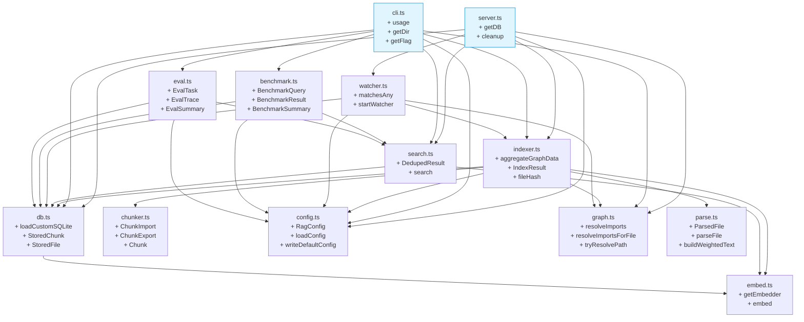
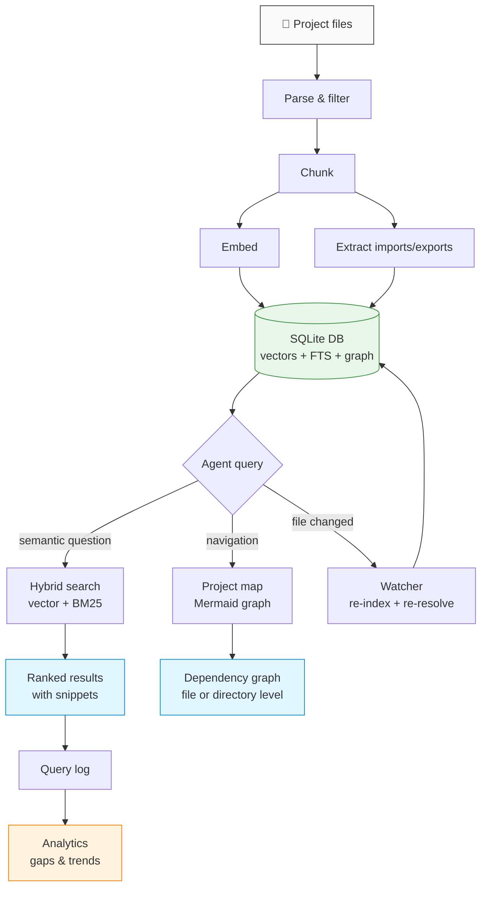

# local-rag-mcp

Semantic search for your codebase, zero config, with built-in gap analysis.

Indexes any files — markdown, code, configs, docs — into a per-project vector store. Your AI assistant finds what it needs by meaning, not filename. Usage analytics show you where your docs are falling short.

No API keys. No cloud. No Docker. Just `bun install`.

[](https://www.npmjs.com/package/local-rag-mcp)
[](LICENSE)

## Why

- **AI agents guess filenames.** They read files one at a time and miss things. This gives them semantic search — "how do we deploy?" finds the right doc even if it's called `runbook-prod-release.md`.
- **No one reads the docs.** Docs exist but never get surfaced at the right moment. This makes them findable by meaning, automatically.
- **Analytics expose documentation gaps.** After a week of usage, you'll know which topics people search for but can't find — that's a free gap analysis.

## Quick start

```bash
npm install local-rag-mcp
```

Or with Bun:

```bash
bun add local-rag-mcp
```

> **macOS:** Apple's bundled SQLite doesn't support extensions. Run `brew install sqlite` first.

### Add to Claude Code

In `~/.claude/settings.json` (global) or `<project>/.claude/settings.json` (per-project):

```json
{
  "mcpServers": {
    "local-rag": {
      "command": "bunx",
      "args": ["local-rag-mcp"],
      "env": {
        "RAG_PROJECT_DIR": "/path/to/your/project"
      }
    }
  }
}
```

Omit `RAG_PROJECT_DIR` for per-project configs — the server uses cwd.

### Auto-indexing

The MCP server automatically indexes your project on startup and watches for file changes during the session. You don't need to manually run `index` — just connect and search.

Progress is logged to stderr:
```
[local-rag] Startup index: 12 indexed, 0 skipped, 0 pruned
[local-rag] Watching /path/to/project for changes
[local-rag] Re-indexed: docs/setup.md
```

### Make the agent use it automatically

The MCP server registers tools, but the agent won't reach for them on its own unless you tell it to. Add this to your project's `CLAUDE.md`:

```markdown
## Using local-rag tools

This project has a local RAG index (local-rag-mcp). Use these MCP tools:

- **`search`**: Before reading files to answer questions about architecture,
  conventions, or setup, search the RAG index first. This finds relevant files
  by meaning, not filename.
- **`project_map`**: When you need to understand how files relate to each other,
  generate a dependency graph. Use `focus` to zoom into a specific file's
  neighborhood. This is faster than reading import statements across many files.
- **`index_files`**: If you've created or modified files and want them searchable,
  re-index the project directory.
- **`search_analytics`**: Check what queries return no results or low-relevance
  results — this reveals documentation gaps.
```

Without this, the agent only uses the tools when you explicitly ask it to search. With it, the agent proactively searches the index and uses the project map for navigation.

### CLI usage

The CLI is available for manual use, debugging, and analytics:

```bash
# Search by meaning
bunx local-rag search "database connection setup" --dir /path/to/project

# Check what's indexed
bunx local-rag status /path/to/project

# Manual index (not needed if using the MCP server)
bunx local-rag index /path/to/project
```

## MCP tools

These tools are available to any MCP client (Claude Code, etc.) once the server is running:

| Tool | What it does |
|---|---|
| `search` | Semantic search over indexed files — returns ranked paths, scores, and snippets |
| `index_files` | Index files in a directory — skips unchanged files, prunes deleted ones |
| `index_status` | Show file count, chunk count, last indexed time |
| `remove_file` | Remove a specific file from the index |
| `search_analytics` | Usage analytics — query counts, zero-result queries, low-relevance queries, top terms |
| `project_map` | Generate a Mermaid dependency graph of the project — file-level or directory-level, with optional focus |

## CLI commands

```bash
bunx local-rag init [dir]                     # Create .rag/config.json with defaults
bunx local-rag index [dir]                    # Index files
bunx local-rag search <query> [--top N]       # Search by meaning
bunx local-rag status [dir]                   # Show index stats
bunx local-rag remove <file> [dir]            # Remove a file from the index
bunx local-rag analytics [dir] [--days N]     # Show search usage analytics
bunx local-rag benchmark <file> [--dir D]    # Run search quality benchmark
bunx local-rag eval <file> [--dir D]         # Run A/B eval (with/without RAG)
bunx local-rag map [dir] [--focus F]         # Generate project dependency graph
                   [--zoom file|directory]    # (Mermaid format)
                   [--max N]
```

## Measuring search quality

Two tools help you measure whether the RAG index is actually working: a **benchmark** for search precision and an **A/B eval** for comparing agent behavior with and without RAG.

### Benchmark

Tests whether specific queries find the right files. Create a JSON file with query/expected pairs:

```json
[
  { "query": "how to deploy", "expected": ["docs/deploy.md"] },
  { "query": "database schema", "expected": ["src/db.ts", "docs/database.md"] }
]
```

Run it against an indexed project:

```bash
bunx local-rag index /path/to/project
bunx local-rag benchmark queries.json --dir /path/to/project
```

Output:

```
Benchmark results (15 queries, top-5):
  Recall@5:      86.7%
  MRR:           0.743
  Zero-miss rate: 6.7% (1 queries)

Missed queries (no expected file in results):
  "kubernetes pod config"
    expected: docs/k8s.md
    got:      docs/deploy.md, docs/infra.md
```

- **Recall@5** — what % of expected files appeared in the top 5 results
- **MRR** — how high the first correct result ranks on average (1.0 = always #1)
- **Zero-miss rate** — what % of queries found none of the expected files

The command exits with code 1 if Recall@5 < 80% or MRR < 0.6, so you can use it in CI.

### A/B eval

Compares what files the RAG server would surface for a task versus having no RAG at all. Create a task file:

```json
[
  {
    "task": "Explain how authentication works",
    "grading": "Must reference auth middleware and session handling",
    "expectedFiles": ["src/auth.ts"]
  }
]
```

Run it:

```bash
bunx local-rag eval tasks.json --dir /path/to/project
```

Output:

```
A/B Eval results (5 tasks):

                     With RAG    Without RAG
  Avg results:            3.2            0.0
  Avg files found:        3.2            0.0
  File hit rate:         100%             0%
  Avg latency:           48ms            0ms

Per-task breakdown:
  "Explain how authentication works"
    files found: auth.ts, session.ts
    grading: Must reference auth middleware and session handling
```

Save full traces with `--out traces.json` for manual review or LLM-as-judge scoring.

### Writing your own benchmark set

A good benchmark set has 15-50 queries that cover:

1. **Core concepts** — queries about the main things your project does
2. **Specific files** — queries that should land on a known file
3. **Cross-cutting concerns** — queries that touch multiple files
4. **Edge cases** — queries using different phrasing for the same concept

See `benchmark/queries.json` and `benchmark/tasks.json` in this repo for examples.

Re-run the benchmark after changing chunking settings, include patterns, or `hybridWeight` to see if search quality improves.

## Analytics

Every search is logged automatically. Run `analytics` to see what's working and what's not:

```
Search analytics (last 30 days):
  Total queries:    142
  Avg results:      3.2
  Avg top score:    0.58
  Zero-result rate: 12% (17 queries)

Top searches:
  3× "authentication flow"
  2× "database migrations"

Zero-result queries (consider indexing these topics):
  3× "kubernetes pod config"
  2× "slack webhook setup"

Low-relevance queries (top score < 0.3):
  "how to fix the build" (score: 0.21)
```

**Zero-result queries** tell you what topics your docs are missing. **Low-relevance queries** tell you where docs exist but don't answer the actual question. Both are actionable.

The analytics output also includes a **trend comparison** showing how metrics changed versus the prior period:

```
Trend (current 30d vs prior 30d):
  Queries:          142 (+38)
  Avg top score:    0.58 (+0.05)
  Zero-result rate: 12% (-3.0%)
```

## Project map

The `map` command generates a Mermaid dependency graph from import/export relationships extracted during indexing. This gives AI agents (and humans) a bird's-eye view of how files relate to each other.

```bash
# Index with source files included
bunx local-rag index . --patterns "**/*.ts,**/*.js,**/*.md"

# Full project graph (file-level)
bunx local-rag map .

# Directory-level overview
bunx local-rag map . --zoom directory

# Focus on a specific file (shows 2 hops of dependencies)
bunx local-rag map . --focus src/search.ts
```

Here's the dependency graph for this project's source files (generated by running `local-rag map` on itself):



Entry points (`server.ts`, `cli.ts`) are highlighted in blue — they have no incoming imports. The graph is extracted from tree-sitter AST parsing, not regex, so it handles re-exports, barrel files, and aliased imports correctly.

## Configuration

Create `.rag/config.json` in your project (or run `local-rag init`):

```json
{
  "include": ["**/*.md", "**/*.txt"],
  "exclude": ["node_modules/**", ".git/**", "dist/**", ".rag/**"],
  "chunkSize": 512,
  "chunkOverlap": 50,
  "hybridWeight": 0.7,
  "searchTopK": 5,
  "benchmarkTopK": 5,
  "benchmarkMinRecall": 0.8,
  "benchmarkMinMrr": 0.6
}
```

| Option | Default | Description |
|---|---|---|
| `include` | `["**/*.md", "**/*.txt"]` | Glob patterns for files to index |
| `exclude` | `["node_modules/**", ...]` | Glob patterns to skip |
| `chunkSize` | `512` | Max tokens per chunk |
| `chunkOverlap` | `50` | Overlap tokens between chunks |
| `hybridWeight` | `0.7` | Blend ratio: 1.0 = vector only, 0.0 = BM25 only |
| `searchTopK` | `5` | Default number of search results |
| `benchmarkTopK` | `5` | Default top-K for benchmark/eval runs |
| `benchmarkMinRecall` | `0.8` | Minimum Recall@K to pass benchmark (CI) |
| `benchmarkMinMrr` | `0.6` | Minimum MRR to pass benchmark (CI) |

All options can be overridden by CLI flags (e.g. `--top 10`).

## How it works



### Step by step

1. **Parse & filter** — Walks your project, matches files against include/exclude globs. Markdown files get frontmatter extracted and weighted. Code files are detected by extension.

2. **Chunk** — Splits content into searchable pieces. Code files (`.ts`, `.py`, `.go`, `.rs`, `.java`, etc.) use tree-sitter AST parsing via `code-chunk` — this respects function/class boundaries instead of cutting mid-statement. Markdown splits on headings. Other files split on paragraphs.

3. **Embed** — Each chunk is embedded into a 384-dimensional vector using all-MiniLM-L6-v2 (runs in-process via Transformers.js + ONNX, no API calls). Vectors are stored in sqlite-vec for fast similarity search.

4. **Extract imports/exports** — During AST chunking, import specifiers and exported symbols are captured. After all files are indexed, relative imports are resolved to actual files in the index (with extension probing for `.ts`/`.tsx`/`.js`/`.jsx`). This builds the dependency graph.

5. **Hybrid search** — Queries run both vector similarity (semantic) and BM25 (keyword) searches in parallel, then blend results using `hybridWeight` (default 0.7 = 70% semantic, 30% keyword). Results are deduplicated by file and ranked by combined score.

6. **Project map** — Generates a Mermaid dependency graph from the stored import/export relationships. Supports file-level and directory-level zoom, and focused subgraphs (BFS from a specific file). Entry points are auto-detected and highlighted.

7. **Watcher** — The MCP server watches for file changes with a 2-second debounce. Changed files are re-indexed and their import relationships re-resolved. Deleted files are pruned automatically.

8. **Analytics** — Every search query is logged with result count, top score, and latency. Analytics surface zero-result queries (missing docs), low-relevance queries (weak docs), top search terms, and period-over-period trends.

## Stack

| Layer | Choice |
|---|---|
| Runtime | Bun (built-in SQLite, fast TS) |
| Embeddings | Transformers.js + ONNX (in-process, no daemon) |
| Model | all-MiniLM-L6-v2 (~23MB, 384 dimensions) |
| Vector store | sqlite-vec (single `.db` file) |
| MCP | @modelcontextprotocol/sdk (stdio transport) |

## Per-project storage

```
your-project/
  .rag/
    index.db        ← vectors, chunks, query logs
    config.json     ← include/exclude patterns, settings
```

Add `.rag/` to your `.gitignore`.
