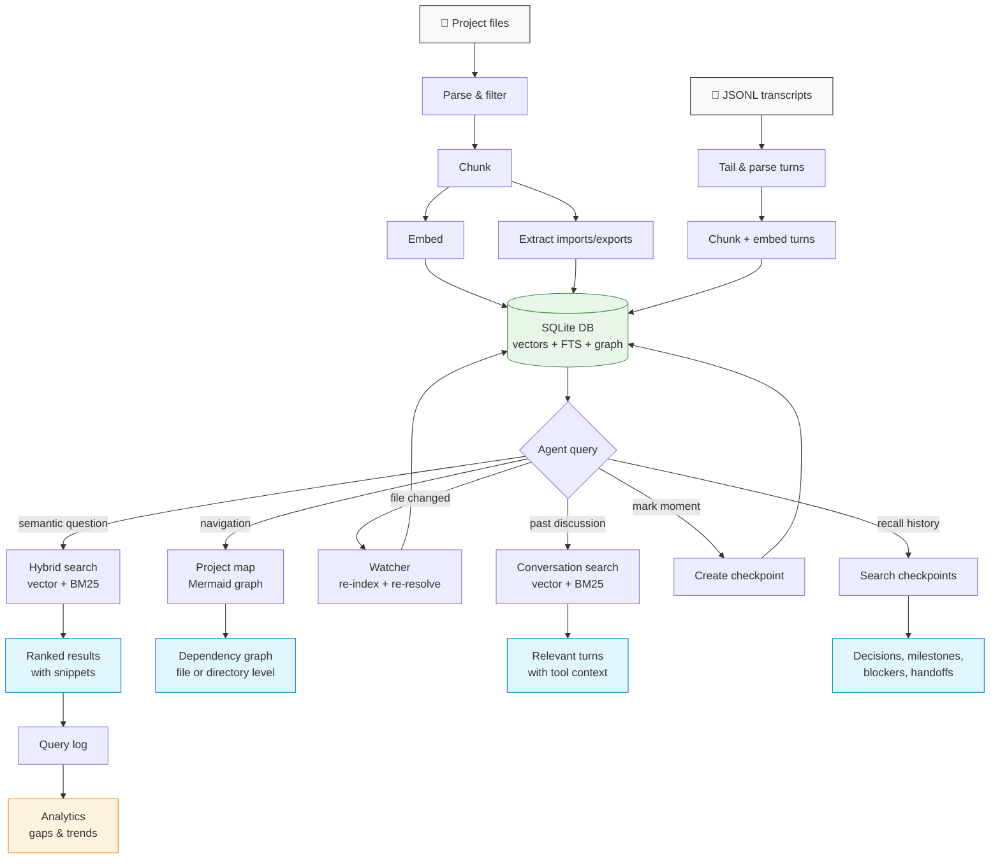

# local-rag-mcp

Semantic search for your codebase and conversation history, zero config, with built-in gap analysis.

Indexes any files — markdown, code, configs, docs — into a per-project vector store. Also indexes AI conversation transcripts in real time, so agents can recall past decisions and discussions. Usage analytics show you where your docs are falling short.

No API keys. No cloud. No Docker. Just `bunx`.

[](https://www.npmjs.com/package/local-rag-mcp)
[](LICENSE)

## Contents

- [Why](#why)
- [Quick start](#quick-start)
- [MCP tools](#mcp-tools)
- [CLI](#cli)
- [Analytics](#analytics)
- [Project map](#project-map)
- [Configuration](#configuration)
- [Supported file types](#supported-file-types)
- [How it works](#how-it-works)
- [Stack](#stack)

## Why

- **AI agents guess filenames.** They read files one at a time and miss things. This gives them semantic search — "how do we deploy?" finds the right doc even if it's called `runbook-prod-release.md`.
- **No one reads the docs.** Docs exist but never get surfaced at the right moment. This makes them findable by meaning, automatically.
- **Analytics expose documentation gaps.** After a week of usage, you'll know which topics people search for but can't find — that's a free gap analysis.
- **Refactoring is blind.** Agents change a function signature and have no way to find all callers. `find_usages` enumerates every call site across the codebase with file and line number, so you know what breaks before you change anything.
- **Agents work on stale mental models.** They search for code without knowing what's already been modified in the working tree. `git_context` surfaces uncommitted changes, recent commits, and changed files in one call — annotated with whether each file is in the index or not.
- **Known issues get rediscovered every session.** There's no way to attach "don't touch this until the auth rewrite lands" to a specific function. `annotate` persists notes on files or symbols that surface automatically when the relevant code appears in search results.

## Quick start

### 1. Install SQLite (macOS)

Apple's bundled SQLite doesn't support extensions. Install the Homebrew version first:

```bash
brew install sqlite
```

### 2. Verify it starts and index your project

Run the server directly to confirm it works and watch the indexing output:

```bash
bunx local-rag-mcp serve
```

You should see something like:

```
[local-rag] Startup index: 12 indexed, 0 skipped, 0 pruned
[local-rag] Watching /path/to/project for changes
[local-rag] Indexing conversation: a1b2c3d4...
```

Press `Ctrl+C` when done — this was just a sanity check. The server will run automatically inside your editor once configured.

### 3. Create a config

Create `.rag/config.json` in your project root. This is the minimal config to get started — it indexes source code and docs while skipping build artifacts:

```json
{
  "include": ["**/*.md", "**/*.ts", "**/*.js", "**/*.py", "**/*.go", "**/*.rs", "**/*.css", "**/*.scss", "**/*.less"],
  "exclude": ["node_modules/**", ".git/**", "dist/**", ".rag/**"]
}
```

See the [Configuration](#configuration) section for all options. Add `.rag/` to your `.gitignore`.

### 4. Add to your editor

Works with any [MCP](https://modelcontextprotocol.io/)-compatible client. Add this server config to your editor's MCP config file:

| Editor | Config file | Sets cwd to project? |
|---|---|---|
| Claude Code | `~/.claude/settings.json` or `<project>/.claude/settings.json` | Yes |
| Cursor | `<project>/.cursor/mcp.json` | **No** — uses home dir |
| Windsurf | `~/.codeium/windsurf/mcp_config.json` | **No** — uses home dir |
| VS Code (Copilot) | `<project>/.vscode/mcp.json` | Yes |

Editors that set cwd to the project automatically (Claude Code, VS Code) work with no extra config:

```json
{
  "mcpServers": {
    "local-rag": {
      "command": "bunx",
      "args": ["local-rag-mcp", "serve"]
    }
  }
}
```

**Cursor and Windsurf** spawn MCP servers from the user's home directory, so you must set `RAG_PROJECT_DIR` explicitly — otherwise the server indexes `~` instead of your project:

```json
{
  "mcpServers": {
    "local-rag": {
      "command": "bunx",
      "args": ["local-rag-mcp", "serve"],
      "env": {
        "RAG_PROJECT_DIR": "/path/to/your/project"
      }
    }
  }
}
```

> **VS Code note:** Uses `"servers"` instead of `"mcpServers"` and requires `"type": "stdio"` on the server object.

**Read-only project directory?** Set `RAG_DB_DIR` to redirect the index to a writable path:

```json
"env": {
  "RAG_PROJECT_DIR": "/path/to/your/project",
  "RAG_DB_DIR": "/tmp/my-project-rag"
}
```

### Auto-indexing

The MCP server (`local-rag-mcp serve`) automatically indexes your project on startup and watches for file changes during the session. It also tails the active conversation transcript in real time and indexes past sessions on startup. You don't need to manually run `index` — just connect and search. Progress is logged to stderr.

### Make the agent use it automatically

The MCP server registers tools, but agents won't reach for them on their own unless you tell them to. Add instructions to your editor's rules file (`CLAUDE.md`, `.cursorrules`, `.windsurfrules`, or `.github/copilot-instructions.md`):

```markdown
## Using local-rag tools

This project has a local RAG index (local-rag-mcp). Use these MCP tools:

- **`search`**: Discover which files are relevant to a topic. Returns file paths
  with snippet previews — use this when you need to know *where* something is.
- **`read_relevant`**: Get the actual content of relevant semantic chunks —
  individual functions, classes, or markdown sections — ranked by relevance.
  Results include exact line ranges (`src/db/index.ts:42-67`) so you can navigate
  directly to the edit location. Use this instead of `search` + `Read` when
  you need the content itself. Two chunks from the same file can both appear
  (no file deduplication).
- **`project_map`**: When you need to understand how files relate to each other,
  generate a dependency graph. Use `focus` to zoom into a specific file's
  neighborhood. This is faster than reading import statements across many files.
- **`search_conversation`**: Search past conversation history to recall previous
  decisions, discussions, and tool outputs. Use this before re-investigating
  something that may have been discussed in an earlier session.
- **`create_checkpoint`**: Mark important moments — decisions, milestones,
  blockers, direction changes. Do this liberally: after completing any feature
  or task, after adding/modifying tools, after key technical decisions, before
  and after large refactors, or when changing direction. If in doubt, create one.
- **`list_checkpoints`** / **`search_checkpoints`**: Review or search past
  checkpoints to understand project history and prior decisions.
- **`index_files`**: If you've created or modified files and want them searchable,
  re-index the project directory.
- **`search_analytics`**: Check what queries return no results or low-relevance
  results — this reveals documentation gaps.
- **`search_symbols`**: When you know a symbol name (function, class, type, etc.),
  find it directly by name instead of using semantic search.
- **`find_usages`**: Before changing a function or type, find all its call sites.
  Use this to understand the blast radius of a rename or API change. Faster and
  more reliable than semantic search for finding usages.
- **`git_context`**: At the start of a session (or any time you need orientation),
  call this to see what files have already been modified, recent commits, and
  which changed files are in the index. Avoids redundant searches and conflicting
  edits on already-modified files.
- **`annotate`**: Attach a persistent note to a file or symbol — "known race
  condition", "don't refactor until auth rewrite lands", etc. Notes appear as
  `[NOTE]` blocks inline in `read_relevant` results automatically.
- **`get_annotations`**: Retrieve all notes for a file, or search semantically
  across all annotations to find relevant caveats before editing.
- **`write_relevant`**: Before adding new code or docs, find the best insertion
  point — returns the most semantically appropriate file and anchor.
```

Without this, the agent only uses the tools when you explicitly ask. With it, the agent proactively searches the index and uses the project map for navigation.

## MCP tools

These tools are available to any MCP client (Claude Code, etc.) once the server is running:

| Tool | What it does |
|---|---|
| `search` | Semantic search over indexed files — returns ranked paths, scores, and 400-char snippets |
| `read_relevant` | Chunk-level retrieval — returns top-N individual semantic chunks ranked by relevance, with entity names and full content. No file deduplication — two chunks from the same file can both appear |
| `index_files` | Index files in a directory — skips unchanged files, prunes deleted ones |
| `index_status` | Show file count, chunk count, last indexed time |
| `remove_file` | Remove a specific file from the index |
| `search_analytics` | Usage analytics — query counts, zero-result queries, low-relevance queries, top terms |
| `project_map` | Generate a Mermaid dependency graph of the project — file-level or directory-level, with optional focus |
| `search_conversation` | Search conversation history — finds past decisions, discussions, and tool outputs across sessions |
| `create_checkpoint` | Mark an important moment — decisions, milestones, blockers, direction changes, or handoffs |
| `list_checkpoints` | List checkpoints, most recent first. Filter by session or type |
| `search_checkpoints` | Semantic search over checkpoint titles and summaries |
| `search_symbols` | Find exported symbols by name — functions, classes, types, interfaces, enums. Faster than semantic search when you know the symbol name |
| `find_usages` | Find every call site of a symbol across the codebase — returns file paths, line numbers (`path:line`), and the matching line. Excludes the defining file |
| `git_context` | Show uncommitted changes (annotated `[indexed]`/`[not indexed]`), recent commits, and changed files. Optional unified diff (`include_diff`). Non-git directories return a graceful message |
| `annotate` | Attach a persistent note to a file or symbol. Notes survive sessions and surface inline in `read_relevant` results. Upserts by `(path, symbol)` key |
| `get_annotations` | Retrieve notes by file path, or search semantically across all annotations |
| `write_relevant` | Find the best insertion point for new content — returns semantically appropriate files and anchors |

## CLI

`local-rag-mcp` is a CLI-first tool. The MCP server runs as the `serve` subcommand.

```bash
local-rag-mcp serve              # Start MCP server (stdio transport)
local-rag-mcp init [dir]         # Set up .rag/config.json, CLAUDE.md, .gitignore
local-rag-mcp index [dir]        # Index files in a directory
local-rag-mcp search <query>     # Semantic search
local-rag-mcp read <query>       # Chunk-level retrieval (like read_relevant)
local-rag-mcp status [dir]       # Show index stats
local-rag-mcp remove <path>      # Remove a file from the index
local-rag-mcp analytics [dir]    # Usage analytics with trend comparison
local-rag-mcp map [dir]          # Dependency graph (Mermaid output)
local-rag-mcp benchmark [dir]    # Run search quality benchmark
local-rag-mcp eval [dir]         # A/B eval harness
local-rag-mcp conversation       # Conversation subcommands (search, sessions, index)
local-rag-mcp checkpoint         # Checkpoint subcommands (create, list, search)
```

## Analytics

Every search is logged automatically. Use the `search_analytics` MCP tool to see what's working and what's not:

```
Search analytics (last 30 days):
  Total queries:    142
  Avg results:      3.2
  Avg top score:    0.58
  Zero-result rate: 12% (17 queries)

Top searches:
  3× "authentication flow"
  2× "database migrations"

Zero-result queries (consider indexing these topics):
  3× "kubernetes pod config"
  2× "slack webhook setup"

Low-relevance queries (top score < 0.3):
  "how to fix the build" (score: 0.21)
```

**Zero-result queries** tell you what topics your docs are missing. **Low-relevance queries** tell you where docs exist but don't answer the actual question. Both are actionable.

The analytics output also includes a **trend comparison** showing how metrics changed versus the prior period:

```
Trend (current 30d vs prior 30d):
  Queries:          142 (+38)
  Avg top score:    0.58 (+0.05)
  Zero-result rate: 12% (-3.0%)
```

## Project map

The `project_map` MCP tool generates a Mermaid dependency graph from import/export relationships extracted during indexing. This gives AI agents (and humans) a bird's-eye view of how files relate to each other.

Here's the dependency graph for this project's source domains:

```mermaid
graph TD
  main["src/main.ts"]
  cli["src/cli/\n+ main, usage, getFlag\n+ 12 command handlers"]
  server["src/server/\n+ startServer, getDB"]
  tools["src/tools/\n+ registerAllTools\n+ 8 tool modules"]
  db["src/db/\n+ RagDB (facade)"]
  indexing["src/indexing/\n+ indexer, chunker,\n  parse, watcher"]
  search["src/search/\n+ hybrid, usages,\n  benchmark, eval"]
  embeddings["src/embeddings/\n+ embed, embedBatch"]
  graph["src/graph/\n+ resolver"]
  conversation["src/conversation/\n+ parser, indexer"]
  config["src/config/\n+ loadConfig"]

  main --> cli
  cli --> server
  cli --> search
  cli --> graph
  cli --> conversation
  server --> tools
  server --> db
  server --> indexing
  server --> conversation
  tools --> search
  tools --> graph
  tools --> conversation
  search --> db
  search --> embeddings
  indexing --> db
  indexing --> embeddings
  indexing --> graph
  conversation --> indexing
  graph --> db

  style main fill:#e1f5fe,stroke:#0288d1
  style server fill:#e1f5fe,stroke:#0288d1
```

`src/main.ts` is the single entry point. The CLI dispatches to command handlers; `serve` starts the MCP server. The graph is extracted from tree-sitter AST parsing, not regex, so it handles re-exports, barrel files, and aliased imports correctly.

## Configuration

Create `.rag/config.json` in your project. The defaults index all [supported file types](#supported-file-types). To index everything and exclude binaries explicitly:

```json
{
  "include": ["**/*"],
  "exclude": [
    "node_modules/**", ".git/**", "dist/**", "build/**", "out/**", ".rag/**",
    "**/*.lock", "**/package-lock.json", "**/*.min.js", "**/*.map",
    "**/*.png", "**/*.jpg", "**/*.jpeg", "**/*.gif", "**/*.webp", "**/*.ico", "**/*.svg",
    "**/*.pdf", "**/*.zip", "**/*.tar", "**/*.gz",
    "**/*.wasm", "**/*.bin", "**/*.exe", "**/*.dylib", "**/*.so",
    "**/*.db", "**/*.sqlite",
    "**/*.ttf", "**/*.woff", "**/*.woff2", "**/*.eot"
  ]
}
```

| Option | Default | Description |
|---|---|---|
| `include` | see [Supported file types](#supported-file-types) | Glob patterns for files to index |
| `exclude` | `["node_modules/**", ...]` | Glob patterns to skip |
| `chunkSize` | `512` | Max tokens per chunk |
| `chunkOverlap` | `50` | Overlap tokens between chunks |
| `hybridWeight` | `0.7` | Blend ratio: 1.0 = vector only, 0.0 = BM25 only |
| `searchTopK` | `5` | Default number of search results |

## Supported file types

Files are detected by extension or by basename (for files with no extension or a suffix-variant like `Dockerfile.prod`). Each type gets a dedicated chunking strategy so chunks land on meaningful boundaries rather than arbitrary character counts.

### AST-aware (tree-sitter)

These use `code-chunk` to extract real function/class/interface/enum boundaries. Import and export symbols are also captured and stored for the project dependency graph.

| Extensions | Notes |
|---|---|
| `.ts` `.tsx` `.js` `.jsx` | TypeScript & JavaScript |
| `.py` | Python |
| `.go` | Go |
| `.rs` | Rust |
| `.java` | Java |

### Structured data & config

| Extensions / filenames | Chunking strategy |
|---|---|
| `.yaml` `.yml` | Split on top-level keys. OpenAPI files: `paths:` is further split per endpoint (`  /users:`, `  /orders:`) so each route is its own chunk. |
| `.json` | Parse and split per top-level key. OpenAPI files: each path under `paths` becomes its own chunk. Falls back to paragraph split for invalid JSON. |
| `.toml` | Split on `[section]` and `[[array-of-tables]]` headers (e.g. each `[[package]]` in a Cargo workspace). |
| `.xml` | Split on blank-line-separated blocks. |

### Build, CI & task runners

Detected by basename — exact match or prefix match (e.g. `Dockerfile.dev` and `Dockerfile.prod` are both treated as Dockerfiles).

| Basename pattern | Chunking strategy |
|---|---|
| `Makefile` `makefile` `GNUmakefile` | Split on target definitions — each `target: deps` line and its recipe is one chunk. |
| `Dockerfile` `Dockerfile.*` | Split on `FROM` instructions (stage boundaries in multi-stage builds). |
| `Jenkinsfile` `Jenkinsfile.*` | Split on blank-line blocks (Groovy DSL). |
| `Vagrantfile` `Gemfile` `Rakefile` `Brewfile` | Split on blank-line blocks (Ruby DSL). |
| `Procfile` | Split on blank-line blocks. |

### Styles

| Extensions | Chunking strategy |
|---|---|
| `.css` `.scss` `.less` | Split on top-level brace blocks — each rule, `@media`, `@keyframes`, etc. is its own chunk. |

### Shell & scripting

| Extensions | Notes |
|---|---|
| `.sh` `.bash` `.zsh` `.fish` | Split on blank-line blocks (function and section boundaries). |

### Infrastructure & schema languages

| Extensions | Chunking strategy |
|---|---|
| `.tf` | Split on blank-line blocks (HCL `resource`, `module`, `variable` blocks). |
| `.proto` | Split on blank-line blocks (message, service, enum definitions). |
| `.graphql` `.gql` | Split on blank-line blocks (type, query, mutation, fragment definitions). |
| `.sql` | Split on `;`-terminated statement boundaries. |
| `.mod` | Split on blank-line blocks (`go.mod` `require`, `replace`, `exclude` directives). |
| `.bru` | Split on top-level blocks (`meta {}`, `post {}`, `headers {}`, `body:json {}`, `tests {}`, etc.) — searchable by endpoint, auth type, headers, or test assertions. |

### Markdown & plain text

| Extensions | Chunking strategy |
|---|---|
| `.md` `.mdx` `.markdown` | Split on heading boundaries (`#` / `##` / `###`). Frontmatter fields (`name`, `description`, `type`, `tags`) are extracted and prepended to boost relevance. |
| `.txt` | Split on paragraphs. |

> Files not matching any of the above extensions still fall back to paragraph splitting, so they're searchable even without a dedicated strategy. You can add any glob pattern to `include` in `.rag/config.json`.

## How it works



### Step by step

1. **Parse & filter** — Walks your project, matches files against include/exclude globs. Markdown files get frontmatter extracted and weighted. Code files are detected by extension.

2. **Chunk** — Splits content using a strategy matched to each file type — function/class boundaries for code, headings for markdown, top-level keys for YAML/JSON, stage boundaries for Dockerfiles, and so on. See [Supported file types](#supported-file-types) for the full list.

3. **Embed** — Each chunk is embedded into a 384-dimensional vector using all-MiniLM-L6-v2 (runs in-process via Transformers.js + ONNX, no API calls). Vectors are stored in sqlite-vec for fast similarity search.

4. **Extract imports/exports** — During AST chunking, import specifiers and exported symbols are captured. After all files are indexed, relative imports are resolved to actual files in the index (with extension probing for `.ts`/`.tsx`/`.js`/`.jsx`). This builds the dependency graph.

5. **Hybrid search** — Queries run both vector similarity (semantic) and BM25 (keyword) searches in parallel, then blend results using `hybridWeight` (default 0.7 = 70% semantic, 30% keyword). `search` deduplicates by file and returns the best-scoring file with a 400-char snippet. `read_relevant` skips deduplication and returns top-N individual chunks with full content, entity names (function/class names from AST parsing), and **exact line ranges** (`path:start-end`) — so you can navigate directly to an edit location without reading the full file.

5a. **Usage search** — `find_usages` locates every call site of a symbol by querying the FTS index, excluding the file that defines it, and resolving per-line matches using the stored chunk line ranges. Useful before any rename or API change to understand the blast radius.

6. **Project map** — Generates a Mermaid dependency graph from the stored import/export relationships. Supports file-level and directory-level zoom, and focused subgraphs (BFS from a specific file). Entry points are auto-detected and highlighted.

7. **Watcher** — The MCP server watches for file changes with a 2-second debounce. Changed files are re-indexed and their import relationships re-resolved. Deleted files are pruned automatically.

8. **Analytics** — Every search query is logged with result count, top score, and latency. Analytics surface zero-result queries (missing docs), low-relevance queries (weak docs), top search terms, and period-over-period trends.

9. **Conversation index** — The MCP server tails the active JSONL transcript in real time via `fs.watch`. Each user/assistant turn is chunked, embedded, and stored — searchable within seconds. Past sessions are discovered and indexed incrementally on startup. Tool results from Bash/Grep are indexed (Read/Write/Edit are skipped since file content is already in the code index).

10. **Checkpoints** — Agents create named snapshots at important moments: decisions, milestones, blockers, direction changes, and handoffs. Each checkpoint has a title, summary, and embedding for semantic search. This gives future sessions a high-signal trail of what happened and why.

11. **Code annotations** — `annotate` stores notes in a dedicated `annotations` table, embedded at write time for semantic search. Notes are keyed by `(path, symbol_name)` so calling again updates rather than duplicates. `get_annotations` retrieves by file path or searches semantically. `read_relevant` automatically surfaces relevant notes as `[NOTE]` blocks above matching chunks — file-level notes for any chunk from that file, symbol-level notes only when the entity name matches.

Example: after annotating `src/db/index.ts` on symbol `RagDB` with "not thread-safe — don't share across requests", a `read_relevant("database constructor")` result looks like:

```
[0.91] src/db/index.ts:108-138  •  RagDB
[NOTE (RagDB)] not thread-safe — don't share across requests
export class RagDB {
  private db: Database;
  ...
```

12. **Git context** — `git_context` shells out to `git` (searching upward for the repo root) and returns up to four sections: uncommitted changes from `git status --short`, recent commits from `git log --oneline`, changed files since a ref, and an optional `git diff HEAD` (truncated to 200 lines). Each file in the status section is annotated with `[indexed]` or `[not indexed]` by checking the RAG file table. Returns `"Not a git repository."` gracefully in non-git directories.

Example output:

```
## Uncommitted changes
 M src/server/index.ts  [indexed]
 M README.md  [not indexed]

## Recent commits (since HEAD~5)
a1b2c3d feat: restructure to domain-based folders
9810edf feat: add git_context tool

## Changed files (since HEAD~5)
src/server/index.ts
README.md
```

## Stack

| Layer | Choice |
|---|---|
| Runtime | Bun (built-in SQLite, fast TS) |
| Embeddings | Transformers.js + ONNX (in-process, no daemon) |
| Model | all-MiniLM-L6-v2 (~23MB, 384 dimensions) |
| Vector store | sqlite-vec (single `.db` file) |
| MCP | @modelcontextprotocol/sdk (stdio transport) |

## Per-project storage

```
your-project/
  .rag/
    index.db        ← vectors, chunks, query logs
    config.json     ← include/exclude patterns, settings
```

Add `.rag/` to your `.gitignore`.
