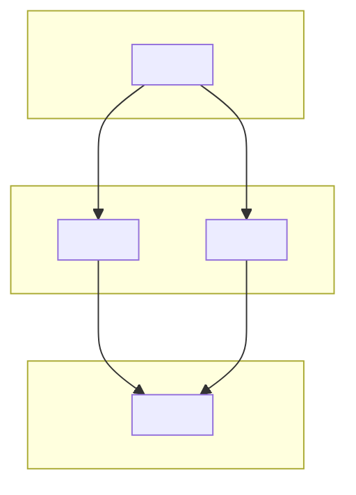

<!-- Exemplar: adapt to this project. Replace every `<!-- adapt ... -->`
     comment and every placeholder in angle brackets. Keep the overall
     shape — overview, layer map, inventory, hubs, cross-cutting,
     conventions pointer. Reuse section snippets by name where cited. -->

# Architecture

<!-- adapt: one paragraph naming what the project is and how it is structured.
     Lead with the problem it solves, not "this project contains". Reference
     the top-level entry point by path. -->

`<project-name>` is a <one-line framing>. The codebase is organised as
<N> cohesive modules under `<top-level source directory>` (whatever
the project uses — `src/`, `cmd/` + `internal/`, `packages/`, `lib/`,
or project root), each behind an entry file that re-exports a narrow
surface. <Name the top-3 modules by fan-in and say one sentence about
what each contributes.>

## System Map

<!-- adapt: pick the layering that fits. Typical shapes:
     (1) entry → pipelines → services → storage  (most projects — use LR)
     (2) parser → resolver → emitter              (compiler-style — LR)
     (3) entry → orchestrator → IO                 (small app — TD ok)
     Prefer `flowchart LR` unless the graph is genuinely tree-shaped: with
     LR, fan-ins from multiple orchestrators to shared services render as
     clean parallel lines, whereas TD forces them to cross through the
     orchestrator row.
     Budget: ≤ 12 nodes and ≤ 18 edges total. 3–5 subgraphs, each ≤ 4 nodes.
     Each subgraph should represent ONE column in the flow — do not put
     a high-fan-out routing node (e.g. MCP tool registry) in a downstream
     "Shared" bucket; that forces its edges to loop back. Routing nodes
     belong in the Surface column with their callers.
     Cross-cutting modules (config, logging, shared utils) do NOT appear
     in this diagram at all — not even as edgeless nodes. They get their
     own small Mermaid block under "## Cross-cutting dependencies" further
     down. If the real dependency graph has more than 18 edges, draw a
     slice (e.g. "control flow, excluding cross-cutters") and name the
     slice in the caption. -->



<!-- adapt: one paragraph explaining the diagram. Name the direction of
     control flow and where state lives. Call out the single invariant
     that holds across modules (e.g. "every write goes through db.ts;
     modules never touch the raw connection"). If you omitted cross-
     cutters from the main map, point the reader at the Cross-cutting
     dependencies section below. -->

<!-- adapt: include when the project has 1-3 modules used by most others
     (logging, config, shared utils). Keep this block compact — one node
     per cross-cutter, LR layout, edges only to direct consumers. Skip
     this section entirely if no such modules exist. -->

## Cross-cutting dependencies

```mermaid
flowchart LR
  <crosscutter_a>["<crosscutter name>"]
  <crosscutter_b>["<crosscutter name>"]
  <crosscutter_a> --> <consumer_1>
  <crosscutter_a> --> <consumer_2>
  <crosscutter_b> --> <consumer_3>
```

<One sentence naming why these live outside the main map — e.g. "used
transitively by every pipeline; drawn separately so the main System Map
retains its control-flow shape".>

<!-- Reuse section: module-inventory. Keep it as the next section. -->

## Modules

| Module | Files | Exports | Fan-in | Fan-out | Entry file |
|--------|-------|---------|--------|---------|------------|
| [<Name>](modules/<name>/index.md) | <n> | <n> | <n> | <n> | `<path>` |

<!-- Reuse section: hub-analysis. Only keep if prefetched hubs list is
     non-empty. -->

## Hubs

Files that many others depend on — changes here ripple widely.

| File | Fan-in | Fan-out | What it exposes |
|------|--------|---------|-----------------|
| `<path>` | <n> | <n> | <bridges list or short summary> |

<One-paragraph call-out: name the top hub and why it is architecturally
central.>

<!-- Reuse section: cross-cutting-inventory. Only keep if prefetched
     crossCuttingSymbols list is non-empty. -->

## Cross-Cutting Symbols

Symbols referenced from 3+ modules. These are the project's shared
vocabulary.

| Symbol | Type | Defined in | Used in |
|--------|------|------------|---------|
| `<Name>` | <type> | `<path>` | `<mod>`, `<mod>`, `<mod>` (+N more) |

## Design Decisions

<!-- adapt: include only when there are genuine non-obvious choices
     visible in the code. Examples: chose SQLite over Postgres for
     single-user local use; FTS + vector fusion over pure vector search
     to retain exact-match quality. Skip this heading entirely if
     there's nothing to say. -->

- **<Decision>** — <what was chosen, over what, and why it matters for
  readers of the code>.

## See also

- [Data Flows](data-flows.md)
- [Conventions](guides/conventions.md)
