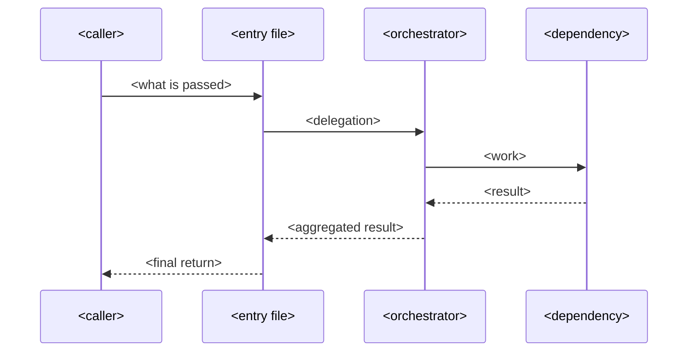
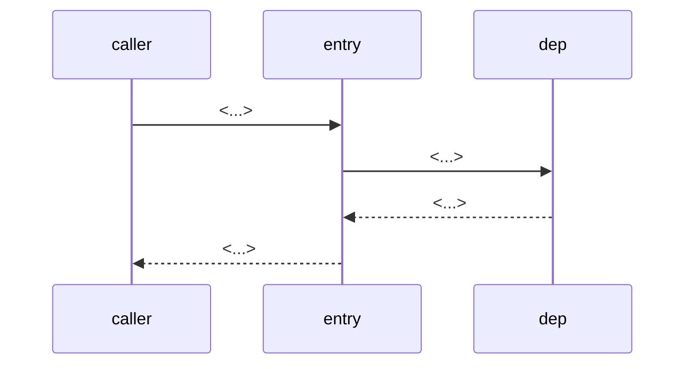

<!-- Exemplar: adapt to this project. Each flow gets a sequence diagram
     plus a numbered step list. Include only flows that genuinely exist
     in this codebase — do not invent. Typical projects have 2-4 flows. -->

# Data Flows

<!-- adapt: one paragraph introducing the set of flows. Name them
     ("indexing", "querying", "sync") and say where each is triggered
     from (CLI? HTTP handler? library consumer?). -->

The project has <N> primary flows: <flow names>. Each is triggered from
<entry points> and ends in <sinks>.

## Flow 1: <Flow name>

<!-- adapt: 1 sentence saying what triggers this flow and what it
     produces. Cite the entry file. -->

Triggered by <caller / command / event> in `<path>`. Produces <result>.

1. **<Step>** — <specifics: file, function, key constant>.
2. **<Step>** — <next step>.
3. **<Step>** — <final output>.

### Error paths

<!-- adapt: include only when the flow has real error handling worth
     describing (retries, fallbacks, graceful degradation). Skip if
     errors just propagate. -->

- **<Error condition>** — <what happens: retry? fallback? propagate?>

## Flow 2: <Second flow>

<!-- adapt: same shape as Flow 1. -->

Triggered by <...>. Produces <...>.

1. **<Step>** — <...>
2. **<Step>** — <...>

## See also

- [Architecture](architecture.md)
