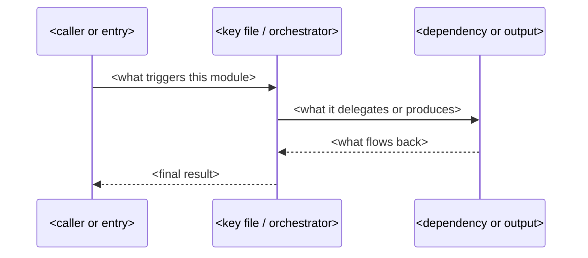

## How It Works

```mermaid
sequenceDiagram
  participant caller as <caller or entry>
  participant core as <key file / orchestrator>
  participant dep as <dependency or output>
  caller->>core: <what triggers this module>
  core->>dep: <what it delegates or produces>
  dep-->>core: <what flows back>
  core-->>caller: <final result>
```

1. **<Step>** — <what happens first, with specifics — numbers, paths, names>
2. **<Step>** — <next step in the flow>
3. **<Step>** — <final output or side effect>
