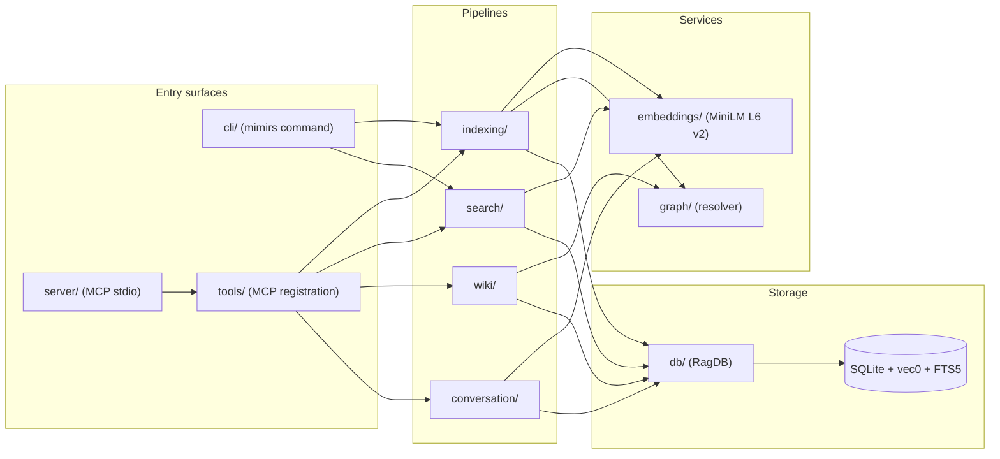
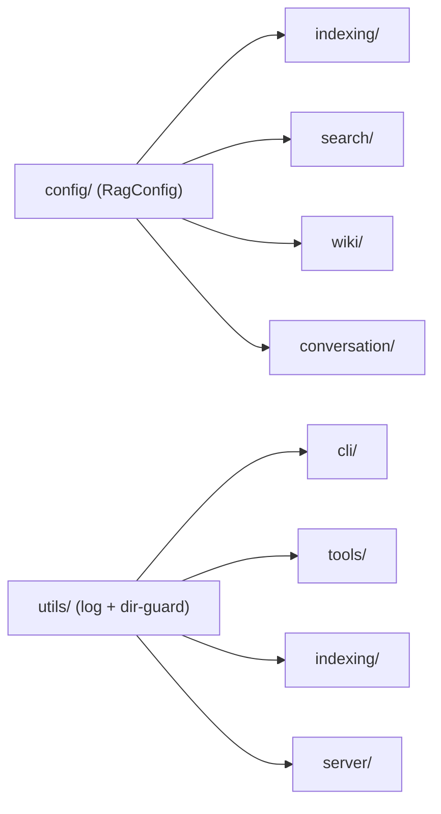

# Architecture

`mimirs` is a local RAG index for semantic code search — a Bun process that embeds a project's files into a SQLite database (with `sqlite-vec` and FTS5 loaded), exposes an MCP server for Claude Code / Cursor / Windsurf to query, and ships a CLI with the same surface. The codebase is organised as thirteen cohesive modules under `src/`, each behind an entry file that re-exports a narrow surface. The three highest-fan-in hubs that every other pipeline bottoms out at are `src/embeddings/embed.ts` (file fan-in 77 — the singleton ONNX boundary), `src/db/index.ts` (file fan-in 57 — the `RagDB` facade and the only code that opens a `Database` handle), and `src/config/index.ts` (file fan-in 40 — the `RagConfig` carrier).

Entry file for the CLI: `src/main.ts` → `src/cli/index.ts`. Entry file for the MCP server: `src/server/index.ts` (loaded dynamically from `src/cli/commands/serve.ts` so a top-level load failure in the server tree doesn't kill every other `mimirs` subcommand — `doctor` and `cleanup` must still run when `serve` is broken).

## System Map

Control flows left-to-right. State lives in one place: the SQLite database behind the `RagDB` facade. The invariant that holds everywhere is **no module outside `db/` opens a `Database` handle directly** — `embeddings`, `search`, `wiki`, `conversation`, and the graph resolver all hold a `RagDB` and call methods on it. FTS5 sync is enforced by triggers on `chunks` (`*_ai` / `*_ad` / `*_au`), so callers can't forget to update the virtual tables; vector column widths are read from `getEmbeddingDim()` at schema-init time, which is why changing the embedding model requires a DB reset. `config/` and `utils/` are used by almost every pipeline and are drawn separately below so the main map keeps its control-flow shape.

## Cross-cutting dependencies

These two modules are used transitively by every pipeline. Drawing each "used by" edge on the main System Map would obscure the control-flow shape, so they live here instead. `config/index.ts` is read at CLI / server startup (`loadConfig(projectDir)` + `applyEmbeddingConfig(config)`) and passed into every orchestrator; `utils/log.ts` provides `log` (stderr, LEVEL-gated so MCP stdio stays clean) and `cli` (stdout for the CLI surface), plus `checkIndexDir` which is imported wherever a module could be tricked into running inside a dangerous directory like `$HOME` or `/`.

## Modules

| Module | Files | Exports | Fan-in | Fan-out | Entry file |
|--------|-------|---------|--------|---------|------------|
| [db](modules/db/index.md) | 10 | 57 | 15 | 2 | `src/db/index.ts` |
| [wiki](modules/wiki/index.md) | 10 | 36 | 2 | 2 | `src/wiki/index.ts` |
| [commands](modules/commands.md) | 19 | 13 | 1 | 10 | — |
| [search](modules/search.md) | 4 | 16 | 5 | 4 | — |
| [indexing](modules/indexing.md) | 4 | 7 | 9 | 4 | — |
| [cli](modules/cli.md) | 3 | 14 | 3 | 3 | `src/cli/index.ts` |
| [tools](modules/tools.md) | 12 | 7 | 1 | 9 | `src/tools/index.ts` |
| [conversation](modules/conversation.md) | 2 | 5 | 4 | 2 | — |
| [utils](modules/utils.md) | 2 | 3 | 8 | 0 | — |
| [embeddings](modules/embeddings.md) | 1 | 8 | 17 | 0 | — |
| [config](modules/config.md) | 1 | 1 | 10 | 2 | `src/config/index.ts` |
| [graph](modules/graph.md) | 1 | 2 | 8 | 1 | — |
| [tests](modules/tests.md) | 1 | 3 | 11 | 0 | — |

## Hubs

Files where many other files land — changes here ripple widely.

| File | Fan-in | Fan-out | What it exposes |
|------|--------|---------|-----------------|
| `src/embeddings/embed.ts` | 77 | 0 | `embed`, `embedBatch`, `embedBatchMerged`, `configureEmbedder`, `getEmbeddingDim`, `mergeEmbeddings`, `getEmbedder`, `getTokenizer` |
| `src/wiki/types.ts` | 67 | 1 | Every cross-phase wiki shape (`DiscoveryResult`, `ClassifiedInventory`, `PageManifest`, `ContentCache`, `PagePayload`) |
| `tests/helpers.ts` | 67 | 0 | `createTempDir`, `writeFixture`, `cleanupTempDir` — fixture scaffolding for every test suite |
| `src/db/index.ts` | 57 | 10 | `RagDB` facade + every row-shape type re-exported from `types.ts` |
| `src/config/index.ts` | 40 | 4 | `loadConfig`, `applyEmbeddingConfig`, `RagConfig` |
| `src/utils/log.ts` | 27 | 0 | `log` (stderr / LEVEL-gated) + `cli` (stdout) |
| `src/search/hybrid.ts` | 20 | 3 | `search`, `searchChunks`, `mergeHybridScores` |
| `src/graph/resolver.ts` | 17 | 1 | `resolveImports`, `resolveImportsForFile`, `generateProjectMap`, `buildPathToIdMap` |
| `src/indexing/chunker.ts` | 17 | 1 | `chunkText` — the `bun-chunk` wrapper |
| `src/indexing/indexer.ts` | 17 | 10 | `indexDirectory` — the write-path orchestrator |
| `src/tools/index.ts` | 12 | 14 | `resolveProject`, `registerAllTools`, `findGitRoot`, `runGit` |
| `src/search/benchmark.ts` | 12 | 3 | `runBenchmark`, `loadBenchmarkQueries`, `formatBenchmarkReport` |
| `src/conversation/parser.ts` | 11 | 0 | `readJSONL`, `parseTurns`, `buildTurnText` |
| `src/search/eval.ts` | 8 | 3 | `runEval`, `loadEvalTasks`, `formatEvalReport` |
| `src/cli/progress.ts` | 7 | 1 | `cliProgress`, `createQuietProgress` |
| `src/indexing/parse.ts` | 7 | 0 | `parseFile` |
| `src/cli/setup.ts` | 6 | 1 | `runSetup` + the `ensure*` install helpers |
| `src/indexing/watcher.ts` | 2 | 4 | `startWatcher` — the filesystem-watch bridge |

`embed.ts` at fan-in 77 is the single architectural centre: every indexing, search, conversation, wiki, benchmark, and test path reaches it directly or transitively. That is why `configureEmbedder(modelId, dim)` is called at app startup (via `applyEmbeddingConfig`) rather than per-call — the singleton pipeline and tokenizer would otherwise lose per-project overrides on the next reset. `src/wiki/types.ts` at fan-in 67 is the other unusual hub: a pure-types file that every phase of wiki generation imports, which is also why changing a `PageManifest` or `ContentCache` field is a breaking change for the whole pipeline.

## Cross-Cutting Symbols

Symbols referenced from three or more modules — the project's shared vocabulary.

| Symbol | Type | Defined in | Used in |
|--------|------|------------|---------|
| `RagDB` | class | `src/db/index.ts` | `benchmarks`, `commands`, `conversation`, `db`, `features`, `graph`, `indexing`, `search` (+3 more) |
| `cleanupTempDir` | function | `tests/helpers.ts` | `benchmarks`, `cli`, `config`, `conversation`, `db`, `features`, `graph`, `indexing` (+3 more) |
| `createTempDir` | function | `tests/helpers.ts` | `benchmarks`, `cli`, `config`, `conversation`, `db`, `features`, `graph`, `indexing` (+3 more) |
| `embed` | function | `src/embeddings/embed.ts` | `benchmarks`, `commands`, `conversation`, `db`, `embeddings`, `features`, `graph`, `search` (+2 more) |
| `getEmbedder` | function | `src/embeddings/embed.ts` | `benchmarks`, `conversation`, `db`, `embeddings`, `features`, `graph`, `indexing`, `search` (+1 more) |
| `writeFixture` | function | `tests/helpers.ts` | `benchmarks`, `cli`, `conversation`, `features`, `graph`, `indexing`, `search`, `tools` |
| `embedBatch` | function | `src/embeddings/embed.ts` | `benchmarks`, `conversation`, `indexing`, `search` |
| `ClassifiedInventory` | interface | `src/wiki/types.ts` | `tools`, `wiki` |
| `DiscoveryResult` | interface | `src/wiki/types.ts` | `tools`, `wiki` |
| `PageManifest` | interface | `src/wiki/types.ts` | `tools`, `wiki` |
| `RagConfig` | type | `src/config/index.ts` | `benchmarks`, `indexing`, `search` |
| `formatBenchmarkReport` | function | `src/search/benchmark.ts` | `benchmarks`, `commands`, `search` |
| `loadBenchmarkQueries` | function | `src/search/benchmark.ts` | `benchmarks`, `commands`, `search` |
| `runBenchmark` | function | `src/search/benchmark.ts` | `benchmarks`, `commands`, `search` |
| `parseFile` | function | `src/indexing/parse.ts` | `benchmarks`, `indexing` |

## Design Decisions

- **SQLite + `sqlite-vec` + FTS5, not a server DB.** mimirs is per-project and runs on the user's machine. Vector and lexical search live in the same file with no network hop. On macOS the `RagDB` constructor calls `loadCustomSQLite()` and points `bun:sqlite` at Homebrew's build because Apple's bundled SQLite can't load extensions. On Linux the constructor probes common distro paths (Debian/Ubuntu x86_64 + arm64, RHEL/Fedora, Arch/Alpine) before falling through; Windows uses bun's bundled SQLite.
- **Hybrid ranking with a blend, not pure vector.** `src/search/hybrid.ts` computes `0.7 × normalised(vectorScore) + 0.3 × normalised(BM25Score)` so exact-name matches (`RagDB`, `embedBatch`) don't get buried under semantic drift. The ratio is tunable via `config.hybridWeight`; min-max normalisation per list keeps the two score spaces comparable.
- **Two-pass graph resolution.** The indexer writes `file_imports` with `resolved_file_id = NULL` and `src/graph/resolver.ts` runs a second pass after every file is on disk in the DB. This removes the file-ordering dependency a single-pass resolver would require; the watcher's `resolveImportsForFile` is the incremental variant.
- **Conversation indexing is tail-based, not one-shot.** `startConversationTail` watches the JSONL file with a 1500 ms debounce and indexes appended turns. `readOffset` is a byte offset so repeat passes are cheap. Claude Code's own `Read` / `Glob` / `Write` / `Edit` / `NotebookEdit` tool-results are skipped (`SKIP_CONTENT_TOOLS`) because the code index already has that content — only the tool name survives.
- **Wiki generation is data-driven, not template-driven.** A 16-entry section library in `src/wiki/section-selector.ts` carries an `applies(cache, ctx)` predicate per entry; aggregate pages (like this one) also get a full exemplar under `src/wiki/exemplars/` with `<!-- adapt -->` markers. The agent decides which sections fit, the pipeline supplies signals.

## See also

- [Data Flows](data-flows.md)
- [Getting Started](guides/getting-started.md)
- [Conventions](guides/conventions.md)
- [Testing](guides/testing.md)
- [Index](index.md)
