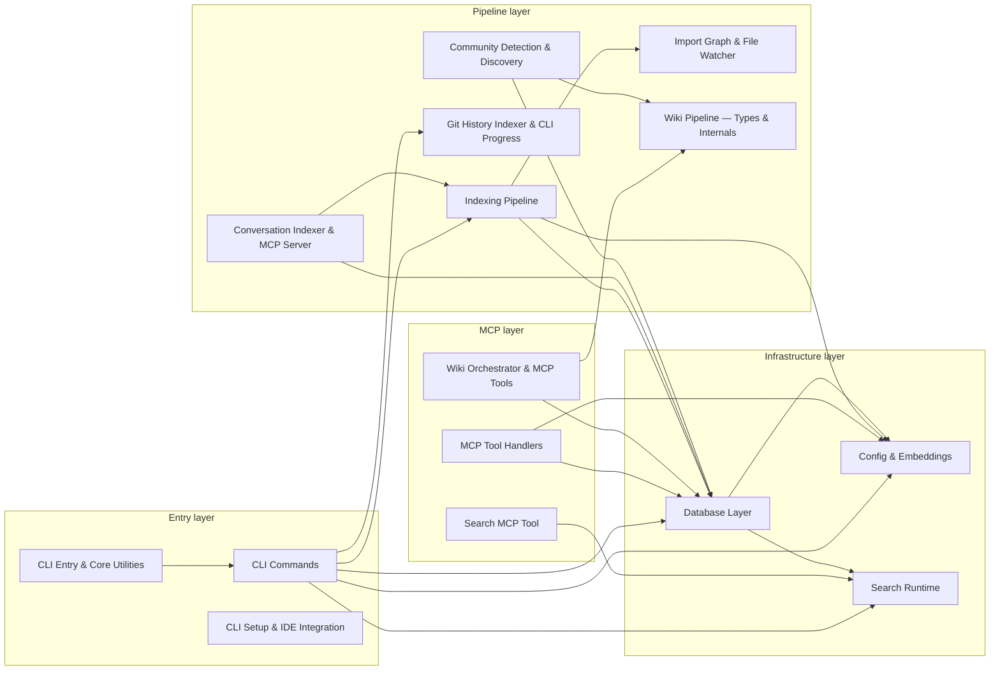
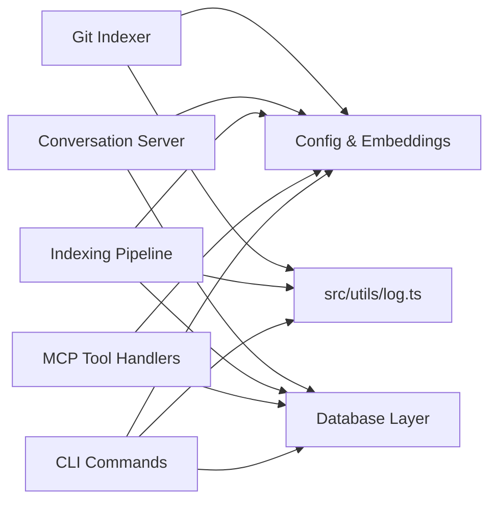

# Architecture

> Generated from `79e963f` · 2026-04-26

Mimirs is a persistent project memory and RAG (Retrieval-Augmented Generation) system for AI coding agents. The codebase is organised as 15 cohesive communities under `src/`, each anchored by an entry file that re-exports a narrow surface, and a benchmark suite plus test helpers under `benchmarks/` and `tests/`.

## System map

The 15 communities form a layered dependency graph. Infrastructure sits at the bottom (config, DB, embeddings), pipeline and runtime services in the middle, and CLI and MCP adapters at the top.

## Load-bearing files

These files have the highest PageRank scores — they sit at the structural centre of the import graph and a change here ripples across many communities.

| File | Fan-in | Fan-out | What it anchors |
|------|--------|---------|-----------------|
| `src/embeddings/embed.ts` | 77 | 0 | Embedding singleton; imported by 7 of 15 communities. Every indexing path and search path runs through here. |
| `src/wiki/types.ts` | 88 | 1 | Shared type contracts for the entire wiki pipeline; 2 communities depend on it directly and all wiki stages transitively. |
| `src/utils/log.ts` | 27 | 0 | Structured logging; imported by 7 of 15 communities. Every service that emits progress or errors goes through this. |
| `src/db/index.ts` | 59 | 10 | The `RagDB` class and all persistence operations; imported by 9 of 15 communities. The sole path to the SQLite store. |
| `src/config/index.ts` | 42 | 4 | Config loader and model defaults; imported by 7 of 15 communities including the CLI, MCP server, and search. |
| `src/search/hybrid.ts` | 21 | 3 | Hybrid vector+FTS ranking engine; imported by the search tool, CLI commands, and wiki pipeline. |

`src/embeddings/embed.ts` is the single highest-fanIn file (77 internal imports) despite having zero outgoing edges — it is a pure leaf that everything depends on. `src/db/index.ts` is the structural bridge with both high fanIn (59) and high fanOut (10), making it the most load-bearing node in the graph: it connects Config, Search, and all pipeline stages together.

## Entry points

The bundle lists 56 files with no incoming edges — the true entry points of the process graph. Most are benchmark scripts and test fixtures that stand alone by design. The runtime entry points that matter are:

| File | What it exports |
|------|-----------------|
| `src/cli/index.ts` — [CLI Entry & Core Utilities](communities/cli-entry-core.md) | Process bootstrap; parses argv, loads config, and dispatches to subcommand handlers |
| `src/server/index.ts` — [Conversation Indexer & MCP Server](communities/conversation-server.md) | MCP server bootstrap; wires all tool groups and starts the protocol listener |
| `benchmarks/*.ts` | Stand-alone benchmark scripts; no imports from them, no exports |

Benchmark files (`benchmarks/ast-truncation-analysis.ts`, `benchmarks/indexing-bench.ts`, etc.) have no exports and are not required at runtime — they are isolated measurement harnesses.

## Cross-cutting dependencies

Three modules are imported by nearly every community and are best understood as shared infrastructure rather than features.

[Config & Embeddings](communities/config-embeddings.md) is imported by 7 of 15 communities. It holds the model singleton (`src/embeddings/embed.ts`) and the YAML config loader (`src/config/index.ts`) — any code path that produces or consumes vectors must go through it. [Database Layer](communities/db-layer.md) is imported by 9 of 15 communities; every read or write to the SQLite store goes through `RagDB` in `src/db/index.ts`. `src/utils/log.ts` is the shared logger, imported by 7 communities; it is a pure leaf with no outgoing edges.

Test infrastructure: `tests/helpers.ts` is imported by 67 test files and is the shared test fixture; it is excluded from the community graph by the Louvain algorithm because it is a test-only node.

## Design decisions

**1. Single SQLite file as the persistence layer.**
Mimirs stores all chunks, embeddings, annotations, checkpoints, conversations, and the import graph in a single SQLite database via `RagDB` in `src/db/index.ts`. The alternative was a dedicated vector store (Chroma, Qdrant) plus a separate metadata store. SQLite was chosen because it ships with zero infrastructure overhead — a user running `mimirs init` gets a working index without running any server. The trade-off is that vector search is handled by a BM25+cosine hybrid rather than an ANN index, which is fast enough for project-scale corpora (tens of thousands of chunks) but would not scale to millions.

**2. Local transformer model with a lazy singleton.**
The embedding model is loaded once at process start via a lazy singleton in `src/embeddings/embed.ts` (fanIn=77). The alternative of calling an external API (OpenAI, Cohere) was rejected because it would require a network round-trip per indexing batch, introduce latency, and tie the tool to an API key. The local model makes indexing fully offline and deterministic. The cost is a cold-start penalty on the first invocation, which the lazy singleton amortises across the process lifetime.

**3. Louvain community detection drives wiki structure.**
Rather than manually grouping files into modules, the wiki pipeline runs the Louvain algorithm on the import graph extracted by `src/wiki/discovery.ts` to find communities automatically. This means the wiki topology reflects the actual coupling in the code, not a developer's intuition about what belongs together. The alternative of hand-crafted module boundaries was rejected because it goes stale as the codebase evolves. The trade-off is that Louvain occasionally merges logically distinct concerns when their files happen to be tightly coupled — the bundle's `DEPTH_PROFILE` thresholds and the community synthesis stage compensate by flagging deep bundles for richer prose treatment.

**4. MCP as the primary tool protocol.**
All runtime capabilities (search, indexing, annotation, wiki generation) are exposed through the Model Context Protocol rather than a proprietary JSON-RPC surface. This means any MCP-capable client (Claude Code, Cursor, Windsurf, VS Code Copilot) gets the full tool set without a custom integration. The [MCP Tool Handlers](communities/mcp-tools.md) community is a thin adapter layer over the DB and business logic, so the protocol choice does not bleed into the core algorithms.

**5. Hybrid search (vector + BM25) with explicit weight tuning.**
`src/search/hybrid.ts` merges cosine-similarity vector results with BM25 full-text results at a tunable weight (`DEFAULT_HYBRID_WEIGHT = 0.7` toward vector). Neither pure vector nor pure BM25 search alone performs well on code: vector search misses exact identifiers, BM25 misses semantic paraphrases. The hybrid approach with boosts for source path, symbol expansion, dependency-graph proximity, and filename affinity achieves measurable Recall@10 and MRR improvements over either alone (see `BENCHMARKS.md`).

**6. Wiki generation is a multi-phase pipeline, not a single LLM call.**
The `generate_wiki` tool runs five distinct phases: discovery → community detection → synthesis (LLM, per-community) → bundling → page rendering. Each phase writes a deterministic artifact under `wiki/_meta/` (classified JSON, syntheses JSON, bundles JSON, manifest JSON). The alternative of a single large LLM call over the entire codebase was rejected because it exceeds context limits and produces shallow output. Phased generation lets each LLM call see exactly the bundle it needs, and incremental re-runs (`incremental: true`) diff against the manifest to regenerate only stale pages.

## See also

- [CLI Commands](communities/cli-commands.md)
- [CLI Entry & Core Utilities](communities/cli-entry-core.md)
- [CLI Setup & IDE Integration](communities/cli-setup.md)
- [Community Detection & Discovery](communities/community-detection.md)
- [Config & Embeddings](communities/config-embeddings.md)
- [Conversation Indexer & MCP Server](communities/conversation-server.md)
- [Data flows](data-flows.md)
- [Database Layer](communities/db-layer.md)
- [Getting started](getting-started.md)
- [Git History Indexer & CLI Progress](communities/git-indexer-progress.md)
- [Import Graph & File Watcher](communities/graph-watcher.md)
- [Indexing Pipeline](communities/indexing-pipeline.md)
- [MCP Tool Handlers](communities/mcp-tools.md)
- [Search MCP Tool](communities/search-tool.md)
- [Search Runtime](communities/search-runtime.md)
- [Wiki Orchestrator & MCP Tools](communities/wiki-orchestrator.md)
- [Wiki Pipeline — Types & Internals](communities/wiki-pipeline-internals.md)
