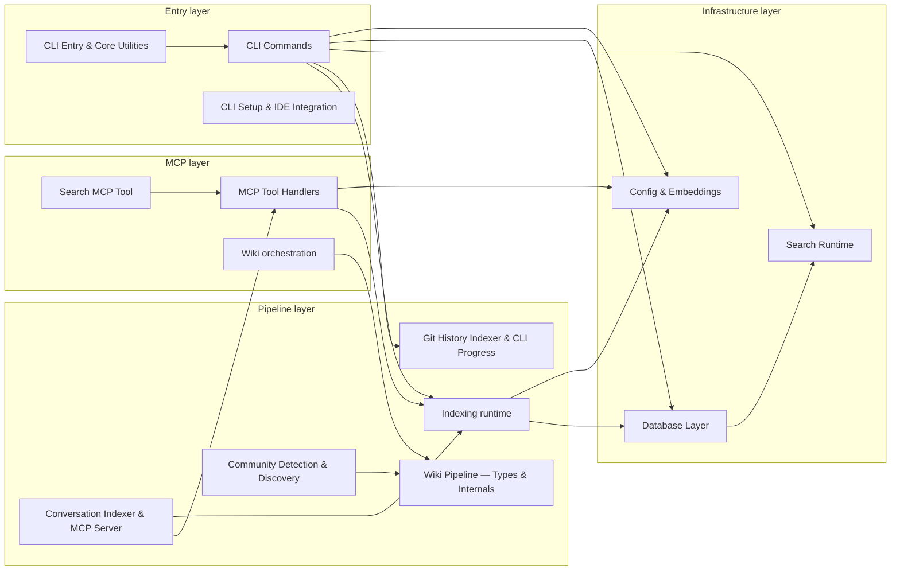
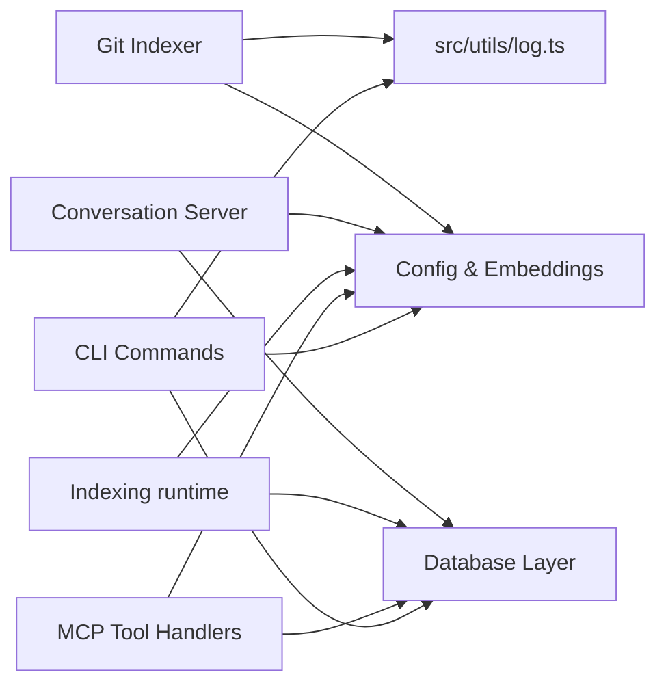

# Architecture

> Generated from `b47d98e` · 2026-04-26

Mimirs is a persistent project memory and RAG system for AI coding agents. The codebase is organised as 14 cohesive communities under `src/`, each anchored by an entry file that re-exports a narrow surface, plus a benchmark suite under `benchmarks/` and shared test helpers under `tests/`. The communities below are the Louvain partitions of mimirs' own import graph — exactly the structure the wiki pipeline produces when run against any project.

## System map

The 14 communities form a layered dependency graph. Infrastructure (config, embeddings, the SQLite layer, search runtime) sits at the bottom; the pipeline and ingestion communities sit in the middle; CLI and MCP adapters sit at the top. The map below shows the load-bearing edges between communities — minor ties (weight 1–2) are omitted to stay within the diagram budget.

The strongest meta-graph edges anchor this picture: `cli-commands` → `config-embeddings` (weight 20), `cli-entry-core` ↔ `cli-commands` (18 / 19), `cli-commands` → `db-layer` (16) and → `search-runtime` (13), `mcp-tools` → `config-embeddings` (8), and `community-detection` → `wiki-pipeline-internals` (9). The CLI is the busiest hub by edge weight; the MCP tool handlers are second.

## Load-bearing files

These files have the highest PageRank scores in the import graph — they sit at the structural centre of the codebase, and a change here ripples across many communities. PageRank ranks structural centrality; the `fanIn` and `fanOut` columns are the citable counts a reader can verify with `depended_on_by` / `depends_on`.

| File | Fan-in | Fan-out | What it anchors |
|------|--------|---------|-----------------|
| `src/embeddings/embed.ts` | 77 | 0 | Embedding singleton; imported by 7 of 14 communities. Every indexing path and every search path runs through here. |
| `src/wiki/types.ts` | 95 | 1 | Shared type contracts for the entire wiki pipeline; 2 communities depend on it directly and every wiki stage transitively. |
| `tests/helpers.ts` | 67 | 0 | Shared test fixture; pure leaf, excluded from the community graph. |
| `src/utils/log.ts` | 27 | 0 | Structured logging; imported by 7 of 14 communities. |
| `src/db/index.ts` | 59 | 10 | The `RagDB` class and all persistence operations; imported by 8 of 14 communities. The sole path to the SQLite store. |
| `src/config/index.ts` | 42 | 4 | Config loader and model defaults; imported by 7 of 14 communities including the CLI, MCP server, and search. |
| `src/search/usages.ts` | 4 | 0 | Symbol-usage lookup helper; small fan-in but high PageRank because it sits inside the search runtime hot path. |
| `src/conversation/parser.ts` | 11 | 0 | `parseTurns` JSONL parser; bridges the conversation indexer and the MCP tool group. |
| `src/search/hybrid.ts` | 21 | 3 | Hybrid vector + FTS ranking engine; imported by the search tool, CLI commands, and the wiki pipeline internals. |
| `src/indexing/chunker.ts` | 17 | 1 | AST-aware chunker; reused by the conversation indexer to chunk transcripts. |
| `src/graph/resolver.ts` | 16 | 1 | Import-edge resolver; bridges CLI commands, community detection, and the MCP tool group. |

`src/embeddings/embed.ts` is the single highest-fanIn source file (77 internal imports) despite having zero outgoing edges — it is a pure leaf that everything depends on. `src/db/index.ts` is the structural bridge with both high fanIn (59) and the largest fanOut (10) of any hub, making it the most load-bearing node in the graph: it connects [Config & Embeddings](communities/config-embeddings.md), [Search Runtime](communities/search-runtime.md), and every pipeline stage. `src/wiki/types.ts` dominates the wiki side with the largest raw fan-in (95) but is only imported by two communities directly — the rest of the wiki pipeline picks it up transitively through those two.

## Entry points

The bundle lists 57 files with no incoming edges — the true graph sinks. The vast majority are benchmark scripts in `benchmarks/` that stand alone by design, none of which export anything. The runtime entry points that matter are a much smaller set:

| File | What it exports |
|------|-----------------|
| `src/cli/index.ts` ([CLI Entry & Core Utilities](communities/cli-entry-core.md)) | `main` — process bootstrap; parses argv, loads config, dispatches to subcommand handlers |
| Server bootstrap ([Conversation Indexer & MCP Server](communities/conversation-server.md)) | MCP server; wires every tool group and starts the protocol listener |
| `benchmarks/*.ts` | Stand-alone benchmark scripts; no imports from them, no exports — measurement harnesses only |

The benchmark files (`benchmarks/ast-truncation-analysis.ts`, `benchmarks/collect-files-bench.ts`, `benchmarks/count-grouping-sim.ts`, `benchmarks/excalidraw-parent-bench.ts`, `benchmarks/indexing-bench.ts`, `benchmarks/indexing-bench-v2.ts`, `benchmarks/large-json.bench.test.ts`, `benchmarks/parent-promotion-bench.ts`, `benchmarks/quality-bench.ts`, `benchmarks/quality-bench-worker.ts`) appear in the entry-point list because they are leaf scripts: nothing in `src/` imports them, and they themselves are not part of the runtime call graph. Treat them as a self-contained measurement suite — see [Search Runtime](communities/search-runtime.md) for the eval harness they exercise.

## Cross-cutting dependencies

Three modules are imported by nearly every community and are best understood as shared infrastructure rather than features. Pulling them out of the main map keeps the system diagram readable without losing the fact that almost everything touches them.

[Config & Embeddings](communities/config-embeddings.md) is imported by 7 of 14 communities. It owns the model singleton (`src/embeddings/embed.ts`) and the config loader (`src/config/index.ts`) — any code path that produces or consumes vectors must go through it. [Database Layer](communities/db-layer.md) is imported by 8 of 14 communities; every read or write to the SQLite store goes through `RagDB` in `src/db/index.ts`. `src/utils/log.ts` is the shared logger, imported by 7 communities; it is a pure leaf with no outgoing edges and no transitive dependencies.

Test infrastructure: `tests/helpers.ts` is imported by 67 test files and is the shared test fixture; it is excluded from the community graph by Louvain because it is a test-only node with no role in the runtime call paths.

## Design decisions

**1. Single SQLite file as the persistence layer.** Mimirs stores all chunks, embeddings, annotations, checkpoints, conversations, git history, and the import graph in a single SQLite database, accessed through `RagDB` in `src/db/index.ts`. The alternative was a dedicated vector store (Chroma, Qdrant) plus a separate metadata store. SQLite was chosen because it ships with zero infrastructure overhead — a user running `mimirs init` gets a working index without running any server. The trade-off is that vector search is handled by a BM25 + cosine hybrid rather than an ANN index, which is fast enough for project-scale corpora (tens of thousands of chunks) but would not scale to millions of documents.

**2. Local transformer model with a lazy singleton.** The embedding model is loaded once at process start via a lazy singleton in `src/embeddings/embed.ts` (fan-in 77). The alternative of calling an external API (OpenAI, Cohere) was rejected because it would require a network round-trip per indexing batch, introduce latency, and tie the tool to an API key. The local model makes indexing fully offline and deterministic. The cost is a cold-start penalty on the first invocation, which the lazy singleton amortises across the lifetime of the process.

**3. Louvain community detection drives wiki structure.** Rather than manually grouping files into modules, the wiki pipeline runs the Louvain algorithm on the import graph and uses the resulting communities as the wiki's chapter boundaries — see [Community Detection & Discovery](communities/community-detection.md). This means the wiki topology reflects actual coupling in the code, not a developer's intuition about what belongs together. Hand-crafted module boundaries were rejected because they go stale as the codebase evolves. The trade-off is that Louvain occasionally merges logically distinct concerns when their files happen to be tightly coupled; the [Wiki Pipeline — Types & Internals](communities/wiki-pipeline-internals.md) community compensates by splitting deep bundles into per-file sub-pages.

**4. MCP as the primary tool protocol.** All runtime capabilities (search, indexing, annotation, wiki generation) are exposed through the Model Context Protocol rather than a proprietary surface. Any MCP-capable client (Claude Code, Cursor, Windsurf, VS Code Copilot) gets the full tool set without a custom integration. The [MCP Tool Handlers](communities/mcp-tools.md) community is a thin adapter layer over `RagDB` and the business-logic communities, so the protocol choice does not bleed into the core algorithms — a hypothetical second protocol would only require a sibling adapter community.

**5. Hybrid search over vector + BM25.** `src/search/hybrid.ts` merges cosine-similarity vector results with BM25 full-text results at a tunable weight. Neither pure vector nor pure BM25 search alone performs well on code: vector search misses exact identifiers, BM25 misses semantic paraphrases. The hybrid approach with boosts for source path, symbol expansion, dependency-graph proximity, and filename affinity achieves measurable Recall@10 and MRR improvements over either alone (see `BENCHMARKS.md` and the [Search Runtime](communities/search-runtime.md) community).

**6. Wiki generation is a multi-phase pipeline, not a single LLM call.** The `generate_wiki` tool runs through discovery, categorization, community detection, synthesis, bundling, and page rendering — each phase writes a deterministic artifact under `wiki/_meta/` (one JSON per pipeline phase: classified, syntheses, bundles, discovery, isolate-docs). The alternative of one large LLM call over the entire codebase was rejected because it exceeds context limits and produces shallow output. Phased generation lets each LLM call see exactly the bundle it needs, and incremental re-runs (`incremental: true`) diff against the manifest to regenerate only stale pages — see [Wiki orchestration](communities/wiki-orchestration.md).

## See also

- [CLI Commands](communities/cli-commands.md)
- [CLI Entry & Core Utilities](communities/cli-entry-core.md)
- [CLI Setup & IDE Integration](communities/cli-setup.md)
- [Community Detection & Discovery](communities/community-detection.md)
- [Config & Embeddings](communities/config-embeddings.md)
- [Conversation Indexer & MCP Server](communities/conversation-server.md)
- [Data flows](data-flows.md)
- [Database Layer](communities/db-layer.md)
- [Getting started](getting-started.md)
- [Git History Indexer & CLI Progress](communities/git-indexer-progress.md)
- [Indexing runtime](communities/indexing-runtime.md)
- [MCP Tool Handlers](communities/mcp-tools.md)
- [Search MCP Tool](communities/search-tool.md)
- [Search Runtime](communities/search-runtime.md)
- [Wiki orchestration](communities/wiki-orchestration.md)
- [Wiki Pipeline — Types & Internals](communities/wiki-pipeline-internals.md)
