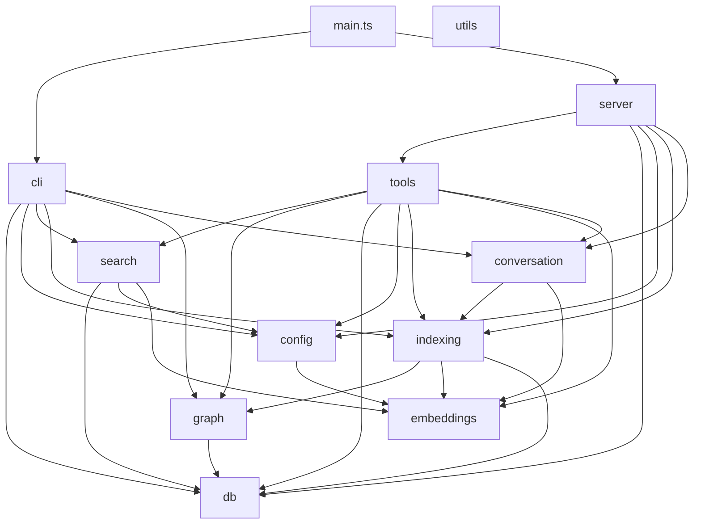

# Architecture

## Overview

mimirs is a persistent project memory layer for AI coding agents. It indexes
codebases into AST-aware semantic chunks, embeds them with a local ONNX model
(all-MiniLM-L6-v2), and serves hybrid vector + BM25 search over MCP (Model
Context Protocol). Beyond file search it tracks conversation history,
checkpoints, annotations, and dependency graphs -- giving agents durable
context across sessions.

The system is built with TypeScript on the Bun runtime. All data lives in a
single SQLite database (with sqlite-vec for vector search and FTS5 for keyword
search) stored in each project's `.mimirs/` directory.

## Module Map

## Entry Points

| Entry | File | Purpose |
|-------|------|---------|
| **CLI** | `src/main.ts` | Parses `process.argv` and dispatches to `src/cli/index.ts` |
| **MCP server** | `src/server/index.ts` | `startServer()` -- creates the MCP server, registers tools, runs background indexing |
| **Command dispatch** | `src/cli/index.ts` | Maps subcommand strings to handler functions (18+ commands) |

`src/main.ts` is the single Bun entry point. The `serve` subcommand
dynamically imports `src/server/index.ts` to avoid loading native SQLite
dependencies for non-server CLI commands. If the import fails, diagnostics
are written to `.mimirs/server-error.log` and `.mimirs/status`.

## Configuration

All project-level configuration lives in `.mimirs/config.json`, validated at
load time by a Zod schema ([`RagConfigSchema`](entities/rag-config.md)). If
the file is missing, `loadConfig()` writes sensible defaults and returns them.
There is no hidden merge logic -- what is on disk is what runs.

Key configuration areas:

| Area | Fields | Purpose |
|------|--------|---------|
| File selection | `include`, `exclude`, `generated` | Glob patterns controlling which files are indexed and which are demoted in search |
| Chunking | `chunkSize`, `chunkOverlap` | Controls chunk boundaries (default 512 chars, 50 overlap) |
| Search | `hybridWeight`, `searchTopK` | Vector/BM25 blend ratio (default 0.7) and default result count |
| Embedding | `embeddingModel`, `embeddingDim`, `embeddingMerge` | Model selection and oversized-chunk windowing |
| Indexing | `indexBatchSize`, `indexThreads`, `incrementalChunks` | Performance tuning and incremental re-embedding |
| Benchmarks | `benchmarkTopK`, `benchmarkMinRecall`, `benchmarkMinMrr` | Quality thresholds for search benchmarks |

## Design Decisions

- **Single SQLite database**: All data -- chunks, embeddings, FTS indexes,
  graphs, conversations, checkpoints, annotations, analytics -- lives in one
  `.mimirs/index.db` file. WAL mode and a 5-second busy timeout handle
  concurrent access from the server and watcher.
- **AST-aware chunking**: Files are split using tree-sitter via `bun-chunk`
  for 30+ languages. This preserves function/class boundaries and extracts
  import/export metadata for the dependency graph. Languages without AST
  support fall back to blank-line heuristic splitting.
- **Local embeddings**: The all-MiniLM-L6-v2 ONNX model runs entirely locally
  via Transformers.js -- no API keys, no network calls. A windowed embedding
  merge handles chunks exceeding the 256-token limit.
- **Hybrid search**: Every query runs both vector similarity (cosine via
  sqlite-vec) and BM25 keyword matching (FTS5), merged with configurable
  weighting. Additional score adjustments for filename affinity, dependency
  centrality, test/generated file demotion, and symbol expansion.
- **Incremental everything**: File hashes skip unchanged files during indexing.
  Content hashes on individual chunks allow incremental re-embedding when
  `incrementalChunks` is enabled. The file watcher re-indexes on save.
- **MCP protocol**: Exposes all capabilities as MCP tools, making it
  agent-agnostic. Works with Claude Code, Cursor, Windsurf, VS Code Copilot,
  JetBrains, and any MCP-compatible client.
- **Dynamic server import**: The `serve` command dynamically imports the
  server module to isolate native dependency failures (bun:sqlite, sqlite-vec)
  from the rest of the CLI. If the import fails, diagnostics are written to
  `.mimirs/server-error.log` and `.mimirs/status`.

## See Also

- [Data Flow](data-flow.md) -- indexing and search pipelines in detail
- [API Surface](api-surface.md) -- MCP tools, CLI commands, configuration
- [Modules](modules/) -- per-module documentation
- [Key Entities](entities/) -- RagDB, hybridSearch, Chunk, RagConfig
