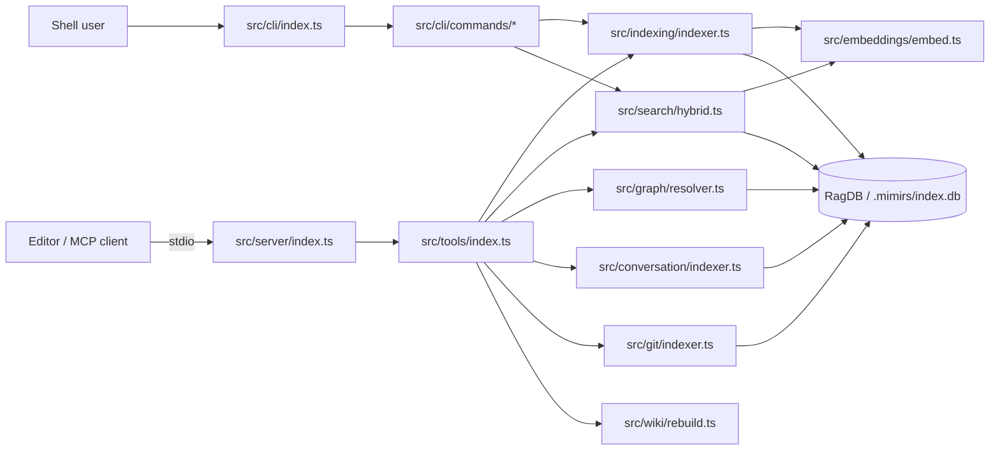

# Architecture

This page is a bird's-eye view of mimirs: how the pieces fit together at runtime, what crosses which boundary, and which invariants the code relies on. It's for someone trying to add a feature or debug an end-to-end issue who needs a map before diving into a flow page.

## Two front doors, one store

mimirs is reached through two surfaces. The MCP stdio server (`src/server/index.ts:88-256`) is what an editor like Claude Code or Cursor talks to over a JSON-RPC pipe; the `mimirs` CLI is what a human uses from a shell. Both end up in the same place: a per-project SQLite file at `.mimirs/index.db`, opened by `RagDB` (`src/db/index.ts:89-123`). The CLI bootstraps each subcommand by constructing `RagDB` directly. The server keeps a per-directory cache of open DBs (`src/server/index.ts:23-51`) so background tasks like the watcher can keep using a connection across many tool calls without re-opening it.

The contract that lets both front doors share the same code is `resolveProject` in `src/tools/index.ts:21-37`. Tool handlers receive a `directory` argument, `resolveProject` turns it into an absolute path, opens or returns a cached DB, loads the project config, and applies the embedding model from that config. CLI commands do the same three steps inline (see `src/cli/commands/init.ts:31-32` for the pattern). The contract is: nothing downstream of `resolveProject` is allowed to assume a process-wide project.

## Tools as thin handlers

The MCP toolbox is one file per topic under `src/tools/`, glued together by `registerAllTools` in `src/tools/index.ts:39-56`. Each handler does the same shape: parse a Zod schema, call `resolveProject`, dispatch to a service module, return text content. The search tool is typical — `src/tools/search.ts` validates inputs and delegates to `search()` in `src/search/hybrid.ts:313-397`. Indexing handlers (`src/tools/index-tools.ts:7-92`) call `indexDirectory` from `src/indexing/indexer.ts:695-799`. The boundary is sharp: tools never touch SQL or globs; services never construct MCP responses.

See [search](tools/search.md) and [index_files](tools/index-files.md) for the per-tool detail.

## Cross-cutting embeddings

`src/embeddings/embed.ts` is a singleton used by every service that needs a vector. The indexer calls it when chunking files (`src/indexing/indexer.ts:741-742` eagerly loads the model so status reflects model-load progress before file progress starts). The search code calls it once per query (`src/search/hybrid.ts:323`). Annotations and checkpoints embed their text at write time, and the git-history indexer embeds commit messages. Because the model is a singleton, changing `config.embeddingModel` only takes effect after a restart — `applyEmbeddingConfig` runs once per `resolveProject` and reconfigures the embedder for the rest of the process lifetime.

## The index lock invariant

Multiple mimirs servers can be alive against the same project — one per IDE window is normal. Without coordination, two concurrent `indexDirectory` calls on the same file race past each other's deletes and double-insert chunk rows (`src/utils/index-lock.ts:17-27`). The defense is a process-level lock at `.mimirs/index.lock`, acquired by `tryAcquireIndexLock` (`src/utils/index-lock.ts:28-65`). The lock contains the holding PID; stale locks (PID gone) are reclaimed automatically; reentrant within one process via the `heldLocks` refcount so the server can hold the lock for its lifetime and also wrap each manual `indexDirectory` call.

The server tries to acquire it during boot (`src/server/index.ts:269-277`). Lock holders run the indexer and watcher; non-holders write `mode: query-only` to the status file and keep serving search/read tools against whatever the lock holder has produced. `indexDirectory` itself also tries to acquire the lock at `src/indexing/indexer.ts:722-730`, so the safety holds even when an MCP tool call drives indexing directly.

There is a one-time self-repair path that exists because earlier versions ran without this lock: `RagDB.dedupeChunks` (`src/db/index.ts:421-472`) collapses duplicate `(file_id, chunk_index, content_hash)` rows and clears `files.hash` on affected files so the next indexer pass re-emits them cleanly.

## Observability via files, not endpoints

mimirs is an stdio process — there is no HTTP port to scrape. External observers (IDEs, the `mimirs doctor` CLI, the user's own scripts) read two files under `.mimirs/`:

- `status` is rewritten throughout boot and on every watcher event. Boot phases are visible at `src/server/index.ts:110`, `179`, `190`, `205`, `207`. Watcher progress is written at `src/server/index.ts:339-346`. Exit reasons land via `writeExitStatus` at `src/server/index.ts:119-138`, including `interrupted` on SIGINT/SIGTERM/SIGHUP, `stdin closed`, or `uncaught exception`.
- `server-error.log` is written by `writeStartupError` (`src/server/index.ts:62-86`) when something blows up before transport connect — exactly the case where the MCP client only sees `Connection closed` with no details.

The `server_info` tool (`src/tools/server-info-tools.ts:12-75`) is the in-band version of the same idea: project dir, db dir, embedding model, active config, all open DBs and their last-active times.

## How a search call hangs together

The search flow is a good worked example of the whole stack. `src/tools/search.ts` accepts a query and optional path filters, `resolveProject` opens the DB and configures the embedder, and `search()` in `src/search/hybrid.ts:313-397` runs a hybrid vector + FTS query against `RagDB`, blends scores via `mergeHybridScores`, applies path/filename/graph boosts, and writes a `query_log` row through `db.logQuery` at `src/search/hybrid.ts:386-394`. That row is what powers the `search_analytics` tool later. The store side of the same flow is `src/db/analytics.ts:3-8`.

## Key source files

- `src/server/index.ts` — MCP stdio entry; status file, signal handlers, DB cache, lock acquisition, background indexer and watcher, conversation tail.
- `src/tools/index.ts` — tool registration and the `resolveProject` contract that both front doors share.
- `src/indexing/indexer.ts` — full-project and per-file indexing pipeline; takes the same lock as the server.
- `src/search/hybrid.ts` — hybrid vector + FTS search, score blending, analytics logging.
- `src/db/index.ts` — `RagDB` class and the SQLite schema (files, chunks, vec/FTS virtual tables, annotations, checkpoints, conversation, git_commits).
- `src/utils/index-lock.ts` — process-level lock that protects the indexer from itself.
- `src/tools/server-info-tools.ts` — in-band observability surface.
