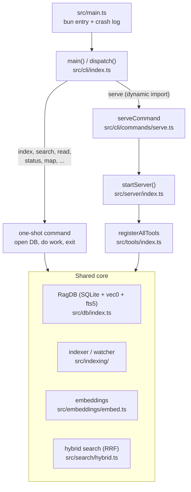

# Architecture

mimirs is a local code-RAG engine: it indexes a project's files into a SQLite database, embeds the chunks, and answers semantic and graph queries against them. The same engine ships in two shapes. A one-shot **CLI** runs a single command and exits; a long-running **MCP server** stays alive over stdio so an IDE agent can call tools across a whole session. This page explains how those two entry styles are wired, what core they share, and the seams a maintainer edits to add a command, a tool, or a table. For the step-by-step behavior of any one command or tool, follow the linked flow pages — this page stays at the level of how the pieces hang together.

## Two entry styles over one core

Every invocation starts at the same binary. `src/main.ts` is the `#!/usr/bin/env bun` entry point: it imports `main` from the CLI and wraps it in a top-level `.catch` that writes a crash to `.mimirs/server-error.log` before exiting non-zero. `main()` reads `process.argv`, prints usage for no-args/`--help`, then routes the first argument through a `switch` in `dispatch()`; a bad numeric flag surfaces as a `CliFlagError` with a clear message and exit 1 rather than a crash log (`src/cli/index.ts:94-111`, `src/cli/index.ts:113-185`).

Most subcommands are statically imported at the top of `src/cli/index.ts` and run to completion: `index`, `search`, `read`, `status`, `remove`, `map`, `conversation`, `checkpoint`, `history`, and so on. Each opens a database, does its work, and the process exits. The one branch that does not exit is `serve`. It is imported **dynamically** inside the `case "serve"` arm rather than at module top (`src/cli/index.ts:115-118`). That is deliberate: the server's transitive dependencies pull in `bun:sqlite`, `sqlite-vec`, and top-level `await`s that can throw at module-load time. A static import would crash the whole CLI before any handler ran — even `doctor`, the command whose job is to diagnose that very failure. The dynamic import keeps that fault contained to the `serve` path (`src/cli/index.ts:17-19`).

The shared core sits below both paths. A one-shot command like `search` constructs a `RagDB`, loads config, and calls the same `search()` function the MCP `search` tool calls. The server constructs a `RagDB` per project directory and hands every tool a way to reach it. Neither path has its own copy of indexing or search logic; they differ only in lifecycle. See [mimirs serve](cli/serve.md) and [Start the MCP server](server/start.md) for the server side, and [mimirs search](cli/search.md), [mimirs read](cli/read.md), and [mimirs index](cli/index.md) for the one-shot side.

## The shared core: RagDB, indexer, embeddings, hybrid search

The center of gravity is `RagDB`, exported from `src/db/index.ts:101`. Its constructor is where all the platform-specific setup happens. On macOS, Apple's bundled SQLite cannot load extensions, so `loadCustomSQLite()` points `bun:sqlite` at a Homebrew build before any `Database` is opened, and throws a "brew install sqlite" message if none is found (`src/db/index.ts:52-73`). The constructor then resolves the storage directory — `RAG_DB_DIR` if set, otherwise `<project>/.mimirs` — creating it and turning an `EROFS`/`EACCES` failure into an actionable "set RAG_DB_DIR" error (`src/db/index.ts:114-136`). It applies the project's embedding config from disk *before* opening the database, so the vector tables are created at the configured dimension rather than the default 384 (`src/db/index.ts:143-145`). It then opens `index.db` in WAL mode with a 5-second busy timeout, loads the `sqlite-vec` extension, runs the two embedding-compatibility guards, builds the schema, and records the active model on first creation (`src/db/index.ts:147-155`).

`RagDB` is a thin facade. The class holds one `Database` handle and delegates every operation to a focused store module — `files`, `search`, `graph`, `conversation`, `checkpoints`, `annotations`, `analytics`, `git-history` — imported as namespaces at the top of the file (`src/db/index.ts:22-29`) and re-exposed as delegating methods. To add a query, you add a function to the right store module and a one-line delegating method here; you do not touch the schema or other callers. The schema itself lives entirely in `initSchema()`: code/conversation/checkpoint/git/annotation tables, plus `vec0` virtual tables for vector search and `fts5` virtual tables for BM25 keyword search, kept in sync by `AFTER INSERT/DELETE/UPDATE` triggers (`src/db/index.ts:292-459`). The code FTS table indexes two columns — `snippet` and a `parts` column that holds split identifier fragments (camelCase / snake_case / dotted names broken into their pieces), so a query for `getDB` can match a chunk that only writes `get` and `db` separately (`src/db/index.ts:324-340`). Because a `vec0` table cannot be the child of a foreign-key cascade, a dedicated `AFTER DELETE` trigger drops the matching vector row whenever a chunk is deleted, keeping `vec_chunks` in sync from one place instead of every caller remembering a manual delete (`src/db/index.ts:347-349`). For the full table inventory, see [Data Model](data-model.md).

Indexing turns files into rows. `indexDirectory()` collects matching files, eagerly loads the embedding model so progress reflects model load before per-file work, then runs each file through the shared `processFile` pipeline — hash, parse, chunk, embed, write (`src/indexing/indexer.ts:859-958`). File collection respects `.gitignore`: it first asks git for the project's non-ignored files, so ignored directories like `node_modules` are skipped entirely instead of walked; a non-git directory falls back to a plain recursive walk, and the config include/exclude globs apply on top of whichever source produced the list. The whole scan is wrapped in `timed("scan", ...)` so it shows up in the phase profiler (`src/indexing/indexer.ts:919`). Embeddings come from `src/embeddings/embed.ts`, which lazily loads a Transformers.js feature-extraction model (default `Xenova/all-MiniLM-L6-v2`, 384-dim) as a process singleton and reuses it across every file and query (`src/embeddings/embed.ts:53-54`, `src/embeddings/embed.ts:225-271`). After files are written, `indexDirectory` prunes files that no longer exist — guarded so an empty scan never wipes the index — then resolves cross-file import paths, and only then symbol-level references, because ref edges depend on `file_imports.resolved_file_id` being populated first (`src/indexing/indexer.ts:962-1002`).

When indexing feels slow, an optional phase profiler answers *where* the time goes. The main phases of `indexDirectory` — `scan`, `model-load`, `prune`, `resolve-imports`, `resolve-symbol-refs` — are each wrapped in `timed(label, fn)` from `src/utils/profiler.ts` (`src/indexing/indexer.ts:919-1001`). With profiling off (the default) `timed` calls the function directly with zero added work; set `MIMIRS_PROFILE=1` to accumulate per-label wall-clock and render an aligned report. This is a measurement seam, not a behavior change: adding a new timed phase is a one-line wrap.

### Hybrid search: vector + BM25 fused by reciprocal-rank fusion

Search reads those rows back. `search()` in `src/search/hybrid.ts:342` embeds the query once, then runs two independent retrievals over the same chunks: a vector k-NN search against `vec_chunks` and a BM25 keyword search against `fts_chunks`. The two result lists are not on comparable scales — a cosine similarity and a BM25-derived score cannot be linearly mixed without one magnitude swamping the other — so they are combined by **rank**, not by raw score. `mergeHybridScores` delegates to `rrfFuse`, which assigns each list a reciprocal-rank weight of `K / (K + rank)` with `K = 60`, then blends the two contributions as `weight * primaryRank + (1 - weight) * secondaryRank` and dedups across lists by `path:chunkIndex` (`src/search/hybrid.ts:77-103`, `src/search/hybrid.ts:109-115`). This is scale-free reciprocal-rank fusion: the fused score is positional, sits in `(0, 1]`, and is ~1 at the top of each list, which keeps the value compressed enough that the downstream re-ranker boosts can still move results. The blend weight defaults to **0.5** — equal weight to the semantic (vector) and lexical (BM25) rank signals — set by `DEFAULT_HYBRID_WEIGHT` (`src/search/hybrid.ts:59-63`); a sweep over keyword and semantic query sets put the optimum there, and dropping the vector share below ~0.3 collapses recall on semantic queries.

`rrfFuse` is the single fusion point for the whole engine: chunk search and conversation search both run through it. After fusion, `search()` deduplicates to one entry per file, expands the candidate set with exact symbol-name hits for code identifiers in the query, then applies a chain of re-rankers — source dirs up, test dirs down (`src/search/hybrid.ts:123-132`), filename and path-segment affinity, boilerplate and generated-file demotion, and a dependency-graph boost for widely-imported files — before sorting. The BM25 leg is wrapped in a `try/catch` so a malformed FTS query degrades to vector-only rather than failing the whole search. This one function backs both `mimirs search` on the CLI and the [search](tools/search.md) MCP tool. (Git-history search is the lone exception: `search_commits` keeps a fixed linear blend, since commit text and diffs share a comparable scale there.)

## Tool registration: how the server exposes the core

When the server starts, it builds an `McpServer`, then calls `registerAllTools(server, getDB, getConnectedDBs, writeStatus)` to attach every capability (`src/server/index.ts:240-246`). `registerAllTools` is the single wiring point: it calls eleven `registerXTools` functions in sequence — search, index, graph, conversation, checkpoint, annotation, analytics, git, git-history, server-info, and wiki (`src/tools/index.ts:130-148`). Between them those eleven groups register **29** MCP tools — for example the graph group alone exposes eight (`project_map`, `usages`, `depends_on`, `dependents`, `impact`, `trace`, `callees`, `affected`). **To add a tool group, add one `registerXTools` import at the top of `src/tools/index.ts` and one call inside `registerAllTools`; to add a single tool, add one `server.tool(...)` call inside the relevant registrar.** That is the only edit the server entry needs; nothing in `src/server/index.ts` changes.

Every registrar receives `getDB`, a `(dir: string) => RagDB` callback rather than a live database. Tools defer database resolution to call time through `resolveProject`, exported alongside `registerAllTools` (`src/tools/index.ts:33-83`). Given an optional `directory` argument, `resolveProject` falls back to `RAG_PROJECT_DIR` then `process.cwd()`, resolves the path to absolute and verifies it exists, loads that project's config, applies its embedding model so queries match the stored index dimension, and returns `{ projectDir, db, config }`. Read tools must not scaffold a database: unless an explicit `allowCreate` is passed, a `directory` that differs from the configured project and has no `.mimirs/` is rejected rather than silently creating an empty index there (`src/tools/index.ts:49-72`). Every tool handler is also wrapped once by `withFriendlyErrors`, a Proxy over the server's `tool` method that turns any thrown error into a readable `isError` text response with an actionable hint matched from `ERROR_HINTS` — so individual tools don't each need a try/catch (`src/tools/index.ts:87-128`). The `getDB` indirection is what lets one server process serve more than one project directory: each unique resolved path gets its own `RagDB`, and the tool layer never holds a connection it has to manage.

The invariant binding tools to the index is **embedding compatibility**, enforced on two axes. A query embedded with a 768-dim model cannot be compared against a `vec_chunks` table built at 384 dims, so `resolveProject` calls `applyEmbeddingConfigFromDisk` on every tool call from the same raw-disk read the `RagDB` constructor uses, keeping the query embedder matched to the stored index (`src/tools/index.ts:74-82`). The constructor then independently runs two guards. `assertEmbeddingDimCompatible()` reads the dimension out of the stored `vec_chunks` DDL and throws a clear "rebuild or restore embeddingModel" error if it disagrees (`src/db/index.ts:271-290`). `assertEmbeddingModelCompatible()` catches the subtler case where two different models share a dimension but produce incompatible vector spaces — it compares a recorded `embedding_model` (and an `embedding_variant` capturing pooling + dtype) in the `meta` table against the configured model, throwing rather than silently corrupting cosine distances (`src/db/index.ts:226-254`). On a fresh index these values are stamped once by `recordEmbeddingModel()` (`src/db/index.ts:256-262`); legacy indexes built before stamping are grandfathered. The stored index always wins, and tables are never silently recreated.

## Background indexing and watching inside the server

A one-shot `mimirs index` does its work and exits, but the server has to keep the index fresh for the lifetime of an editor session without ever blocking a tool call. `startServer()` orchestrates this carefully in stages (`src/server/index.ts:119-447`).

It registers all tools and connects the stdio transport **first**, before any slow I/O, so the MCP client's `initialize` handshake is answered immediately. Connecting late risks the client timing out, closing the pipes, and turning later stderr writes into `EPIPE` crashes (`src/server/index.ts:256-269`). Only after the transport is live does it open the startup `RagDB` as a preflight — distinguishing a transient "database is locked" (don't cache; the next tool call retries) from a permanent error like missing SQLite (cache in `permanentError` so every tool call gets one clear message) (`src/server/index.ts:271-313`, `src/server/index.ts:32`).

All of the server's background work is gated by a single invariant: **only one server process indexes a project.** When several IDE windows each spawn a server against the same `.mimirs/index.db`, concurrent indexers would double-insert chunk rows. `startServer` calls `tryAcquireIndexLock(startupDir)`; if another live process already holds it, this instance writes a `done` (read-serving) status and skips indexing, watching, and conversation-folder watching, but keeps retrying every 30 seconds so it can take over if the lock owner dies (`src/server/index.ts:415-444`). The lock is a PID file at `.mimirs/index.lock` that auto-reclaims when the owning process is gone and is reentrant within one process via a refcount, so the server can hold it for its whole lifetime while `indexDirectory` re-acquires it per run (`src/utils/index-lock.ts:28-69`, `src/indexing/indexer.ts:851-915`).

Only the lock holder kicks off indexing, and it does so in the background: `indexDirectory(...)` is called without `await`. Its `onProgress` callback streams scan/model-load/per-file messages into the status file; its `.then()` writes a `done` status; and — whether the initial pass succeeded or failed — its `.finally()` starts the filesystem watcher, so a transient startup failure no longer leaves the server watch-less for its whole lifetime (`src/server/index.ts:332-400`). The watcher (`startWatcher`) watches the project recursively, filters events through the pre-compiled include/exclude globs, debounces each path, and funnels changes through a serial queue so a re-index and its graph-resolution never interleave — a removed file is dropped from the index, a changed file is re-indexed and its import/symbol edges re-resolved. Still inside the lock-held branch, `startConversationFolderWatch` tails the project's chat-transcript folder and indexes turns from their stored byte offset, so one agent's findings become searchable to another in near real time (`src/server/index.ts:407-412`). See [mimirs index](cli/index.md) and the [index_files](tools/index-files.md) tool for the indexing flow itself.

## Lifecycle, status, and shutdown

The server is observable from outside through `.mimirs/status`, a plain text file it overwrites at each phase: `starting` with the current phase, per-file progress like `42/118 files (35%)`, `done` with totals, or `error` with the message (`src/server/index.ts:134-144`, `src/server/index.ts:332-378`). Each line is stamped with `pid:<process.pid>` so an exit handler can tell whether this instance still owns the file (`src/server/index.ts:130`). The `writeStatus` callback is passed all the way down into `registerAllTools` so tools can update it too (`src/server/index.ts:246`).

Shutdown is centralized in one `cleanup(reason)` function that sets a `shuttingDown` flag, writes an `interrupted` exit status (only if this instance still owns the file and it has not already reached `done`/`error`), closes the watcher, conversation watcher, and index lock, closes every open `RagDB`, and exits (`src/server/index.ts:177-189`). It is wired to every exit trigger: `stdin` `end` (the IDE window closed) and `error`, the `SIGINT`/`SIGTERM`/`SIGHUP` signals, `uncaughtException`/`unhandledRejection`, and a parent-death watchdog that detects reparenting to init and exits the orphan so the lock is released — all registered early so even a crash mid-startup writes a status rather than leaving a stale one (`src/server/index.ts:193-230`). Open databases are deliberately kept in a `Map` and only closed here, never per tool call, so background indexing and the watcher never lose the connection out from under them; the map is also LRU-capped (8 entries, never evicting the primary project or one touched within 10 minutes) so a long-lived server serving many directories doesn't leak handles (`src/server/index.ts:20-82`).

## Key source files

- `src/main.ts` — bun entry point; calls `main()` and writes fatal crashes to `.mimirs/server-error.log`.
- `src/cli/index.ts` — command parsing and `dispatch()`; statically imports one-shot commands, dynamically imports `serve`.
- `src/server/index.ts` — `startServer`; transport connect, preflight DB, index lock, background index/watch, status file, LRU DB map, and centralized shutdown.
- `src/tools/index.ts` — `registerAllTools` (the single tool-wiring seam), `resolveProject` (per-call DB/config resolution), and the `withFriendlyErrors` handler wrapper.
- `src/db/index.ts` — `RagDB`; SQLite setup, full schema with `vec0`/`fts5` (identifier-aware `parts`) tables and triggers, store-module facade, and embedding dim/model/variant guards.
- `src/indexing/indexer.ts` — `indexDirectory`/`indexFile`; gitignore-aware file collection, the hash→parse→chunk→embed→write pipeline, guarded prune, import/symbol resolution, and `timed` profiler phases.
- `src/embeddings/embed.ts` — lazy singleton Transformers.js embedding model (default `Xenova/all-MiniLM-L6-v2`, 384-dim) shared by indexing and search.
- `src/search/hybrid.ts` — `search`; vector + BM25 retrieval fused by reciprocal-rank fusion (`rrfFuse`, default weight 0.5), with path, filename, generated-file, and dependency-graph re-rankers.
- `src/utils/index-lock.ts` — `tryAcquireIndexLock`; the per-directory PID lock that keeps one process as the sole indexer.
