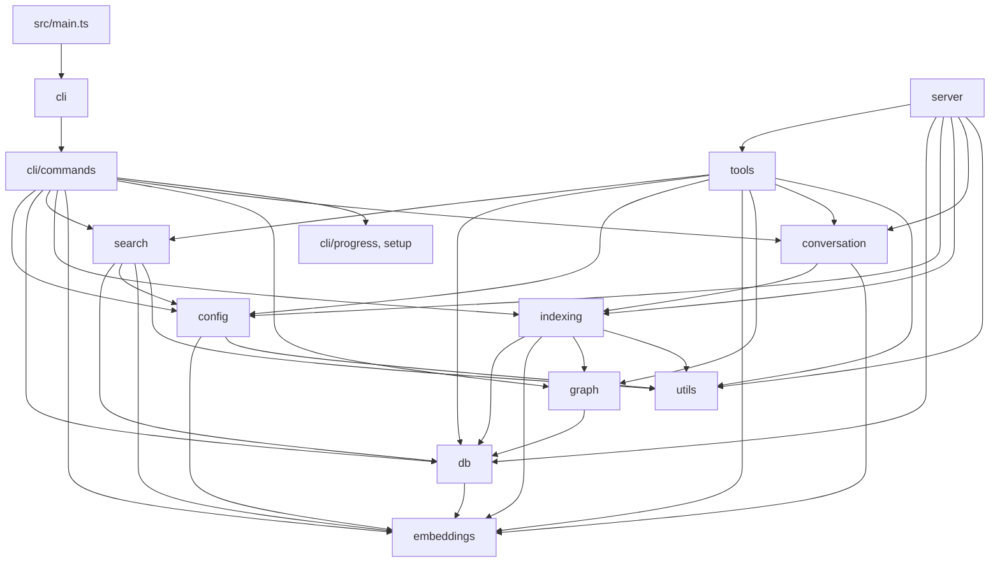

# Architecture

## Overview

local-rag is a semantic search and code intelligence MCP server built with Bun and TypeScript. It indexes codebases into a local SQLite database with vector embeddings (via Hugging Face Transformers.js), then exposes search, navigation, and annotation capabilities through the Model Context Protocol. Everything runs locally — no external APIs, no cloud dependencies.

## Module Map

## Entry Points

There are two primary entry points:

1. **CLI** (`src/main.ts` → `src/cli/index.ts`) — The command-line interface. Provides commands for indexing, searching, setup, benchmarking, and launching the MCP server. This is the main user-facing entry point invoked via `bunx @winci/local-rag`.

2. **MCP Server** (`src/server/index.ts`) — Started by the `serve` CLI command. Runs over stdio, registers all MCP tools, and handles requests from AI agents (Claude Code, Cursor, etc.). This is the primary machine-facing entry point.

## Configuration

Configuration lives in `.rag/config.json` per project. If missing, it's auto-created with defaults on first use. The config schema is validated with Zod (`src/config/index.ts`).

Key config options:
- `include` / `exclude` — glob patterns for which files to index (53 include patterns by default covering 20+ languages)
- `chunkSize` / `chunkOverlap` — chunking parameters in characters (default: 512 / 50)
- `hybridWeight` — balance between vector and BM25 search (default: 0.7 = 70% vector)
- `searchTopK` — default number of search results (default: 10)
- `embeddingModel` / `embeddingDim` — embedding model config (default: Xenova/all-MiniLM-L6-v2, 384 dimensions)
- `generated` — glob patterns for generated files (demoted in search results)

## Design Decisions

- **Local-first**: All processing happens locally using Hugging Face Transformers.js via ONNX runtime. No API keys or network calls needed.
- **SQLite + sqlite-vec**: Single-file database with WAL mode for concurrent reads. Vector search via the `sqlite-vec` extension. FTS5 for BM25 text search. All in one DB file at `.rag/index.db`.
- **Hybrid search**: Combines semantic vector search with BM25 keyword matching (configurable weight) to handle both natural language queries and exact symbol lookups.
- **AST-aware chunking**: Uses tree-sitter (via `@winci/bun-chunk`) to parse source files into semantically meaningful chunks (functions, classes, methods) rather than arbitrary fixed-size splits. Falls back to heuristic blank-line splitting for unsupported languages.
- **Incremental indexing**: Files are hashed and only re-indexed when content changes. Chunk-level deduplication via content hashes avoids redundant embedding computation.
- **MCP protocol**: Exposes all capabilities as MCP tools, making it agent-agnostic. Works with Claude Code, Cursor, Windsurf, and any MCP-compatible client.

## See Also

- [Data Flow](data-flow.md) — how queries and indexing operations flow through the system
- [API Surface](api-surface.md) — all MCP tools and CLI commands
- [Config module](modules/config/index.md) — configuration loading and validation
- [DB module](modules/db/index.md) — database schema and operations
