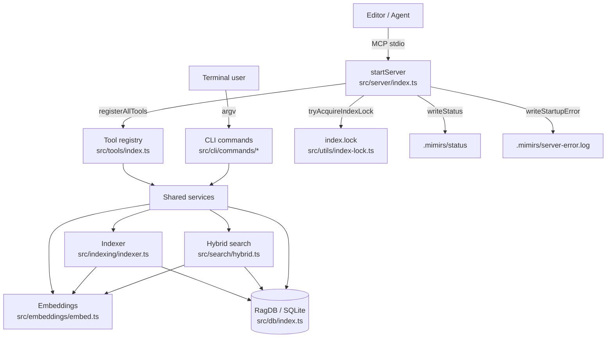

# Architecture

This page is the orientation map for anyone changing mimirs. It explains the two ways callers reach the system, the shared services every entry point delegates to, and the cross-cutting concerns — the embedding model, the per-project SQLite database, the index lock, and the status/error files — that hold it together. Per-feature behavior lives on the individual flow pages; this page is about how the pieces connect and where to cut in when you need to change them.

## Two front doors, one database

mimirs exposes the same capabilities two ways. The **MCP stdio server** is the door an editor or agent uses: `startServer` builds an `McpServer`, registers every tool, and connects a `StdioServerTransport` (`src/server/index.ts:181-207`). The **CLI** is the door a human uses from a terminal; each subcommand under `src/cli/commands/` constructs its own `RagDB` and calls the same service functions. Both doors read and write the same store: a per-project SQLite database at `.mimirs/index.db`, opened by the `RagDB` class (`src/db/index.ts:89-123`).

Because both doors share one database file, neither owns it exclusively. The server keeps a `RagDB` per project directory in a long-lived `dbMap` and never closes a connection mid-session, because background indexing and the file watcher may still hold it; connections close only on process exit (`src/server/index.ts:20-51`, `src/server/index.ts:140-150`). The CLI opens, uses, and exits. The reconciliation between concurrent writers is the index lock, described below.

## The tool registry seam

Every MCP tool is registered from one place. `registerAllTools` calls one `registerXTools` function per tool family, passing the same `getDB` accessor, the optional connected-DB lister, and the `writeStatus` callback (`src/tools/index.ts:39-56`). Each family module (search, indexing, graph, conversation, checkpoints, annotations, analytics, git, git history, server info, wiki) registers its tools against the `McpServer` and is otherwise independent.

This is the seam to edit when adding a capability. To add a new tool family, write a `registerYTools(server, getDB)` module under `src/tools/`, then add one import plus one call inside `registerAllTools`. Every handler shares one contract: it receives an optional `directory` param and resolves it through `resolveProject`, which validates the path exists, loads config, applies the embedding config, and returns `{ projectDir, db, config }` (`src/tools/index.ts:21-37`). Handlers should not open databases or load config themselves; they go through `resolveProject` so the project-resolution and embedding-setup rules stay in one place.

## Shared services behind both doors

Tool handlers and CLI commands are thin. The real work lives in services that both doors call.

The **indexer** turns files into searchable rows. `indexDirectory` scans the project, chunks and parses each file, embeds the chunks, and upserts `files` and `chunks` rows; with `prune: true` it also removes rows for files that no longer match the include patterns (`src/indexing/indexer.ts`, called from `src/tools/index-tools.ts:31-53`). The `index_files` tool passes `prune: !patterns` so a full re-index prunes deleted files but a pattern-scoped refresh leaves the rest of the index untouched (`src/tools/index-tools.ts:24-53`). See [index_files](tools/index-files.md) for the full per-call behavior.

The **hybrid search** service answers code-lookup queries. `search` embeds the query, runs a vector search and a BM25 full-text search, merges the two scores, deduplicates by file, expands exact symbol matches, applies path/filename/graph boosts, and returns ranked files (`src/search/hybrid.ts:313-397`). The dependency-graph boost reads importer counts straight from the database, so search quality depends on the indexer having populated the graph (`src/search/hybrid.ts:301-311`). The `search` tool is a thin wrapper that builds a `PathFilter` from the `extensions`/`dirs`/`excludeDirs` params and formats the ranked results (`src/tools/search.ts:31-99`). See [search](tools/search.md).

The same database object also serves the graph, conversation, checkpoint, annotation, analytics, git, and wiki services — each backed by its own store module under `src/db/`. The `RagDB` class composes all of those store modules (`src/db/index.ts:9-17`), which is why it has a fan-in of more than fifty: nearly every command, tool, and test reaches the database through it.

## Embeddings as a cross-cutting dependency

Both the indexer and the search service depend on the same embedding model. Chunks are embedded at index time; the query is embedded at search time; the two must use the same model and vector dimension or the vectors are not comparable. The embedder lives in `src/embeddings/embed.ts`, which exposes `embed` for single strings and `embedBatch`/`embedBatchMerged` for indexing throughput, plus `configureEmbedder` and `getEmbeddingDim` (`src/embeddings/embed.ts:35-202`). The database reads the active dimension from `getEmbeddingDim()` when it creates the vector table (`src/db/index.ts:3`), and `resolveProject` calls `applyEmbeddingConfig(config)` before any tool runs so the model the index was built with is the model used to query it (`src/tools/index.ts:34-36`). When changing embedding behavior, treat the model id and dimension as a contract spanning the indexer, the search service, and the schema — not a local detail of one module.

## The process-level index lock

Multiple mimirs servers can target the same project — one MCP server per editor window is common. If two of them index concurrently they race past each other and double-insert chunk rows. The guard is a process-level lock. On startup, after the transport is connected, the server calls `tryAcquireIndexLock(startupDir)`; only the holder runs the background indexer and file watcher, and any other instance announces `mode: query-only` and serves reads against the existing index (`src/server/index.ts:266-352`).

The lock is a PID file at `.mimirs/index.lock`. `tryAcquireIndexLock` reclaims a stale lock when the recorded PID is no longer alive, refuses when a live process holds it (returns `null`), and is reentrant within one process via a per-directory refcount so the server can hold it for its lifetime while `indexDirectory` also wraps each run (`src/utils/index-lock.ts:28-89`). The invariant is: at most one process writes the index for a given project at a time; everyone else reads. When touching indexing concurrency, keep that invariant — the lock, not SQLite's `busy_timeout`, is what prevents duplicate chunks. The `index_files` tool surfaces a lock miss explicitly, returning an "Indexing skipped" message and still answering from the existing index (`src/tools/index-tools.ts:66-81`).

## Status file and error log for observability

The server's lifecycle is observable from outside the process through two files under `.mimirs/`. The **status file** is written at every boot phase by the `writeStatus` closure, which stamps the line with `pid:<n>` so an instance only ever overwrites its own status (`src/server/index.ts:100-110`). It moves through `starting` (with sub-phases: creating server, tools registered, connecting transport, transport connected), then either `done` with version, indexed/skipped/pruned counts, file/chunk totals, and watcher progress, or `error` with the failure (`src/server/index.ts:179-210`, `src/server/index.ts:322-348`). On shutdown, `writeExitStatus` writes `interrupted` with a reason — but only if this instance still owns the file and it has not already reached `done`/`error`, so a fresh instance's status is never clobbered (`src/server/index.ts:119-138`).

The **error log** captures crashes that would otherwise be invisible. If tool registration or transport connection throws, `writeStartupError` writes `.mimirs/server-error.log` with the message, stack, and a `bunx mimirs doctor` hint, because a client that loses the stdio pipe sees only "Connection closed" with no detail (`src/server/index.ts:62-86`, `src/server/index.ts:191-211`). When DB open fails, the code distinguishes transient errors (`database is locked`, `SQLITE_BUSY`) — which are not cached, so the next tool call retries — from permanent ones like missing SQLite or a read-only filesystem, which are cached in `permanentError` so every later tool call returns a clear fix instead of failing opaquely (`src/server/index.ts:214-256`, `src/server/index.ts:34-37`). These files, plus `getConnectedDBs`, are what the server-info tooling reports. The full boot sequence is on [mimirs serve](server/start.md) and [mimirs serve (CLI)](cli/serve.md).

## Key source files

- `src/server/index.ts` — MCP server boot: tool registration, transport connect, status/error files, index lock acquisition, background indexing, conversation tailing, shutdown cleanup.
- `src/tools/index.ts` — the tool registry seam (`registerAllTools`) and the shared `resolveProject` contract.
- `src/indexing/indexer.ts` — `indexDirectory`/`indexFile`: scans, chunks, embeds, and upserts/prunes file and chunk rows.
- `src/search/hybrid.ts` — `search`/`searchChunks`: hybrid vector + BM25 ranking with symbol expansion and graph boost; logs each query for analytics.
- `src/db/index.ts` — `RagDB`: the per-project SQLite store composing every store module; the single point both front doors read and write.
- `src/utils/index-lock.ts` — `tryAcquireIndexLock`: the PID-file lock that funnels indexing through one process.
- `src/embeddings/embed.ts` — the embedding model shared by indexing and search; owner of model id and vector dimension.
