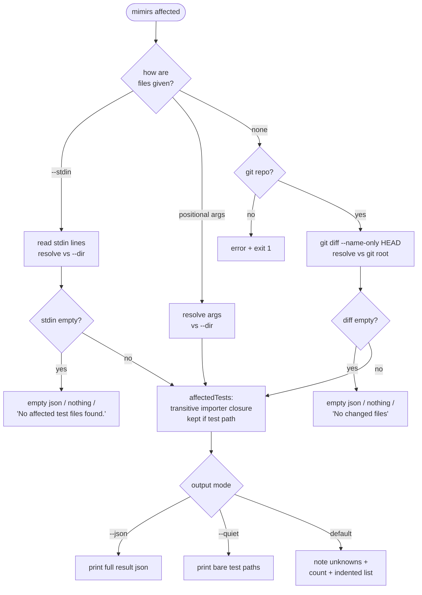

# CLI: affected

`mimirs affected` answers one practical question for CI and pre-commit hooks: *given this set of changed files, which test files should I run?* Instead of running the whole suite on every change, you hand it the files that changed and it returns only the test files that could be affected — the ones that import the changed files, directly or through a chain of imports. It is the scriptable, non-interactive counterpart to the "Tests to run" section of the [`impact`](../tools/impact.md) tool: same underlying importer walk, but driven from the command line and shaped for piping into a test runner.

The command reads the changed files three different ways, walks the import graph to find every test downstream of them, and prints the result in whichever shape the surrounding script needs.

## How it runs



1. **Mode select.** The command first decides where the changed file list comes from, checking `--stdin`, then positional arguments, then falling back to git (`src/cli/commands/affected.ts:38-71`).
2. **`--stdin`.** It reads all of standard input, splits it into trimmed non-empty lines, and resolves each against the project directory (`--dir`, default `.`). This is the mode for `git diff --name-only | mimirs affected --stdin`. Resolving against `--dir` rather than the shell's cwd matters in CI, where the test runner's cwd is usually not the indexed project — cwd-relative paths would silently match nothing (`src/cli/commands/affected.ts:39-51`).
3. **Positional args.** If no `--stdin` but file arguments were given, those are resolved against the project directory too (`src/cli/commands/affected.ts:52-53`).
4. **Git auto-detect.** With no input at all, it finds the git root and runs `git diff --name-only HEAD` to get the working-tree changes, resolving each path against the git root (`src/cli/commands/affected.ts:54-71`).
5. **Empty / no-repo guards.** If there is no git root, it errors and exits non-zero. If the stdin lines are empty, or the git diff is empty, it returns early in the shape the output flags ask for — empty JSON under `--json`, nothing under `--quiet`, otherwise a short message — without opening the index (`src/cli/commands/affected.ts:42-48`, `src/cli/commands/affected.ts:57-69`).
6. **The walk.** `affectedTests` opens the index, maps the changed files to file ids, walks their transitive importers, and keeps the ones that are test files (`src/cli/commands/affected.ts:73-75`, `src/graph/trace.ts:546-570`).
7. **Output.** The result is printed as JSON, as bare paths (`--quiet`), or as the default human-readable summary (`src/cli/commands/affected.ts:77-95`).

## Input modes in detail

The three input modes are mutually exclusive and checked in a fixed order, so the behavior is predictable in a script.

| mode | trigger | how paths resolve | typical use |
| --- | --- | --- | --- |
| stdin | `--stdin` present | each line resolved against `--dir` (default `.`) | `git diff --name-only \| mimirs affected --stdin` |
| arguments | positional files, no `--stdin` | each arg resolved against `--dir` | `mimirs affected src/a.ts src/b.ts` |
| git auto-detect | no `--stdin`, no positional files | each line resolved against the git root | `mimirs affected` inside a repo |

Positional collection skips flags and the `--dir` value so they aren't mistaken for filenames: the loop starts after the subcommand token, consumes the argument following `--dir`, and ignores anything starting with `--` (`src/cli/commands/affected.ts:27-36`). The git path resolves against the *git root* because `git diff --name-only` reports repo-root-relative paths; the stdin and argument modes resolve against `--dir` (the indexed project root) rather than the shell's cwd, so a CI runner whose cwd differs from the checkout still matches the right files (`src/cli/commands/affected.ts:51`, `src/cli/commands/affected.ts:53`, `src/cli/commands/affected.ts:70`).

## The importer closure, filtered to tests

The matching is done by `affectedTests` (`src/graph/trace.ts:546-570`). It first builds a map from file id to path from the project graph, then resolves each changed absolute path to an indexed file id with `getFileByPath`. Paths that exist in the index become the `changed` set and feed the walk; paths not in the index are collected separately as `unknown` and skipped (`src/graph/trace.ts:554-562`).

The walk itself is `transitiveImporters`: starting from the changed file ids, it repeatedly asks `getImportersOf` for every file that imports a file already in the closure, adding new ones until nothing new appears (`src/graph/trace.ts:488-504`). This is the file-level reverse-dependency graph — the same edges [`dependents`](../tools/dependents.md) reads, walked transitively. Because the closure is a visited set, it terminates without a depth cap. Finally, every file id in the closure whose path is a test file — decided by the shared `isTestPath` patterns (`tests/` or `test/`, `__tests__/`, `spec/`, `test_`, or a `.test.`/`.spec.` suffix) — is kept as an affected test (`src/graph/trace.ts:565-567`, `src/utils/test-paths.ts:9-19`). The result is three sorted, project-relative lists: `changed`, `unknown`, and `tests`.

## Output modes

| flag | what prints | intended consumer |
| --- | --- | --- |
| `--json` | the full `{ changed, unknown, tests }` object, pretty-printed | another program parsing the result |
| `--quiet` | one bare test path per line, nothing else | piping straight into a test runner |
| (none) | unknown-file note, a count line, then indented test paths | a human reading the terminal |

The default output is the most informative: when any input files were not in the index it prints a `Note: N file(s) not in the index, skipped: …` line so a stale index doesn't silently swallow inputs, then either "No affected test files found." or a count line followed by the indented test list (`src/cli/commands/affected.ts:85-95`). `--json` and `--quiet` are checked before that and return early — `--json` emits the whole result (including `unknown`), `--quiet` emits only the bare test paths with no notes or headers, which is exactly what a `$(...)` substitution or an `xargs` pipe wants (`src/cli/commands/affected.ts:77-84`).

## Inputs

| name | type | required | description |
| --- | --- | --- | --- |
| `files` | positional strings | no | Changed file paths, resolved against `--dir`. When present (and `--stdin` absent) they are the input set (`src/cli/commands/affected.ts:52-53`). |
| `--stdin` | flag | no | Read changed paths from standard input, one per line, resolved against `--dir` (`src/cli/commands/affected.ts:39-51`). |
| `--json` | flag | no | Print the full result object as pretty JSON (`src/cli/commands/affected.ts:77-80`). |
| `--quiet` | flag | no | Print only bare test file paths, one per line (`src/cli/commands/affected.ts:81-84`). |
| `--dir` | string | no | Project directory whose index to query and the base for resolving stdin/argument paths; resolved to an absolute path. Defaults to `.` (`src/cli/commands/affected.ts:21`). |

When there are no `files`, no `--stdin`, and the directory is a git repo, the input is auto-detected from `git diff --name-only HEAD` (`src/cli/commands/affected.ts:54-71`).

## Outputs

| output | where it lands / shape / description |
| --- | --- |
| Affected test file list | Written to stdout. `--json`: the `{ changed, unknown, tests }` object (`src/cli/commands/affected.ts:77-80`). `--quiet`: bare test paths, one per line (`src/cli/commands/affected.ts:81-84`). Default: an optional unknown-files note, then either "No affected test files found." or an `N test file(s) affected by M changed file(s):` count line with indented paths (`src/cli/commands/affected.ts:85-95`). |

The command opens the index and closes it after the walk (`src/cli/commands/affected.ts:73-75`); it writes nothing back, so it changes no persistent state. The empty-input and no-repo paths return before the index is even opened.

## Branches and failure cases

- **stdin mode.** `--stdin` reads and splits standard input; empty or whitespace-only lines are dropped by `splitLines` (`src/cli/commands/affected.ts:39-41`, `src/cli/commands/affected.ts:98-103`).
- **Empty stdin.** When the piped input has no usable lines, the command returns early following the same output contract as the other modes: under `--json` it emits a valid empty result `{ changed: [], unknown: [], tests: [] }`; under `--quiet` it prints nothing (so a `$(...)` consumer does not receive a blank argument); otherwise it prints "No affected test files found." It returns before opening the index (`src/cli/commands/affected.ts:42-48`).
- **Argument mode.** Positional files (with `--dir`'s value and other flags filtered out) become the input set, resolved against `--dir` (`src/cli/commands/affected.ts:27-36`, `src/cli/commands/affected.ts:52-53`).
- **Git auto-detect.** With no explicit input, the working-tree diff against HEAD supplies the files, resolved against the git root (`src/cli/commands/affected.ts:54-71`).
- **Not a git repo and no input.** `findGitRoot` returns null; the command prints an error telling the user to pass files, pipe with `--stdin`, or run inside a repo, then exits with code 1 (`src/cli/commands/affected.ts:56-62`).
- **Empty diff.** When git reports no changed files, the command emits empty JSON (under `--json`), prints nothing (under `--quiet`), or prints "No changed files (git diff against HEAD is empty)." and returns without opening the index (`src/cli/commands/affected.ts:65-69`).
- **Unknown files.** Input paths not found in the index are reported in the default output's `Note:` line and included in `--json` under `unknown`; they contribute nothing to the walk (`src/graph/trace.ts:559-561`, `src/cli/commands/affected.ts:85-87`).
- **No affected tests.** When the closure contains no test files, the default output prints "No affected test files found." and `--quiet` prints nothing (`src/cli/commands/affected.ts:88-90`).
- **JSON / quiet short-circuit.** Both are handled before the human-readable branch and return immediately, so the unknown-files note and count line never appear in those modes (`src/cli/commands/affected.ts:77-84`).

## Example

Run the tests touched by your current uncommitted changes, piping bare paths into the test runner:

```sh
mimirs affected --quiet | xargs bun test
```

Or feed an explicit diff and inspect the structured result:

```sh
git diff --name-only main | mimirs affected --stdin --json
```

Default human-readable output looks like this (paths are synthetic):

```
Note: 1 file(s) not in the index, skipped: docs/notes.md
2 test files affected by 1 changed file:
  tests/example/search.test.ts
  tests/example/index.test.ts
```

## Key source files

- `src/cli/commands/affected.ts` — the command: input-mode selection, git fallback, output formatting, and the `splitLines` helper (`src/cli/commands/affected.ts:20-103`).
- `src/graph/trace.ts` — `affectedTests` resolves changed paths and filters the closure to tests; `transitiveImporters` walks the importer graph (`src/graph/trace.ts:488-570`).
- `src/utils/test-paths.ts` — `isTestPath` and the patterns that decide what counts as a test file.
- `src/tools/git-tools.ts` — `findGitRoot` and `runGit`, used for the git auto-detect mode (`src/tools/git-tools.ts:6-19`).
- `src/cli/index.ts` — dispatches the `affected` subcommand to `affectedCommand` (`src/cli/index.ts:140-141`).
