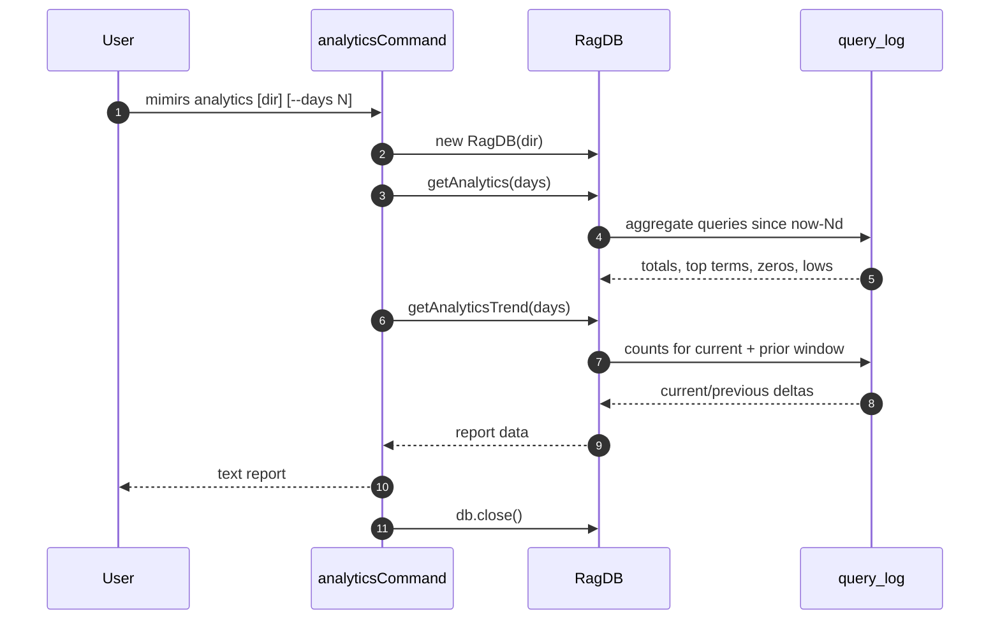

# CLI: analytics

`mimirs analytics` prints a summary of how the project's RAG index has been searched over a recent window. It reads the `query_log` table that every search call writes to and turns it into a human-readable report. Use it to spot topics agents asked about but where the index has nothing useful — those are the gaps you should index or document next.

## Flow



1. The user runs `mimirs analytics`. The first positional arg (if it does not look like a flag) is the project directory; otherwise the current directory is used. `--days` defaults to `30` (`src/cli/commands/analytics.ts:5-9`).
2. A `RagDB` is opened against the project's `.mimirs/index.db`. Closing it at the end is important — analytics is a query-only command and should not hold the DB open after printing.
3. `getAnalytics(days)` runs six SQL aggregates over `query_log` filtered by `created_at >= now - days*86400000` (`src/db/analytics.ts:19-56`). Each aggregate is bounded with `LIMIT 10` for the list-shaped buckets.
4. The command prints the summary header (totals, averages, zero-result rate), then top searches, zero-result queries, and low-relevance queries — but only when each list has rows.
5. `getAnalyticsTrend(days)` runs the same totals twice: once for the current window and once for the prior window of equal length. The delta between them is what produces the `+12` / `-3.4%` arrows in the trend section (`src/db/analytics.ts:69-115`).
6. The DB connection is closed.

## Inputs

| Input | Where it comes from | Effect |
|---|---|---|
| `directory` (positional) | First arg if it does not start with `--`, otherwise `.` | Picks which project's `.mimirs/index.db` to read. |
| `--days N` | CLI flag, parsed with `parseInt` | Look-back window in days. Default `30`. The same value also drives the trend's prior-window length, so the comparison is always like-for-like. |

The command does not need a writable directory — it only reads the SQLite analytics table.

## Outputs

A single text block on stdout, written via `cli.log`. The sections are emitted in this fixed order, each one conditionally on having rows:

1. Header — total queries, average result count, average top score (or `n/a` if no scored queries), zero-result rate as a percentage and absolute count.
2. `Top searches:` — up to 10 most-frequent query strings, with run counts (`src/db/analytics.ts:46-50`).
3. `Zero-result queries (consider indexing these topics):` — up to 10 queries that returned no results, ordered by frequency (`src/db/analytics.ts:33-37`).
4. `Low-relevance queries (top score < 0.3):` — up to 10 queries whose top hit scored below `0.3`, ordered by score ascending (`src/db/analytics.ts:39-44`). The `< 0.3` threshold is hard-coded in the SQL.
5. `Trend (current Nd vs prior Nd):` — current totals plus signed deltas vs the prior window. Only printed when at least one of the two windows has queries.

## Acting on the report

The "zero-result queries" list is the actionable section. Each entry is a query that one or more callers asked, and the index returned nothing. Two ways to close the gap:

- Run `mimirs index` (or the `index_files` MCP tool) on directories that should contain matching content — the index may simply be stale.
- Add documentation that uses the missing vocabulary. The query is stored verbatim, so you can copy the phrase and grep for whether the codebase even mentions it.

Low-relevance queries (`top score < 0.3`) point at a softer gap: there *was* something matched, but the embedder did not consider it close. Same fixes apply — extend docs with the missing terms, or recheck that the right files are indexed.

The trend block lets you tell whether changes you made are landing: a positive `Avg top score` delta and a negative zero-result-rate delta means your last edit improved retrieval.

## Branches and failure cases

- Empty windows: if neither the current nor prior trend window has any queries, the trend block is skipped (`src/cli/commands/analytics.ts:45`). The header is still printed with zeros.
- `avgTopScore` is `null` when no query in the window had a scored top result (the `WHERE top_score IS NOT NULL` clause filters them out, `src/db/analytics.ts:30`). The CLI prints `n/a` for that field.
- `delta.avgTopScore` is `null` if either window had no scored queries; the trend line for "Avg top score" is then suppressed.
- The CLI does no error handling around `new RagDB(dir)` — if the project has no `.mimirs/index.db` yet, you will get a DB open error. Run `mimirs init` (or any indexing command) first.

## Example

```sh
mimirs analytics --days 7
```

Illustrative output:

```
Search analytics (last 7 days):
  Total queries:    42
  Avg results:      6.3
  Avg top score:    0.61
  Zero-result rate: 12% (5 queries)

Top searches:
  8× "how does indexing work"
  4× "wiki rebuild"

Zero-result queries (consider indexing these topics):
  3× "deprecated config flags"
  2× "rate limiter"

Trend (current 7d vs prior 7d):
  Queries:          42 (+11)
  Avg top score:    0.61 (+0.04)
  Zero-result rate: 12% (-3.0%)
```

## Related flows

- [tools/search-analytics](../tools/search-analytics.md) — the MCP tool form of the same report; calls `getAnalytics` over the same `query_log` table.
- [tools/search](../tools/search.md) — each search appends a row to `query_log`, which is the source data this command summarises.

## Key source files

- `src/cli/commands/analytics.ts` — argument parsing, formatting, and section ordering.
- `src/db/analytics.ts` — `getAnalytics` and `getAnalyticsTrend` SQL.
