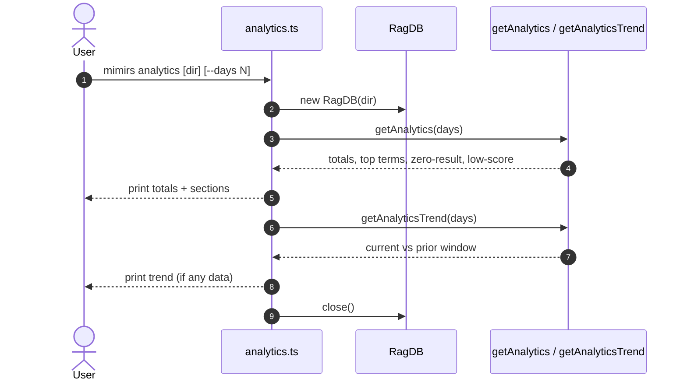

# CLI: analytics

`mimirs analytics` prints a usage report about searches run against the project's
index. Every search logs a row — the query text, how many results it returned,
the best result's score, and timing — and this command aggregates those rows over
a look-back window. It exists to answer "what are people searching for, and where
is the index failing them?" The terminal report is the human-facing twin of the
[search_analytics](../tools/search-analytics.md) MCP tool, reading the same
`query_log` table (`src/cli/commands/analytics.ts:5-59`).

## What feeds it

Searches append rows to `query_log` via `logQuery`, storing the query, result
count, top score, top path, duration, and an ISO timestamp
(`src/db/analytics.ts:3-8`). This command never writes; it only reads and
aggregates, then closes the database (`src/cli/commands/analytics.ts:9-58`).

The project directory is read from the first positional argument when present and
not starting with `--`; otherwise it defaults to `.` (there is no `--dir` flag on
this command) and is resolved to an absolute path
(`src/cli/commands/analytics.ts:6`).

## Flow



1. The user runs the command with an optional directory and `--days`
   (`src/cli/commands/analytics.ts:5-8`).
2. A `RagDB` is opened and `getAnalytics(days)` is called
   (`src/cli/commands/analytics.ts:8-9`).
3. `getAnalytics` computes a cutoff timestamp `now - days*86400000ms` and runs
   several aggregate queries against `query_log` filtered to rows at or after that
   cutoff (`src/db/analytics.ts:19-56`).
4. The command derives the zero-result count and rate, then prints the totals
   block (`src/cli/commands/analytics.ts:11-20`).
5. It prints the top searches, zero-result queries, and low-relevance queries
   sections, each only when non-empty (`src/cli/commands/analytics.ts:22-41`).
6. It calls `getAnalyticsTrend(days)` to compare the current window against the
   immediately preceding window of the same length
   (`src/cli/commands/analytics.ts:44`, `src/db/analytics.ts:69-116`).
7. The trend block prints only if either window has any queries
   (`src/cli/commands/analytics.ts:45-56`).
8. The database is closed (`src/cli/commands/analytics.ts:58`).

## Inputs

| name | type | required | description |
|------|------|----------|-------------|
| directory | path (positional) | no | `args[1]`, used as the project directory when present and not starting with `--`; otherwise `.` (`src/cli/commands/analytics.ts:6`). |
| `--days` | integer | no | Look-back window in days. Defaults to `30`; parsed with `parseInt` (`src/cli/commands/analytics.ts:7`). The same value sizes both the current window and the prior comparison window. |

## Outputs

| output | where it lands / shape / description |
|--------|--------------------------------------|
| analytics report | stdout only. A header, a totals block, then up to three optional sections (top searches, zero-result queries, low-relevance queries), then an optional trend block. No files or DB rows are written (`src/cli/commands/analytics.ts:16-56`). |

## Report sections

| section | shown when | content |
|---------|-----------|---------|
| Totals | always | Total queries in the window, average result count (1 decimal), average top score (2 decimals or `n/a` if no scored rows), and zero-result rate as a percent plus the zero-result count (`src/cli/commands/analytics.ts:16-20`). |
| Top searches | top terms exist | Up to 10 most-frequent queries with their counts, ordered by count descending (`src/cli/commands/analytics.ts:22-27`, `src/db/analytics.ts:46-50`). |
| Zero-result queries | any exist | Up to 10 queries that returned no results, by frequency — the index gaps to act on (`src/cli/commands/analytics.ts:29-34`, `src/db/analytics.ts:33-37`). |
| Low-relevance queries | any exist | Up to 10 queries whose best result scored below `0.3`, ordered worst-first, each with its top score (`src/cli/commands/analytics.ts:36-41`, `src/db/analytics.ts:39-44`). |
| Trend | either window has queries | Query count, average top score, and zero-result rate for the current window, each with a signed delta vs the prior window of equal length (`src/cli/commands/analytics.ts:44-56`). |

## How the window and trend are computed

`getAnalytics` filters every aggregate to `created_at >= now - days days`.
Averages over `top_score` ignore rows where the score is `NULL`, and
`avgResultCount` falls back to `0` when there are no rows
(`src/db/analytics.ts:25-31`, `60`). The zero-result rate the command prints is
derived in the command itself: it sums the per-query zero-result counts and
divides by `totalQueries`, guarding against divide-by-zero
(`src/cli/commands/analytics.ts:11-14`).

`getAnalyticsTrend` defines two adjacent windows: the current one is
`[now - days, far future)` and the previous one is `[now - 2*days, now - days)`.
For each it counts queries, averages the top score (non-null only), and computes
a zero-result rate. The deltas are current minus previous; the score delta is
`null` when either window has no scored rows
(`src/db/analytics.ts:74-115`).

## Acting on zero-result queries

The zero-result section is the actionable one. Each line is a query that returned
nothing, which usually means the relevant code or docs are not in the index. The
section header literally suggests indexing those topics
(`src/cli/commands/analytics.ts:30`). The fix is to index the missing files — for
example re-running indexing over the directories those topics live in — and then
re-check that the queries start returning results. Low-relevance queries point at
content that exists but ranks poorly, a weaker but related signal.

## Branches and failure cases

| branch | behavior |
|--------|----------|
| no positional directory | Uses `.` (`src/cli/commands/analytics.ts:6`). |
| invalid `--days` | `parseInt` may yield `NaN`; the date math then produces an `Invalid Date` ISO string and counts can be off. Pass a valid integer (`src/cli/commands/analytics.ts:7`). |
| no queries logged | Totals show `0` queries, `0.0` avg results, `n/a` avg top score, `0%` zero-result rate; optional sections are skipped; trend prints only if a prior window had data (`src/cli/commands/analytics.ts:12-19`, `45`). |
| no scored rows | `avgTopScore` is `null`, printed as `n/a`; trend score delta is suppressed (`src/cli/commands/analytics.ts:19`, `52`). |
| empty section | Top searches, zero-result, and low-score sections each print only when their list is non-empty (`src/cli/commands/analytics.ts:22`, `29`, `36`). |
| both windows empty | The entire trend block is skipped (`src/cli/commands/analytics.ts:45`). |

## Example

```bash
# Last 30 days (default) for the current project
bun run mimirs analytics

# Last 7 days
bun run mimirs analytics --days 7

# A different project directory
bun run mimirs analytics /path/to/project --days 14
```

Illustrative output:

```
Search analytics (last 7 days):
  Total queries:    42
  Avg results:      6.3
  Avg top score:    0.61
  Zero-result rate: 12% (5 queries)

Top searches:
  9× "embedding model config"
  4× "conversation indexing"

Zero-result queries (consider indexing these topics):
  3× "webhook retry policy"

Low-relevance queries (top score < 0.3):
  "vector dimension mismatch" (score: 0.21)

Trend (current 7d vs prior 7d):
  Queries:          42 (+12)
  Avg top score:    0.61 (+0.04)
  Zero-result rate: 12% (-3.0%)
```

## Key source files

- `src/cli/commands/analytics.ts` — directory/days parsing, report formatting,
  derived zero-result rate, trend printing.
- `src/db/analytics.ts` — `logQuery` (the writer), `getAnalytics` (window
  aggregates), and `getAnalyticsTrend` (current vs prior window).
