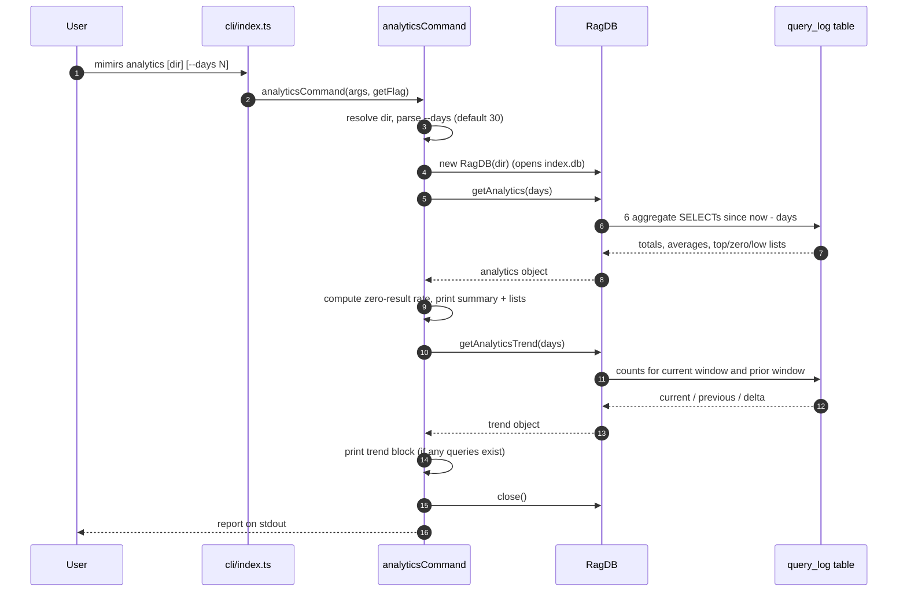

# CLI: analytics

`mimirs analytics` reports how the project's search index is being used and how
well it is answering. Every semantic search the project runs leaves a row in a
local log table; this command reads that log over a look-back window and prints
a short usage report: how many queries ran, how good the results were on
average, which searches returned nothing, which returned weak matches, and
whether things are getting better or worse compared with the previous window of
the same length.

It is a read-only command. It opens the index database, runs a handful of
aggregate queries, prints the report to stdout, and closes the database. It
never writes to the log itself. The rows it reads are produced as a side effect
of running searches — see [cli/search](search.md) and
[cli/read](read.md), which both call into the same hybrid search path that
records each query.

The most common reason to run it is to find documentation or indexing gaps: a
query that consistently returns zero results, or returns only low-relevance
matches, usually means the topic the user is asking about is not well covered in
the indexed code or docs. The same data is also available to agents through the
[search_analytics](../tools/search-analytics.md) MCP tool.

## How a query gets logged

Nothing in the `analytics` command writes log rows. The data comes entirely from
the search path. When a search runs, the hybrid search function measures how
long it took, then records one row: the query text, how many results came back,
the score of the top result (or `null` when there were no results), the path of
the top result, and the duration in milliseconds — `src/search/hybrid.ts:388`.
A second search variant records the same shape after parent-grouping and doc
expansion — `src/search/hybrid.ts:546`. Both call the database wrapper
`db.logQuery(...)`, which inserts into the `query_log` table —
`src/db/analytics.ts:3`.

The table is created on database open if it does not already exist —
`src/db/index.ts:340`:

| Column | Type | Meaning |
| --- | --- | --- |
| `id` | INTEGER PK | Autoincrement row id |
| `query` | TEXT | The query string that was searched |
| `result_count` | INTEGER | How many results that search returned |
| `top_score` | REAL (nullable) | Relevance score of the best result, or NULL when none |
| `top_path` | TEXT (nullable) | File path of the best result |
| `duration_ms` | INTEGER | Search latency in milliseconds |
| `created_at` | TEXT | ISO timestamp the row was written |

The `analytics` command only reads `query`, `result_count`, `top_score`, and
`created_at`. The `top_path` and `duration_ms` columns are stored but not shown
in this report.

## What the command does

The flow is short and entirely synchronous around two database reads.



1. The user runs `mimirs analytics`, optionally with a directory and a
   `--days N` flag. The top-level dispatcher matches the `analytics` command and
   calls the handler — `src/cli/index.ts:130-132`.
2. The handler resolves the target directory. It uses the first positional
   argument only if it is present and does not start with `--`; otherwise it
   defaults to the current directory — `src/cli/commands/analytics.ts:7`.
3. It parses `--days` through the integer flag helper, which defaults to `30`
   and rejects non-integer or sub-1 values — `src/cli/commands/analytics.ts:8`.
4. It opens the index database for that directory by constructing a `RagDB`,
   which opens `index.db` and ensures the schema (including `query_log`) exists
   — `src/db/index.ts:134`, `src/cli/commands/analytics.ts:9`.
5. It calls `getAnalytics(days)`, which runs six aggregate SQL queries over rows
   newer than `now - days` and returns a single object — `src/db/analytics.ts:10`.
6. The handler computes the zero-result rate from the returned zero-result list
   and prints the summary block, then prints the three optional lists when they
   are non-empty — `src/cli/commands/analytics.ts:12-42`.
7. It calls `getAnalyticsTrend(days)` to compare the current window against the
   immediately preceding window of the same length — `src/cli/commands/analytics.ts:45`,
   `src/db/analytics.ts:69`.
8. If either window saw any queries, it prints the trend block with signed
   deltas — `src/cli/commands/analytics.ts:46-57`.
9. It closes the database and returns. All output has already gone to stdout
   through the CLI logger — `src/cli/commands/analytics.ts:59`.

## The look-back window

`getAnalytics` turns `--days` into a single cutoff timestamp:
`new Date(Date.now() - days * 86400000).toISOString()`, where `86400000` is the
number of milliseconds in a day — `src/db/analytics.ts:19`. Every query in this
function filters on `created_at >= since`, so the whole report covers exactly
the last `days` days up to the moment the command runs. Because `created_at` is
stored as an ISO 8601 string and the cutoff is also an ISO string, the
comparison is a lexicographic string compare that happens to be chronologically
correct for this format.

The six reads behind the summary are — `src/db/analytics.ts:21-56`:

| Reported field | Source query |
| --- | --- |
| `totalQueries` | `COUNT(*)` of all logged queries in the window |
| `avgResultCount` | `AVG(result_count)`, coalesced to `0` when there are no rows |
| `avgTopScore` | `AVG(top_score)` over rows where `top_score` is not null (stays `null` if none) |
| `zeroResultQueries` | Top 10 queries grouped by text where `result_count = 0`, by frequency |
| `lowScoreQueries` | Top 10 lowest-scoring queries where `top_score < 0.3` |
| `topSearchedTerms` | Top 10 queries grouped by text, by frequency |

## The printed report

The handler always prints a five-line summary, then up to three optional list
sections, then an optional trend block. Output goes through the CLI logger,
which writes plain lines to stdout with no `[mimirs]` prefix —
`src/utils/log.ts:49-53`.

The summary header reflects the window (`Search analytics (last 30 days):`) and
then shows total queries, average result count to one decimal, average top score
to two decimals (or `n/a` when no query in the window had a score), and the
zero-result rate — `src/cli/commands/analytics.ts:17-21`.

The zero-result rate is not read from the database directly. The handler sums
the `count` field of every entry in `zeroResultQueries` to get the total number
of zero-result queries, then divides by `totalQueries` and rounds to a whole
percent. When there were no queries at all, it short-circuits to `"0"` to avoid
dividing by zero — `src/cli/commands/analytics.ts:12-15`. One subtlety: the
zero-result list is capped at the 10 most frequent zero-result queries, so on a
very diverse log the displayed `(N queries)` count and the percentage are based
on that top-10 sum, not on every distinct zero-result query.

The three list sections each print only when their underlying array is
non-empty:

- **Top searches** — the most frequent query strings, shown as `count× "query"`
  — `src/cli/commands/analytics.ts:23-28`.
- **Zero-result queries** — frequent searches that returned nothing, labeled as
  topics worth indexing — `src/cli/commands/analytics.ts:30-35`.
- **Low-relevance queries** — searches whose best match scored below `0.3`,
  shown with that score — `src/cli/commands/analytics.ts:37-42`.

## Trend comparison vs the prior period

After the summary, the handler asks for a second view that compares the current
window to the window immediately before it. `getAnalyticsTrend(days)` computes
two start timestamps — `now - days` for the current window and `now - 2 * days`
for the previous window — and counts queries in each — `src/db/analytics.ts:74-104`.

It uses a helper that runs three counts per window (total queries, average top
score, and a zero-result count it converts into a rate) bounded by a `since` and
an `until` timestamp — `src/db/analytics.ts:78-100`. The current window runs
from `now - days` up to a sentinel far-future timestamp
(`9999-12-31T23:59:59.999Z`), and the previous window runs from `now - 2*days`
up to `now - days`, so the two windows are adjacent and non-overlapping —
`src/db/analytics.ts:102-104`.

The returned `delta` is current minus previous for each metric. The query delta
is an integer; the average-top-score delta is `null` when either window had no
scored query; the zero-result-rate delta is a fraction — `src/db/analytics.ts:106-113`.

The handler prints the trend block only when at least one of the two windows
actually saw queries — otherwise there is nothing useful to compare and the
block is skipped — `src/cli/commands/analytics.ts:46`. When it does print, two
small formatters add explicit signs: `arrow` prefixes a `+` for positive query
deltas, and `pctArrow` formats the zero-result-rate delta as a signed percentage
to one decimal — `src/cli/commands/analytics.ts:47-49`. The average-top-score
line is skipped entirely when its delta is `null` (one window had no scored
queries), and otherwise shows the current average with a signed two-decimal
change — `src/cli/commands/analytics.ts:53-55`.

Note the default arguments differ between the two functions: `getAnalytics`
defaults to `30` days and `getAnalyticsTrend` defaults to `7`, but this command
passes the same parsed `days` value into both, so the trend window always
matches the summary window the user asked for — `src/db/analytics.ts:10`,
`src/db/analytics.ts:69`, `src/cli/commands/analytics.ts:10`,
`src/cli/commands/analytics.ts:45`.

## Inputs

| Name | Type | Required | Description |
| --- | --- | --- | --- |
| `[dir]` | positional string | No | Project directory whose index to read. Used only when present and not starting with `--`; otherwise the current directory. Resolved to an absolute path — `src/cli/commands/analytics.ts:7`. |
| `--days N` | integer flag | No | Look-back window in days. Defaults to `30`. Must be an integer `>= 1`; bad values raise a flag error before any database work — `src/cli/commands/analytics.ts:8`, `src/cli/flags.ts:40-53`. |

## Outputs

| Output | Where it lands / shape / description |
| --- | --- |
| Usage summary | Five lines on stdout: total queries, average results, average top score, and zero-result rate for the window — `src/cli/commands/analytics.ts:17-21`. |
| Top searches list | Optional block listing the most frequent queries with counts — `src/cli/commands/analytics.ts:23-28`. |
| Zero-result list | Optional block of frequent searches that returned nothing — `src/cli/commands/analytics.ts:30-35`. |
| Low-relevance list | Optional block of searches whose best score was under `0.3` — `src/cli/commands/analytics.ts:37-42`. |
| Trend block | Optional block comparing the current window to the prior equal-length window, with signed deltas — `src/cli/commands/analytics.ts:51-56`. |

No files are written and no rows are inserted; the only state touched is opening
and closing the database connection.

## Branches and failure cases

- **No directory argument** — falls back to the current directory; the
  positional argument is ignored if it begins with `--` —
  `src/cli/commands/analytics.ts:7`.
- **Invalid `--days`** — a non-integer such as `--days abc`, or a value below
  `1`, throws a `CliFlagError` from the flag parser. The dispatcher catches it,
  prints the message, and exits non-zero, rather than letting `NaN` flow into
  date math — `src/cli/flags.ts:40-53`, `src/cli/index.ts:97-99`.
- **Empty log / brand-new index** — `totalQueries` is `0`, `avgResultCount`
  coalesces to `0`, and `avgTopScore` stays `null` and prints as `n/a`. The
  zero-result-rate branch short-circuits to `"0"` so there is no division by
  zero — `src/cli/commands/analytics.ts:13-15`, `src/db/analytics.ts:60-61`.
- **No queries in either trend window** — the entire trend block is skipped
  — `src/cli/commands/analytics.ts:46`.
- **No scored queries in a window** — `avgTopScore` is `null` for that window,
  so the trend's average-top-score line is omitted; the summary shows `n/a` for
  the average score — `src/cli/commands/analytics.ts:20`,
  `src/cli/commands/analytics.ts:53`, `src/db/analytics.ts:108-111`.
- **Empty list sections** — top searches, zero-result, and low-relevance
  sections each render only when their array has at least one entry, so a quiet
  index prints just the summary — `src/cli/commands/analytics.ts:23`,
  `src/cli/commands/analytics.ts:30`, `src/cli/commands/analytics.ts:37`.
- **List truncation** — each of the three lists is capped at 10 rows by the
  SQL `LIMIT 10`; high-cardinality logs show only the top entries —
  `src/db/analytics.ts:35`, `src/db/analytics.ts:41`, `src/db/analytics.ts:48`.

## Example

```bash
# Last 30 days (default) for the current project
mimirs analytics

# A specific project, two-week window
mimirs analytics ./my-project --days 14
```

Illustrative output for a small log (paths and values are synthetic):

```
Search analytics (last 14 days):
  Total queries:    42
  Avg results:      6.3
  Avg top score:    0.58
  Zero-result rate: 7% (3 queries)

Top searches:
  9× "how does auth work"
  5× "embedding dimension"

Zero-result queries (consider indexing these topics):
  2× "websocket reconnect"
  1× "feature flags"

Low-relevance queries (top score < 0.3):
  "legacy migration script" (score: 0.21)

Trend (current 14d vs prior 14d):
  Queries:          42 (+11)
  Avg top score:    0.58 (+0.04)
  Zero-result rate: 7% (-3.0%)
```

## Key source files

- `src/cli/index.ts` — top-level CLI dispatcher; routes the `analytics` command
  and converts flag errors into a clean non-zero exit.
- `src/cli/commands/analytics.ts` — the command handler: resolves args, reads
  analytics and trend from the database, and prints the report.
- `src/db/analytics.ts` — the store: `logQuery` writes rows during search;
  `getAnalytics` and `getAnalyticsTrend` run the aggregate reads.
- `src/db/index.ts` — defines the `query_log` schema and exposes the
  `RagDB.logQuery` / `getAnalytics` / `getAnalyticsTrend` wrappers.
- `src/cli/flags.ts` — `intFlag` validation for `--days`.
- `src/utils/log.ts` — the `cli` logger that writes the report to stdout.
