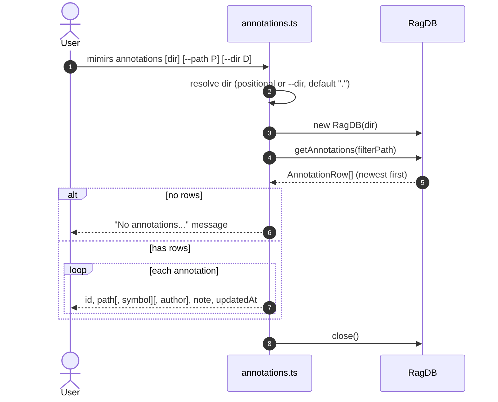

# CLI: annotations

`mimirs annotations` prints the notes attached to a project's files. Annotations
are short caveats — a known bug, a fragile invariant, a workaround — that earlier
sessions recorded so future readers see them in context. This command is the
read-only viewer for those notes from a terminal. It is the listing counterpart
to the [get_annotations](../tools/get-annotations.md) MCP tool; the writing side
lives in the [annotate](../tools/annotate.md) tool, which this command never
calls (`src/cli/commands/annotations.ts:1-27`).

## What it does

The command resolves the project directory, opens the project's `RagDB`, fetches
annotations (optionally filtered to one path), and prints each one. It writes
nothing back: there is no insert, update, or delete anywhere in the function. To
create or remove a note, use the [annotate](../tools/annotate.md) /
[delete_annotation](../tools/delete-annotation.md) tools instead
(`src/cli/commands/annotations.ts:5-27`).

The project directory can be given two ways. If the first positional argument
exists and does not start with `--`, it is treated as the directory; otherwise
the `--dir` flag is used, defaulting to `.`. The chosen path is resolved to an
absolute path (`src/cli/commands/annotations.ts:6`).

## Flow



1. The user runs the command, optionally passing a directory positionally, a
   `--path` filter, and/or `--dir` (`src/cli/commands/annotations.ts:5-7`).
2. The directory is resolved — positional first, then `--dir`, then `.`
   (`src/cli/commands/annotations.ts:6`).
3. A `RagDB` is opened on that directory, reading `.mimirs/index.db`
   (`src/cli/commands/annotations.ts:8`).
4. `getAnnotations(filterPath)` runs `SELECT * FROM annotations`, adding
   `AND path = ?` only when `--path` was given, ordered by `updated_at`
   descending (`src/cli/commands/annotations.ts:9`, `src/db/annotations.ts:101-135`).
5. If nothing matches, a message is printed and the database is closed early
   (`src/cli/commands/annotations.ts:11-15`).
6. Otherwise each annotation is printed as a small block
   (`src/cli/commands/annotations.ts:17-24`).
7. The database is closed (`src/cli/commands/annotations.ts:26`).

## Inputs

| name | type | required | description |
|------|------|----------|-------------|
| directory | path (positional) | no | `args[1]`, used as the project directory only when present and not starting with `--`. Falls back to `--dir`, then `.` (`src/cli/commands/annotations.ts:6`). |
| `--path` | path string | no | Restricts the listing to annotations whose stored `path` equals this value exactly. Omitted means all annotations (`src/cli/commands/annotations.ts:7`, `src/db/annotations.ts:105-108`). |
| `--dir` | path | no | Project directory, used when no positional directory is given (`src/cli/commands/annotations.ts:6`). |

## Outputs

| output | where it lands / shape / description |
|--------|--------------------------------------|
| annotation listing | stdout. Per annotation: `#<id>  <path>` (with `  •  <symbol>` appended when a symbol name is stored, and ` [<author>]` when an author is stored), then an indented note line, then an indented `(<updatedAt>)` line, then a blank line (`src/cli/commands/annotations.ts:17-24`). |
| empty-state message | stdout. `No annotations for <path>.` when `--path` was given, otherwise `No annotations found.` (`src/cli/commands/annotations.ts:12`). |

## Output format

Each row is printed across three lines. The header combines the id and target:
the target is just the file path, or `path  •  symbolName` when the annotation
was attached to a specific symbol. An author, when stored, is shown in brackets
after the target. The second line is the note text; the third is the
`updatedAt` timestamp in parentheses
(`src/cli/commands/annotations.ts:18-23`). The underlying rows carry `id`,
`path`, `symbolName`, `note`, `author`, `createdAt`, and `updatedAt`; this
command surfaces all of these except `createdAt`
(`src/db/annotations.ts:101-135`).

Rows come back ordered by `updated_at` descending, so the most recently
touched annotations print first (`src/db/annotations.ts:118`).

## Read-only by design

Nothing in this flow mutates state. The only `RagDB` call is `getAnnotations`,
followed by `close()`. There is no path that inserts, updates, or deletes a row,
so running `annotations` repeatedly is side-effect free
(`src/cli/commands/annotations.ts:9-26`). Writing notes is a separate concern
handled by the [annotate](../tools/annotate.md) tool.

## Branches and failure cases

| branch | behavior |
|--------|----------|
| positional directory given | First arg not starting with `--` becomes the directory (`src/cli/commands/annotations.ts:6`). |
| no positional directory | Uses `--dir`, then defaults to `.` (`src/cli/commands/annotations.ts:6`). |
| `--path` given, matches | Lists only annotations whose `path` equals it exactly (`src/db/annotations.ts:105-108`). |
| `--path` given, no match | Prints `No annotations for <path>.` and returns after closing the db (`src/cli/commands/annotations.ts:12-14`). |
| no `--path`, none stored | Prints `No annotations found.` and returns (`src/cli/commands/annotations.ts:12-14`). |
| annotation has a symbol | Header shows `path  •  symbol` (`src/cli/commands/annotations.ts:18`). |
| annotation has an author | Header appends ` [author]` (`src/cli/commands/annotations.ts:19`). |

A subtle point: `--path` matches the stored `path` string exactly, not a prefix
or glob. Notes are stored under whatever path string the writer used, so a filter
only matches if it is byte-for-byte identical
(`src/db/annotations.ts:105-108`).

## Example

```bash
# All annotations in the current project
bun run mimirs annotations

# Only annotations on one file
bun run mimirs annotations --path src/conversation/indexer.ts

# Point at a different project directory positionally
bun run mimirs annotations /path/to/project --path src/db/index.ts
```

Illustrative output:

```
#6  src/conversation/indexer.ts  •  startConversationTail [agent]
  Potential multi-server race: tailing is not guarded by the index lock.
  (2026-05-28T14:30:12.360Z)
```

## Key source files

- `src/cli/commands/annotations.ts` — directory resolution, the single read call,
  and output formatting.
- `src/db/annotations.ts` — `getAnnotations`, which builds the optional path
  filter and orders rows newest-first.
