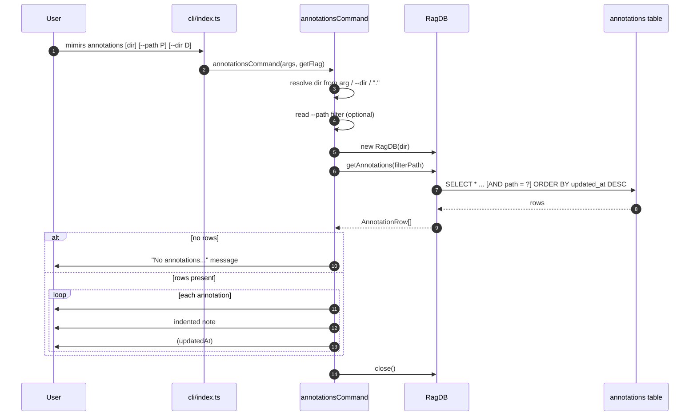

# CLI: annotations

`mimirs annotations` prints the persistent notes that have been pinned to files and symbols in a project. An annotation is a short caveat — a known bug, a race condition, a non-obvious constraint, a workaround — that agents and people attach while reading code so the warning survives across sessions. Notes are normally created through the `annotate` MCP tool and surface inline inside `read_relevant` output, but the index also stores them as plain rows, and this command is the read-only window onto that table from a terminal.

Reach for it when you want to audit what notes exist without going through an MCP client: to see every caveat in the project, or to check what is pinned to one specific file before you edit it.

## What runs

The command is a thin, synchronous reader. It resolves a target directory, opens that project's index database, runs one `SELECT`, and prints each row as a fixed three-line block. There is no embedding, no network call, and no write to the annotations data — opening the database is the only side effect.



1. The user runs `mimirs annotations`, optionally with a positional directory, a `--path` filter, or a `--dir` flag. `process.argv` is sliced into `args` and the first element becomes the command name (`src/cli/index.ts:26-27`).
2. The dispatcher matches the `annotations` case and calls the handler, passing the raw `args` array and a `getFlag` helper that returns the element following a given flag (`src/cli/index.ts:161-162`, `src/cli/index.ts:85-88`).
3. The handler picks the target directory. If the second argument exists and does not start with `--`, it is treated as the directory; otherwise it falls back to the `--dir` flag, and finally to `"."`. The result is passed through `resolve` so a relative path becomes absolute (`src/cli/commands/annotations.ts:6`).
4. It reads the optional `--path` value into `filterPath`. When absent this is `undefined`, which the query treats as "no filter" (`src/cli/commands/annotations.ts:7`).
5. It constructs `RagDB` for the resolved directory. The constructor resolves the index folder (`<dir>/.mimirs` unless `RAG_DB_DIR` is set), creates it if missing, opens `index.db`, enables WAL journaling with a 5 s busy timeout, loads the sqlite-vec extension, and ensures the `annotations` table (plus its companion full-text and vector tables) exists (`src/db/index.ts:104-150`, `src/db/index.ts:493-512`). If the index directory is unwritable it throws a clear `RAG_DB_DIR` error here, before any read.
6. The handler calls `db.getAnnotations(filterPath)`. The `RagDB` method forwards straight to the annotation store function (`src/db/index.ts:1029-1031`).
7. The store builds `SELECT * FROM annotations WHERE 1=1`, appends `AND path = ?` only when a path was supplied, always orders by `updated_at DESC`, runs the query, and maps each snake_case database row into a camelCase `AnnotationRow` (`src/db/annotations.ts:101-135`).
8. If the result array is empty, the handler prints one message — naming the path when filtered, or a generic "No annotations found." otherwise — closes the database, and returns (`src/cli/commands/annotations.ts:11-15`).
9. Otherwise it loops the rows and prints each as three lines plus a blank separator (`src/cli/commands/annotations.ts:17-24`).
10. Either way the database is closed before the function returns (`src/cli/commands/annotations.ts:13`, `src/cli/commands/annotations.ts:26`).

## Inputs

| Name | Type | Required | Description |
| --- | --- | --- | --- |
| `[dir]` positional | string | No | Project directory whose index is read. Taken from the second CLI argument only when it does not start with `--`. Resolved to an absolute path (`src/cli/commands/annotations.ts:6`). |
| `--path P` | string | No | Restricts output to annotations whose stored `path` equals `P` exactly. Omitted means list every annotation in the index (`src/cli/commands/annotations.ts:7`). |
| `--dir D` | string | No | Alternate way to set the project directory. Used only when no bare positional directory was given; the positional argument wins when both are present (`src/cli/commands/annotations.ts:6`). |

The directory ultimately tells `RagDB` where to find `index.db` — under `<dir>/.mimirs`, unless `RAG_DB_DIR` overrides it (`src/db/index.ts:111-115`). If that directory has no index yet, the constructor still creates an empty schema, so the command reports no annotations rather than failing.

## Outputs

| Output | Where it lands / shape / description |
| --- | --- |
| Annotation listing | Printed to stdout via the CLI logger. One block per annotation: a header line `#<id>  <target>[ <author>]`, an indented note line, an indented `(<updatedAt>)` line, then a blank line (`src/cli/commands/annotations.ts:17-24`). |
| Empty-state message | A single stdout line when there are no matching rows: `No annotations for <path>.` when filtered, else `No annotations found.` (`src/cli/commands/annotations.ts:11-12`). |

Output goes through `cli.log`, which writes to stdout with `console.log`; called with no argument it prints a blank line. This is distinct from the `log` channel used by the MCP server, which writes diagnostics to stderr (`src/utils/log.ts:49-53`).

### Block fields

Each printed annotation maps directly onto an `AnnotationRow` (`src/db/types.ts:47-55`):

| Printed field | Source | Notes |
| --- | --- | --- |
| `#<id>` | `a.id` | The autoincrement primary key from the `annotations` table; this is the value you pass to `delete_annotation`. |
| target | `a.path`, optionally `a.symbolName` | When a symbol name is stored, the target reads `<path>  •  <symbolName>`; otherwise just the path (`src/cli/commands/annotations.ts:18`). |
| `[author]` | `a.author` | Appended only when an author was recorded; bracketed and space-prefixed. Absent for anonymous notes (`src/cli/commands/annotations.ts:19`). |
| note | `a.note` | The annotation text, printed indented on its own line (`src/cli/commands/annotations.ts:21`). |
| `(<updatedAt>)` | `a.updatedAt` | The ISO-8601 timestamp of the last write, printed indented in parentheses. Rows are ordered newest-first by this column. |

The query selects all columns, so `createdAt` is fetched into the row too, but the listing only prints `updatedAt` (`src/db/annotations.ts:126-134`).

## Branches and failure cases

- **No `--path` (list all).** `filterPath` is `undefined`, so the store skips the `AND path = ?` clause and returns every annotation, newest-updated first (`src/db/annotations.ts:105-108`).
- **`--path` given, matches exist.** The query adds an exact-match `path = ?` predicate. The match is exact and case-sensitive — there is no prefix or glob handling — so the supplied path must equal what was stored (`src/db/annotations.ts:106-107`).
- **`--path` given, no match.** The store returns an empty array and the handler prints `No annotations for <path>.` (`src/cli/commands/annotations.ts:11-12`).
- **Empty index / no annotations at all.** Same empty-array path, but the message is the generic `No annotations found.` (`src/cli/commands/annotations.ts:12`).
- **Directory resolution precedence.** A positional argument that starts with `--` is not treated as a directory, so `mimirs annotations --path foo.ts` correctly uses the current directory rather than mistaking `--path` for a directory (`src/cli/commands/annotations.ts:6`).
- **Read-only or unwritable index directory.** The `RagDB` constructor calls `mkdirSync` on the index directory and, on `EROFS`/`EACCES`, throws a message pointing the user at `RAG_DB_DIR`. This happens before any annotation read (`src/db/index.ts:118-133`). The error is not a `CliFlagError`, so the top-level `dispatch` wrapper rethrows it rather than printing a one-line flag message (`src/cli/index.ts:96-106`).
- **Symbol-scoped notes.** A note can be pinned to a symbol within a file. The listing renders these with the `path • symbol` target form, but `--path` filters on the file path only — there is no symbol filter at the CLI level (`src/cli/commands/annotations.ts:18`). The store's `getAnnotations` does accept an optional `symbolName` argument, but the CLI handler never passes one (`src/db/annotations.ts:101`).
- **No numeric flag validation.** This command takes only string flags, so the `CliFlagError` path that guards numeric options on other commands never fires here.

## Example

List every annotation in the current project:

```
mimirs annotations
```

List only the notes attached to one file, in another project directory:

```
mimirs annotations ../other-repo --path src/db/index.ts
```

Illustrative output (ids, timestamps, and text are synthetic):

```
#7  src/db/index.ts  •  assertEmbeddingDimCompatible  [agent]
  Throws on dim mismatch instead of failing later in vec0 insert — do not soften.
  (2026-05-20T14:03:11.482Z)

#3  src/cli/commands/annotations.ts
  Read-only command; never add a write path here.
  (2026-05-18T09:11:02.001Z)
```

## State changes

This command makes no logical state change to the annotations data. It opens the index, reads, and closes. The only filesystem effects come from opening a WAL database: the constructor runs `PRAGMA journal_mode=WAL` (`src/db/index.ts:145`), which may create `-wal`/`-shm` sidecar files, and `mkdirSync` may create an empty `.mimirs` schema if none exists yet (`src/db/index.ts:119`). Writing, updating, and deleting annotations happen elsewhere — through the `upsertAnnotation` and `deleteAnnotation` store functions invoked by the MCP tools, not by this listing command (`src/db/annotations.ts:4-66`, `src/db/annotations.ts:175-194`).

## Key source files

- `src/cli/index.ts` — CLI entry: slices `process.argv`, defines `getFlag`, and dispatches the `annotations` case to the handler.
- `src/cli/commands/annotations.ts` — the command handler: resolves the directory, reads `--path`, queries, and formats each row.
- `src/db/index.ts` — the `RagDB` class: constructor that opens the index and ensures the `annotations` schema, plus the `getAnnotations` wrapper method.
- `src/db/annotations.ts` — the annotation store: `getAnnotations` builds the filtered query; sibling functions write and delete annotations.
- `src/db/types.ts` — `AnnotationRow`, the row shape this command prints.
- `src/utils/log.ts` — `cli.log`, the stdout output channel.

## Related

- [annotate](../tools/annotate.md) — the MCP tool that creates the notes this command lists.
- [get_annotations](../tools/get-annotations.md) — the MCP tool that retrieves and semantically searches annotations from within an agent session.
- [delete_annotation](../tools/delete-annotation.md) — removes a note by the `#<id>` this command prints.
- [CLI commands](./index.md) — the full command index.
