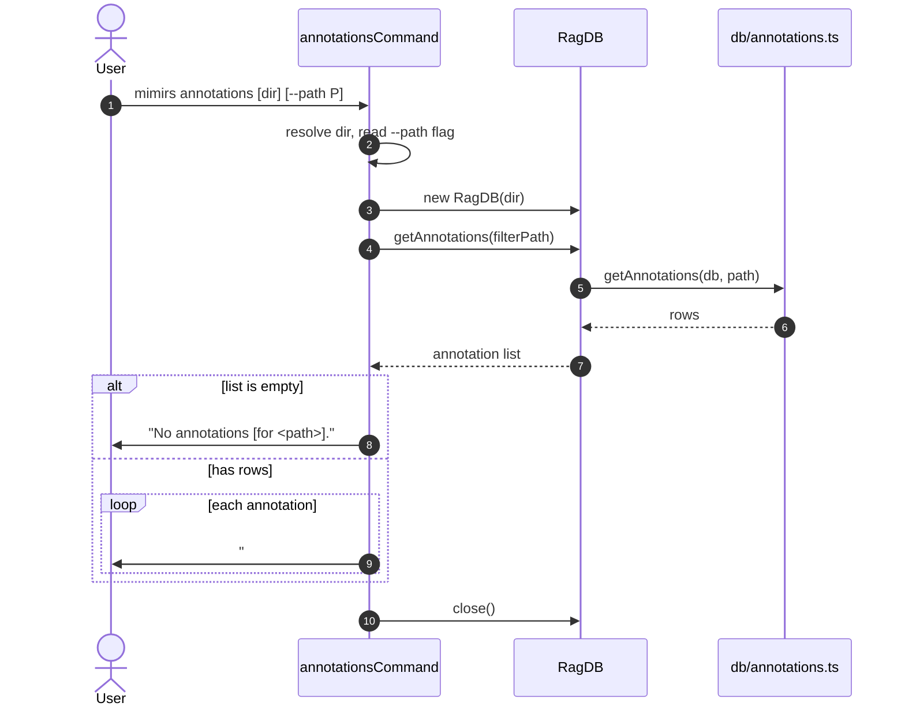

# CLI: annotations

`mimirs annotations [dir] [--path P]` prints all annotations stored for
a project, optionally filtered to a single file. It is a read-only
view — it does not create, update, or delete anything. Use it when you
want to skim every persistent note an agent (or you) has left across
the codebase, or when you want to inspect the notes attached to one
specific file before editing it.

Annotations themselves are written by the MCP `annotate` tool (or by
the underlying DB calls). This CLI just reads them back.

## Flow



1. The user invokes the command. The directory is taken from the first
   positional argument (when it does not start with `--`), then from
   `--dir`, and finally defaults to `.`
   (`src/cli/commands/annotations.ts:6`).
2. `--path` is read with the shared `getFlag` helper. When set, it is
   passed as the filter into `db.getAnnotations`. The filter is a
   single path string; there is no glob or directory matching here
   (`src/cli/commands/annotations.ts:7-9`).
3. `RagDB` opens the project DB.
4. `db.getAnnotations(filterPath)` returns rows for the whole project
   or for the one path. With no filter every annotation row in the
   project is returned.
5. If the result list is empty, the CLI prints
   `No annotations for <path>.` (when a filter was set) or
   `No annotations found.` (when no filter was set), then closes the
   DB and returns. The command always exits 0.
6. Otherwise, each annotation is rendered as a small three-line block:
   the id and target on line 1, the note on line 2, and the
   `updatedAt` timestamp on line 3. A blank line separates entries.

## Inputs

| Input | Source | Notes |
| --- | --- | --- |
| `directory` | first positional arg or `--dir` | Optional. Defaults to `.`. The positional form is accepted only when the first arg does not start with `--`. |
| `--path` | flag | Optional. A single file path. When present, only annotations on that path are returned. |
| `--dir` | flag | Optional. Alternate way to pass the project directory. The positional form takes precedence when provided. |

## Outputs

| Output | What happens |
| --- | --- |
| Formatted annotation listing | One block per row, written to stdout. Each block carries the row id, the path, an optional symbol name, an optional author tag, the note body, and the last-updated timestamp. |

When the result set is empty, a single short message is printed
instead.

The exact rendered shape (from `src/cli/commands/annotations.ts:17-23`):

```
#<id>  <path>[  •  <symbolName>][ [<author>]]
  <note>
  (<updatedAt>)
```

`symbolName` and the `[author]` segment are conditional: they are
omitted when the underlying row stored a null. The timestamp is the
row's `updated_at` column (set on each upsert in
`src/db/annotations.ts:38-40`).

## Read-only behaviour

The CLI never calls the write side of the annotations module. It only
invokes `db.getAnnotations(...)` which runs a `SELECT` and returns
rows. To add or change a note, use the `annotate` MCP tool. To remove
one, use `delete_annotation`. This split keeps the CLI safe to run
casually — there is no flag here that mutates state.

## Branches and failure cases

- **No annotations stored**: the command prints
  `No annotations found.` and exits 0.
- **`--path` filter with no matches**: the command prints
  `No annotations for <path>.` and exits 0. There is no fuzzy match —
  the filter is a literal path equality check inside
  `getAnnotations`.
- **Path string mismatches**: annotations are stored under whatever
  path the writer supplied. If you pass a relative path here but the
  annotation was stored as absolute (or vice versa), the filter will
  miss. Re-run without `--path` to see what is actually stored.

## Example

```
mimirs annotations
# → #12  src/server/index.ts  •  startServer  [agent]
#       Watcher does not pick up symlinks; pass absolute paths.
#       (2026-04-12T15:08:11.000Z)

mimirs annotations --path src/db/files.ts
# → No annotations for src/db/files.ts.
```

## Key source files

- `src/cli/commands/annotations.ts` — the CLI entrypoint
  (`annotationsCommand`). The whole command is 27 lines.
- `src/db/index.ts` — `RagDB.getAnnotations` forwards to the
  annotations module (`src/db/index.ts:779-781`).
- `src/db/annotations.ts` — the actual `getAnnotations` query, plus
  the write paths used by the `annotate` tool but not by this CLI.

## Related flows

- [tools/get-annotations](../tools/get-annotations.md) — MCP tool with
  the same read behavior plus a semantic search mode.
- [tools/annotate](../tools/annotate.md) — the writer counterpart;
  this CLI is the read side of the same store.
