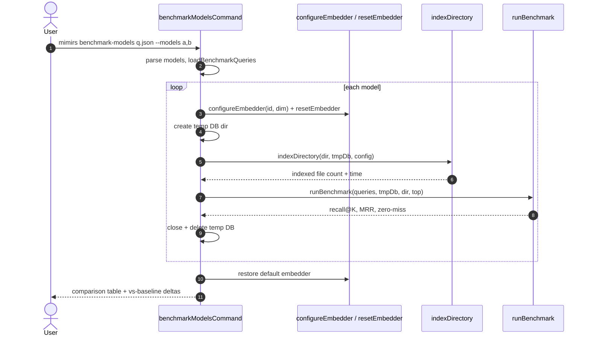

# CLI: benchmark-models

`mimirs benchmark-models` answers a single question: *which embedding model retrieves best for this codebase?* It takes one labeled query file and a list of candidate models, then for each model it builds a throwaway index, runs the same benchmark over it, and prints a side-by-side comparison table. Where [benchmark](benchmark.md) scores one fixed configuration, this command sweeps several models so you can choose one before committing it to config.

The whole flow lives in one file, `src/cli/commands/benchmark-models.ts`. It reuses the scoring logic from `src/search/benchmark.ts` and the indexing pipeline from `src/indexing/indexer.ts`; its own job is to swap the active embedder per model, index into an isolated temp directory, collect metrics, and report them.

## What it does, step by step

For each model the command reconfigures the global embedder, creates a temporary index directory, indexes the project there, benchmarks the same queries against it, records the metrics and index time, then deletes the temp directory. After all models run it restores the default embedder and prints the comparison (`src/cli/commands/benchmark-models.ts:59-117`).



1. The user runs the command with a query file and a `--models` list. Without a query file, the command prints usage (including the known-model list) and exits 1 (`src/cli/commands/benchmark-models.ts:33-41`).
2. The command resolves the project dir, loads config, computes top-K, and reads `--models`. A missing `--models` flag prints an error and exits 1 (`src/cli/commands/benchmark-models.ts:43-51`).
3. The model list is split on commas and each entry is parsed into an id and embedding dimension; the query file is loaded and validated by `loadBenchmarkQueries` (`src/cli/commands/benchmark-models.ts:53-54`).
4. For each model, `configureEmbedder` sets the active model id and dimension, and `resetEmbedder` clears the cached pipeline so the next embedding call loads the new model (`src/cli/commands/benchmark-models.ts:63-64`).
5. A temp directory named `.rag-eval-<model-id>` is created under the project dir (slashes in the id replaced with dashes); any pre-existing one is removed first. A `RagDB` is opened with this temp dir as its index location, keeping the real index untouched (`src/cli/commands/benchmark-models.ts:67-73`).
6. `indexDirectory` indexes the project into the temp DB, streaming progress to the same stdout line; the elapsed time and indexed-file count are recorded (`src/cli/commands/benchmark-models.ts:77-83`).
7. `runBenchmark` scores the queries against the temp index using the config's hybrid weight, producing recall@K, MRR and zero-miss rate (`src/cli/commands/benchmark-models.ts:87`).
8. In a `finally` block the temp DB is closed and its directory deleted, so a benchmark failure still cleans up (`src/cli/commands/benchmark-models.ts:94-98`).
9. After the loop, the embedder is restored to the default model and dimension (`src/cli/commands/benchmark-models.ts:102-103`).
10. A Markdown comparison table is printed, and when more than one model ran, each later model is compared against the first as a baseline with recall/MRR deltas and a recommendation (`src/cli/commands/benchmark-models.ts:106-137`).

## Models compared on the same fixture

Every model is judged on the *same* query file with the *same* top-K, so the only variable is the embedding model. Four models are recognized by name, each with a fixed embedding dimension (`src/cli/commands/benchmark-models.ts:15-20`):

| Model id | Dim |
| --- | --- |
| `Xenova/all-MiniLM-L6-v2` | 384 |
| `Xenova/bge-small-en-v1.5` | 384 |
| `Xenova/jina-embeddings-v2-small-en` | 512 |
| `jinaai/jina-embeddings-v2-base-code` | 768 |

`Xenova/all-MiniLM-L6-v2` is also the project default embedder, so it is what the embedder is restored to after the run (`src/embeddings/embed.ts:16-17`,`213`). Any model not in the table can still be benchmarked by passing it as `model-id:dim` (for example `some-org/model:768`); a bare unknown id with no dimension throws (`src/cli/commands/benchmark-models.ts:22-30`).

## Inputs

| Name | Type | Required | Description |
| --- | --- | --- | --- |
| `fixture` | positional path | yes | Path to the JSON query file, the same `{ query, expected }` array format used by [benchmark](benchmark.md). Missing value prints usage and exits 1 (`src/cli/commands/benchmark-models.ts:33-41`). |
| `--models` | comma list | yes | Models to compare. Each entry is either a known id or `model-id:dim`. Missing flag exits 1 (`src/cli/commands/benchmark-models.ts:46-53`). |
| `--dir` | path | no | Project directory to index and benchmark. Defaults to `.` (`src/cli/commands/benchmark-models.ts:43`). |
| `--top` | integer | no | Top-K cutoff for scoring. Defaults to the config `benchmarkTopK` (default 5) (`src/cli/commands/benchmark-models.ts:45`). |

## Outputs

| Output | Where it lands / shape / description |
| --- | --- |
| Per-model progress | Streamed to stdout during each model's run: a header line, indexing progress, indexed-file count and time, then recall/MRR/zero-miss (`src/cli/commands/benchmark-models.ts:60-93`). |
| Comparison table | A Markdown table printed after all models complete, with columns Model, Dim, Recall@K, MRR, Zero-miss, Index time (`src/cli/commands/benchmark-models.ts:106-117`). |
| Baseline deltas | When more than one model ran, per-candidate recall (in percentage points) and MRR differences versus the first model, plus a one-line recommendation (`src/cli/commands/benchmark-models.ts:120-137`). |

## How model selection feeds back into config

This command does not edit config. It changes the active embedder only in process — via `configureEmbedder` — and restores the default before exiting, so the project's stored configuration is never touched (`src/cli/commands/benchmark-models.ts:102-103`). The recommendation lines tell you what *to do*, not what was done: when a candidate beats the baseline by more than 5 percentage points of recall the command suggests making it the default; a smaller positive gain suggests documenting it but keeping the current default; no gain prints "No recall improvement" (`src/cli/commands/benchmark-models.ts:129-135`). Acting on that advice — switching the project to the winning model — is a separate, manual config change.

## State changes

| State | Before | After | Why it matters |
| --- | --- | --- | --- |
| Active embedder | Whatever was configured (default `all-MiniLM-L6-v2`) | Reset to each model in turn, then restored to default | Lets each model embed both the index and the queries; restoring avoids leaking a non-default embedder into later code in the same process (`src/cli/commands/benchmark-models.ts:63-64`,`102-103`). |
| Temp index dir | Absent | Created `.rag-eval-<model>` per model, then deleted | Keeps each model's index isolated from the real index and from other models; the `finally` block guarantees deletion even on error (`src/cli/commands/benchmark-models.ts:67-69`,`94-98`). |

The project's real index and config are read-only throughout; the only persistent file system changes are the temporary directories, which are removed by the time the command finishes.

## Branches and failure cases

- **Missing query file** — prints usage with the known-model list and exits 1 (`src/cli/commands/benchmark-models.ts:33-41`).
- **Missing `--models`** — prints an error with an example and exits 1 (`src/cli/commands/benchmark-models.ts:48-51`).
- **Known model id** — resolved to its preset dimension (`src/cli/commands/benchmark-models.ts:22-23`).
- **`model-id:dim` form** — split on `:` into id and parsed integer dimension (`src/cli/commands/benchmark-models.ts:25-28`).
- **Unknown id with no dimension** — `parseModelArg` throws listing the known models (`src/cli/commands/benchmark-models.ts:29`).
- **Stale temp dir present** — removed before re-creating, so a previous interrupted run does not corrupt results (`src/cli/commands/benchmark-models.ts:68`).
- **Index or benchmark error mid-model** — the `finally` block still closes the DB and deletes the temp dir; the error then propagates and ends the command (`src/cli/commands/benchmark-models.ts:94-98`).
- **Single model** — the table prints, but the baseline-delta block is skipped because it requires more than one result (`src/cli/commands/benchmark-models.ts:120`).
- **Recommendation tiers** — candidate vs baseline recall: `>5pp` suggests making it default, `>0` suggests documenting it, otherwise "No recall improvement" (`src/cli/commands/benchmark-models.ts:129-135`).
- **Invalid query file** — `loadBenchmarkQueries` throws on a non-array file or any entry missing `query`/`expected` (`src/search/benchmark.ts:29-44`).

## Example

```bash
bun run mimirs benchmark-models queries.json \
  --models Xenova/all-MiniLM-L6-v2,jinaai/jina-embeddings-v2-base-code \
  --dir . --top 5
```

Illustrative comparison output:

```
Comparing 2 models on 12 queries (top-5)...

--- Xenova/all-MiniLM-L6-v2 (384d) ---
  Indexing...
  Indexed 120 files in 8.4s
  Running benchmark...
  Recall@5: 78.0%
  MRR: 0.640
  Zero-miss: 8.3%

--- jinaai/jina-embeddings-v2-base-code (768d) ---
  Indexing...
  Indexed 120 files in 22.1s
  Running benchmark...
  Recall@5: 86.5%
  MRR: 0.710
  Zero-miss: 0.0%


=== Comparison ===

| Model | Dim | Recall@5 | MRR | Zero-miss | Index time |
|---|---|---|---|---|---|
| Xenova/all-MiniLM-L6-v2 | 384 | 78.0% | 0.640 | 8.3% | 8.4s |
| jinaai/jina-embeddings-v2-base-code | 768 | 86.5% | 0.710 | 0.0% | 22.1s |

jinaai/jina-embeddings-v2-base-code vs Xenova/all-MiniLM-L6-v2:
  Recall: +8.5pp
  MRR: +0.070
  → Candidate shows >5pp recall improvement — consider making it default
```

## Related

- [benchmark](benchmark.md) — scores one fixed configuration against a query file and exits non-zero below thresholds. `benchmark-models` reuses the same query format and the same scoring code to compare several embedding models at once.

## Key source files

- `src/cli/commands/benchmark-models.ts` — the entire command: model parsing, per-model index+benchmark loop, temp-dir lifecycle, comparison table and recommendations.
- `src/search/benchmark.ts` — `loadBenchmarkQueries` and `runBenchmark`, shared with the single-config benchmark.
- `src/embeddings/embed.ts` — `configureEmbedder`/`resetEmbedder` and the default model constants used to swap and restore the active embedder.
- `src/indexing/indexer.ts` — `indexDirectory`, which builds each model's temporary index.
- `src/config/index.ts` — supplies `benchmarkTopK` and `hybridWeight`.
