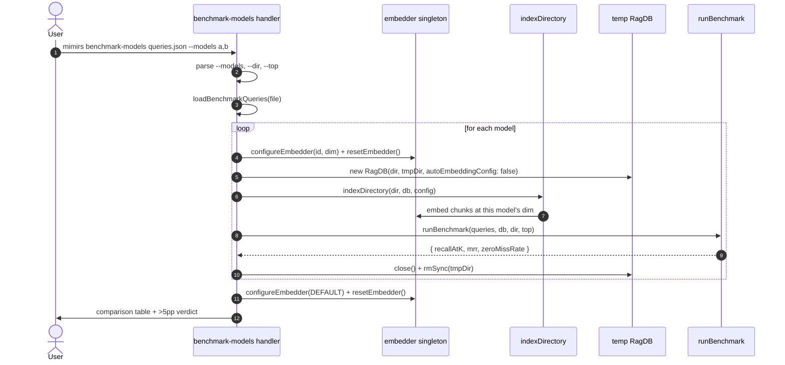

# CLI: benchmark-models

`mimirs benchmark-models` answers one question: **would switching the embedding model make search better, and by how much?** It takes a set of labelled queries (each with the files you *expect* search to find) and runs the same search quality benchmark against several candidate embedding models, one after another. For each model it reconfigures the embedder, builds a fresh throwaway index of your project, scores the queries, and at the end prints a side-by-side comparison table plus a verdict on whether any candidate beats the first model by a meaningful margin.

This is a maintainer/evaluation tool, not part of normal indexing or serving. You reach for it when you are considering changing the default embedding model and want hard recall numbers on real queries before touching `embeddingModel` in config. It never modifies your real index: every model gets its own temporary index directory that is deleted when its turn is over.

The command is registered in the CLI dispatcher at `src/cli/index.ts:139-140`, which calls `benchmarkModelsCommand` in `src/cli/commands/benchmark-models.ts:33`.

## How it works

The whole flow lives in one handler, `benchmarkModelsCommand`. The interesting part is the per-model loop: because the embedder in `src/embeddings/embed.ts` is a process-wide singleton, the command has to carefully swap models in and out and keep each model's vectors in a separate index so dimensions never collide.



1. The user runs the command with a queries file as the first positional argument and a required `--models` list. The handler reads the file name from `args[1]` and rejects the run with usage text (including the list of known models) if it is missing — `src/cli/commands/benchmark-models.ts:34-42`.
2. Flags are resolved: `--dir` (default current directory) is resolved to an absolute path, the project config is loaded from it, and `--top` is parsed with `intFlag` falling back to `config.benchmarkTopK` (default 5). The `--models` string is split on commas and each entry is turned into a model spec by `parseModelArg` — `src/cli/commands/benchmark-models.ts:44-54`.
3. The labelled queries are loaded and validated by `loadBenchmarkQueries`, which parses the JSON array and checks that every entry has a non-empty `query` string and a non-empty `expected` array — `src/search/benchmark.ts:29-44`.
4. For each model, `configureEmbedder(model.id, model.dim)` records the new model and dimension on the singleton, and `resetEmbedder()` clears the cached pipeline so the next embed call loads the new model — `src/cli/commands/benchmark-models.ts:64-65`.
5. A temporary index directory `.rag-eval-<model>` is created inside the project dir (deleted first if it already exists), and a `RagDB` is opened against it with `autoEmbeddingConfig: false` so the constructor does not overwrite the dimension the command just set — `src/cli/commands/benchmark-models.ts:67-77`.
6. `indexDirectory` walks the project and embeds every chunk into the temp DB at the current model's dimension. The handler times this and prints how many files were indexed — `src/cli/commands/benchmark-models.ts:81-87`.
7. `runBenchmark` runs each query through the normal hybrid search against the temp index and computes recall@K, mean reciprocal rank, and zero-miss rate — `src/cli/commands/benchmark-models.ts:90-97`, `src/search/benchmark.ts:52-105`.
8. In a `finally` block the DB is closed and the temp directory is removed with `rmSync(..., { force: true })`, so the temp index never survives the model's turn even if the benchmark throws — `src/cli/commands/benchmark-models.ts:98-102`.
9. After all models are done, the embedder is restored to the project default (`configureEmbedder(DEFAULT_MODEL_ID, DEFAULT_EMBEDDING_DIM)` + `resetEmbedder()`), so the process is left in a clean state — `src/cli/commands/benchmark-models.ts:106-107`.
10. The handler prints a Markdown comparison table and, when more than one model ran, a per-candidate verdict comparing each model against the first — `src/cli/commands/benchmark-models.ts:110-141`.

## Inputs

| Name | Type | Required | Description |
|---|---|---|---|
| `<file>` | positional path | yes | Path to a JSON file containing the benchmark queries. Each entry is `{ "query": string, "expected": string[] }`, where `expected` lists the file paths search should return for that query. Resolved with `resolve(file)` and read by `loadBenchmarkQueries` — `src/cli/commands/benchmark-models.ts:55`, `src/search/benchmark.ts:29`. |
| `--models m1,m2` | comma-separated string | yes | Models to compare, in order; the first is treated as the baseline. Each entry is either a known model name (looked up in `KNOWN_MODELS`) or a custom `model-id:dim` pair. Missing this flag aborts the run with an error and exit code 1 — `src/cli/commands/benchmark-models.ts:47-54`. |
| `--dir D` | path | no | Project directory to index and benchmark against. Defaults to the current directory and is resolved to absolute — `src/cli/commands/benchmark-models.ts:44`. |
| `--top N` | integer | no | Cutoff K for recall@K and the search depth per query. Defaults to `config.benchmarkTopK` (5). Validated as an integer ≥ 1; bad input fails with a clear flag error — `src/cli/commands/benchmark-models.ts:46`. |

### The `--models` value format

| Form | Example | Meaning |
|---|---|---|
| Known model name | `Xenova/all-MiniLM-L6-v2` | Looked up in `KNOWN_MODELS`; dimension is filled in automatically — `src/cli/commands/benchmark-models.ts:24`. |
| `model-id:dim` | `some-org/some-model:768` | Any model identifier plus its embedding dimension, split on `:` — `src/cli/commands/benchmark-models.ts:26-29`. |
| Anything else | `gpt-foo` | Rejected with `Unknown model "..."` listing the known models — `src/cli/commands/benchmark-models.ts:30`. |

The four built-in known models are defined in `KNOWN_MODELS` at `src/cli/commands/benchmark-models.ts:16-21`:

| Model id | Dimension |
|---|---|
| `Xenova/all-MiniLM-L6-v2` | 384 |
| `Xenova/bge-small-en-v1.5` | 384 |
| `Xenova/jina-embeddings-v2-small-en` | 512 |
| `jinaai/jina-embeddings-v2-base-code` | 768 |

`Xenova/all-MiniLM-L6-v2` at 384 dimensions is also the project default model (`DEFAULT_MODEL_ID` / `DEFAULT_EMBEDDING_DIM` in `src/embeddings/embed.ts:16-17`), so putting it first in `--models` makes the comparison a "candidate vs current default" test.

## Outputs

| Output | Where it lands / shape / description |
|---|---|
| Per-model progress | Lines on stdout per model: a header `--- <id> (<dim>d) ---`, an indexed-files line, and that model's `Recall@K`, `MRR`, and `Zero-miss` percentages — `src/cli/commands/benchmark-models.ts:61,87,95-97`. |
| Comparison table | A Markdown table printed under `=== Comparison ===` with columns Model, Dim, Recall@K, MRR, Zero-miss, Index time — one row per model — `src/cli/commands/benchmark-models.ts:110-121`. |
| Recall verdict | When more than one model ran, a per-candidate block showing the recall (in percentage points) and MRR difference versus the first model, plus a recommendation line — `src/cli/commands/benchmark-models.ts:124-141`. |
| Temp index directories | One `.rag-eval-<model>` directory created per model inside the project dir, then deleted after that model's run. Not a persistent output — see *State changes* — `src/cli/commands/benchmark-models.ts:67-101`. |

The three quality numbers come straight from `runBenchmark`'s `BenchmarkSummary` (`src/search/benchmark.ts:21-27`):

- **Recall@K** — averaged fraction of a query's expected files that appeared in the top-K results.
- **MRR** — mean reciprocal rank; `1/rank` of the first expected file found, averaged over queries.
- **Zero-miss** — fraction of queries where *no* expected file showed up at all.

A file counts as found when the result path and an expected path match exactly or one ends with the other, which lets relative `expected` paths match the absolute paths search returns — `src/search/benchmark.ts:71-74`.

## State changes

### Temporary per-model index directory

| | |
|---|---|
| Before | No `.rag-eval-<model>` directory for the model (any stale one is deleted first). |
| During | The directory and a SQLite index inside it exist, populated with vectors at this model's dimension. |
| After | The directory is removed; the project is left with no trace of the run. |

For each model the handler computes `tmpDir = join(dir, ".rag-eval-<model-id-with-slashes-replaced>")`, deletes any existing copy, and creates it fresh. It opens a `RagDB` pointed at that directory, indexes into it, benchmarks against it, then in a `finally` block closes the DB and removes the directory with `rmSync(tmpDir, { recursive: true, force: true })` — `src/cli/commands/benchmark-models.ts:67-102`.

This matters for two reasons. First, **isolation**: different models produce vectors of different sizes (384, 512, 768…), and the vector table is built at a fixed dimension, so each model needs its own index — reusing one index would trigger a dimension-mismatch error. Second, **safety**: your real `.mimirs` index is never touched, so running this benchmark cannot corrupt or invalidate the index your editor or MCP server is using.

The reason the `RagDB` is constructed with `autoEmbeddingConfig: false` is directly tied to this. Normally the `RagDB` constructor reads the project config and calls `applyEmbeddingConfig` so the vector table is created at the configured dimension — but here the command has *already* set the embedder to the candidate model, and the default behaviour would reset it back to the project default. Opting out lets the command stay in control of which model is active — `src/db/index.ts:125-132`.

### Embedder singleton model/dim

| | |
|---|---|
| Before each model | Whatever model was active previously. |
| During | The candidate model id and dimension. |
| After the run | Restored to the project default model and dimension. |

`configureEmbedder` only swaps the singleton's recorded model and clears the cached pipeline when the id or dim actually changed; `resetEmbedder` then forces the next embed call to reload — `src/embeddings/embed.ts:35-42,196-199`. Because this state is process-wide, the handler deliberately restores the default at the end so a long-lived process is not left configured for the last candidate — `src/cli/commands/benchmark-models.ts:106-107`.

## Branches and failure cases

- **No queries file** — if `args[1]` is absent, the handler prints usage plus the known-model list and exits with code 1 — `src/cli/commands/benchmark-models.ts:34-42`.
- **Missing `--models`** — prints an error with an example and exits 1 — `src/cli/commands/benchmark-models.ts:49-52`.
- **Unknown model name** — `parseModelArg` throws `Unknown model "..."` when the argument is neither a known model nor a valid `id:dim` pair (i.e. it does not split into exactly two `:`-separated parts) — `src/cli/commands/benchmark-models.ts:23-31`.
- **Bad `--top`** — a non-integer or `< 1` value throws a `CliFlagError`, which the top-level dispatcher catches to print the message and exit 1 rather than crash — `src/cli/flags.ts:40-53`, `src/cli/index.ts:96-102`.
- **Invalid benchmark file** — `loadBenchmarkQueries` throws if the JSON is not an array, or if any entry lacks a `query` or has an empty/absent `expected` array — `src/search/benchmark.ts:33-41`.
- **Indexing or benchmark error mid-loop** — the `try/finally` still closes the DB and deletes the temp directory, so a failure on one model does not leave a stray `.rag-eval-*` folder behind. The error then propagates out of the loop — `src/cli/commands/benchmark-models.ts:79-102`.
- **Stale temp directory** — if a previous run died before cleanup and left a `.rag-eval-<model>` directory, it is removed before re-creation, so the index always starts empty — `src/cli/commands/benchmark-models.ts:69`.
- **Single model** — the run still works and prints the table, but the per-candidate verdict block is skipped because there is no baseline to compare against (`results.length > 1` guard) — `src/cli/commands/benchmark-models.ts:124`.
- **Recall verdict thresholds** — for each candidate after the first, the recall difference in percentage points decides the recommendation:

| Condition | Message |
|---|---|
| `recallDiff > 5` | `→ Candidate shows >5pp recall improvement — consider making it default` |
| `0 < recallDiff ≤ 5` | `→ Marginal improvement — document but keep current default` |
| `recallDiff ≤ 0` | `→ No recall improvement` |

These branches live at `src/cli/commands/benchmark-models.ts:133-139`. The ">5pp" rule is the practical bar: model swaps churn the whole index and force everyone to re-embed, so the tool only suggests a default change when the recall gain clears that margin.

## Example

```bash
mimirs benchmark-models bench/queries.json \
  --models Xenova/all-MiniLM-L6-v2,jinaai/jina-embeddings-v2-base-code \
  --dir . --top 5
```

A `bench/queries.json` entry looks like:

```json
[
  { "query": "how does hybrid search combine fts and vectors", "expected": ["src/search/hybrid.ts"] },
  { "query": "where is the embedding model configured", "expected": ["src/embeddings/embed.ts"] }
]
```

The tail of the output has the shape (values illustrative):

```
=== Comparison ===

| Model | Dim | Recall@5 | MRR | Zero-miss | Index time |
|---|---|---|---|---|---|
| Xenova/all-MiniLM-L6-v2 | 384 | 72.0% | 0.640 | 8.0% | 12.3s |
| jinaai/jina-embeddings-v2-base-code | 768 | 81.0% | 0.710 | 4.0% | 41.7s |

jinaai/jina-embeddings-v2-base-code vs Xenova/all-MiniLM-L6-v2:
  Recall: +9.0pp
  MRR: +0.070
  → Candidate shows >5pp recall improvement — consider making it default
```

The first model in `--models` is the baseline, so order matters: put your current default first to read every later row as a candidate against it.

## Relationship to the other benchmark commands

| Command | Scope | Index used | Output |
|---|---|---|---|
| [benchmark](benchmark.md) | One model — your current config | Your real `.mimirs` index | Quality report for the active model |
| `benchmark-models` | Several models compared | A throwaway temp index per model | Comparison table + recall verdict |
| [eval](eval.md) | Search-on vs search-off | Your real index | A/B answer-quality eval |

All three share `runBenchmark` / the benchmark types in `src/search/benchmark.ts`; `benchmark-models` is the only one that re-indexes from scratch per run, because it has to build a separate index for each candidate model.

## Key source files

- `src/cli/commands/benchmark-models.ts` — the command handler: model parsing, the per-model index/benchmark loop, cleanup, and the comparison/verdict output.
- `src/cli/index.ts` — CLI dispatcher that routes `benchmark-models` to the handler and catches flag errors.
- `src/embeddings/embed.ts` — the embedder singleton; `configureEmbedder` / `resetEmbedder` are what let the command swap models, and `DEFAULT_MODEL_ID` / `DEFAULT_EMBEDDING_DIM` are restored at the end.
- `src/search/benchmark.ts` — `loadBenchmarkQueries` and `runBenchmark`, which validate the query file and compute recall@K, MRR, and zero-miss rate.
- `src/indexing/indexer.ts` — `indexDirectory`, which builds each model's temp index.
- `src/db/index.ts` — `RagDB`, whose `autoEmbeddingConfig: false` option keeps the constructor from overriding the model the command selected.
