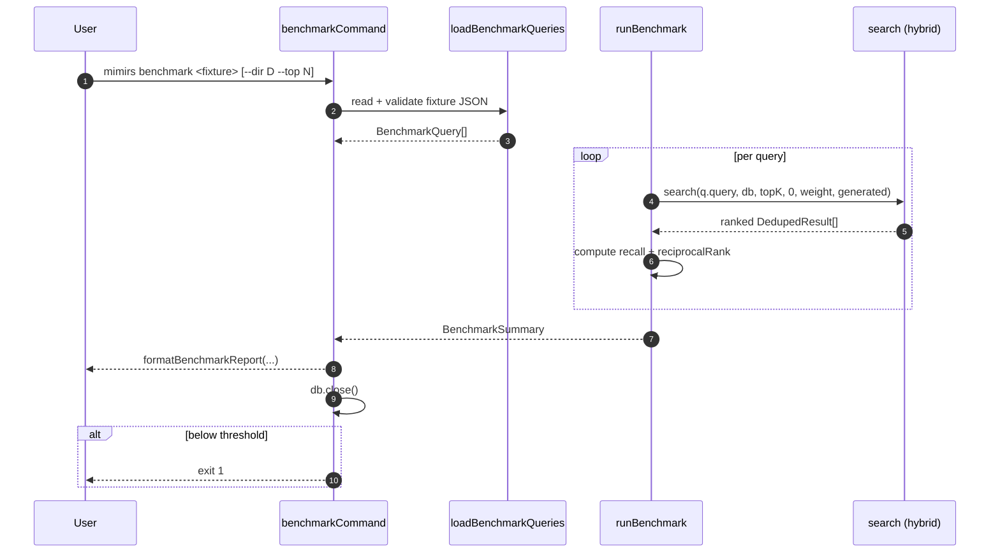

# CLI: benchmark

`mimirs benchmark` measures the search index's retrieval quality against a fixture of queries with expected files. For each query it runs the same hybrid search that the `search` MCP tool uses, then computes recall@K, MRR (mean reciprocal rank), and a zero-miss rate. It exits non-zero when the result drops below configured thresholds — so the command is suitable for CI gating.

## Flow



1. The first positional is the fixture path; missing → usage + `exit(1)` (`src/cli/commands/benchmark.ts:8-12`).
2. `--dir` (default `.`) and `--top` (default `config.benchmarkTopK`) come from flags (`src/cli/commands/benchmark.ts:14-17`).
3. `loadBenchmarkQueries(file)` reads JSON and validates each entry has a string `query` plus a non-empty string array `expected` (`src/search/benchmark.ts:29-44`).
4. For every query, `runBenchmark` calls `search(q.query, db, topK, 0, weight, config.generated)` — the same hybrid (vector + FTS) entry point that powers the `search` MCP tool (`src/search/benchmark.ts:64-66`).
5. Returned paths are matched against `expected` with loose suffix logic (`r === e || r.endsWith(e) || e.endsWith(r)`) so callers can write either project-relative or absolute paths in the fixture and have them match (`src/search/benchmark.ts:71-73`).
6. Per-query metrics: `recall` = `found.length / expected.length`; `reciprocalRank` = `1 / (rank+1)` of the first expected file in `results`, or `0` if none appears; `hit` = at least one match.
7. The summary aggregates: `recallAtK` is the simple average of per-query recall; `mrr` is the average of reciprocal ranks; `zeroMissRate` is the share of queries with no expected file in their top-K results.
8. `formatBenchmarkReport` prints the summary, then a `Missed queries` block (queries where `hit` is false) and a `Partial matches` block (queries with `recall < 1` but at least one hit).
9. After printing, the DB is closed. If `summary.recallAtK < config.benchmarkMinRecall || summary.mrr < config.benchmarkMinMrr`, the command exits with code `1` (`src/cli/commands/benchmark.ts:28-30`).

## Inputs

| Input | Where it comes from | Effect |
|---|---|---|
| `fixture` (positional) | First arg | Path to a JSON file with the benchmark queries. Required. |
| `--dir D` | CLI flag (default `.`) | Project directory whose `.mimirs/index.db` is searched. |
| `--top N` | CLI flag (default `config.benchmarkTopK`) | top-K passed to `search` and used as the K in recall@K. |
| `config.benchmarkMinRecall` | Project config | Recall floor — below this the command exits non-zero. |
| `config.benchmarkMinMrr` | Project config | MRR floor — below this the command exits non-zero. |
| `config.hybridWeight` | Project config | Weight passed through to `search`. Picked up from the same `loadConfig` call. |

### Fixture file format

JSON array of `BenchmarkQuery`:

| Field | Type | Required | Notes |
|---|---|---|---|
| `query` | string | yes | Natural-language search the index is asked to satisfy. |
| `expected` | string[] | yes, non-empty | File paths the search should return. Relative or absolute; matched via `endsWith` against `r` and itself. |

Both `query` and `expected` (non-empty array) are enforced — `loadBenchmarkQueries` throws on missing or empty `expected`.

## Outputs

- **Stdout**: a header (`Recall@K`, `MRR`, `Zero-miss rate`), then per-failure entries listing each missed query with its `expected` and `got` paths, then a `Partial matches` block.
- **Exit code**: `0` on pass, `1` if recall or MRR is below the configured threshold (or the usage path).

## Reported metrics

`BenchmarkSummary` carries (`src/search/benchmark.ts:21-27`):

- **Recall@K** — average per-query recall, printed as a percentage with one decimal.
- **MRR** — mean reciprocal rank, printed with three decimals. Range 0..1; higher is better.
- **Zero-miss rate** — share of queries whose top-K contained none of the expected files, plus an absolute count in parentheses.

The CI gating uses only `recallAtK` and `mrr` — `zeroMissRate` is reported but not gated.

## Branches and failure cases

- Missing fixture arg → usage + `exit(1)`.
- Invalid fixture (not an array, or any entry missing `query` / `expected`, or `expected` empty) → `loadBenchmarkQueries` throws and the command crashes.
- Threshold failure: even if every query returned results, the run exits `1` when recall or MRR is below threshold. Use this as a CI quality gate, but check both thresholds — a regression in recall or MRR alone is enough to fail.
- The command does not handle a missing or unbuilt index — `new RagDB(dir)` will throw if the DB does not exist. Run `mimirs index` first.

## Example

```sh
mimirs benchmark evals/retrieval.json --top 10
```

Fixture entry:

```json
[
  {
    "query": "how does the file watcher debounce events",
    "expected": ["src/indexing/watcher.ts"]
  }
]
```

Illustrative report:

```
Benchmark results (1 queries, top-10):
  Recall@10:      100.0%
  MRR:            1.000
  Zero-miss rate: 0.0% (0 queries)
```

## Relationship to benchmark-models

`mimirs benchmark` measures one specific index against one fixture using the currently-configured embedder. `mimirs benchmark-models` reuses the same `runBenchmark` and `loadBenchmarkQueries`, but loops over multiple embedding models, rebuilds the index in a temp directory for each, and prints a side-by-side comparison table. So this command is the inner loop; benchmark-models is the outer comparison.

## Related flows

- [cli/eval](eval.md) — A/B simulation of agent behaviour against fixture tasks. Different output, fixture format, and intent.
- [cli/benchmark-models](benchmark-models.md) — multi-model comparison built on top of this command's primitives.

## Key source files

- `src/cli/commands/benchmark.ts` — argument parsing and threshold gating.
- `src/search/benchmark.ts` — `loadBenchmarkQueries`, `runBenchmark`, `formatBenchmarkReport`, metric definitions.

## Open questions

- Discovery flags the exact metrics emitted as an open question. The current source emits Recall@K, MRR, and Zero-miss rate; if more are added (NDCG, precision, etc.) update this page and the report formatter together.
