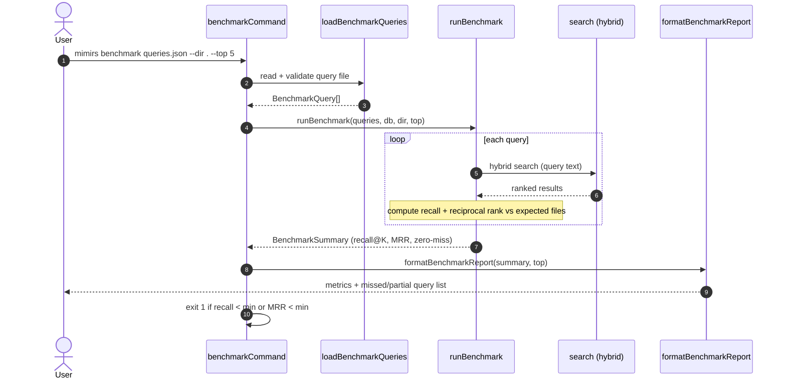

# CLI: benchmark

`mimirs benchmark` scores how good the search index is at finding the *right* files. You give it a file of labeled queries — each query paired with the file paths a correct search should surface — and it runs every query through the real hybrid search, then reports relevance metrics. Unlike [eval](eval.md), which compares search against an empty baseline, benchmark measures search quality on its own terms against a ground-truth label set. It is the command to wire into CI: if quality drops below configured thresholds, it exits non-zero.

The command file itself is a thin orchestrator. It parses arguments, loads the query file, opens the index, runs the benchmark, prints the report, and then decides the exit code. The scoring logic lives in `src/search/benchmark.ts`.

## What it measures

For each query the benchmark runs one hybrid search and compares the returned file paths against the query's expected files. From those comparisons it derives three summary numbers (`src/search/benchmark.ts:98-104`):

- **Recall@K** — the average, across queries, of the fraction of a query's expected files that appeared in the top-K results.
- **MRR (mean reciprocal rank)** — the average of `1 / rank` of the first expected file found per query, where rank is 1-based. A correct file at position 1 scores 1.0; at position 3 scores 0.33; never found scores 0.
- **Zero-miss rate** — the fraction of queries where *none* of the expected files appeared at all.

Precision is not computed. The metrics are recall-oriented: they ask "did we find the files we should have", not "how much of what we returned was relevant".



1. The user runs the command with a query file and optional flags. `benchmarkCommand` requires the first positional argument; without it, it prints a usage line and exits 1 (`src/cli/commands/benchmark.ts:8-12`).
2. `loadBenchmarkQueries` reads and JSON-parses the file, validating that it is an array and that every entry has a `query` string and a non-empty `expected` array (`src/search/benchmark.ts:29-44`).
3. The command logs how many queries it will run and against which directory (`src/cli/commands/benchmark.ts:20`).
4. `runBenchmark` loads config (for the hybrid weight) and loops over the queries (`src/search/benchmark.ts:59-64`).
5. For each query it runs the hybrid `search` with the requested top-K (`src/search/benchmark.ts:65`).
6. It normalizes expected paths and computes per-query recall and reciprocal rank by matching result paths against expected paths (`src/search/benchmark.ts:67-95`).
7. `runBenchmark` averages the per-query numbers into the summary metrics (`src/search/benchmark.ts:98-104`).
8. `formatBenchmarkReport` prints the headline metrics plus per-query failure and partial-match detail (`src/search/benchmark.ts:107-138`).
9. After closing the index, the command compares recall and MRR against the configured minimums and exits 1 if either is below threshold (`src/cli/commands/benchmark.ts:25-30`).

## Fixture file format

The query file is a JSON array. Each element has one required string and one required non-empty array, defined by the `BenchmarkQuery` interface (`src/search/benchmark.ts:7-10`):

| Field | Type | Required | Description |
| --- | --- | --- | --- |
| `query` | string | yes | The search query text, passed directly to hybrid search. |
| `expected` | string[] | yes, non-empty | File paths a correct search should surface. May be relative (resolved against the project dir) or absolute. |

A query whose `expected` array is empty or missing causes load to throw, so unlike the eval fixture there is no "no expected files" case here.

## Inputs

| Name | Type | Required | Description |
| --- | --- | --- | --- |
| `fixture` | positional path | yes | Path to the JSON query file. Missing value prints usage and exits 1 (`src/cli/commands/benchmark.ts:8-12`). |
| `--dir` | path | no | Project directory whose index is queried. Defaults to `.`, resolved to an absolute path (`src/cli/commands/benchmark.ts:14`). |
| `--top` | integer | no | Top-K cutoff for each search. Defaults to the project's `benchmarkTopK` config value (default 5) (`src/cli/commands/benchmark.ts:17`, `src/config/index.ts:32`). |

The pass/fail thresholds are not flags; they come from config: `benchmarkMinRecall` (default 0.8) and `benchmarkMinMrr` (default 0.6) (`src/config/index.ts:33-34`).

## Outputs

| Output | Where it lands / shape / description |
| --- | --- |
| Benchmark report | Printed to stdout. A header with query count and top-K, three metric lines (Recall@K, MRR, Zero-miss rate), an optional "Missed queries" block listing each fully-missed query with its expected and got paths, and an optional "Partial matches" block for queries that found some but not all expected files (`src/search/benchmark.ts:107-138`). |
| Exit code | 0 when recall and MRR both meet their minimums; 1 when either falls below, making the command usable as a CI gate (`src/cli/commands/benchmark.ts:25-30`). |

## Metrics reference

| Metric | Meaning | How computed |
| --- | --- | --- |
| Recall@K | Avg fraction of a query's expected files present in top-K | `found.length / expected.length`, averaged over queries (`src/search/benchmark.ts:74`,`99`) |
| MRR | Avg reciprocal rank of first expected file | `1 / (i + 1)` of first match, 0 if none, averaged (`src/search/benchmark.ts:77-86`,`100`) |
| Zero-miss rate | Fraction of queries finding none of their expected files | `misses / total` (`src/search/benchmark.ts:101-102`) |

Precision and F-score are intentionally absent — the code computes only the three metrics above.

## State changes

The benchmark does not write any persistent state. It opens the index for reading and closes it before deciding the exit code (`src/cli/commands/benchmark.ts:15`,`25`). The only observable side effect besides stdout is the process exit code.

## Branches and failure cases

- **Missing fixture argument** — prints usage and exits 1 (`src/cli/commands/benchmark.ts:8-12`).
- **File not an array** — `loadBenchmarkQueries` throws "Benchmark file must be a JSON array of { query, expected } objects" (`src/search/benchmark.ts:33-35`).
- **Entry missing `query` or with empty/missing `expected`** — throws an error naming the offending entry (`src/search/benchmark.ts:37-41`).
- **Invalid JSON** — `JSON.parse` throws before validation (`src/search/benchmark.ts:31`).
- **`--top` omitted** — falls back to `benchmarkTopK` (default 5) (`src/cli/commands/benchmark.ts:17`).
- **Path matching** — an expected file counts as found when a result path equals it, ends with it, or is a suffix of it, so relative and absolute forms both match; relative expected paths are first resolved against the project dir (`src/search/benchmark.ts:46-50`,`71-73`).
- **No results for a query** — recall and reciprocal rank are 0, the query counts as a miss, and the report shows "got: (no results)" (`src/search/benchmark.ts:122-125`).
- **Below threshold** — recall below `benchmarkMinRecall` or MRR below `benchmarkMinMrr` exits 1; both at or above pass with exit 0 (`src/cli/commands/benchmark.ts:25-30`).
- **Empty query set guard** — when there are zero queries, all averages are reported as 0 rather than dividing by zero (`src/search/benchmark.ts:99-102`).

## Example

```bash
# queries.json:
# [
#   { "query": "open the database", "expected": ["src/db/index.ts"] },
#   { "query": "hybrid search ranking", "expected": ["src/search/hybrid.ts"] }
# ]

bun run mimirs benchmark queries.json --dir . --top 5
```

Illustrative report shape:

```
Running 2 benchmark queries against /path/to/project...

Benchmark results (2 queries, top-5):
  Recall@5:      75.0%
  MRR:            0.667
  Zero-miss rate: 0.0% (0 queries)

Partial matches (some expected files missing):
  "hybrid search ranking" — recall: 50%
```

If recall@5 had been below 80% or MRR below 0.6, the command would print the same report and then exit with code 1.

## Relationship to benchmark-models

`benchmark` measures retrieval quality with whatever embedding model the index was built with. [benchmark-models](benchmark-models.md) is the broader experiment: it re-embeds and re-runs the same kind of query set across multiple candidate embedding models so you can pick the best one. Use `benchmark` for a single-config regression gate; use `benchmark-models` when choosing or comparing models.

## Open questions

- The fixture schema is the current `BenchmarkQuery` shape (`query`, `expected`); it is not formally frozen.

## Key source files

- `src/cli/commands/benchmark.ts` — command entry: argument parsing, orchestration, threshold-based exit code.
- `src/search/benchmark.ts` — query loading, per-query scoring, summary metrics, report formatting.
- `src/config/index.ts` — supplies `benchmarkTopK`, `benchmarkMinRecall`, `benchmarkMinMrr`, and `hybridWeight`.
- `src/search/hybrid.ts` — the `search` function each query runs through.
