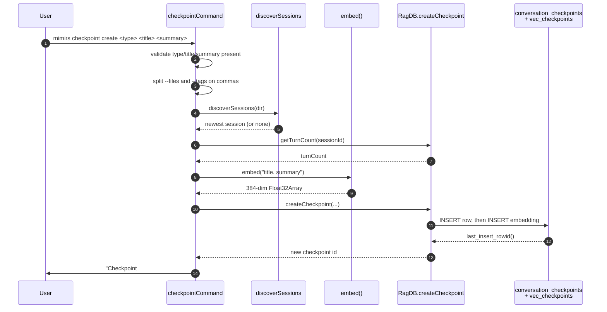

# CLI: checkpoint

`mimirs checkpoint` is the command-line door to the project's checkpoint log — a
small table of short notes that records what a working session decided, shipped,
got stuck on, or handed off. The same notes are normally written by the
[create_checkpoint](../tools/create-checkpoint.md) MCP tool from inside an agent
session; this command is the terminal equivalent, plus two read paths for
getting them back out. It groups three subcommands under one verb:

| Subcommand | What it does |
| --- | --- |
| `create <type> <title> <summary>` | Embeds the title plus summary and inserts one new checkpoint row. |
| `list` | Prints the most recent checkpoints, newest first, optionally filtered by type. |
| `search <query>` | Embeds the query and returns the semantically closest checkpoints. |

All three share a single entry function, `checkpointCommand`, which the top-level
dispatcher calls for the `checkpoint` command word (`src/cli/index.ts:148-149`).
That function opens one `RagDB` against the resolved project directory, branches
on the second argument, and always closes the database before returning
(`src/cli/commands/checkpoint.ts:8-87`).

## How the command is wired up

The CLI parses `process.argv`, takes the first token as the command, and routes
`checkpoint` into `checkpointCommand(args, getFlag)` (`src/cli/index.ts:148-149`).
`args` is the full argument list, so inside the handler `args[0]` is the literal
string `checkpoint`, `args[1]` is the subcommand, and the remaining positions hold
subcommand operands. `getFlag` is a tiny lookup that finds a flag by name and
returns the token after it, or `undefined` when the flag is absent
(`src/cli/index.ts:81-84`).

The handler resolves the target directory once — from `--dir` or the current
working directory — and constructs a `RagDB` for it before looking at the
subcommand (`src/cli/commands/checkpoint.ts:10-11`). Opening the database here
runs the full schema bootstrap, so the `conversation_checkpoints` table and its
companion `vec_checkpoints` vector table exist even on a brand-new index
(`src/db/index.ts`). If none of `create`, `list`, or `search` matches `args[1]`,
the handler prints a usage line to stderr and exits non-zero
(`src/cli/commands/checkpoint.ts:81-84`).

## Flow: create



1. The user runs `create` with three positional operands: `type`, `title`, and
   `summary`, taken from `args[2]`, `args[3]`, and `args[4]`
   (`src/cli/commands/checkpoint.ts:14-16`).
2. All three are required. If any is missing or empty, the handler prints the
   `create` usage string to stderr and calls `process.exit(1)`
   (`src/cli/commands/checkpoint.ts:17-20`). Note the command does not constrain
   `type` to a fixed set — unlike the MCP tool, which restricts it to one of five
   enum values (`src/tools/checkpoint-tools.ts:11-13`).
3. The optional `--files` and `--tags` flags are read as single strings and split
   on commas, with each piece trimmed. When a flag is absent the result is an
   empty array (`src/cli/commands/checkpoint.ts:22-25`).
4. The handler finds the current conversation by scanning the project's transcript
   directory for `*.jsonl` session files and picking the most recently modified
   one; `discoverSessions` already sorts newest-first. If no transcript exists,
   the session id falls back to the literal string `"unknown"`
   (`src/cli/commands/checkpoint.ts:27-28`, `src/conversation/parser.ts:301-332`).
5. It then asks the database how many turns that session has indexed and stores
   `turnCount - 1` (floored at 0) as the turn index — a best-effort pointer at
   "where in the session this happened." On a fresh index with no turns this is
   simply 0 (`src/cli/commands/checkpoint.ts:29-30`,
   `src/db/conversation.ts`).
6. The title and summary are joined as `"${title}. ${summary}"` and embedded into
   a single normalized vector by the local embedding model
   (`src/cli/commands/checkpoint.ts:32`, `src/embeddings/embed.ts:78-86`).
7. `RagDB.createCheckpoint` writes the row and its vector inside one transaction,
   then returns the new id (`src/cli/commands/checkpoint.ts:33-36`,
   `src/db/checkpoints.ts:4-49`).
8. The handler prints a one-line confirmation to stdout, including the new id,
   the type, and the title (`src/cli/commands/checkpoint.ts:37`).

The embedding step is what makes a checkpoint findable later by `search`. The
text actually embedded is title and summary joined with a period — the files and
tags are stored as searchable metadata but are not part of the vector.

## Flow: list

`list` reads back the most recent checkpoints. It reads an optional `--type`
filter and an optional `--top` count, defaulting to 20 and rejecting anything
below 1 (`src/cli/commands/checkpoint.ts:39-40`). The numeric parse goes through
`intFlag`, which uses strict `Number` parsing and throws a `CliFlagError` on
garbage like `--top 5abc`; the dispatcher catches that, prints the message, and
exits non-zero rather than crashing (`src/cli/flags.ts:40-53`,
`src/cli/index.ts:94-102`).

It then calls `db.listCheckpoints(undefined, type, top)`. The first argument is
the session filter, which the CLI deliberately leaves `undefined` so that **all**
sessions' checkpoints are listed, not just the current one
(`src/cli/commands/checkpoint.ts:41`). Under the hood the query starts from
`WHERE 1=1`, appends `AND type = ?` only when a type is supplied, orders by
`timestamp DESC`, and applies the limit (`src/db/checkpoints.ts:51-89`).

When the result set is empty the handler prints `No checkpoints found.`. Otherwise
it prints each checkpoint as a small block: a header line with the id, type,
title, and bracketed tags; a second line with the timestamp and turn index; the
full summary; and, when present, a `Files:` line — separated by blank lines
(`src/cli/commands/checkpoint.ts:43-56`).

## Flow: search

`search` takes a free-text query at `args[2]`; a missing query prints the search
usage string and exits non-zero (`src/cli/commands/checkpoint.ts:57-62`). It reads
the same optional `--type` filter and a `--top` count, but here the default is 5,
again validated by `intFlag` (`src/cli/commands/checkpoint.ts:64-65`).

The query string is embedded into a vector, and `db.searchCheckpoints(queryEmb,
top, type)` does the nearest-neighbour lookup
(`src/cli/commands/checkpoint.ts:66-67`). The store query asks the
`vec_checkpoints` virtual table for the closest vectors by distance, joins back to
`conversation_checkpoints` for the row data, and converts each raw distance into a
similarity score with `1 / (1 + distance)` so higher means closer
(`src/db/checkpoints.ts:91-144`).

Two details about the type filter are worth knowing. First, the vector query asks
for `topK * 2` candidates, then the type filter is applied in TypeScript and the
loop stops once `topK` matches accumulate (`src/db/checkpoints.ts:117-141`). This
over-fetch is a heuristic: if the type filter is narrow and most of the closest
vectors belong to other types, the function can still return fewer than `topK`
rows. Second, when no `--type` is given, every candidate up to the limit is kept.

Empty results print `No matching checkpoints found.`. Otherwise each hit prints
its score (four decimals), id, type, and title, then the summary, then an optional
`Files:` line (`src/cli/commands/checkpoint.ts:69-80`).

## Inputs

| Name | Type | Required | Description |
| --- | --- | --- | --- |
| subcommand | `create` / `list` / `search` | yes | Second argument; selects the branch. An unknown value prints usage and exits 1. |
| `<type>` | positional string | for `create` | Free-text checkpoint kind (e.g. `decision`, `milestone`). Not enum-checked by the CLI. |
| `<title>` | positional string | for `create` | Short label; embedded as part of the search vector. |
| `<summary>` | positional string | for `create` | Longer description; embedded with the title. |
| `<query>` | positional string | for `search` | Free-text query embedded and matched against checkpoint vectors. |
| `--files` | comma-separated string | no | Files relevant to the checkpoint; split, trimmed, stored as a JSON array. |
| `--tags` | comma-separated string | no | Freeform tags; split, trimmed, stored as a JSON array. |
| `--type` | string | no | Filters `list` and `search` results to one type. |
| `--top` | integer (>= 1) | no | Result count. Defaults to 20 for `list`, 5 for `search`. |
| `--dir` | path | no | Project directory. Defaults to the current working directory. |

## Outputs

| Output | Where it lands / shape / description |
| --- | --- |
| New checkpoint row | One row in `conversation_checkpoints` plus a matching vector in `vec_checkpoints`, written by `create`. |
| Confirmation line | stdout: `Checkpoint #<id> created: [<type>] <title>`. |
| Checkpoint listing | stdout: a multi-line block per checkpoint (header, timestamp + turn, summary, optional files) for `list`. |
| Ranked search hits | stdout: per hit, a similarity score, id, type, title, summary, and optional files for `search`. |
| Empty-state message | stdout: `No checkpoints found.` (list) or `No matching checkpoints found.` (search). |
| Usage error | stderr plus exit code 1 when a required operand or subcommand is missing or unknown. |

## State changes

### A checkpoint row is inserted

The only persistent change this command makes happens in the `create` branch.
Before the call there is no row for this note; after it there is exactly one new
checkpoint and its vector.

`RagDB.createCheckpoint` delegates to the store function, which wraps both writes
in a single transaction so the row and its embedding always land together
(`src/db/checkpoints.ts:4-49`). It first inserts into `conversation_checkpoints`
with the session id, turn index, ISO timestamp, type, title, summary, and the
JSON-encoded `files_involved` and `tags`. The base table has **no** embedding
column. It then reads `last_insert_rowid()` to learn the new id and inserts the
384-dimension vector into the `vec_checkpoints` virtual table keyed by that id,
passing the float buffer as raw bytes (`src/db/checkpoints.ts:18-48`). The split
between a plain table and a vec0 virtual table mirrors how chunks and
`vec_chunks` are stored elsewhere in the schema (`src/db/index.ts`).

The transaction matters: if the vector insert failed, the row insert would roll
back too, so a checkpoint can never exist without its embedding — which would
otherwise make it invisible to `search`. `list`, `search`, and the database open
itself perform no writes to the checkpoint tables.

## Branches and failure cases

- **Unknown subcommand** — anything other than `create`, `list`, or `search`
  prints `Usage: mimirs checkpoint <create|list|search>` to stderr and exits 1
  (`src/cli/commands/checkpoint.ts:81-84`).
- **Missing create operands** — if `type`, `title`, or `summary` is absent, the
  `create` usage line is printed and the process exits 1 before any embedding or
  database write (`src/cli/commands/checkpoint.ts:17-20`).
- **Missing search query** — a `search` with no query prints the search usage line
  and exits 1 (`src/cli/commands/checkpoint.ts:59-62`).
- **No transcript / fresh project** — when `discoverSessions` finds no `*.jsonl`
  files (directory missing or empty), the session id stored on the checkpoint is
  `"unknown"` and the turn index is 0; the checkpoint is still created normally
  (`src/cli/commands/checkpoint.ts:27-30`, `src/conversation/parser.ts:301-332`).
- **Bad `--top`** — a non-integer or out-of-range value throws `CliFlagError`,
  which the dispatcher converts into a clear stderr message and a non-zero exit
  (`src/cli/flags.ts:40-53`, `src/cli/index.ts:94-102`).
- **Empty `list` result** — prints `No checkpoints found.` and writes nothing
  (`src/cli/commands/checkpoint.ts:43-44`).
- **Empty `search` result** — prints `No matching checkpoints found.`
  (`src/cli/commands/checkpoint.ts:69-70`).
- **Narrow `--type` on search** — because the type filter is applied after the
  vector search over `topK * 2` candidates, a rare type can yield fewer than
  `--top` results even when more matching checkpoints exist further down the
  distance ranking (`src/db/checkpoints.ts:117-141`).
- **Type not constrained on create** — the CLI accepts any string for `<type>`,
  so a typo such as `milstone` is stored verbatim and will not match a later
  `--type milestone` filter (`src/cli/commands/checkpoint.ts:14`).
- **Database always closed** — regardless of which branch ran, the handler calls
  `db.close()` on the way out (`src/cli/commands/checkpoint.ts:86`).

## Example

```bash
# Record a decision, tagging the files it touched
mimirs checkpoint create decision "Chose SQLite over Postgres" \
  "Local-first index, no server to run. Revisit if multi-user lands." \
  --files src/db/index.ts,src/config.ts --tags storage,architecture

# Most recent 10 checkpoints of one type
mimirs checkpoint list --type decision --top 10

# Find checkpoints related to a topic
mimirs checkpoint search "why did we pick the embedding model" --top 5
```

A `create` run prints a single confirmation line, for example:

```
Checkpoint #42 created: [decision] Chose SQLite over Postgres
```

A `search` hit block looks like (score and id illustrative):

```
0.8123  #42 [decision] Chose SQLite over Postgres
  Local-first index, no server to run. Revisit if multi-user lands.
  Files: src/db/index.ts, src/config.ts
```

## Key source files

- `src/cli/index.ts` — top-level argument parsing, the `getFlag` helper, and the
  `checkpoint` dispatch case.
- `src/cli/commands/checkpoint.ts` — the `checkpointCommand` handler with all
  three subcommand branches.
- `src/embeddings/embed.ts` — `embed()`, the local model that turns title+summary
  or a query into a vector.
- `src/conversation/parser.ts` — `discoverSessions`, used to attribute a
  checkpoint to the most recent session.
- `src/db/checkpoints.ts` — the store: `createCheckpoint`, `listCheckpoints`,
  `searchCheckpoints`, and `getCheckpoint`.
- `src/db/index.ts` — `RagDB`, which wraps the store functions and owns the
  schema for `conversation_checkpoints` and `vec_checkpoints`.

## Related

- [create_checkpoint](../tools/create-checkpoint.md) — the MCP tool that creates
  checkpoints from inside an agent session.
- [list_checkpoints](../tools/list-checkpoints.md) — the MCP read path matching
  `checkpoint list`.
- [search_checkpoints](../tools/search-checkpoints.md) — the MCP read path
  matching `checkpoint search`.
