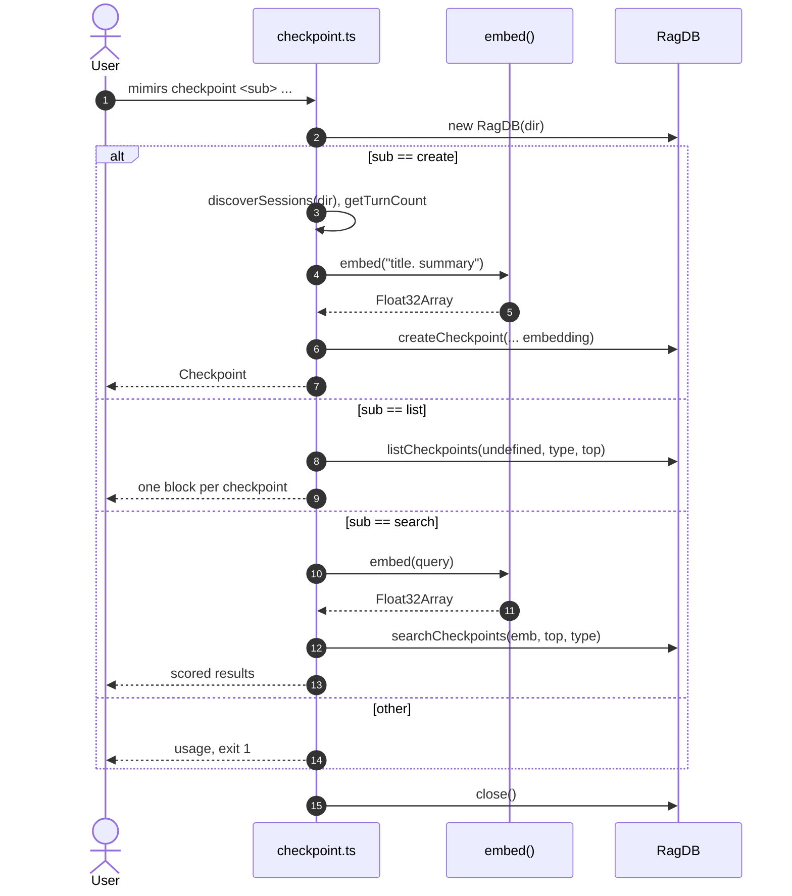

# CLI: checkpoint

`mimirs checkpoint` records and recalls short, durable notes about work done in a
project — what was changed, why, and which files were involved. Each checkpoint
is embedded so that later sessions can find it by meaning, not just exact words.
This is the terminal-side equivalent of the
[create_checkpoint](../tools/create-checkpoint.md),
[list_checkpoints](../tools/list-checkpoints.md), and
[search_checkpoints](../tools/search-checkpoints.md) MCP tools: same tables, same
storage and scoring, exposed for scripts and manual use.

The command is a dispatcher. It reads the subcommand from `args[1]`, resolves the
project directory from `--dir` (defaulting to `.`), opens the project's `RagDB`,
and branches on `create`, `list`, or `search`. Any other value prints usage and
exits with code `1`. The database is closed at the end
(`src/cli/commands/checkpoint.ts:7-86`).

## Subcommands

| subcommand | required args | optional flags | what it does |
|------------|---------------|----------------|--------------|
| `create` | `<type> <title> <summary>` | `--files`, `--tags`, `--dir` | Embeds title + summary and stores one checkpoint row (`src/cli/commands/checkpoint.ts:12-36`). |
| `list` | — | `--type`, `--top`, `--dir` | Enumerates stored checkpoints, newest first, optionally filtered by type (`src/cli/commands/checkpoint.ts:37-55`). |
| `search` | `<query>` | `--type`, `--top`, `--dir` | Embeds the query and returns the closest checkpoints by vector distance (`src/cli/commands/checkpoint.ts:56-79`). |

## Flow



1. The user runs the command; the directory is resolved and a `RagDB` opened
   (`src/cli/commands/checkpoint.ts:8-10`).
2. `create` validates that `type`, `title`, and `summary` are all present, else
   prints usage and exits `1` (`src/cli/commands/checkpoint.ts:13-19`).
3. To attach the checkpoint to a point in the session timeline, it finds the most
   recent session transcript and reads its stored turn count, using
   `turnCount - 1` (floored at `0`) as the turn index
   (`src/cli/commands/checkpoint.ts:26-29`).
4. It embeds the string `"<title>. <summary>"` and stores the row via
   `createCheckpoint`, printing the new id
   (`src/cli/commands/checkpoint.ts:31-36`).
5. `list` queries up to `--top` (default 20) checkpoints, optionally filtered by
   `--type`, and prints each one (`src/cli/commands/checkpoint.ts:38-54`).
6. `search` embeds the query and runs a vector-distance search over the stored
   checkpoint embeddings, printing each result with its score
   (`src/cli/commands/checkpoint.ts:63-78`).
7. Any unrecognized subcommand prints usage and exits `1`
   (`src/cli/commands/checkpoint.ts:80-82`).

## Inputs

| name | type | required | description |
|------|------|----------|-------------|
| subcommand | `create` \| `list` \| `search` | yes | `args[1]`; anything else prints usage, exits `1` (`src/cli/commands/checkpoint.ts:8`, `80-82`). |
| type | string | yes for `create` | Free-text category (`args[2]`), e.g. `decision`, `bugfix`. Not validated against an enum (`src/cli/commands/checkpoint.ts:13`). |
| title | string | yes for `create` | Short headline (`args[3]`); embedded with the summary (`src/cli/commands/checkpoint.ts:14`, `31`). |
| summary | string | yes for `create` | Body text (`args[4]`); embedded with the title (`src/cli/commands/checkpoint.ts:15`, `31`). |
| query | string | yes for `search` | Free-text query (`args[2]`); missing it prints usage, exits `1` (`src/cli/commands/checkpoint.ts:57-61`). |
| `--files` | comma list | no (`create`) | Split on `,` and trimmed into `filesInvolved`; defaults to `[]` (`src/cli/commands/checkpoint.ts:21-23`). |
| `--tags` | comma list | no (`create`) | Split on `,` and trimmed into `tags`; defaults to `[]` (`src/cli/commands/checkpoint.ts:22-24`). |
| `--type` | string | no (`list`, `search`) | Restricts results to checkpoints with that exact type (`src/cli/commands/checkpoint.ts:38`, `63`). |
| `--top` | integer | no | Result cap. Default `20` for `list`, `5` for `search` (`src/cli/commands/checkpoint.ts:39`, `64`). |
| `--dir` | path | no | Project directory; resolved, defaults to `.` (`src/cli/commands/checkpoint.ts:9`). |

## Outputs

| output | where it lands / shape / description |
|--------|--------------------------------------|
| created checkpoint row | A row in `conversation_checkpoints` plus an embedding in `vec_checkpoints`; stdout prints `Checkpoint #<id> created: [<type>] <title>` (`src/cli/commands/checkpoint.ts:36`, `src/db/checkpoints.ts:4-48`). |
| checkpoint listing | stdout: per checkpoint, `#<id> [<type>] <title> [tags]`, then timestamp + turn index, summary, and `Files:` line if any. Empty prints "No checkpoints found." (`src/cli/commands/checkpoint.ts:42-54`). |
| ranked results | stdout: per result, `<score> #<id> [<type>] <title>`, summary, and `Files:` line if any. Empty prints "No matching checkpoints found." (`src/cli/commands/checkpoint.ts:68-78`). |

## State changes

**A new checkpoint row and its embedding are persisted.**

- *Before*: no row for this checkpoint exists.
- *After*: `conversation_checkpoints` has a new row holding session id, turn
  index, timestamp, type, title, summary, JSON-encoded `files_involved` and
  `tags`; `vec_checkpoints` holds the title+summary embedding keyed by the new
  checkpoint id.
- *Why it matters*: this is the only way later `list`/`search` calls (CLI or the
  [search_checkpoints](../tools/search-checkpoints.md) tool) surface the note.
- *Code*: `createCheckpoint` runs both inserts inside one transaction and returns
  the new id. Note that the row's own `embedding` column is written as `null`;
  the usable embedding lives in the `vec_checkpoints` virtual table, which is what
  search queries (`src/db/checkpoints.ts:4-48`).

## Branches and failure cases

| branch | behavior |
|--------|----------|
| `create` missing type/title/summary | Prints usage, exits `1` (`src/cli/commands/checkpoint.ts:16-19`). |
| `create`, no session transcripts | `discoverSessions` returns empty, so `sessionId` falls back to the literal `"unknown"` and `turnIndex` is `0` (`src/cli/commands/checkpoint.ts:26-29`). |
| `create`, session never indexed | `getTurnCount` returns `0`, so `turnIndex` is `0` (`src/cli/commands/checkpoint.ts:28-29`). |
| `--files` / `--tags` absent | Default to empty arrays, stored as `"[]"` (`src/cli/commands/checkpoint.ts:23-24`). |
| `list`, none found | Prints "No checkpoints found." (`src/cli/commands/checkpoint.ts:42-43`). |
| `list` / `search` with `--type` | Filters to that exact type; `list` filters in SQL, `search` filters the candidate rows after the vector query (`src/db/checkpoints.ts:90-143`). |
| `search` missing query | Prints usage, exits `1` (`src/cli/commands/checkpoint.ts:58-61`). |
| `search`, no matches | Prints "No matching checkpoints found." (`src/cli/commands/checkpoint.ts:68-69`). |
| unknown subcommand | Prints usage, exits `1` (`src/cli/commands/checkpoint.ts:80-82`). |

## Type filtering and scoring details

`list` passes `--type` straight into the SQL `WHERE` clause via `listCheckpoints`
and orders newest-first. `search` over-fetches `topK * 2` candidates by vector
distance, then skips any whose `type` does not match the requested filter and
stops once `topK` survivors are collected; this means a tight `--type` filter can
return fewer than `--top` results. The printed score is `1 / (1 + distance)`, so
higher is closer (`src/db/checkpoints.ts:90-143`).

## Parity with the MCP tools

The CLI and the MCP tools call the same `RagDB` methods —
`createCheckpoint`, `listCheckpoints`, `searchCheckpoints` — so behavior is
shared. The differences are at the edges: the CLI takes positional args and comma
lists, formats text for a terminal, and derives `sessionId`/`turnIndex` from
discovered sessions; the tools accept structured arguments and return structured
results. See [create_checkpoint](../tools/create-checkpoint.md),
[list_checkpoints](../tools/list-checkpoints.md), and
[search_checkpoints](../tools/search-checkpoints.md).

## Example

```bash
# Record a decision touching two files
bun run mimirs checkpoint create decision \
  "switch embeddings to local model" \
  "moved off the hosted embedder to cut latency; updated config defaults" \
  --files src/embeddings/embed.ts,src/config/index.ts \
  --tags embeddings,perf

# List the last 10 bugfix checkpoints
bun run mimirs checkpoint list --type bugfix --top 10

# Find checkpoints about embeddings
bun run mimirs checkpoint search "why we changed the embedder" --top 5
```

Illustrative `search` output:

```
0.7421  #7 [decision] switch embeddings to local model
  moved off the hosted embedder to cut latency; updated config defaults
  Files: src/embeddings/embed.ts, src/config/index.ts
```

## Key source files

- `src/cli/commands/checkpoint.ts` — subcommand dispatch, arg parsing, session
  resolution, output formatting.
- `src/db/checkpoints.ts` — `createCheckpoint`, `listCheckpoints`,
  `searchCheckpoints`, and row/embedding storage.
- `src/embeddings/embed.ts` — `embed`, which turns title+summary or the query
  into the vector used for storage and search.
- `src/conversation/parser.ts` — `discoverSessions`, used to attach a checkpoint
  to the most recent session.
