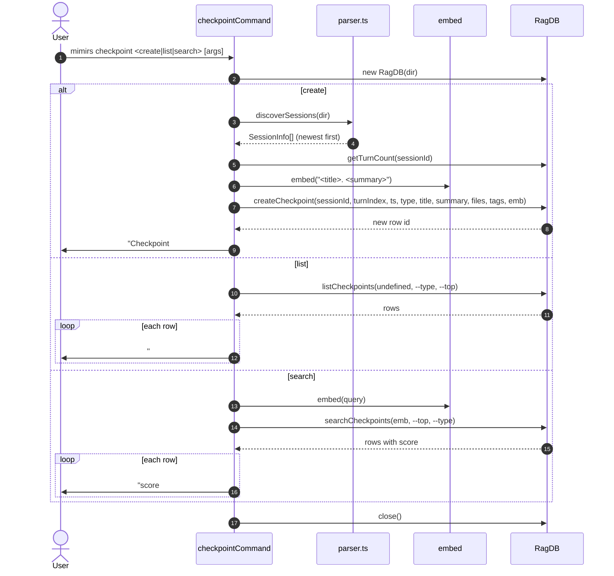

# CLI: checkpoint

`mimirs checkpoint` is the CLI mirror of the checkpoint MCP tools.
Subcommands: `create` saves a new checkpoint row (a typed note with
title, summary, optional file list and tags), `list` enumerates
stored checkpoints filtered by type, and `search` runs vector
similarity over the title+summary embedding. The CLI shares the same
schema and storage as the `create_checkpoint`, `list_checkpoints`,
and `search_checkpoints` MCP tools, so anything created here is
visible from agents and vice versa.

Use it from the terminal when you want to write a checkpoint without
going through Claude Code, or to grep what has accumulated.

## Flow



1. The user runs `mimirs checkpoint <sub> [args]`. The CLI reads
   `args[1]` to pick a branch. Directory is taken from `--dir` or
   defaults to `.` (`src/cli/commands/checkpoint.ts:9-10`).
2. `RagDB` opens the project DB at the top of the handler. Every
   branch closes it at the end.
3. **`create`** requires the next three positional arguments:
   `type`, `title`, and `summary`. Any missing argument prints the
   usage string with `--files` and `--tags` hints and exits with code
   1 (`src/cli/commands/checkpoint.ts:13-19`).
4. `--files` and `--tags` are comma-separated strings, split with
   `String.split(",").map(trim)`. They are stored as arrays on the
   row (`src/cli/commands/checkpoint.ts:21-24`).
5. The session/turn link is best-effort: the CLI calls
   `discoverSessions(dir)` and uses the newest session id (or the
   string literal `"unknown"` if none exists). It then asks the DB
   for that session's `turnCount` and stores `turnIndex = max(0,
   turnCount - 1)` — i.e. the index of the most recent turn the DB
   currently knows about (`src/cli/commands/checkpoint.ts:26-29`).
6. The embedding is computed once over `"<title>. <summary>"` and
   passed to `db.createCheckpoint`. The DB call returns the new row
   id, which is printed back to the user
   (`src/cli/commands/checkpoint.ts:31-36`).
7. **`list`** calls `db.listCheckpoints(undefined, type, top)` — the
   first argument is `sessionId`, deliberately left undefined so the
   listing spans the whole project, not just the latest session
   (`src/cli/commands/checkpoint.ts:38-40`). Default `--top` is 20.
8. Each listed checkpoint is printed as a four-line block: header
   with id, type, title, and tags; timestamp and `turn N` line;
   summary; and an optional `Files: ...` line when
   `filesInvolved` is non-empty (`src/cli/commands/checkpoint.ts:45-54`).
9. **`search`** requires the query as `args[2]`. Missing query prints
   usage and exits 1. Default `--top` is 5
   (`src/cli/commands/checkpoint.ts:56-64`).
10. The query is embedded and passed to
    `db.searchCheckpoints(emb, top, type)`. Each result is printed as
    a three-line block: `<score>  #id [type] title`, the summary, and
    the optional files line. Score is rendered with four decimals
    (`src/cli/commands/checkpoint.ts:65-78`).

## Inputs

| Input | Subcommand | Source | Notes |
| --- | --- | --- | --- |
| `create\|list\|search` | all | `args[1]` | Required. Anything else triggers the usage error and exit 1 (`src/cli/commands/checkpoint.ts:80-83`). |
| `type` | create | `args[2]` | Required. A free-form string (for example `task-done`, `decision`, `bug`). Also accepted by `--type` on `list` and `search` as a filter. |
| `title` | create | `args[3]` | Required. Used in the embedding and rendered first in lists. |
| `summary` | create | `args[4]` | Required. Concatenated with the title for the embedding text and shown verbatim in list/search output. |
| `--files f1,f2` | create | flag | Optional. Comma-separated paths. Stored as an array on the row. |
| `--tags t1,t2` | create | flag | Optional. Comma-separated labels. Stored as an array on the row. |
| `--type T` | list, search | flag | Optional. Filter rows to one checkpoint type. |
| `--top N` | list, search | flag | Optional. Defaults to 20 for `list`, 5 for `search`. |
| `query` | search | `args[2]` | Required for `search`. Embedded and matched against the row embeddings. |
| `--dir D` | all | flag | Optional. Project directory. Defaults to `.`. |

## Outputs

| Output | What happens |
| --- | --- |
| Created checkpoint row | `create` writes a row to the `checkpoints` table with the embedding and prints `Checkpoint #<id> created: [<type>] <title>` (`src/cli/commands/checkpoint.ts:36`). |
| Listing | `list` prints a four-line block per row (header, timestamp+turn, summary, optional files). Empty result prints `"No checkpoints found."`. |
| Ranked search results | `search` prints a three-line block per row including the similarity score. Empty result prints `"No matching checkpoints found."`. |

## State changes

### `checkpoints` row

- Before: no row for this checkpoint.
- After: a new row exists carrying `sessionId`, `turnIndex`,
  `timestamp`, `type`, `title`, `summary`, `filesInvolved`, `tags`,
  and the title+summary embedding. The row id is returned and
  printed.
- Trigger: `mimirs checkpoint create <type> <title> <summary>`.
- Why it matters: `list_checkpoints`, `search_checkpoints`, and this
  CLI's `list`/`search` branches all read this row. It is the same
  storage used by the agent-facing `create_checkpoint` tool, so
  there is one source of truth.
- Code: `db.createCheckpoint` in `src/db/index.ts:748-756`; the CLI
  call site is `src/cli/commands/checkpoint.ts:31-35`.

The CLI does not have an update or delete branch. Checkpoints, once
created, live until the DB is wiped. Filtering by type is the
preferred way to keep listings manageable.

## Branches and failure cases

- **Unknown or missing subcommand**: prints
  `"Usage: mimirs checkpoint <create|list|search>"` and exits 1
  (`src/cli/commands/checkpoint.ts:80-83`).
- **`create` with missing positional args**: prints the long usage
  with `--files` and `--tags` hints, exits 1
  (`src/cli/commands/checkpoint.ts:16-19`).
- **`search` with missing query**: prints
  `"Usage: mimirs checkpoint search <query> ..."`, exits 1
  (`src/cli/commands/checkpoint.ts:58-61`).
- **No sessions discovered when creating**: `sessionId` falls back to
  the literal string `"unknown"` and `turnIndex` to `0`. The row is
  still created; the link to a real conversation turn is just not
  recorded (`src/cli/commands/checkpoint.ts:27-29`).
- **Empty result sets**: `list` prints `"No checkpoints found."`;
  `search` prints `"No matching checkpoints found."`. Both exit 0.
- **Type filter that matches nothing**: hits the same empty-result
  paths above — there is no special "no rows match this type"
  message.

## Filtering by type

`type` is a free-form string. The schema does not validate it, so
projects typically pick a small vocabulary and stick to it (for
example: `task-done`, `decision`, `bug`, `note`). The CLI passes
`--type` straight into `db.listCheckpoints` and
`db.searchCheckpoints` as the third argument; both functions accept
an optional type filter applied in SQL. Mistyped values produce
empty results silently.

## Parity with the MCP tools

| CLI subcommand | MCP tool | Notes |
| --- | --- | --- |
| `checkpoint create` | `create_checkpoint` | Same `db.createCheckpoint` call, same embedding strategy (title + ". " + summary). The MCP tool runs inside an active session and therefore knows the real `sessionId` and `turnIndex` for free; the CLI infers them from the newest discovered session. |
| `checkpoint list` | `list_checkpoints` | Same `db.listCheckpoints` call. Both accept a type filter and a top-N cap. |
| `checkpoint search` | `search_checkpoints` | Same `db.searchCheckpoints` call after embedding the query. The CLI prints a four-decimal score; the MCP tool returns the score as a number for the agent. |

Anything created from either surface is visible to the other.

## Example

```
mimirs checkpoint create decision \
  "Hybrid weight set to 0.7" \
  "Benchmarks favored 0.7 vector / 0.3 text on this corpus." \
  --files src/search/hybrid.ts,src/config/index.ts \
  --tags search,tuning
# → Checkpoint #42 created: [decision] Hybrid weight set to 0.7

mimirs checkpoint list --type decision --top 5
# → #42 [decision] Hybrid weight set to 0.7 [search, tuning]
#     2026-04-22T11:00:00.000Z (turn 17)
#     Benchmarks favored 0.7 vector / 0.3 text on this corpus.
#     Files: src/search/hybrid.ts, src/config/index.ts

mimirs checkpoint search "hybrid weight benchmark" --top 3
# → 0.8123  #42 [decision] Hybrid weight set to 0.7
#     Benchmarks favored 0.7 vector / 0.3 text on this corpus.
#     Files: src/search/hybrid.ts, src/config/index.ts
```

## Key source files

- `src/cli/commands/checkpoint.ts` — CLI entrypoint with three
  branches.
- `src/embeddings/embed.ts` — `embed` for both `create` and `search`.
- `src/db/index.ts` — `RagDB.createCheckpoint`,
  `RagDB.listCheckpoints`, `RagDB.searchCheckpoints`,
  `RagDB.getTurnCount`.
- `src/conversation/parser.ts` — `discoverSessions` for the
  best-effort session/turn link on `create`.

## Related flows

- [tools/create-checkpoint](../tools/create-checkpoint.md) — MCP tool
  that writes the same row from inside an active session.
- [tools/list-checkpoints](../tools/list-checkpoints.md) — MCP tool
  reading the same rows.
- [tools/search-checkpoints](../tools/search-checkpoints.md) — MCP
  tool running the same vector query.
