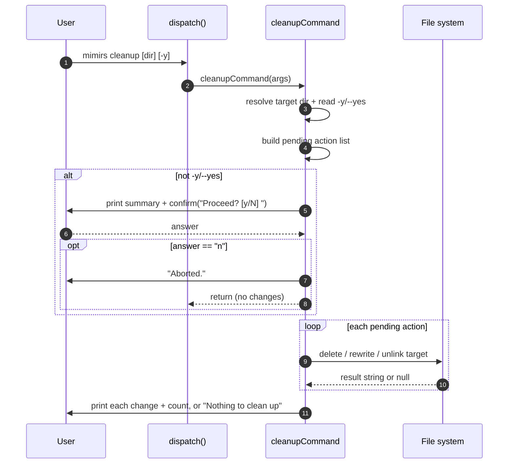

# CLI: cleanup

`mimirs cleanup [dir] [-y]` undoes everything [`mimirs init`](./init.md) added to a project. It deletes the local index, removes the `mimirs` server entry from every MCP config it knows about, strips the mimirs instruction block from agent files, and removes the `.mimirs/` line from `.gitignore`. It is the "uninstall from this project" command — useful when you stop using mimirs, when you want a clean checkout, or when an `init` went into the wrong directory.

The command is intentionally surgical. It does not wipe whole config files blindly; it edits each file to remove only the mimirs pieces, and only deletes a file outright when nothing of yours would be left behind.

## What runs

`cleanup` is one of the static command cases in the CLI dispatcher. When the first CLI argument is `cleanup`, `dispatch()` calls `cleanupCommand(args)` with the full argument array `process.argv.slice(2)` (`src/cli/index.ts:163`). All the real work lives in `cleanupCommand` (`src/cli/commands/cleanup.ts:113`).

The handler builds a list of pending removal actions, optionally asks the user to confirm, then runs each action in order and prints what it actually changed.



1. The user runs `mimirs cleanup`, optionally with a directory and the `-y`/`--yes` flag.
2. `dispatch()` matches the `cleanup` case and calls `cleanupCommand(args)` (`src/cli/index.ts:163-164`).
3. The handler resolves the target directory and decides whether confirmation is suppressed. The directory is `args[1]` when it is present and does not start with `--`, otherwise the current directory; `autoYes` is true when `args` contains `--yes` or `-y` (`src/cli/commands/cleanup.ts:114-115`).
4. It assembles a list of zero-argument async functions, one per thing that might need removing. Nothing is deleted yet at this stage — the list is just closures that will run later (`src/cli/commands/cleanup.ts:118-142`).
5. Unless `autoYes` is set, it prints a plain-language summary of what will be removed and calls `confirm("Proceed? [y/N] ")` (`src/cli/commands/cleanup.ts:144-151`).
6. The user answers. The prompt is treated as "proceed unless you explicitly say no" — see Branches and failure cases below.
7. If the user said no, it prints `Aborted.` and returns without touching anything (`src/cli/commands/cleanup.ts:152-155`).
8. Otherwise it runs each pending action in order. Each returns either a short description of what it changed, or `null` when there was nothing to do (`src/cli/commands/cleanup.ts:159-162`).
9. Finally it prints one line per change followed by a count, or `Nothing to clean up — no mimirs files found.` when every action returned `null` (`src/cli/commands/cleanup.ts:164-169`).

## The pending action list

The order of the pending list is fixed, and it covers exactly the surfaces that [`init`](./init.md) writes to.

**The index directory.** If `<dir>/.mimirs` exists, the first action recursively removes it with `rm(ragDir, { recursive: true, force: true })`. This is the SQLite index database and the `config.json` (`src/cli/commands/cleanup.ts:121-126`). The existence check happens while building the list, so a `.mimirs/` that appears between list-building and execution would be skipped, but in normal single-process use this is not a concern.

**MCP config entries.** Four removal actions target the JSON files where an MCP client registers the `mimirs` server: the project `.mcp.json`, `.cursor/mcp.json`, and two Windsurf locations under the home directory — `~/.codeium/windsurf/mcp_config.json` and `~/.codeium/mcp_config.json` (`src/cli/commands/cleanup.ts:130-133`). Each goes through `removeMcpEntry`, which parses the file, deletes the `mcpServers.mimirs` key, and only rewrites the file with the remaining servers. If removing mimirs leaves `mcpServers` empty and there are no other top-level keys, it deletes the whole file; if `mcpServers` is empty but other keys exist, it drops just the `mcpServers` key (`src/cli/commands/cleanup.ts:53-77`). A file that is missing, unparseable, or has no `mimirs` entry is left untouched and the action returns `null`.

**Agent instruction files.** Four more actions remove the per-agent instructions:

| File | How it is cleaned | Helper |
| --- | --- | --- |
| `CLAUDE.md` | Removes the mimirs block, deletes file if nothing else remains | `removeInstructionsBlock` |
| `.cursor/rules/mimirs.mdc` | Deletes the whole file (mimirs owns it) | `removeOwnedFile` |
| `.windsurf/rules/mimirs.md` | Deletes the whole file (mimirs owns it) | `removeOwnedFile` |
| `.github/copilot-instructions.md` | Removes the mimirs block, deletes file if nothing else remains | `removeInstructionsBlock` |

`removeInstructionsBlock` is the careful one. It finds the start of the block at the `<!-- mimirs -->` marker, or the `## Using mimirs tools` heading if the marker is absent, walks backward over blank lines, and finds the end at the next top-level (`#` or `##`) heading or end of file. It rewrites the file with the block removed and collapsed blank lines; if the result is empty it deletes the file instead (`src/cli/commands/cleanup.ts:15-47`). `removeOwnedFile` simply unlinks the file because mimirs created the entire file (`src/cli/commands/cleanup.ts:83-87`).

**The `.gitignore` line.** The last action filters `.gitignore` line by line, dropping `.mimirs/`, `.mimirs`, and the `# mimirs index` comment that `init` writes. If the filtered content is identical to the original it returns `null` (nothing to do); if filtering empties the file it deletes `.gitignore`; otherwise it rewrites it (`src/cli/commands/cleanup.ts:92-110`).

## Inputs

| Name | Type | Required | Description |
| --- | --- | --- | --- |
| `[dir]` | positional string | no | Project directory to clean. Taken from `args[1]` when present and not starting with `--`; otherwise the current working directory. Resolved to an absolute path with `resolve()` (`src/cli/commands/cleanup.ts:114`). |
| `-y` / `--yes` | flag | no | Skips the confirmation prompt. Detected by scanning `args` for either token (`src/cli/commands/cleanup.ts:115`). |

## Outputs

| Output | Where it lands / shape / description |
| --- | --- |
| Deleted `.mimirs/` directory | The index database and config are recursively removed from disk (`src/cli/commands/cleanup.ts:124`). |
| Edited or deleted MCP configs | The `mimirs` server entry is removed from each known MCP JSON file; empty files are deleted (`src/cli/commands/cleanup.ts:63-75`). |
| Edited or deleted agent files | mimirs instruction blocks are stripped from `CLAUDE.md` and `copilot-instructions.md`; mimirs-owned rule files are deleted (`src/cli/commands/cleanup.ts:42-46`, `:85`). |
| Edited or deleted `.gitignore` | The `.mimirs/` lines and the `# mimirs index` comment are removed (`src/cli/commands/cleanup.ts:109`). |
| Console summary | Each change prints as an indented line to stdout, followed by `Cleaned up N item(s).`, or `Nothing to clean up — no mimirs files found.` when nothing matched (`src/cli/commands/cleanup.ts:164-168`). |

## State changes

| Change | Before | After | What does it |
| --- | --- | --- | --- |
| Local index | `.mimirs/` present | removed | `rm(ragDir, { recursive: true, force: true })` (`src/cli/commands/cleanup.ts:124`) |
| MCP registration | `mcpServers.mimirs` present in config JSON | key removed; file deleted if nothing else remains | `removeMcpEntry` (`src/cli/commands/cleanup.ts:63-75`) |
| Agent instructions | mimirs block / file present | block stripped or file deleted | `removeInstructionsBlock`, `removeOwnedFile` (`src/cli/commands/cleanup.ts:40-46`, `:85`) |
| Git ignore rules | `.mimirs/` listed in `.gitignore` | line removed; file deleted if it becomes empty | `removeGitignoreEntry` (`src/cli/commands/cleanup.ts:105-109`) |

These changes matter because they make `init` reversible. After `cleanup` a checkout has no trace that mimirs was ever installed: no index, no MCP wiring, no agent instructions, and no ignore rule. Re-running `init` afterward starts from a clean slate.

## Branches and failure cases

- **Confirmation is "proceed unless 'n'".** The prompt reads `Proceed? [y/N] `, but `confirm` returns `false` only when the trimmed, lower-cased answer is exactly `"n"`; every other answer — including pressing Enter — proceeds (`src/cli/setup.ts:314-322`). Despite the `[y/N]` styling suggesting No is the default, an empty answer deletes. Use `-y`/`--yes` when you actually want non-interactive behavior, and answer `n` to abort.
- **`-y` as the only argument is misread as a directory.** The directory check rejects only arguments starting with `--`, so `mimirs cleanup -y` puts `-y` into `args[1]`, fails the `--` check, and resolves `-y` as the target directory — pointing cleanup at a `-y` subfolder of the cwd rather than the project. The `--yes` long form is still detected as the flag, so it both skips the prompt and is not mistaken for a directory. To skip the prompt for the current directory, prefer `mimirs cleanup . -y` or `mimirs cleanup --yes` (`src/cli/commands/cleanup.ts:114-115`).
- **Nothing to clean up.** If every action returns `null` — no `.mimirs/`, no MCP entries, no instruction blocks, no `.gitignore` line — the command prints `Nothing to clean up — no mimirs files found.` and changes nothing (`src/cli/commands/cleanup.ts:164-165`).
- **Missing files are skipped silently.** Every helper guards with `existsSync` (or a JSON parse) and returns `null` when its target is absent or irrelevant, so cleanup never errors on a partially-installed project (`src/cli/commands/cleanup.ts:16`, `:54`, `:84`, `:94`).
- **Unparseable MCP JSON is left alone.** `removeMcpEntry` wraps `JSON.parse` in a `try/catch` and returns `null` on failure, so a hand-corrupted config is not rewritten or deleted (`src/cli/commands/cleanup.ts:56-60`).
- **No "mimirs" entry means no edit.** `removeMcpEntry` returns early when `mcpServers.mimirs` is absent, leaving other people's servers and the file untouched (`src/cli/commands/cleanup.ts:61`).
- **Shared configs in the home directory.** The two Windsurf paths live under `~/.codeium`, not the project. Cleaning one project removes the global `mimirs` Windsurf registration; if multiple projects relied on it, they lose it too (`src/cli/commands/cleanup.ts:132-133`).
- **Aborted run.** Answering `n` prints `Aborted.` and returns before any action runs, so the pending list never executes (`src/cli/commands/cleanup.ts:152-155`).

## Example

Clean the current project interactively:

```
$ mimirs cleanup
This will remove all mimirs files from this project:

  - .mimirs/ directory (index database & config)
  - mimirs entries from MCP configs (.mcp.json, .cursor/mcp.json, windsurf)
  - Agent instructions (CLAUDE.md block, .cursor/rules/mimirs.mdc, etc.)
  - .mimirs/ entry from .gitignore

Proceed? [y/N] y
  Deleted .mimirs/ directory
  Removed mimirs from .mcp.json
  Removed mimirs block from CLAUDE.md
  Removed .mimirs/ from .gitignore

Cleaned up 4 item(s).
```

Clean a specific directory without prompting:

```
$ mimirs cleanup ./my-project --yes
```

The summary text and result lines above match the literal strings the command prints (`src/cli/commands/cleanup.ts:145-168`); which lines appear depends on what was actually installed.

## Key source files

| File | Role |
| --- | --- |
| `src/cli/index.ts` | CLI dispatcher; routes the `cleanup` command to its handler (`:163-164`). |
| `src/cli/commands/cleanup.ts` | The command itself plus all removal helpers (`removeInstructionsBlock`, `removeMcpEntry`, `removeOwnedFile`, `removeGitignoreEntry`, `cleanupCommand`). |
| `src/cli/setup.ts` | Home of `confirm`, the prompt helper, and the `init` writers whose effects this command reverses. |
| `src/utils/log.ts` | `cli.log` / `cli.error` — the stdout/stderr console wrappers used for all output. |
