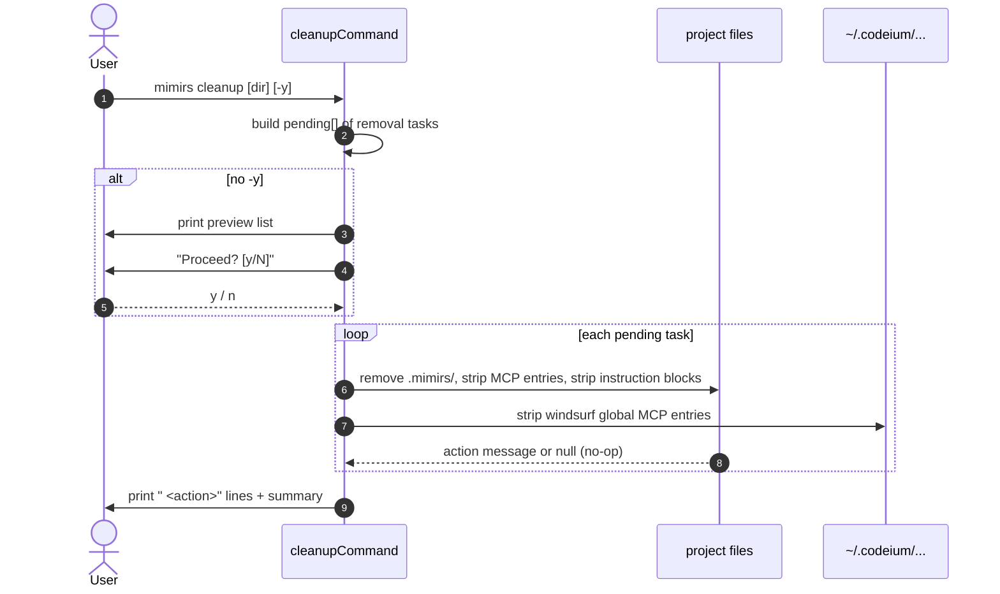

# CLI: cleanup

`mimirs cleanup` is the inverse of [`mimirs init`](init.md). It deletes the local index database, removes the mimirs entry from every IDE MCP config it knows about, and strips the "Using mimirs tools" block from agent instruction files. After it finishes, the project looks (mostly) like mimirs was never installed.

Run it when you want to uninstall mimirs from a project, or when you want a hard reset before reinitialising.

## Flow



1. The CLI resolves the directory argument (default `.`) and reads the `-y`/`--yes` flag (`src/cli/commands/cleanup.ts:113-115`).
2. It builds a `pending` array of zero-arg async functions, one per removable artifact. Each function returns the action description string, or `null` if there was nothing to do (`src/cli/commands/cleanup.ts:118-142`). Building the list eagerly lets the preview show exactly what *might* happen.
3. Unless `-y` was passed, cleanup prints a four-line summary of what it will touch and calls `confirm("Proceed? [y/N] ")`. Note the default is **N** here, the opposite of `init`'s "Index project now? [Y/n]" — `confirm` returns true only when the answer is not "n" (case-insensitive), so the user must explicitly type `y` (`src/cli/commands/cleanup.ts:144-156`, `src/cli/setup.ts:314-322`).
4. Each pending task runs in order. Successful ones return a string; ones that find nothing to do return `null` and are dropped.
5. If no actions ran, cleanup prints `"Nothing to clean up — no mimirs files found."` Otherwise it prints each action line indented by two spaces and a final count: `"Cleaned up N item(s)."` (`src/cli/commands/cleanup.ts:164-169`).

## Inputs

| Input | Source | Notes |
| --- | --- | --- |
| `directory` | first positional arg | Defaults to `.` (`src/cli/commands/cleanup.ts:114`). |
| `-y` / `--yes` | bool flag | Skips the confirmation prompt. The prompt itself defaults to **No**, unlike `init`. |

## Outputs

| Output | Where | Notes |
| --- | --- | --- |
| Action log | stdout | One indented line per actual removal, then a summary. |
| Empty-result message | stdout | `"Nothing to clean up — no mimirs files found."` when no artifacts existed. |
| Filesystem changes | project + `~/.codeium` | See state changes below. |

## State changes

Cleanup performs four kinds of removals, each idempotent and safe to re-run.

### `.mimirs/` data directory

Before: `.mimirs/config.json`, `rag.db`, `status`, possibly `server-error.log`.

After: directory deleted recursively via `rm(ragDir, { recursive: true, force: true })`. The check uses `existsSync` so the task is only queued when the directory exists (`src/cli/commands/cleanup.ts:121-127`).

### MCP server entry in IDE config files

`removeMcpEntry` is called for:

- `<dir>/.mcp.json` — Claude Code project config.
- `<dir>/.cursor/mcp.json` — Cursor.
- `~/.codeium/windsurf/mcp_config.json` — standalone Windsurf.
- `~/.codeium/mcp_config.json` — Windsurf plugin (JetBrains).

For each file: read JSON, delete the `mimirs` key from `mcpServers`. If `mcpServers` becomes empty and was the *only* top-level key, the whole file is unlinked; otherwise the (now possibly empty) `mcpServers` is removed and the file is rewritten (`src/cli/commands/cleanup.ts:53-77`). Invalid JSON returns `null` — cleanup leaves it alone rather than corrupting it.

### Agent instruction blocks

Two helpers handle the two formats:

- `removeInstructionsBlock` works on plain markdown files (`CLAUDE.md`, `.github/copilot-instructions.md`). It finds either the `<!-- mimirs -->` marker or the `## Using mimirs tools` heading, scans back over preceding blank lines, then forward until the next `#` or `##` heading or EOF, and removes that range. If the file is empty after the removal it is unlinked entirely (`src/cli/commands/cleanup.ts:15-47`).
- `removeOwnedFile` is used for `.cursor/rules/mimirs.mdc` and `.windsurf/rules/mimirs.md` — files mimirs created in full and therefore deletes in full (`src/cli/commands/cleanup.ts:83-87`).

The marker constants match what `init` writes (`<!-- mimirs -->` and the `## Using mimirs tools` heading) (`src/cli/commands/cleanup.ts:8-9`, `src/cli/setup.ts:8-10`).

### `.gitignore` entry

`removeGitignoreEntry` reads `.gitignore`, filters out the `.mimirs/` (or `.mimirs`) line and the `# mimirs index` header comment, then writes the result back. If the file becomes empty it is deleted; if nothing actually changed the helper returns `null` (`src/cli/commands/cleanup.ts:92-111`).

## Branches and failure cases

- **User declines.** `confirm` returns false; cleanup prints `"Aborted."` and returns without touching anything (`src/cli/commands/cleanup.ts:152-155`).
- **Already clean.** Every task returns `null`; the empty-result message prints.
- **Partial setup.** Tasks for missing files are no-ops by design — running cleanup on a partial install works without errors.
- **Corrupt MCP JSON.** A parse failure on a `*mcp*.json` file makes that one task return `null`. The user sees no removal for that file; the file is left as-is.
- **Globally-shared windsurf configs.** The Codeium MCP configs under `~/.codeium/` are *user-global*. If the user has mimirs configured for multiple projects through windsurf, this command removes the single `mimirs` server entry from those globals (it does not scope per project). That's appropriate because the entry itself isn't per-project — only `RAG_PROJECT_DIR` inside it is. Re-running `mimirs init` from another project will re-add it.

## Example

```bash
# Preview + confirm
mimirs cleanup
# This will remove all mimirs files from this project:
#
#   - .mimirs/ directory (index database & config)
#   - mimirs entries from MCP configs (.mcp.json, .cursor/mcp.json, windsurf)
#   - Agent instructions (CLAUDE.md block, .cursor/rules/mimirs.mdc, etc.)
#   - .mimirs/ entry from .gitignore
#
# Proceed? [y/N] y
#   Deleted .mimirs/ directory
#   Removed mimirs from /path/.mcp.json
#   Removed mimirs block from /path/CLAUDE.md
#   Removed .mimirs/ from .gitignore
#
# Cleaned up 4 item(s).

# Non-interactive
mimirs cleanup -y
```

## Key source files

- `src/cli/commands/cleanup.ts` — full removal logic; one file, all helpers inline.
- `src/cli/setup.ts` — `confirm` (shared with `init`), and the markers/blocks that cleanup mirrors.

## Related flows

- [CLI: init](init.md) — what cleanup undoes. Every artifact removed here is one `init` writes.
