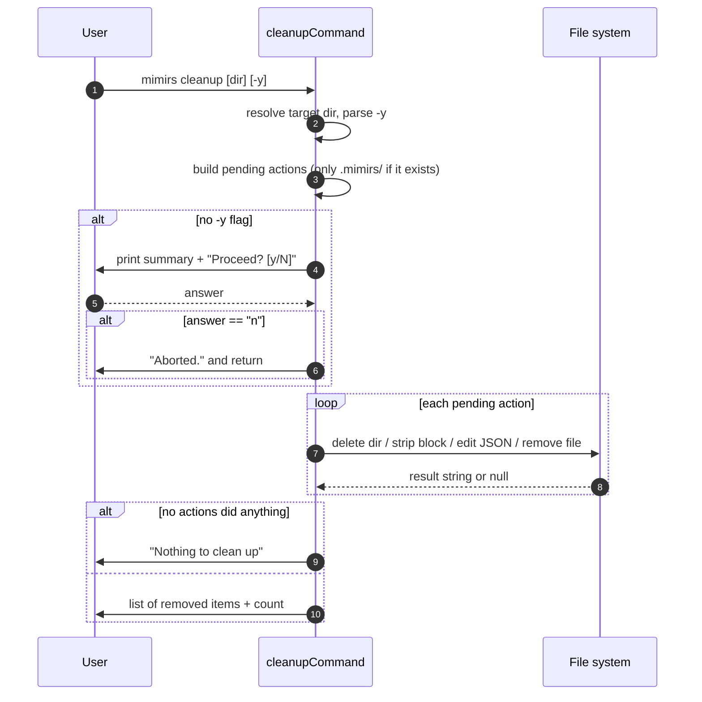

# CLI: cleanup

`mimirs cleanup` is the inverse of `mimirs init` ([cli/init](./init.md)). It removes every artifact that mimirs writes into a project: the on-disk index database, the instruction block injected into agent files, the MCP server registration in IDE configs, owned rule files, and the `.gitignore` entry. Use it when you want to fully uninstall mimirs from a project, or reset it before re-running setup.

The command never touches your source code. It only undoes what setup added.

## How it works

The command builds a list of pending removal actions, prints a summary, asks for confirmation (unless `-y` is passed), then runs each action in order and reports what changed. Each action is a function that returns a human-readable string when it did something, or `null` when there was nothing to remove. Actions that find nothing simply contribute no line to the final report (`src/cli/commands/cleanup.ts:158-169`).



1. The user runs `mimirs cleanup`, optionally with a target directory and `-y`. The first positional argument is the directory; if it is missing or starts with `--`, the current directory `.` is used (`src/cli/commands/cleanup.ts:114`).
2. The directory is resolved to an absolute path and `--yes`/`-y` is detected anywhere in the arguments (`src/cli/commands/cleanup.ts:114-115`).
3. The command assembles the `pending` action list. The `.mimirs/` directory removal is only added if that directory exists; the MCP, agent-file, owned-file, and `.gitignore` actions are always queued, and each decides at run time whether there is anything to remove (`src/cli/commands/cleanup.ts:118-142`).
4. Without `-y`, the command prints a plain-text summary of what it would remove and asks `Proceed? [y/N]` (`src/cli/commands/cleanup.ts:144-151`).
5. The prompt is answered. The confirmation helper treats any answer other than a literal `n` as yes — including a bare Enter — so the displayed `N` default is misleading: pressing Enter proceeds (`src/cli/setup.ts`).
6. If the answer is exactly `n`, the command prints `Aborted.` and returns without changing anything (`src/cli/commands/cleanup.ts:152-155`).
7. Each pending action runs in sequence; non-null results are collected into `actions` (`src/cli/commands/cleanup.ts:159-162`).
8. If nothing was removed, it prints `Nothing to clean up — no mimirs files found.` (`src/cli/commands/cleanup.ts:164-165`).
9. Otherwise it prints each removed item indented, then a `Cleaned up N item(s).` summary (`src/cli/commands/cleanup.ts:166-169`).

## Inputs

| name | type | required | description |
| --- | --- | --- | --- |
| directory | positional string | no | Project directory to clean. Taken from the first positional argument when present and not starting with `--`; otherwise defaults to the current directory `.`. Resolved to an absolute path (`src/cli/commands/cleanup.ts:114`). |
| `-y` / `--yes` | flag | no | Skips the confirmation prompt and proceeds immediately. Detected anywhere in the arguments (`src/cli/commands/cleanup.ts:115`). |

## Outputs

| output | where it lands / shape / description |
| --- | --- |
| Removal report | Printed to stdout via the CLI logger. One indented line per item actually removed, followed by `Cleaned up N item(s).` (`src/cli/commands/cleanup.ts:167-168`). |
| Empty-result message | `Nothing to clean up — no mimirs files found.` when no action removed anything (`src/cli/commands/cleanup.ts:165`). |
| Abort message | `Aborted.` printed when the user declines the prompt (`src/cli/commands/cleanup.ts:153`). |
| Deleted `.mimirs/` directory | The index database and config directory removed recursively from the target project (`src/cli/commands/cleanup.ts:124`). |
| Edited or deleted config / agent files | MCP JSON configs, agent markdown files, owned rule files, and `.gitignore` are edited in place or deleted — see State changes. |

## What gets removed

The command targets a fixed set of locations. Some are inside the project directory; the Windsurf and Codeium MCP configs live under the user's home directory.

| Target | Path | Action |
| --- | --- | --- |
| Index database & config | `<dir>/.mimirs/` | Recursive delete if present (`src/cli/commands/cleanup.ts:121-127`) |
| Project MCP config | `<dir>/.mcp.json` | Remove `mimirs` server entry (`src/cli/commands/cleanup.ts:130`) |
| Cursor MCP config | `<dir>/.cursor/mcp.json` | Remove `mimirs` server entry (`src/cli/commands/cleanup.ts:131`) |
| Windsurf MCP config | `~/.codeium/windsurf/mcp_config.json` | Remove `mimirs` server entry (`src/cli/commands/cleanup.ts:132`) |
| Codeium MCP config | `~/.codeium/mcp_config.json` | Remove `mimirs` server entry (`src/cli/commands/cleanup.ts:133`) |
| Claude agent file | `<dir>/CLAUDE.md` | Strip the mimirs instructions block (`src/cli/commands/cleanup.ts:136`) |
| Cursor rule file | `<dir>/.cursor/rules/mimirs.mdc` | Delete (mimirs-owned file) (`src/cli/commands/cleanup.ts:137`) |
| Windsurf rule file | `<dir>/.windsurf/rules/mimirs.md` | Delete (mimirs-owned file) (`src/cli/commands/cleanup.ts:138`) |
| Copilot instructions | `<dir>/.github/copilot-instructions.md` | Strip the mimirs instructions block (`src/cli/commands/cleanup.ts:139`) |
| Git ignore entry | `<dir>/.gitignore` | Remove the `.mimirs/` line (`src/cli/commands/cleanup.ts:142`) |

## State changes

All state changes are file-system writes inside the target directory (plus the two home-directory MCP configs). There is no database transaction — the `.mimirs/` directory containing the database is simply deleted whole.

### `.mimirs/` data directory

- **Before:** project contains a `.mimirs/` directory holding the index database and configuration.
- **After:** directory is gone.
- This is the bulk of mimirs' on-disk state. It is removed with a recursive, forced delete, and the action is only queued when the directory actually exists (`src/cli/commands/cleanup.ts:122-126`).

### Instructions block in agent markdown files

- **Before:** `CLAUDE.md` (or `.github/copilot-instructions.md`) contains a `## Using mimirs tools` section, optionally fenced by a `<!-- mimirs -->` marker.
- **After:** that block is removed; if the file is now empty it is deleted entirely.
- The helper locates the block start at the `<!-- mimirs -->` marker, falling back to the `## Using mimirs tools` heading when no marker is present. It walks backward over leading blank lines, then finds the block end at the next top-level (`#` or `##`) heading or end of file. Triple blank lines are collapsed. If the remaining content is whitespace-only, the file is deleted and the report says it "was only mimirs content"; otherwise the trimmed content is rewritten (`src/cli/commands/cleanup.ts:15-47`).

### MCP server entry in IDE configs

- **Before:** an MCP JSON config has a `mcpServers.mimirs` entry.
- **After:** that key is removed.
- The helper parses the JSON, deletes `mcpServers["mimirs"]`, and rewrites the file. If `mimirs` was the only server and `mcpServers` was the only top-level key, the file is deleted instead. If `mcpServers` becomes empty but other top-level keys remain, the empty `mcpServers` key itself is dropped before rewriting (`src/cli/commands/cleanup.ts:53-77`).

### Owned rule files

- **Before:** `.cursor/rules/mimirs.mdc` or `.windsurf/rules/mimirs.md` exists.
- **After:** the file is deleted outright.
- These files are written entirely by mimirs, so they are removed without inspecting their contents (`src/cli/commands/cleanup.ts:83-87`).

### `.gitignore` entry

- **Before:** `.gitignore` contains a `.mimirs/` (or `.mimirs`) line, possibly with a `# mimirs index` comment.
- **After:** those lines are filtered out and the file is rewritten; if the file becomes empty it is deleted.
- The helper splits on newlines, drops the matching lines, collapses extra blank lines, and trims. If the cleaned content equals the original (nothing matched), it returns `null` and the file is left untouched (`src/cli/commands/cleanup.ts:92-111`).

## Branches and failure cases

- **No target directory argument:** falls back to `.` (current directory) (`src/cli/commands/cleanup.ts:114`).
- **First argument starts with `--`:** treated as a flag, not a directory, so the directory still defaults to `.` (`src/cli/commands/cleanup.ts:114`).
- **`-y` / `--yes` present:** the confirmation prompt is skipped entirely (`src/cli/commands/cleanup.ts:144`).
- **Prompt declined:** only an answer of exactly `n` (case-insensitive) counts as decline; the command prints `Aborted.` and returns. Any other input, including a bare Enter, proceeds despite the `[y/N]` prompt suggesting `N` is the default (`src/cli/commands/cleanup.ts:151-155`, `src/cli/setup.ts`).
- **`.mimirs/` missing:** the deletion action is never queued, so it contributes nothing (`src/cli/commands/cleanup.ts:122`).
- **MCP config missing or unparseable:** `removeMcpEntry` returns `null` if the file does not exist or JSON parsing throws, leaving nothing to report (`src/cli/commands/cleanup.ts:54-60`).
- **MCP config has no `mimirs` server:** returns `null` without editing the file (`src/cli/commands/cleanup.ts:61`).
- **Agent file missing or has no mimirs content:** `removeInstructionsBlock` returns `null` early when the file is absent or contains neither the marker nor the heading (`src/cli/commands/cleanup.ts:16-18`).
- **Owned file missing:** `removeOwnedFile` returns `null` if it does not exist (`src/cli/commands/cleanup.ts:84`).
- **`.gitignore` missing or unchanged:** returns `null` when the file is absent or when filtering produced no change (`src/cli/commands/cleanup.ts:94`, `src/cli/commands/cleanup.ts:104`).
- **Nothing removed at all:** prints `Nothing to clean up — no mimirs files found.` (`src/cli/commands/cleanup.ts:164-165`).

## Example

```bash
# Clean the current project, with confirmation
mimirs cleanup

# Clean a specific project without prompting
mimirs cleanup ./my-project -y
```

Illustrative output after a successful run:

```
  Deleted .mimirs/ directory
  Removed mimirs from .mcp.json
  Removed mimirs block from CLAUDE.md
  Removed .mimirs/ from .gitignore

Cleaned up 4 item(s).
```

## Key source files

- `src/cli/commands/cleanup.ts` — the entire command: argument parsing, the removal helpers, the confirmation flow, and the report.
- `src/cli/setup.ts` — provides `confirm`, whose "anything but `n` is yes" behavior makes Enter proceed.
- `src/utils/log.ts` — provides the `cli` logger used for all output.
- `src/cli/index.ts` — registers `cleanupCommand` in the CLI command table.
