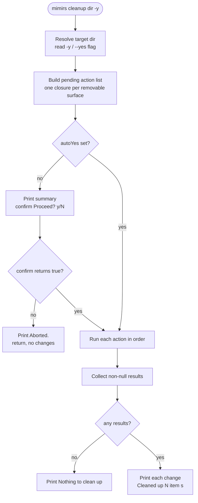

# CLI: cleanup

`mimirs cleanup [dir] [-y]` undoes everything [`mimirs init`](./init.md) added to a project. It deletes the local index, removes the `mimirs` server entry from every MCP config it knows about, strips the mimirs instruction block out of agent files, and removes the `.mimirs/` line from `.gitignore`. It is the "uninstall from this project" command — useful when you stop using mimirs, when you want a clean checkout, or when an `init` landed in the wrong directory.

The command is deliberately surgical. It does not wipe whole config files blindly. It edits each file to remove only the mimirs pieces, and only deletes a file outright when nothing of yours would be left behind.

## What runs

`cleanup` is one of the static command cases in the CLI dispatcher. The CLI reads its arguments once at module load: `args` is `process.argv.slice(2)` and `command` is `args[0]` (`src/cli/index.ts:26-27`). When `command` is `cleanup`, `dispatch()` calls `cleanupCommand(args)` with the full argument array (`src/cli/index.ts:174-175`). All the real work lives in `cleanupCommand` (`src/cli/commands/cleanup.ts:158`).

The handler builds a list of pending removal actions, optionally asks the user to confirm, then runs each action in order and prints what it actually changed.



1. The user runs `mimirs cleanup`, optionally with a directory and the `-y`/`--yes` flag.
2. `dispatch()` matches the `cleanup` case and calls `cleanupCommand(args)` (`src/cli/index.ts:174-175`).
3. The handler resolves the target directory and decides whether confirmation is suppressed. The directory is `args[1]` when present (defaulting to `"."`), resolved to an absolute path with `resolve()`; `autoYes` is true when `args` contains `--yes` or `-y` (`src/cli/commands/cleanup.ts:159-160`).
4. It assembles a list of zero-argument async functions, one per thing that might need removing. Nothing is deleted yet at this stage — the list is just closures that will run later (`src/cli/commands/cleanup.ts:163-191`).
5. Unless `autoYes` is set, it prints a plain-language summary of what will be removed and calls `confirm("Proceed? [y/N] ")` (`src/cli/commands/cleanup.ts:193-200`).
6. `confirm` resolves `true` only when the answer trims to `y`/`yes` and `false` otherwise — see Branches and failure cases below.
7. If the user did not confirm, it prints `Aborted.` and returns without touching anything (`src/cli/commands/cleanup.ts:201-204`).
8. Otherwise it runs each pending action in order. Each returns either a short description of what it changed, or `null` when there was nothing to do (`src/cli/commands/cleanup.ts:207-211`).
9. Finally it prints one indented line per change followed by a count, or `Nothing to clean up — no mimirs files found.` when every action returned `null` (`src/cli/commands/cleanup.ts:213-218`).

## The pending action list

The order of the pending list is fixed, and it covers exactly the surfaces that [`init`](./init.md) writes to.

**The index directory.** The first action removes the index directory if it exists. Normally that is `<dir>/.mimirs`, but the command honors `RAG_DB_DIR` — the documented workaround for read-only project directories — so the index may live elsewhere; the removal uses `rm(ragDir, { recursive: true, force: true })`. This directory holds the SQLite index database and `config.json` (`src/cli/commands/cleanup.ts:165-173`). The existence check happens while building the list, so a `.mimirs/` that appears between list-building and execution would be skipped; in normal single-process use this is not a concern.

**MCP config entries.** Six removal actions target the files where an MCP client registers the `mimirs` server: the project `.mcp.json`, `.cursor/mcp.json`, `.junie/mcp.json`, `.vscode/mcp.json`, and two Windsurf locations under the home directory — `~/.codeium/windsurf/mcp_config.json` and `~/.codeium/mcp_config.json` (`src/cli/commands/cleanup.ts:176-181`). All but the VS Code file go through `removeMcpEntry`, which parses the file, deletes the `mcpServers.mimirs` key, then rewrites the file with the remaining servers. If removing mimirs leaves `mcpServers` empty and there are no other top-level keys, it deletes the whole file; if `mcpServers` is empty but other keys exist, it drops just the `mcpServers` key (`src/cli/commands/cleanup.ts:98-122`). The VS Code config uses a different shape — a top-level `servers` map rather than `mcpServers` — so it is handled by `removeVscodeMcpEntry`, which applies the same logic to the `servers.mimirs` key (`src/cli/commands/cleanup.ts:69-92`). A file that is missing, unparseable, or has no `mimirs` entry is left untouched and the action returns `null`.

**Agent instruction files.** Five more actions remove the per-agent instructions:

| File | How it is cleaned | Helper |
| --- | --- | --- |
| `CLAUDE.md` | Removes the mimirs block; deletes file if nothing else remains | `removeInstructionsBlock` |
| `.cursor/rules/mimirs.mdc` | Deletes the whole file (mimirs owns it) | `removeOwnedFile` |
| `.windsurf/rules/mimirs.md` | Deletes the whole file (mimirs owns it) | `removeOwnedFile` |
| `.junie/guidelines/mimirs.md` | Removes the mimirs block; deletes file if nothing else remains | `removeInstructionsBlock` |
| `.github/copilot-instructions.md` | Removes the mimirs block; deletes file if nothing else remains | `removeInstructionsBlock` |

`removeInstructionsBlock` is the careful one. It returns `null` unless the file contains the current fenced region (`<!-- mimirs:start v=… -->…<!-- mimirs:end -->`, matched by `FENCE_RE`), the legacy `<!-- mimirs -->` marker, or the legacy `## Using mimirs tools` heading. For the fenced format it splices out the whole region, fences included; for a legacy block it removes from the marker (or heading) to the next top-level (`#` or `##`) heading or end of file. It rewrites the file with the block removed; if the result is empty it deletes the file instead (`src/cli/commands/cleanup.ts:27-62`). The splice is done by `spliceOut`, which trims only the newlines immediately adjacent to the removed region rather than reformatting the rest of the user's file (`src/cli/commands/cleanup.ts:14-20`). `removeOwnedFile` simply unlinks the file, because mimirs created the entire file (`src/cli/commands/cleanup.ts:128-132`).

**The `.gitignore` line.** The last action filters `.gitignore` line by line, dropping `.mimirs/`, `.mimirs`, and the `# mimirs index` comment that `init` writes. If the filtered content is identical to the original it returns `null` (nothing to do); if filtering empties the file it deletes `.gitignore`; otherwise it rewrites it (`src/cli/commands/cleanup.ts:137-156`).

## Inputs

| Name | Type | Required | Description |
| --- | --- | --- | --- |
| `[dir]` | positional string | no | Project directory to clean. Taken from `args[1]` when present; otherwise the current working directory. Resolved to an absolute path with `resolve()` (`src/cli/commands/cleanup.ts:159`). |
| `-y` / `--yes` | flag | no | Skips the confirmation prompt. Detected by scanning `args` for either token (`src/cli/commands/cleanup.ts:160`). |

The environment variable `RAG_DB_DIR` is also read: when set, it overrides where the index directory is looked for, so a project whose index lives outside the repo (a read-only checkout) is still cleaned (`src/cli/commands/cleanup.ts:167`).

## Outputs

| Output | Where it lands / shape / description |
| --- | --- |
| Deleted index directory | The index database and config are recursively removed from disk (`src/cli/commands/cleanup.ts:170`). |
| Edited or deleted MCP configs | The `mimirs` server entry is removed from each known MCP JSON file; files with nothing left are deleted (`src/cli/commands/cleanup.ts:79-91`, `:108-121`). |
| Edited or deleted agent files | mimirs instruction blocks are stripped from `CLAUDE.md`, the Junie and Copilot files; mimirs-owned rule files are deleted (`src/cli/commands/cleanup.ts:27-62`, `:128-132`). |
| Edited or deleted `.gitignore` | The `.mimirs/` lines and the `# mimirs index` comment are removed (`src/cli/commands/cleanup.ts:142-155`). |
| Console summary | Each change prints as an indented line to stdout, followed by `Cleaned up N item(s).`, or `Nothing to clean up — no mimirs files found.` when nothing matched (`src/cli/commands/cleanup.ts:213-217`). |

## State changes

| Change | Before | After | What does it |
| --- | --- | --- | --- |
| Local index | index directory present | removed | `rm(ragDir, { recursive: true, force: true })` (`src/cli/commands/cleanup.ts:170`) |
| MCP registration | `mimirs` present in config JSON | key removed; file deleted if nothing else remains | `removeMcpEntry` / `removeVscodeMcpEntry` (`src/cli/commands/cleanup.ts:69-122`) |
| Agent instructions | mimirs block / file present | block stripped or file deleted | `removeInstructionsBlock`, `removeOwnedFile` (`src/cli/commands/cleanup.ts:27-62`, `:128-132`) |
| Git ignore rules | `.mimirs/` listed in `.gitignore` | line removed; file deleted if it becomes empty | `removeGitignoreEntry` (`src/cli/commands/cleanup.ts:137-156`) |

These changes matter because they make `init` reversible. After `cleanup` a checkout has no trace that mimirs was ever installed: no index, no MCP wiring, no agent instructions, and no ignore rule. Re-running `init` afterward starts from a clean slate.

## Branches and failure cases

- **Confirmation requires a yes.** The prompt reads `Proceed? [y/N] `. `cleanup` calls `confirm` with no explicit default, so `defaultYes` is `false`: the helper resolves `true` only when the trimmed, lower-cased answer is `y` or `yes`, resolves `false` for `n`/`no`, and falls back to `defaultYes` (`false`) for anything else, including an empty answer (`src/cli/setup.ts:421-432`). So pressing Enter aborts — the `[y/N]` styling is accurate. Use `-y`/`--yes` for non-interactive runs.
- **`-y` as the only argument is misread as a directory.** The directory comes from `args[1]` whenever it is present, so `mimirs cleanup -y` puts `-y` into `args[1]` and resolves it as the target directory — pointing cleanup at a `-y` subfolder of the cwd rather than the project. (`autoYes` still becomes true because `-y` is in `args`, so the prompt is still skipped — it is just aimed at the wrong directory, where it finds nothing and prints `Nothing to clean up`.) To skip the prompt for the current directory, prefer `mimirs cleanup . -y` (`src/cli/commands/cleanup.ts:159-160`).
- **Nothing to clean up.** If every action returns `null` — no index directory, no MCP entries, no instruction blocks, no `.gitignore` line — the command prints `Nothing to clean up — no mimirs files found.` and changes nothing (`src/cli/commands/cleanup.ts:213-214`).
- **Missing files are skipped silently.** Every helper guards with `existsSync` (or a JSON parse) and returns `null` when its target is absent or irrelevant, so cleanup never errors on a partially-installed project (`src/cli/commands/cleanup.ts:28`, `:70`, `:99`, `:129`, `:139`).
- **Unparseable MCP JSON is left alone.** `removeMcpEntry` and `removeVscodeMcpEntry` wrap `JSON.parse` in a `try/catch` and return `null` on failure, so a hand-corrupted config is not rewritten or deleted (`src/cli/commands/cleanup.ts:72-76`, `:101-105`).
- **No "mimirs" entry means no edit.** `removeMcpEntry` returns early when `mcpServers.mimirs` is absent (and `removeVscodeMcpEntry` when `servers.mimirs` is absent), leaving other people's servers and the file untouched (`src/cli/commands/cleanup.ts:77`, `:106`).
- **An instruction file with no mimirs content is left alone.** `removeInstructionsBlock` returns `null` unless the file contains the fenced region, the `<!-- mimirs -->` marker, or the `## Using mimirs tools` heading, so a hand-written `CLAUDE.md` or `copilot-instructions.md` is never edited (`src/cli/commands/cleanup.ts:34-55`).
- **`.gitignore` no-op detection.** If filtering the lines produces content identical to the original (trimmed), `removeGitignoreEntry` returns `null` rather than rewriting the file, so an unrelated `.gitignore` is left byte-for-byte intact (`src/cli/commands/cleanup.ts:149`).
- **Shared configs in the home directory.** The two Windsurf paths live under `~/.codeium`, not the project. Cleaning one project removes the global `mimirs` Windsurf registration; if multiple projects relied on it, they lose it too (`src/cli/commands/cleanup.ts:180-181`).
- **Aborted run.** Not confirming prints `Aborted.` and returns before any action runs, so the pending list never executes (`src/cli/commands/cleanup.ts:201-204`).

## Example

Clean the current project interactively:

```
$ mimirs cleanup
This will remove all mimirs files from this project:

  - .mimirs/ directory (index database & config)
  - mimirs entries from MCP configs (.mcp.json, .cursor/mcp.json, windsurf)
  - Agent instructions (CLAUDE.md block, .cursor/rules/mimirs.mdc, etc.)
  - .mimirs/ entry from .gitignore

Proceed? [y/N] y
  Deleted index directory /path/to/project/.mimirs
  Removed mimirs from .mcp.json
  Removed mimirs block from CLAUDE.md
  Removed .mimirs/ from .gitignore

Cleaned up 4 item(s).
```

Clean a specific directory without prompting:

```
$ mimirs cleanup ./my-project --yes
```

The summary text and result lines above match the literal strings the command prints (`src/cli/commands/cleanup.ts:194-217`); which lines appear depends on what was actually installed.

## Key source files

| File | Role |
| --- | --- |
| `src/cli/index.ts` | CLI dispatcher; routes the `cleanup` command to its handler (`:174-175`). |
| `src/cli/commands/cleanup.ts` | The command itself plus all removal helpers (`removeInstructionsBlock`, `removeMcpEntry`, `removeVscodeMcpEntry`, `removeOwnedFile`, `removeGitignoreEntry`, `cleanupCommand`). |
| `src/cli/setup.ts` | Home of `confirm`, the prompt helper; the `FENCE_RE` and `LEGACY_HEADING` markers the block remover matches; and the `init` writers whose effects this command reverses. |
| `src/utils/log.ts` | `cli.log` — the stdout console wrapper used for all output. |
