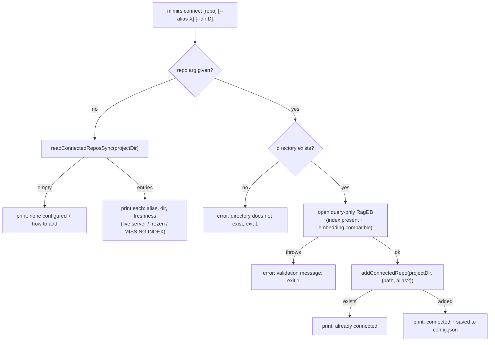

# CLI: connect

`mimirs connect` manages persistent cross-repo connections. A connected repo is
another project whose mimirs index you want this project's server to be able to
search — for example, querying a backend repo's code from inside a frontend
repo. Because the CLI is sessionless (each invocation is a fresh short-lived
process), "connecting" from the CLI cannot mean opening a live handle; it means
*persisting* the connection into `.mimirs/config.json`. The running MCP server
warm-attaches every configured entry query-only at startup, and read tools then
accept the connected repo's path or alias as their `directory` argument
(`src/cli/commands/connect.ts:14-23`).

The command has two modes. With no repo argument it lists the currently
configured connections and their freshness. With a repo argument it validates
that repo's index and saves it (`src/cli/commands/connect.ts:25-70`). Removing a
connection is the separate [disconnect command](./disconnect.md). Attaching a
repo for the current server session only — without persisting — is the
[connect_repo tool](../tools/connect-repo.md).



1. **Resolve the project directory.** `--dir` overrides the default of `.`; this
   is the project whose `.mimirs/config.json` holds the connection list
   (`src/cli/commands/connect.ts:26`).
2. **No repo argument → list mode.** `readConnectedReposSync` reads
   `connectedRepos` straight off disk. When the list is empty it prints how to
   add one and returns (`src/cli/commands/connect.ts:29-34`).
3. **Print each connection with freshness.** For every entry it resolves the
   path and checks whether that repo has an `index.db` and whether a live server
   holds its lock, labelling it `live server`, `frozen (no live server)`, or
   `MISSING INDEX`. The alias, when present, is shown left-padded
   (`src/cli/commands/connect.ts:35-44`). Freshness matters because a connected
   repo with no live server is frozen at its last index — searches against it
   return stale results until someone reindexes it from its own side.
4. **Repo argument → resolve and existence-check.** The target is resolved
   relative to the project directory; a non-existent directory is a hard error
   with exit 1 (`src/cli/commands/connect.ts:48-52`).
5. **Validate the index.** It opens the target as a query-only `RagDB` and
   immediately closes it. This is the same attach the server performs: the
   constructor fails if there is no index or if the repo's embedding model/dim
   is incompatible with this one, and that error is surfaced and the command
   exits 1 (`src/cli/commands/connect.ts:53-60`). Validating up front means a
   saved connection is one the server will actually be able to attach.
6. **Persist the connection.** `addConnectedRepo` appends `{ path, alias? }` to
   `connectedRepos`, deduplicating by resolved path. An entry that already
   exists yields `"exists"` and a "already connected" message; a new one yields
   `"added"` and a confirmation that live servers pick it up on restart
   (`src/cli/commands/connect.ts:62-69`).

## How the config write stays safe

`addConnectedRepo` does not blindly rewrite the file. If `config.json` does not
exist yet it first scaffolds defaults via `loadConfig`, then performs a
read-modify-write under a lock (`src/config/index.ts:300-314`). The shared
`mutateRawConfig` helper acquires a `wx`-created `config.json.lock`, edits the
*raw* parsed JSON (so every unrelated field is preserved exactly, rather than
re-serializing the validated config and baking defaults into the user's file),
and writes via temp-file + rename so a crash mid-write cannot truncate the file
(`src/config/index.ts:272-295`). The lock guards against the IDE server and a
CLI invocation interleaving their edits and silently dropping one another's
change; a lock older than 10 seconds is treated as a crashed holder and stolen,
and acquisition gives up after 2 seconds (`src/config/index.ts:246-270`).

## Inputs

| name | type | required | description |
| --- | --- | --- | --- |
| `repo` | positional path | no | The repo to connect, resolved relative to the project dir. Omit it to list current connections instead (`src/cli/commands/connect.ts:27`). |
| `--alias` | flag (string) | no | Short name stored with the entry; later usable as the `directory` argument of read tools (`src/cli/commands/connect.ts:62-63`). |
| `--dir` | flag (path) | no | Project directory whose `connectedRepos` is edited; defaults to `.` (`src/cli/commands/connect.ts:26`). |

## Outputs

| output | where it lands / shape / description |
| --- | --- |
| `connectedRepos` entry | Appended to `.mimirs/config.json` (deduped by resolved path) via an atomic, locked read-modify-write (`src/config/index.ts:306-313`). |
| Status line | Printed to the log: the connection list (with freshness), "Already connected", or a save confirmation. |
| Exit code | `1` on a missing directory or a failed index validation; `0` otherwise (`src/cli/commands/connect.ts:51,59`). |

## State changes

| Item | Before | After | Why it matters |
| --- | --- | --- | --- |
| Connected repo entry | absent | saved in `connectedRepos` | A persisted connection auto-attaches in every future server session, so read tools can target the other repo by path or alias. Written by `addConnectedRepo` (`src/config/index.ts:306-313`). |

## Branches and failure cases

- **No repo, no connections** — prints the "add one" hint and returns
  (`src/cli/commands/connect.ts:31-33`).
- **No repo, with connections** — lists each entry with a freshness label
  (`src/cli/commands/connect.ts:35-44`).
- **Directory does not exist** — error, exit 1
  (`src/cli/commands/connect.ts:49-52`).
- **Index validation fails** — the query-only open throws (no index, or
  incompatible embedding model/dim); the message is printed, exit 1
  (`src/cli/commands/connect.ts:55-60`).
- **Already connected** — duplicate path detected by `addConnectedRepo`; prints
  "Already connected", no write (`src/cli/commands/connect.ts:64-65`).
- **Saved** — new entry written; prints the confirmation and the restart note
  (`src/cli/commands/connect.ts:66-69`).

## Example

```console
$ mimirs connect ../backend --alias backend
Connected /Users/me/backend as "backend" (saved to .mimirs/config.json).
Live servers pick this up on restart; read tools then accept it as `directory`.

$ mimirs connect
Connected repos (1):
  backend           /Users/me/backend  [live server]
```

## Key source files

- `src/cli/commands/connect.ts` — `connectCommand`: list mode, validation, and
  the save path; `disconnectCommand` lives here too (see
  [disconnect](./disconnect.md)).
- `src/config/index.ts` — `readConnectedReposSync`, `addConnectedRepo`, and the
  locked atomic `mutateRawConfig` write.
- `src/cli/index.ts:148-149` — the `connect` case in the CLI dispatch switch.
