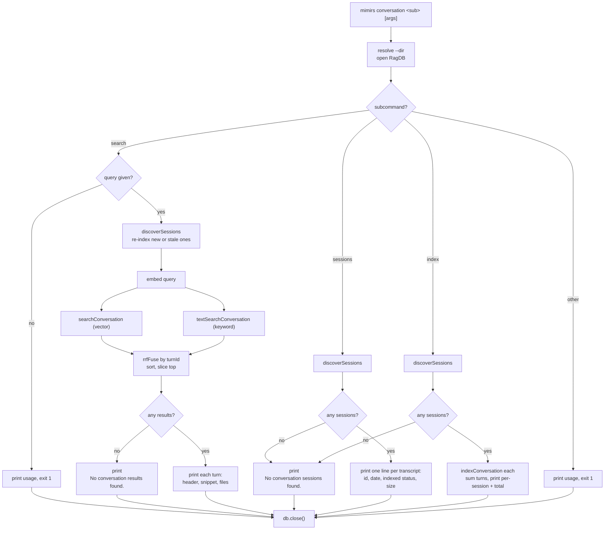

# CLI: conversation

The `conversation` command turns past Claude Code transcripts into something you can search from the terminal. Claude Code records every session as a JSONL file under your home directory. This command finds those files for the current project, splits each one into "turns" (one user message plus everything the assistant did in response), stores each turn in the project database, and then lets you search across them by meaning and by keyword.

It exists so that work done in an earlier session is not lost. If a previous session decided how a tricky function should behave, or ran a command that produced an important result, you can find it again without re-reading whole transcripts. The same stored turns also back the MCP [search_conversation](../tools/search-conversation.md) tool used inside an agent session.

The command has three subcommands, selected by the second positional argument:

| Subcommand | What it does |
| --- | --- |
| `search <query>` | Indexes any new or changed transcripts first, then runs a hybrid (vector + keyword) search over indexed turns and prints the best matches. |
| `sessions` | Lists every transcript found for this project and how many turns of each are already indexed. |
| `index` | Indexes every found transcript into the database without searching. |

## How a transcript is found

Claude Code stores transcripts in `~/.claude/projects/<encoded-path>/`, where the encoded path is the project's absolute directory with every `/` replaced by `-`. `getTranscriptsDir` builds that path from the project directory and the `HOME` environment variable (`src/conversation/parser.ts:293`). `discoverSessions` then globs that folder for `*.jsonl` files, `stat`s each one for its modification time and byte size, and returns them sorted newest-first (`src/conversation/parser.ts:302`). The session id is the file name with `.jsonl` stripped off. If the transcripts folder does not exist yet, the glob throws and is caught, so the lookup returns an empty list rather than failing (`src/conversation/parser.ts:325`).

All three subcommands start from this same step, so they only ever touch the current project's transcripts — never another project's history.

## Dispatch and branching

`mimirs conversation ...` enters through the shared CLI dispatcher. The top-level command string is matched in a switch, and `conversation` routes to `conversationCommand(args, getFlag)` (`src/cli/index.ts:152`). That handler reads the second positional argument as the subcommand, resolves the working directory from `--dir` (defaulting to `.`), opens the project database, and branches (`src/cli/commands/conversation.ts:11`). Because the value of the command is in which branch runs, the flow is best read as a dispatch tree.



1. The handler resolves the directory from `--dir` and opens `RagDB` before any branch runs, so the database is always available to close at the end (`src/cli/commands/conversation.ts:13`).
2. `search` first checks that a query string is present; a missing query prints usage and exits `1` (`src/cli/commands/conversation.ts:18`).
3. With a query, `search` walks every found transcript and re-indexes only the new or stale ones, then embeds the query.
4. Two searches run against the stored turns — a vector search and a keyword search — and their results are fused by rank, sorted, and trimmed to the top count.
5. An empty fused list prints `No conversation results found.`; otherwise each surviving turn is printed.
6. `sessions` lists every transcript with its indexed status, or prints a "none found" message when the folder is empty.
7. `index` indexes every transcript and prints per-session and total turn counts, or the same "none found" message.
8. Any other subcommand (or none) prints the usage line and exits `1`.
9. Every branch falls through to `db.close()` (`src/cli/commands/conversation.ts:94`).

## `search`: index-on-demand, then rank fusion

`search` is the only subcommand that both writes and reads. Before searching it makes sure the index is current: it walks every found transcript, compares the on-disk modification time against the `file_mtime` stored in the session row, and calls `indexConversation` for anything that has never been indexed or whose file has grown since (`src/cli/commands/conversation.ts:27-33`). This is why a fresh search picks up turns from a session you just finished without a separate `index` run, while unchanged transcripts are skipped.

Once the index is current the handler embeds the query with `embed`, then runs two searches over the stored turn chunks (`src/cli/commands/conversation.ts:36-41`):

- A vector search, `searchConversation`, matches the query embedding against the `vec_conversation` virtual table and turns the cosine distance into a similarity via `1 / (1 + distance)` (`src/db/conversation.ts:175`).
- A keyword search, `textSearchConversation`, runs an FTS5 `MATCH` against `fts_conversation` and converts the BM25 `rank` into a score via `1 / (1 + abs(rank))` (`src/db/conversation.ts:234`).

Both searches return at most one row per turn. The DB layer over-fetches (three times the requested top count) and de-duplicates by `turn_id`, so a turn split into several chunks does not crowd out other turns (`src/db/conversation.ts:155`, `src/db/conversation.ts:160-162`).

The two lists are then combined by **reciprocal-rank fusion** rather than by blending the raw scores. The handler calls `rrfFuse(vecResults, bm25Results, config.hybridWeight, (r) => r.turnId)`, sorts the fused list by score descending, and slices it to the top count (`src/cli/commands/conversation.ts:44-46`). This matters because cosine similarity and the BM25-derived `1/(1+|rank|)` score live on different, non-comparable scales — adding them directly would let whichever has the larger magnitude dominate and make the weight nearly inert. Fusing by *position* avoids that.

Inside `rrfFuse` each list is scored only by where a turn lands in it: a turn at rank `i` contributes `RRF_K / (RRF_K + i)` with `RRF_K = 60`, which is `1` at the top and decays smoothly down the list (`src/search/hybrid.ts:84-88`). A turn's final score is `weight * vectorRankScore + (1 - weight) * keywordRankScore`, where the vector list is the primary (weight) side and the keyword list is the secondary; a turn missing from one list contributes `0` from that side (`src/search/hybrid.ts:99-102`). The `weight` is `config.hybridWeight`, whose default is `0.5` — equal pull from semantic and keyword rank — so neither signal dominates and an exact keyword hit can still surface a turn the vector search ranked lower (`src/config/index.ts:118`). The same `rrfFuse` is the single fusion path for ordinary chunk search too, so conversation search and code search rank by the same rule.

Each printed result shows `Turn <turnIndex> (<timestamp>)`, an optional `[tool, tool]` list when the turn used tools, the first 200 characters of the matching snippet, and up to five referenced files when present (`src/cli/commands/conversation.ts:51-58`). When nothing matches it prints `No conversation results found.`

## `sessions`: what exists and what is indexed

`sessions` is read-only. It calls `discoverSessions` and, for each transcript, looks up the stored session row with `getSession`. If a row exists it reports the stored `turnCount` as `<n> turns indexed`; otherwise it reports `not indexed` (`src/cli/commands/conversation.ts:66-71`). Each line shows the first eight characters of the session id, the file modification time as an ISO timestamp trimmed to seconds, the indexed status, and the file size in kilobytes. With no transcripts at all it prints `No conversation sessions found for this project.`

This is the quickest way to see whether a recent session has made it into the index, and how large each transcript is.

## `index`: index everything now

`index` indexes every found transcript and reports per-session and total turn counts. It prints a `Found N sessions, indexing...` header, then loops over the sessions, calls `indexConversation` on each, accumulates `turnsIndexed`, prints a line for every session that produced new turns, and finishes with a total (`src/cli/commands/conversation.ts:73-88`). Unlike `search`, it does not check `mtime` first — it calls `indexConversation` unconditionally. That is safe because indexing is idempotent at the turn level (see below): a session that is already fully indexed contributes zero new turns and prints nothing.

## Inside `indexConversation`

`indexConversation` is the shared worker for both `index` and the on-demand path in `search` (`src/conversation/indexer.ts:16`). The CLI always passes the default byte offset of `0` and start turn index of `0`, so the whole file is re-read each time and turn numbering starts from zero. It reads the JSONL with `readJSONL`, parses the entries into turns, indexes each turn, and finally updates the session row (`src/conversation/indexer.ts:24-52`).

Parsing is done by `parseTurns`, which keeps only `user` and `assistant` messages and groups them into turns (`src/conversation/parser.ts:111`). A new turn begins at a real user text message; tool-result messages and assistant messages are folded into the current turn (`src/conversation/parser.ts:168-185`). While building a turn it records which tools were used (from `tool_use` blocks), which files were referenced (from `toolUseResult.filenames` metadata), and the running token cost (from message `usage`) (`src/conversation/parser.ts:236-247`). To keep the index lean, the content of `Read`, `Glob`, `Write`, `Edit`, and `NotebookEdit` tool results is dropped unless it is short (500 characters or less), since that output is already covered by the code index (`src/conversation/parser.ts:60`, `src/conversation/parser.ts:216-220`).

Each turn is then handed to `indexTurn`, which builds the indexable text with `buildTurnText` (user text, then assistant text, then selected tool results), splits it into chunks of up to 512 tokens with 50 tokens of overlap using `chunkText` with a `.md` extension for paragraph-style splitting, embeds all chunks in one `embedBatch` call, and stores the turn with `insertTurn` (`src/conversation/indexer.ts:58-86`). A turn whose text is empty after trimming is skipped and counts as not indexed (`src/conversation/indexer.ts:60`).

After the loop it updates session tracking: it reads any existing row, adds the newly indexed turns to the prior `turnCount`, `stat`s the file for its current `mtimeMs`, then calls `upsertSession` and `updateSessionStats` (`src/conversation/indexer.ts:44-50`). The stored `file_mtime` is exactly what `search` compares against next time to decide whether to re-index.

## State changes

| Name | Before | After | Why it matters |
| --- | --- | --- | --- |
| Turn row | No row for `(session_id, turn_index)` | One row in `conversation_turns` | Makes the turn discoverable and is the dedupe point for re-indexing. |
| Chunk + embedding rows | No chunks for the turn | Rows in `conversation_chunks`, `vec_conversation`, and (via trigger) `fts_conversation` | Provide the vector and keyword search surfaces. |
| Session row | Missing or stale | Upserted with new `file_mtime`, `read_offset`, `turn_count`, `total_tokens` | Lets later runs skip unchanged files and report indexed counts. |

The turn insert is the dedupe point. `insertTurn` runs `INSERT OR IGNORE` into `conversation_turns`, which carries `UNIQUE(session_id, turn_index)` (`src/db/index.ts` schema; `conversation_turns` table). If the turn already exists the insert is ignored, `changes()` returns `0`, and the function returns `0` without writing any chunks or embeddings (`src/db/conversation.ts:89-91`). Only genuinely new turns get chunk rows: each new chunk inserts a snippet into `conversation_chunks`, then its embedding into `vec_conversation`, and an `AFTER INSERT` trigger (`conv_chunks_ai`) mirrors the snippet into the `fts_conversation` full-text index (`src/db/conversation.ts:97-110`). The whole turn — row, chunks, embeddings — is written inside one transaction, so a failure cannot leave a turn with partial chunks (`src/db/conversation.ts:71-113`).

Session bookkeeping happens after the turns. `upsertSession` inserts or updates the session row with the latest `file_mtime` and `read_offset`, and `updateSessionStats` writes the accumulated turn count and token total (`src/db/conversation.ts:5-22`, `src/db/conversation.ts:49-54`).

## Branches and failure cases

- **Missing query for `search`.** With no query argument the handler prints `Usage: mimirs conversation search <query> [--dir D] [--top N]` and exits `1` (`src/cli/commands/conversation.ts:18-21`).
- **Unknown or missing subcommand.** Anything other than `search`, `sessions`, or `index` prints `Usage: mimirs conversation <search|sessions|index>` and exits `1` (`src/cli/commands/conversation.ts:89-92`).
- **No transcripts found.** `sessions` and `index` print `No conversation sessions found for this project.` and do nothing further; the transcripts folder simply may not exist yet (`src/cli/commands/conversation.ts:63-64`, `src/cli/commands/conversation.ts:75-76`).
- **No search matches.** When the fused result list is empty, `search` prints `No conversation results found.` (`src/cli/commands/conversation.ts:48-49`).
- **Full-text search errors.** FTS5 can throw on queries with special characters. The keyword search is wrapped in a `try/catch` that swallows the error and leaves the keyword list empty, so `search` still returns its vector results (`src/cli/commands/conversation.ts:38-41`). The DB layer also passes the query through `sanitizeFTS` before matching (`src/db/conversation.ts:214`, `src/search/usages.ts:29`).
- **Empty transcript.** If `readJSONL` returns no entries (an empty file, or an offset already at end-of-file), `indexConversation` returns early with zero turns indexed (`src/conversation/indexer.ts:26-28`).
- **Empty turn text.** A turn whose combined text is blank after trimming is skipped by `indexTurn` and never reaches the database (`src/conversation/indexer.ts:60`).
- **Already-indexed turn.** Re-running `index` on an unchanged session is a no-op: the unique constraint ignores each existing turn, so `turnsIndexed` stays `0` and no per-session line prints.
- **Stale-only re-index in `search`.** A session is re-indexed only when it has no row or its `mtime` grew; an unchanged session is skipped entirely on the search path (`src/cli/commands/conversation.ts:30`).
- **Bad `--top` value.** `--top` is parsed by `intFlag`, which rejects non-integers and values below `1` by throwing `CliFlagError`; the dispatcher catches it, prints the message, and exits `1` (`src/cli/flags.ts:40-52`, `src/cli/index.ts:101-104`).
- **Always closes the DB.** Every branch falls through to `db.close()` at the end of the handler (`src/cli/commands/conversation.ts:94`).

## Inputs

| Name | Type | Required | Description |
| --- | --- | --- | --- |
| subcommand | `search` \| `sessions` \| `index` | yes | Second positional argument; selects the branch. Anything else prints usage and exits `1`. |
| `<query>` | string | for `search` only | Third positional argument; the natural-language or keyword search query. A missing query on `search` exits `1`. |
| `--dir D` | path | no | Project directory whose transcripts and database are used. Resolved to an absolute path; defaults to the current directory. |
| `--top N` | integer ≥ 1 | no | Maximum results for `search`. Defaults to the config `searchTopK` (10). Validated by `intFlag`. |

## Outputs

| Output | Where it lands / shape / description |
| --- | --- |
| Search results | Printed to stdout for `search`: per turn, `Turn <index> (<timestamp>)` with an optional `[tool, ...]` list, a snippet capped at 200 chars, and up to 5 referenced files. Empty case prints `No conversation results found.` |
| Session list | Printed to stdout for `sessions`: one line per transcript with short session id, ISO timestamp, indexed-turn count or `not indexed`, and file size in KB. |
| Index summary | Printed to stdout for `index`: a `Found N sessions, indexing...` header, a per-session line for sessions with new turns, and a final `Done: <total> turns indexed across N sessions`. |
| Persisted rows | Both `index` and the `search` on-demand path write session, turn, chunk, embedding, and FTS rows into the project database (see State changes). |

## Example

```
$ mimirs conversation sessions
  3f9a1c20...  2026-05-30T14:22:07  142 turns indexed  (318KB)
  a18b7e44...  2026-05-29T09:11:50  not indexed        (44KB)

$ mimirs conversation index
Found 2 sessions, indexing...
  a18b7e44...: 18 turns
Done: 18 turns indexed across 2 sessions

$ mimirs conversation search "how did we handle FTS special chars" --top 3
Turn 57 (2026-05-29T10:02:13) [search, read_relevant]
  Wrapped the keyword search in try/catch so FTS5 errors on special chars fall
  Files: src/cli/commands/conversation.ts, src/db/conversation.ts
```

Values such as session ids, timestamps, and turn indices above are illustrative.

## Background indexing

The CLI is the manual way to fill the conversation index. When the MCP server is running it indexes transcripts automatically: `startConversationFolderWatch` backfills every existing session on startup and then watches the transcripts folder, indexing new turns through a single serial queue so two index runs never overlap on the same file (`src/conversation/indexer.ts:162`). That background path reads from the byte offset stored in each session row rather than re-reading whole files (`src/conversation/indexer.ts:97-112`), and is described under [server start](../server/start.md). Because both paths funnel into the same idempotent `indexConversation`, running the CLI `index` while the server watches is safe — already-indexed turns are simply ignored.

## Key source files

- `src/cli/index.ts` — top-level CLI dispatcher; routes `conversation` to its handler and catches `CliFlagError`.
- `src/cli/commands/conversation.ts` — the handler implementing `search`, `sessions`, and `index`.
- `src/conversation/parser.ts` — transcript lookup (`discoverSessions`, `getTranscriptsDir`), JSONL reading (`readJSONL`), and turn parsing (`parseTurns`, `buildTurnText`).
- `src/conversation/indexer.ts` — the `indexConversation` worker plus the server's folder watcher.
- `src/db/conversation.ts` — the SQL behind session upserts, turn inserts, and the vector/keyword searches.
- `src/db/index.ts` — the conversation table schema, the `UNIQUE(session_id, turn_index)` dedupe key, the FTS sync triggers, and the `RagDB` method wrappers.
- `src/search/hybrid.ts` — `rrfFuse`, the shared reciprocal-rank fusion used by both conversation search and code search.
- `src/cli/flags.ts` — `intFlag` validation for `--top`.
- `src/config/index.ts` — defaults for `searchTopK` (10) and `hybridWeight` (0.5).
