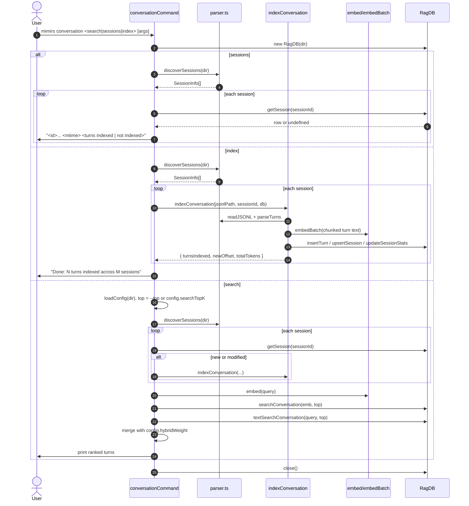

# CLI: conversation

`mimirs conversation` indexes and queries Claude Code session
transcripts so past chats become searchable. It has three
subcommands: `index` ingests every session JSONL file for the current
project, `search` runs hybrid vector + BM25 search across indexed
turns, and `sessions` lists discovered transcripts with their indexed
status. Use it when you want to remember what was decided in an
earlier session, or to feed the `search_conversation` MCP tool.

Session files are not stored in the project. They live in Claude
Code's per-project directory under
`~/.claude/projects/<encoded-project-path>/<session-id>.jsonl` —
`discoverSessions` reads from that location, never from the project
itself (`src/conversation/parser.ts:291-323`).

## Flow



1. The user runs `mimirs conversation <sub> [args]`. The CLI reads
   `args[1]` as the subcommand. Directory defaults to `--dir` or `.`
   (`src/cli/commands/conversation.ts:9-12`).
2. `RagDB` is opened once at the top of the handler and closed at the
   end, so every branch reuses the same DB handle.
3. **`sessions`** branch: calls `discoverSessions(dir)` and prints one
   line per session showing the short id, mtime, indexed turn count
   (or `not indexed`), and file size in KB
   (`src/cli/commands/conversation.ts:69-80`).
4. **`index`** branch: calls `discoverSessions(dir)` and then, for
   each session, invokes `indexConversation(jsonlPath, sessionId,
   db)`. The indexer reads JSONL from the current offset, parses
   turns, chunks the text, embeds the chunks, and inserts new turn
   rows. It returns `turnsIndexed`, `newOffset`, and `totalTokens`
   per session (`src/conversation/indexer.ts:13-49`).
5. **`search`** branch: before running the actual search, the CLI
   refreshes the index — it iterates discovered sessions and re-runs
   `indexConversation` for any session whose disk `mtime` is newer
   than the stored mtime, or that has no row at all
   (`src/cli/commands/conversation.ts:25-31`). This guarantees freshly
   resumed conversations are searchable without a manual `index`.
6. The query is embedded once with `embed(query)`. Vector results
   come from `db.searchConversation(emb, top)` and BM25-style results
   from `db.textSearchConversation(query, top)`. The text search
   call is wrapped in `try / catch` because FTS can throw on special
   characters in the query (`src/cli/commands/conversation.ts:33-39`).
7. Results are merged in a `Map<turnId, row>`. The weighting uses the
   project's `hybridWeight` config (not a hard-coded value): vector
   rows contribute `score * hybridWeight` and text rows contribute
   `score * (1 - hybridWeight)`. When a turn appears in both, its
   contributions add (`src/cli/commands/conversation.ts:41-52`).
8. The merged turns are sorted descending by score and trimmed to
   `top`. Each result prints as a three-line block: turn index with
   timestamp and any tools used, the first 200 chars of the snippet,
   and a `Files: ...` line listing up to 5 referenced files when
   present (`src/cli/commands/conversation.ts:58-67`).

## Inputs

| Input | Subcommand | Source | Notes |
| --- | --- | --- | --- |
| `search\|sessions\|index` | all | `args[1]` | Required. Anything else triggers the usage error and `exit(1)` (`src/cli/commands/conversation.ts:97-100`). |
| `query` | search | `args[2]` | Required for `search`. Missing query prints usage and exits 1. |
| `--dir D` | all | flag | Optional. Project directory. Defaults to `.`. |
| `--top N` | search | flag | Optional. Defaults to `config.searchTopK` from the loaded project config. Sets both the per-query row cap and the final returned count. |

The `index` and `sessions` branches do not load the full project
config — they only need the directory.

## Outputs

| Output | What happens |
| --- | --- |
| Session listing | `sessions` prints one line per discovered transcript: `<short-id>...  <iso-date>  <"K turns indexed"\|"not indexed">  (<size>KB)`. |
| Ranked turns | `search` prints up to `--top` three-line blocks with the turn index, timestamp, tool tags, a 200-char snippet, and referenced files. |
| Indexed turn rows | `index` (and the auto-refresh inside `search`) inserts new rows into the conversation tables via `db.insertTurn` and updates `sessions` / `session_stats` (`src/conversation/indexer.ts:36-49`). |

## State changes

### `sessions` and conversation turn tables

- Before: previously indexed turns for each session (potentially
  empty if the session is new).
- After: every new turn since the last stored byte offset has a row
  with embeddings; `sessions.read_offset`, `turn_count`, and
  `total_tokens` are updated.
- Trigger: `mimirs conversation index`, or implicitly inside
  `mimirs conversation search` when a session's disk `mtime` is newer
  than the stored mtime, or no row exists yet.
- Why it matters: `mcp__mimirs__search_conversation` and any later
  CLI search reads these tables. Without them, the search returns
  nothing.
- Code: `indexConversation` orchestrates the work
  (`src/conversation/indexer.ts:13-49`); `indexTurn` does the chunking
  + embedding + insert per turn (`src/conversation/indexer.ts:54-86`).
  `db.insertTurn` returns 0 when a duplicate is detected, so re-runs
  are safe.

## Branches and failure cases

- **Unknown or missing subcommand**: `cli.error("Usage: mimirs
  conversation <search|sessions|index>")` and exit 1
  (`src/cli/commands/conversation.ts:97-100`).
- **No sessions found**: `discoverSessions` returns an empty array
  when the Claude project directory does not exist or contains no
  `.jsonl` files. The `sessions` branch prints
  `"No conversation sessions found for this project."`; `index`
  prints the same. Search continues but will not have data to query
  (`src/cli/commands/conversation.ts:71-72, 82-84`).
- **Search yields nothing**: prints
  `"No conversation results found."` and returns
  (`src/cli/commands/conversation.ts:56-57`).
- **FTS error on special characters**: the `textSearchConversation`
  call is wrapped in `try / catch`. A failure leaves `bm25Results`
  empty and the search proceeds with vector results only
  (`src/cli/commands/conversation.ts:37-39`).

## Where session JSONL files come from

`discoverSessions` derives the directory by URL-encoding the project
path (replacing `/` with `-`) and looking under
`$HOME/.claude/projects/<encoded>` for `*.jsonl` files
(`src/conversation/parser.ts:292-323`). For a project at
`/Users/jane/code/my-app`, that becomes
`~/.claude/projects/-Users-jane-code-my-app/`. Each file is a
JSON-lines transcript written by Claude Code as the user works.

Sessions are sorted newest-first by mtime so the `sessions`
subcommand always shows the most-recent transcript at the top
(`src/conversation/parser.ts:319-322`).

## Relationship to the server's conversation tail

When `mimirs serve` starts, it also begins tailing the active session
in the background via `startConversationTail` so live turns get
indexed as the user works (`src/conversation/indexer.ts:90-...`). The
CLI's `index` subcommand is the batch counterpart: when the server is
not running (or hasn't been running for a while), `mimirs
conversation index` catches up the index by reading from each
session's stored byte offset. Both paths funnel through the same
`indexConversation` function, so they cannot disagree about what is
indexed — only about when.

The `search` subcommand also runs the catch-up loop before querying,
so an ad-hoc CLI search is never blocked by an idle indexer.

## Example

```
# Show what session files exist
mimirs conversation sessions
# →   abcd1234...  2026-04-22T11:03:14  84 turns indexed  (412KB)
#     ef567890...  2026-04-20T09:18:00  not indexed  (88KB)

# Index everything
mimirs conversation index
# → Found 2 sessions, indexing...
#     abcd1234...: 0 turns
#     ef567890...: 17 turns
#   Done: 17 turns indexed across 2 sessions

# Hybrid search
mimirs conversation search "decision on hybrid weight" --top 5
# → Turn 42 (2026-04-22T10:55:01Z) [search, read_relevant]
#     We landed on 0.7/0.3 vector/text after benchmarking on this fixture...
#     Files: src/search/hybrid.ts, src/config/index.ts
```

## Key source files

- `src/cli/commands/conversation.ts` — CLI entrypoint with three
  branches.
- `src/conversation/parser.ts` — `discoverSessions`, `readJSONL`,
  `parseTurns`, `buildTurnText`.
- `src/conversation/indexer.ts` — `indexConversation` (batch + catch-up)
  and `startConversationTail` (the live-tail used by the server).
- `src/db/index.ts` — `RagDB.searchConversation`,
  `RagDB.textSearchConversation`, `RagDB.getSession`,
  `RagDB.insertTurn`, `RagDB.upsertSession`,
  `RagDB.updateSessionStats`.
- `src/embeddings/embed.ts` — `embed` and `embedBatch`.

## Related flows

- [tools/search-conversation](../tools/search-conversation.md) — MCP
  tool that wraps the same search path.
- [cli/serve](./serve.md) — the server start command that runs the
  live conversation tail alongside this CLI's batch indexer.
