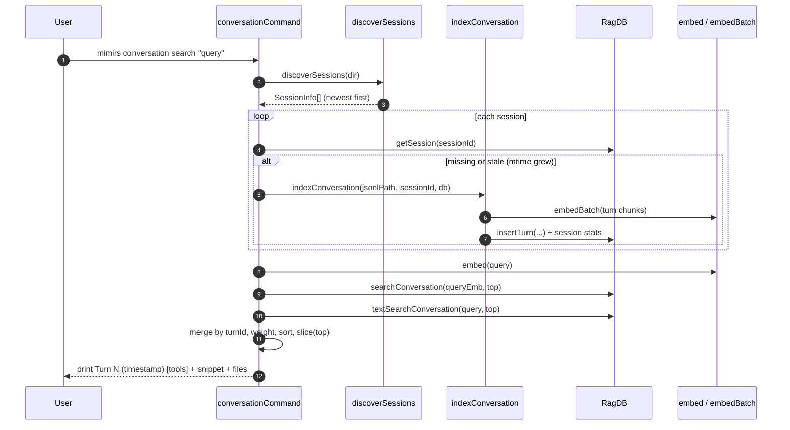

# CLI: conversation

The `conversation` command turns past Claude Code transcripts into something you can search from the terminal. Claude Code records every session as a JSONL file under your home directory; this command reads those files, splits them into "turns" (one user message plus everything the assistant did in response), stores each turn in the project database, and then lets you search across them by meaning and by keyword.

It exists so that work done in an earlier session does not get lost. If a previous session decided how a tricky function should behave, or ran a command that produced an important result, you can find it again without re-reading whole transcripts. The same data also powers the MCP [`search_conversation`](../tools/search-conversation.md) tool used inside an agent session.

The command has three subcommands:

| Subcommand | What it does |
| --- | --- |
| `search <query>` | Indexes any new or changed transcripts, then runs a hybrid (vector + keyword) search over indexed turns and prints the best matches. |
| `sessions` | Lists every transcript discovered for this project and how many turns of each are already indexed. |
| `index` | Indexes every discovered transcript into the database without searching. |

## How a session file is found

Claude Code stores transcripts in `~/.claude/projects/<encoded-path>/`, where the encoded path is the project's absolute directory with every `/` replaced by `-`. The helper `getTranscriptsDir` builds that path from the project directory and the `HOME` environment variable (`src/conversation/parser.ts:293`). `discoverSessions` then globs that folder for `*.jsonl` files, `stat`s each one for its modification time and size, and returns them sorted newest-first (`src/conversation/parser.ts:302`). The session id is just the file name with `.jsonl` stripped off. If the transcripts folder does not exist yet, the glob throws and is swallowed, so discovery returns an empty list rather than failing.

All three subcommands start from this same discovery step, so they only ever touch the current project's transcripts — never another project's history.

## Dispatch

`mimirs conversation ...` enters through the shared CLI dispatcher. The top-level command string is matched in a switch, and `conversation` routes to `conversationCommand(args, getFlag)` (`src/cli/index.ts:145`). That handler reads the second positional argument as the subcommand, resolves the working directory from `--dir` (defaulting to `.`), and opens the project database before branching on the subcommand (`src/cli/commands/conversation.ts:10`).



1. The user runs `mimirs conversation search` with a query string. The handler validates that a query is present and exits with usage text if it is missing (`src/cli/commands/conversation.ts:16`).
2. `discoverSessions(dir)` finds every transcript for the project, newest first.
3. For each session the handler loads its stored row with `getSession`.
4. A session is re-indexed only when it has never been indexed or when its file modification time has grown since the last index, so unchanged transcripts are skipped (`src/cli/commands/conversation.ts:28`).
5. `indexConversation` parses the new content into turns and embeds each turn's chunks in a batch.
6. Indexed turns, their text chunks, and embeddings are written to the database.
7. The query string is embedded into a single vector.
8. `searchConversation` runs a vector (semantic) search over turn chunks.
9. `textSearchConversation` runs a keyword (full-text) search over the same chunks.
10. The two result sets are merged by turn id, blended with the configured hybrid weight, sorted by score, and trimmed to the requested top count (`src/cli/commands/conversation.ts:42`).
11. Each surviving result is printed as a turn header (index, timestamp, tools used) followed by a snippet and any referenced files.

## `search`: index-on-demand, then hybrid scoring

`search` is the only subcommand that both writes and reads. Before searching, it makes sure the index is current: it walks every discovered session, compares the on-disk modification time against the `file_mtime` stored in the session row, and calls `indexConversation` for anything new or changed (`src/cli/commands/conversation.ts:26`). This is why a fresh search picks up turns from a session you just finished without a separate `index` run.

Once the index is current the handler embeds the query with `embed`, then runs two searches over the stored turn chunks:

- A vector search, `searchConversation`, matches the query embedding against `vec_conversation` and turns the cosine distance into a similarity via `1 / (1 + distance)` (`src/db/conversation.ts:175`).
- A keyword search, `textSearchConversation`, runs an FTS5 `MATCH` against `fts_conversation` and converts the BM25 `rank` into a score via `1 / (1 + abs(rank))` (`src/db/conversation.ts:234`).

Both searches return at most one row per turn — the DB layer over-fetches (3× the top count) and de-duplicates by `turn_id` so a turn split into several chunks does not crowd out other turns (`src/db/conversation.ts:158`).

The two lists are blended in a `Map` keyed by turn id. Vector scores are multiplied by the configured `hybridWeight` and keyword scores by `1 - hybridWeight`; when the same turn appears in both lists, the two weighted scores are added (`src/cli/commands/conversation.ts:42`). The default `hybridWeight` is `0.7`, so semantic relevance dominates but exact keyword hits still lift a result (`src/config/index.ts:116`). The merged turns are sorted by combined score, descending, and sliced to the top count.

Each printed result shows `Turn <turnIndex> (<timestamp>)`, an optional `[tool, tool]` list when the turn used tools, the first 200 characters of the matching snippet, and up to five referenced files when present (`src/cli/commands/conversation.ts:60`). When nothing matches, it prints `No conversation results found.`

## `sessions`: what exists and what is indexed

`sessions` is read-only. It calls `discoverSessions` and, for each transcript, looks up the stored session row with `getSession`. If a row exists it reports the stored `turn_count` as `<n> turns indexed`; otherwise it reports `not indexed` (`src/cli/commands/conversation.ts:75`). Each line shows the first eight characters of the session id, the file modification time as an ISO timestamp trimmed to seconds, the indexed status, and the file size in kilobytes. With no transcripts at all it prints `No conversation sessions found for this project.`

This is the quickest way to see whether a recent session has made it into the index, and how large each transcript is.

## `index`: index everything now

`index` indexes every discovered transcript and reports per-session and total turn counts. It loops over discovered sessions, calls `indexConversation` on each, accumulates `turnsIndexed`, and prints a line per session that produced new turns plus a final total (`src/cli/commands/conversation.ts:82`). Unlike `search`, it does not check `mtime` first — it calls `indexConversation` unconditionally. That is safe because indexing is idempotent at the turn level (see below): a session that is already fully indexed contributes zero new turns and prints nothing.

## Inside `indexConversation`

`indexConversation` is the shared worker for both `index` and the on-demand path in `search` (`src/conversation/indexer.ts:16`). It reads the JSONL file from a byte offset (the CLI always passes the default offset of `0`, re-reading the whole file), parses the entries into turns, and indexes each turn.

Parsing is done by `parseTurns`, which keeps only `user` and `assistant` messages and groups them into turns (`src/conversation/parser.ts:111`). A new turn begins at a real user text message; tool-result messages and assistant messages are folded into the current turn. While building a turn it records which tools were used, which files were referenced (from tool-result metadata), and the running token cost. To keep the index lean, the content of `Read`, `Glob`, `Write`, `Edit`, and `NotebookEdit` tool results is dropped unless it is short (500 characters or less), since that output is already covered by the code index (`src/conversation/parser.ts:60`).

Each turn is then handed to `indexTurn`, which builds the indexable text with `buildTurnText` (user text, assistant text, then selected tool results), splits it into ~512-token chunks, embeds all chunks in one `embedBatch` call, and stores the turn (`src/conversation/indexer.ts:58`). After the loop it updates the session row's turn count, token total, and read offset.

## State changes

| Name | Before | After | Why it matters |
| --- | --- | --- | --- |
| Turn rows | No row for `(session_id, turn_index)` | One row in `conversation_turns` | Makes the turn discoverable and dedupes re-indexing. |
| Chunk + embedding rows | No chunks for the turn | Rows in `conversation_chunks`, `vec_conversation`, and (via trigger) `fts_conversation` | Provide the vector and keyword search surfaces. |
| Session row | Missing or stale | Upserted with new `file_mtime`, `read_offset`, `turn_count`, `total_tokens` | Lets later runs skip unchanged files and report indexed counts. |

The turn insert is the dedupe point. `insertTurn` runs `INSERT OR IGNORE` into `conversation_turns`, which has `UNIQUE(session_id, turn_index)` (`src/db/index.ts:286`). If the turn already exists the insert is ignored, `changes()` returns `0`, and the function returns `0` without writing any chunks or embeddings (`src/db/conversation.ts:90`). Only genuinely new turns get chunk rows. Each new chunk row inserts a snippet into `conversation_chunks`, then its embedding into `vec_conversation`; an `AFTER INSERT` trigger mirrors the snippet into the `fts_conversation` full-text index (`src/db/index.ts:307`). The whole turn — row, chunks, embeddings — is written inside one transaction, so a failure cannot leave a turn with partial chunks.

Session bookkeeping happens after the turns. `upsertSession` inserts or updates the session row with the latest `file_mtime` and `read_offset`, and `updateSessionStats` writes the accumulated turn count and token total (`src/conversation/indexer.ts:49`). The stored `file_mtime` is exactly what `search` compares against next time to decide whether to re-index.

## Branches and failure cases

- **Missing query for `search`.** With no query argument the handler prints the usage line and exits with code `1` (`src/cli/commands/conversation.ts:17`).
- **Unknown or missing subcommand.** Anything other than `search`, `sessions`, or `index` prints `Usage: mimirs conversation <search|sessions|index>` and exits `1` (`src/cli/commands/conversation.ts:98`).
- **No transcripts found.** `sessions` and `index` print a "No conversation sessions found for this project." message and do nothing further; the transcripts folder simply may not exist yet (`src/cli/commands/conversation.ts:72`).
- **No search matches.** When the merged result list is empty, `search` prints `No conversation results found.` (`src/cli/commands/conversation.ts:57`).
- **Full-text search errors.** FTS5 can throw on queries with special characters. The keyword search is wrapped in a `try/catch` that swallows the error and falls back to an empty keyword list, so `search` still returns its vector results (`src/cli/commands/conversation.ts:38`). The DB layer also passes the query through `sanitizeFTS` before matching (`src/db/conversation.ts:214`).
- **Empty or unchanged transcript.** If `readJSONL` returns no entries, `indexConversation` returns early with zero turns indexed (`src/conversation/indexer.ts:26`). An already-indexed turn is ignored by the unique constraint, so re-running `index` is a no-op for unchanged sessions.
- **Stale-only re-index in `search`.** A session is re-indexed only when it is new or its `mtime` grew; an unchanged session is skipped entirely on the search path (`src/cli/commands/conversation.ts:29`).
- **Bad `--top` value.** `--top` is parsed by `intFlag`, which rejects non-integers and values below `1` by throwing `CliFlagError`; the dispatcher catches it, prints the message, and exits `1` (`src/cli/flags.ts:40`, `src/cli/index.ts:97`).
- **Always closes the DB.** Every branch falls through to `db.close()` at the end of the handler (`src/cli/commands/conversation.ts:103`).

## Inputs

| Name | Type | Required | Description |
| --- | --- | --- | --- |
| subcommand | `search` \| `sessions` \| `index` | yes | Second positional argument; selects the branch. Anything else prints usage and exits `1`. |
| `<query>` | string | for `search` only | Third positional argument; the natural-language or keyword search query. Missing query on `search` exits `1`. |
| `--dir D` | path | no | Project directory whose transcripts and database are used. Resolved to an absolute path; defaults to the current directory. |
| `--top N` | integer ≥ 1 | no | Maximum results for `search`. Defaults to the config `searchTopK` (10). Validated by `intFlag`. |

## Outputs

| Output | Where it lands / shape / description |
| --- | --- |
| Search results | Printed to stdout for `search`: per turn, `Turn <index> (<timestamp>)` with an optional `[tool, ...]` list, a snippet capped at 200 chars, and up to 5 referenced files. Empty case prints `No conversation results found.` |
| Session list | Printed to stdout for `sessions`: one line per transcript with short session id, ISO timestamp, indexed-turn count or `not indexed`, and file size in KB. |
| Index summary | Printed to stdout for `index`: a `Found N sessions, indexing...` header, a per-session line for sessions with new turns, and a final `Done: <total> turns indexed across N sessions`. |
| Persisted rows | Both `index` and the `search` on-demand path write session, turn, chunk, embedding, and FTS rows into the project database (see State changes). |

## Example

```
$ mimirs conversation sessions
  3f9a1c20...  2026-05-30T14:22:07  142 turns indexed  (318KB)
  a18b7e44...  2026-05-29T09:11:50  not indexed        (44KB)

$ mimirs conversation index
Found 2 sessions, indexing...
  a18b7e44...: 18 turns
Done: 18 turns indexed across 2 sessions

$ mimirs conversation search "how did we handle FTS special chars" --top 3
Turn 57 (2026-05-29T10:02:13) [search, read_relevant]
  Wrapped the keyword search in try/catch so FTS5 errors on special chars fall
  Files: src/cli/commands/conversation.ts, src/db/conversation.ts
```

Values such as session ids, timestamps, and turn indices above are illustrative.

## Background indexing

The CLI is the manual way to fill the conversation index. When the MCP server is running it indexes transcripts automatically: `startConversationFolderWatch` backfills every existing session on startup and then watches the transcripts folder, indexing new turns through a single serial queue so two index runs never overlap on the same file (`src/conversation/indexer.ts:162`). That background path is described under [server start](../server/start.md). Because both paths call the same idempotent `indexConversation`, running the CLI `index` while the server watches is safe — already-indexed turns are simply ignored.

## Key source files

- `src/cli/index.ts` — top-level CLI dispatcher; routes `conversation` to its handler and catches `CliFlagError`.
- `src/cli/commands/conversation.ts` — the handler implementing `search`, `sessions`, and `index`.
- `src/conversation/parser.ts` — session discovery (`discoverSessions`, `getTranscriptsDir`) and turn parsing (`parseTurns`, `buildTurnText`).
- `src/conversation/indexer.ts` — `indexConversation` worker plus the server's folder watcher.
- `src/db/conversation.ts` — the SQL behind session upserts, turn inserts, and the vector/keyword searches.
- `src/db/index.ts` — conversation table schema, the `UNIQUE(session_id, turn_index)` dedupe key, and the FTS sync triggers.
- `src/cli/flags.ts` — `intFlag` validation for `--top`.
