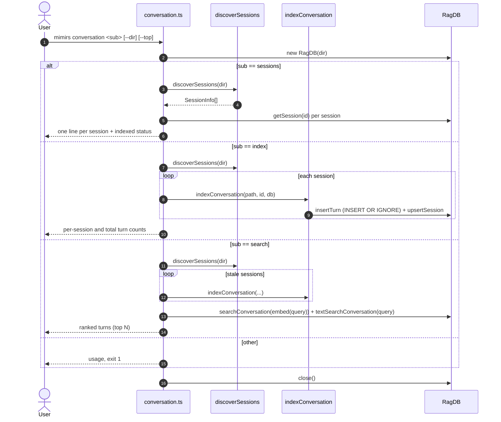

# CLI: conversation

`mimirs conversation` works with the transcripts of past Claude Code sessions for
the current project. It can list the session files Claude Code wrote to disk,
ingest their turns into the local index, and run a hybrid (vector + keyword)
search over those turns. This is the command-line counterpart to the
[search_conversation](../tools/search-conversation.md) MCP tool: same underlying
tables and search logic, exposed for terminal use and for one-off bulk indexing.

The command is a small dispatcher. It reads the subcommand from `args[1]`,
resolves the project directory from `--dir` (defaulting to `.`), opens the
project's `RagDB`, and branches on `search`, `sessions`, or `index`. Any other
value prints usage and exits with code `1`. The database is closed at the end in
all branches (`src/cli/commands/conversation.ts:9-103`).

## Where session transcripts come from

Claude Code stores each session as a JSONL file under
`~/.claude/projects/<encoded-path>/`, where the project path has every `/`
replaced with `-`. `discoverSessions` builds that directory name, globs for
`*.jsonl`, stats each file, and returns one `SessionInfo` per file (session id,
full path, mtime, size), sorted most-recent-first. If the project directory has
never been opened in Claude Code, the glob throws and the function returns an
empty list rather than erroring (`src/conversation/parser.ts:292-323`).

The session id is just the filename with `.jsonl` stripped
(`src/conversation/parser.ts:302`). Nothing in this command writes those JSONL
files; they are produced by Claude Code itself. This command only reads them.

## Relationship to live tailing during `server start`

`conversation index` is the manual, batch counterpart to the live tail that the
MCP server starts on launch. The same module exports `startConversationTail`,
which `watch`es a single JSONL file and, after a 1.5s debounce, calls the same
`indexConversation` to ingest only the bytes appended since the last read
(`src/conversation/indexer.ts:91-147`). The CLI command, by contrast, re-reads
each discovered session from offset `0` every time it runs. Both paths land in
the same `conversation_turns` / `conversation_chunks` tables, and both rely on
`INSERT OR IGNORE` to avoid creating duplicate rows. See
[server start](../server/start.md) for the tailing side.

## Flow



1. The user runs the command with a subcommand and optional `--dir` / `--top`.
   The directory is resolved and a `RagDB` is opened
   (`src/cli/commands/conversation.ts:10-12`).
2. `sessions` discovers every transcript file for the project
   (`src/cli/commands/conversation.ts:70`).
3. For each session it looks up the stored row via `getSession` to report
   whether it has been indexed and how many turns it holds
   (`src/cli/commands/conversation.ts:74-79`).
4. `index` discovers sessions and indexes every one from the start, summing the
   newly inserted turns (`src/cli/commands/conversation.ts:82-95`).
5. `indexConversation` reads the JSONL, parses turns, inserts each as a row plus
   embedded chunks, then updates the session's stats and read offset
   (`src/conversation/indexer.ts:14-51`).
6. `search` first re-indexes only sessions whose file mtime is newer than the
   stored mtime (or that were never indexed), so results are fresh without a
   separate `index` run (`src/cli/commands/conversation.ts:25-31`).
7. It then embeds the query and runs vector + keyword search, merges the two
   result sets by score, and prints the top results
   (`src/cli/commands/conversation.ts:34-67`).
8. Any unrecognized subcommand prints usage and exits `1`
   (`src/cli/commands/conversation.ts:97-100`).

## Inputs

| name | type | required | description |
|------|------|----------|-------------|
| subcommand | `search` \| `sessions` \| `index` | yes | Read from `args[1]`; any other value prints usage and exits `1` (`src/cli/commands/conversation.ts:10`, `97-100`). |
| query | string | yes for `search` | The free-text search query, `args[2]`. Missing it prints usage and exits `1` (`src/cli/commands/conversation.ts:15-19`). |
| `--dir` | path | no | Project directory; resolved, defaults to `.` (`src/cli/commands/conversation.ts:11`). Determines which `~/.claude/projects/` folder is scanned. |
| `--top` | integer | no (`search` only) | Max results to return. Defaults to `config.searchTopK` (`src/cli/commands/conversation.ts:22`). |

## Outputs

| output | where it lands / shape / description |
|--------|--------------------------------------|
| session listing | stdout: one line per session — short id, ISO date (from mtime), `N turns indexed` or `not indexed`, and size in KB (`src/cli/commands/conversation.ts:74-79`). Empty list prints "No conversation sessions found for this project." |
| ranked turns | stdout: per result, `Turn <index> (<timestamp>) [tool, tool]`, a 200-char snippet, and up to 5 referenced files. Empty result prints "No conversation results found." (`src/cli/commands/conversation.ts:56-67`). |
| indexed turn rows | Inserted/ignored rows in `conversation_turns` + `conversation_chunks`, plus updated `conversation_sessions` stats. `index` prints per-session counts (only when > 0) and a grand total (`src/cli/commands/conversation.ts:86-95`). |

## State changes

**`conversation_sessions` and `conversation_turns` gain rows for new turns.**

- *Before*: the turns/sessions tables hold whatever was indexed by a prior
  `index` run or by the live tail — possibly nothing.
- *After*: each new turn in each session JSONL has a row in
  `conversation_turns` plus one or more embedded rows in `conversation_chunks`,
  and the session's `turn_count`, `total_tokens`, and `read_offset` are updated.
- *Why it matters*: this is the searchable store. Every later
  conversation search (CLI or the
  [search_conversation](../tools/search-conversation.md) tool) reads from these
  tables.
- *Code*: `indexConversation` parses entries, inserts each turn via `indexTurn`,
  then calls `upsertSession` and `updateSessionStats`
  (`src/conversation/indexer.ts:33-50`). `insertTurn` uses `INSERT OR IGNORE`
  keyed on `(session_id, turn_index)` and returns `0` when the row already
  exists, so re-indexing does not duplicate turns
  (`src/db/conversation.ts:56-91`).

## Branches and failure cases

| branch | behavior |
|--------|----------|
| `search` with no query | Prints usage, exits `1` (`src/cli/commands/conversation.ts:16-19`). |
| `search`, all sessions current | No re-index; only sessions whose stored mtime is older than the file (or unindexed) are re-read (`src/cli/commands/conversation.ts:27-31`). |
| `search`, FTS throws | The BM25 call is wrapped in `try/catch`; on failure `bm25Results` stays empty and only vector results contribute (`src/cli/commands/conversation.ts:36-39`). |
| `search`, no matches | Prints "No conversation results found." (`src/cli/commands/conversation.ts:56-57`). |
| `sessions`, none found | Prints "No conversation sessions found for this project." (`src/cli/commands/conversation.ts:71-72`). |
| `index`, none found | Same empty message; no indexing attempted (`src/cli/commands/conversation.ts:83-84`). |
| `index`, all turns already present | `insertTurn` ignores duplicates, so `turnsIndexed` is `0`; that session's per-line log is skipped and the total reflects only new turns (`src/cli/commands/conversation.ts:91-92`). |
| empty / unreadable JSONL | `readJSONL` returns no entries past the offset; `indexConversation` returns `turnsIndexed: 0` early (`src/conversation/indexer.ts:24-26`, `src/conversation/parser.ts:76-78`). Malformed lines are skipped silently (`src/conversation/parser.ts:94-98`). |
| unknown subcommand | Prints usage, exits `1` (`src/cli/commands/conversation.ts:97-100`). |

## How a turn is built

`parseTurns` walks the user/assistant messages in order. A new turn starts only
at a user message that has real text and no tool result; subsequent assistant
text, tool uses, and tool results accumulate into that turn until the next such
user message (`src/conversation/parser.ts:111-255`). Tool results for
`Read`/`Glob`/`Write`/`Edit`/`NotebookEdit` are dropped from the indexed text
unless they are short (≤ 500 chars), because their content is already covered by
the code index (`src/conversation/parser.ts:60-63`, `214-227`). `buildTurnText`
joins user text, assistant text, and kept tool results into the string that gets
chunked and embedded (`src/conversation/parser.ts:261-277`).

## Hybrid search scoring

The query embedding feeds `searchConversation` (vector) and the raw query feeds
`textSearchConversation` (BM25). Results are merged into one map keyed by
`turnId`: vector scores are multiplied by `config.hybridWeight`, BM25 scores by
`1 - config.hybridWeight`, and overlapping turns sum both contributions. The map
is sorted by combined score and sliced to `top`
(`src/cli/commands/conversation.ts:41-54`).

## Example

```bash
# List session transcripts for this project and their index status
bun run mimirs conversation sessions

# Index every session from scratch (idempotent)
bun run mimirs conversation index

# Search past turns, top 5
bun run mimirs conversation search "why did we switch to sqlite-vec" --top 5
```

Illustrative `search` output:

```
Turn 12 (2026-05-20T14:03:11Z) [search, read_relevant]
  User: why did we switch to sqlite-vec  Assistant: we moved off the previous...
  Files: src/db/index.ts, src/db/conversation.ts
```

## Open question

The live tail (`startConversationTail`) is not guarded by the index lock, so a
second mimirs process indexing the same session first can leave the tail's
in-memory offset and turn index stale, since it only advances when
`turnsIndexed > 0` (`src/conversation/indexer.ts:97-123`). The CLI `index`
command always reads from offset `0`, so it is not affected by that drift, but
concurrent CLI + server runs share the same tables.

## Key source files

- `src/cli/commands/conversation.ts` — subcommand dispatch, hybrid search merge,
  output formatting.
- `src/conversation/parser.ts` — session discovery, JSONL reading, turn parsing,
  indexable-text construction.
- `src/conversation/indexer.ts` — per-turn chunking/embedding/insert and session
  stat updates; also the live tail used by the server.
- `src/db/conversation.ts` — `insertTurn` (duplicate-safe), `getSession`,
  vector and keyword search queries.
