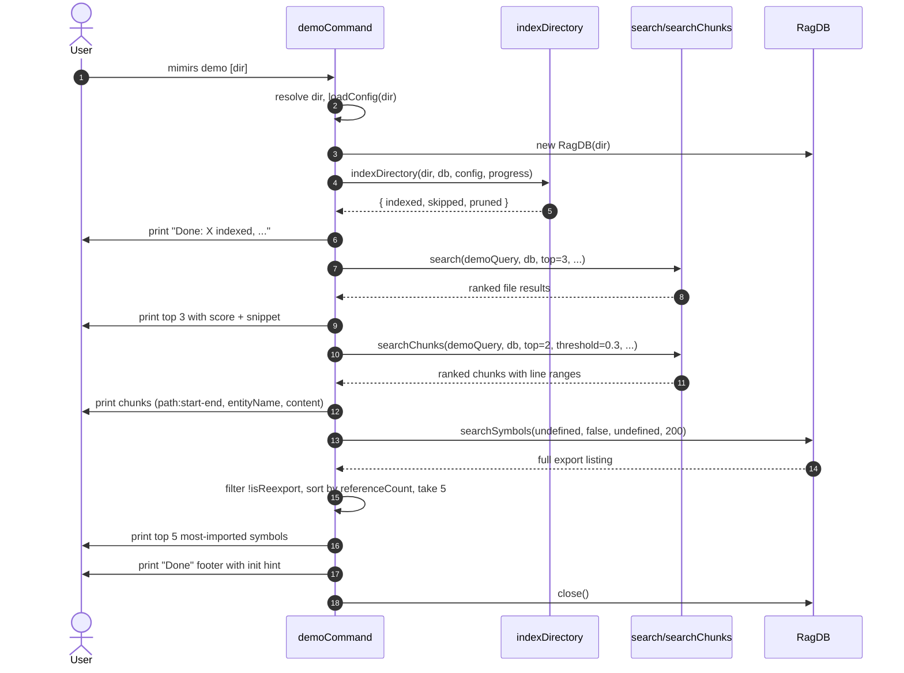

# CLI: demo

`mimirs demo [dir]` is a guided walkthrough aimed at first-time users.
It runs the four most-useful read paths — index, `search`,
`read_relevant`, and `search_symbols` listing mode — against a real
project directory, with a fixed sample query, and prints the kind of
output an agent would see from the MCP tools. Reach for it when you
have just installed mimirs and want to confirm that everything works
end to end before wiring it into Claude Code or another IDE.

The demo always indexes the target directory first; it does not assume
an existing index. The "sample data" is whatever code lives at the
path you pass — there is no bundled corpus.

## Flow



1. The user runs `mimirs demo` optionally with a directory. The CLI
   resolves the first positional argument to an absolute path; if it
   starts with `--` or is missing, `.` is used
   (`src/cli/commands/demo.ts:37`).
2. The CLI prints a header, opens a fresh `RagDB` on that directory,
   and calls `loadConfig(dir)` so the demo uses the project's
   embedding model, hybrid weight, and ignore lists.
3. `indexDirectory` is invoked with a custom progress callback. The
   callback parses the `"Found N files to index"` event and, from
   that point on, suppresses per-file chatter via
   `createQuietProgress`, so the demo's "step 1" output stays compact
   even on big projects (`src/cli/commands/demo.ts:48-56`).
4. The indexer returns counts for `indexed`, `skipped` and `pruned`.
   The CLI prints them and pauses 500ms to let the user follow along
   (`src/cli/commands/demo.ts:57-60`).
5. **Step 2 — `search`**: The demo runs `search` with the fixed query
   `"AST-aware chunking with tree-sitter"`, takes the top 3, prints
   each as `score  relative-path` followed by the first snippet (up
   to 3 lines, wrapped at 96 columns)
   (`src/cli/commands/demo.ts:62-80`).
6. **Step 3 — `read_relevant`**: The demo calls `searchChunks` with
   `top=2` and `threshold=0.3` and prints each chunk with its line
   range, entity name, and up to 18 lines of content. This is the
   same shape that the `read_relevant` MCP tool returns to agents
   (`src/cli/commands/demo.ts:82-99`).
7. **Step 4 — `search_symbols` listing**: The demo lists up to 200
   exported symbols, filters out re-exports, sorts by
   `referenceCount` descending, and prints the top 5 with their
   importer count and module count
   (`src/cli/commands/demo.ts:101-118`).
8. The footer prints a hint to run `bunx mimirs init --ide claude` (or
   another IDE) and the docs URL, then the DB is closed
   (`src/cli/commands/demo.ts:120-125`).

## Inputs

| Input | Source | Notes |
| --- | --- | --- |
| `directory` | first positional arg | Optional. Resolved against the shell CWD; defaults to `.`. The argument is only accepted as a directory when it does not start with `--`. |

The demo also reads project config from disk via `loadConfig(dir)` —
specifically `hybridWeight` and `generated` are passed into the
`search` and `searchChunks` calls. Embedding model selection is
governed by whatever the config and `RagDB` agree on.

## Outputs

| Output | What happens |
| --- | --- |
| Interactive demo output | Multi-section ANSI-colored text on stdout, with short pauses between sections to make the walkthrough readable. |

The demo also has a real side effect: indexing the directory. After
the run, the project's `.mimirs` database contains a current index for
that path. Subsequent searches (CLI or MCP) will return results
without re-indexing.

## What the four steps look like

The shapes match the MCP tool output one-to-one — the demo is the
fastest way to learn them.

- `search` rows: `score  path` + truncated snippet block.
- `read_relevant` rows: `[score]  path:start-end  entityName` + an
  18-line excerpt of the chunk's content. This mirrors the format
  the agent receives.
- `search_symbols` (listing mode) rows: symbol name, symbol type,
  importer count, count of distinct modules that import it. The
  listing comes from `db.searchSymbols(undefined, false, undefined,
  200)` — the first argument is the query, which is omitted to
  request the export listing mode.

## Branches and failure cases

- **No matching `search` results**: when the fixed sample query
  returns nothing (very small projects, or projects with no
  tree-sitter or AST content), step 2 prints
  `"No results — try a query related to your project."`
  (`src/cli/commands/demo.ts:77-79`).
- **No chunks above threshold for `read_relevant`**: step 3 prints
  `"No chunks above threshold."` and moves on
  (`src/cli/commands/demo.ts:96-98`).
- **No exported symbols indexed**: step 4 prints
  `"No exported symbols indexed yet."`
  (`src/cli/commands/demo.ts:115-117`). This will happen on
  freshly-indexed projects with only non-code content, or when the
  symbol table is empty.
- **Empty directory or all files pruned**: `indexDirectory` still
  reports zeros and the demo continues, but every later step will
  fall into its "empty" branch.

## Audience: first-time users

The demo is intentionally scripted. Pauses, headers like
`--- 1. Index your project ---`, color codes (cyan headers, yellow
scores, magenta importer counts, dim snippet bodies), and the final
init hint are all aimed at someone seeing mimirs output for the first
time. It is not meant to be parsed by a tool or piped into a buffer —
the ANSI codes will leak. For machine consumption, use the
corresponding MCP tools directly.

## Example

```
mimirs demo
# → mimirs demo
#   Running against: /Users/example/project
#
#   --- 1. Index your project ---
#   ...
#   Done: 124 indexed, 0 skipped, 0 pruned
#
#   --- 2. search — ranked files for a query ---
#   > search "AST-aware chunking with tree-sitter"
#     0.8412  src/indexing/chunker.ts
#       export async function chunkText(...)
#
#   --- 3. read_relevant — ranked chunks with exact line ranges ---
#   ...
#
#   --- 4. search_symbols — most-referenced symbols in the codebase ---
#   ...
#
#   --- Done ---
#   Add mimirs to your editor:
#     bunx mimirs init --ide claude
```

## Open questions

- The discovery packet asked whether the demo indexes a sample or uses
  an existing index. The source answers it: the demo always calls
  `indexDirectory(dir, db, config, progress)` first
  (`src/cli/commands/demo.ts:56`), so it indexes whatever directory
  you point it at. There is no bundled sample corpus. The "sample
  data" is your own project.

## Key source files

- `src/cli/commands/demo.ts` — the entire scripted demo.
- `src/indexing/indexer.ts` — `indexDirectory` does the actual file
  indexing.
- `src/search/hybrid.ts` — `search` and `searchChunks` power steps 2
  and 3.
- `src/db/index.ts` — `RagDB.searchSymbols` powers step 4.
- `src/cli/progress.ts` — `cliProgress` and `createQuietProgress`
  control how indexing chatter is rendered.

## Related flows

- [cli/search](./search.md) — the standalone CLI for the `search`
  step shown by the demo.
- [cli/map](./map.md) — text dependency graph from the same DB the
  demo just populated.
