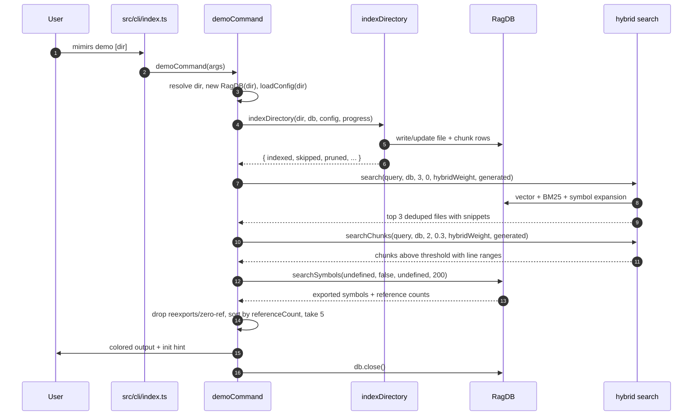

# CLI: demo

`mimirs demo` is a guided, mostly read-only tour of the core search features. It indexes a project once, then runs three of the most-used capabilities — file search, chunk-level reading, and symbol listing — against one fixed query, printing colored, paced terminal output. It exists so a first-time user can see what mimirs does end to end in a single command, without first learning the flag surface of `index`, `search`, `read`, and `search_symbols`. The closing screen points them at `mimirs init` to wire the tools into an editor.

The whole flow lives in one handler, `demoCommand`, in `src/cli/commands/demo.ts:36`. It is deliberately thin: it calls the same library functions the real CLI commands and MCP tools call, so the output is representative of actual behavior rather than mocked.

## How it is reached

The CLI entry parses `process.argv` once at module load — `args = process.argv.slice(2)` and `command = args[0]` (`src/cli/index.ts:26-27`). When the command is `demo`, `dispatch()` hits its `case "demo"` and calls `demoCommand(args)` (`src/cli/index.ts:173-174`). The entire `args` array is forwarded, so inside the handler `args[0]` is still the literal string `"demo"` and `args[1]` is the optional directory.

The handler resolves the target directory defensively: it uses `args[1]` only when it exists and does not start with `--`, otherwise it falls back to the current directory, then makes the result absolute with `resolve` (`src/cli/commands/demo.ts:37`). So `mimirs demo` and `mimirs demo .` behave identically, and a stray flag passed where a path is expected is ignored rather than mistaken for a directory.

## What runs, step by step



1. **Setup.** The handler prints a banner and the resolved target directory, then opens the database with `new RagDB(dir)` and loads project settings with `loadConfig(dir)` (`src/cli/commands/demo.ts:45-46`). Both are the same primitives every other command uses, so the demo reads and writes the real `.mimirs` index for that directory — it is not a sandbox.

2. **Index the project.** Section 1 calls `indexDirectory(dir, db, config, progress)` and awaits it (`src/cli/commands/demo.ts:56`). This is the only step that mutates state; everything after it is read-only. Indexing first, so the search sections have data to return, is the reason the order is fixed.

3. **Report the index result.** `indexDirectory` returns an `IndexResult` carrying `indexed`, `skipped`, and `pruned` counts (`src/indexing/indexer.ts:46`). The demo prints them on one green `Done:` line (`src/cli/commands/demo.ts:57-59`), then pauses 500 ms via `pause` (`src/cli/commands/demo.ts:21`). The pacing exists purely so a human reading along can keep up.

4. **Search demo (files).** Section 2 runs `search(demoQuery, db, 3, 0, config.hybridWeight, config.generated)` and keeps the first three results (`src/cli/commands/demo.ts:67`). `search` returns one entry per file — a `DedupedResult` with `path`, `score`, and `snippets` — collapsed so each file appears once with its best score (`src/search/hybrid.ts:39-43`). For each result the demo prints the score in yellow, the path relative to the target dir, and the first snippet, truncated by `renderBlock` to three lines at 96 columns (`src/cli/commands/demo.ts:69-76`).

5. **Read demo (chunks).** Section 3 runs `searchChunks(demoQuery, db, 2, 0.3, config.hybridWeight, config.generated)` (`src/cli/commands/demo.ts:85`). Unlike `search`, this returns individual semantic chunks with no file deduplication, and each `ChunkResult` carries `startLine`, `endLine`, and an optional `entityName` (`src/search/hybrid.ts:46-56`). The demo renders a `path:start-end` locator plus the entity name when present, then up to 18 lines of the chunk body (`src/cli/commands/demo.ts:87-94`). The `0.3` argument is a relevance floor — merged candidates scoring below it are dropped inside `searchChunks` (`src/search/hybrid.ts:514`).

6. **Symbol listing demo.** Section 4 calls `db.searchSymbols(undefined, false, undefined, 200)` (`src/cli/commands/demo.ts:102`). Passing no query puts `searchSymbols` into listing mode (`isListing = !query`), which returns up to 200 exported symbols with per-symbol metadata instead of matching a name (`src/db/search.ts:245-246`). The demo then filters out re-exports and zero-reference symbols, sorts by `referenceCount` descending, and keeps the top five (`src/cli/commands/demo.ts:103-106`). Each line shows the symbol name, its type, how many importer files reference it, and across how many modules — see the State changes section below.

7. **Closing screen and cleanup.** A final "Done" header prints the `mimirs init` hint and a docs link (`src/cli/commands/demo.ts:120-123`), and the handler closes the database with `db.close()` (`src/cli/commands/demo.ts:125`). There is no explicit `process.exit`; the command simply returns.

## Inputs

| name | type | required | description |
| --- | --- | --- | --- |
| `[dir]` | positional string | no | Project directory to demo against. Taken from `args[1]` only when present and not starting with `--`; otherwise defaults to `.` and is resolved to an absolute path (`src/cli/commands/demo.ts:37`). |

Two values come from the loaded config rather than from flags: `config.hybridWeight` (the vector-vs-keyword blend, default `0.5`) and `config.generated` (glob patterns whose matches get demoted in chunk ranking, default empty). Both are passed straight into `search` and `searchChunks` (`src/cli/commands/demo.ts:67`, `src/cli/commands/demo.ts:85`; defaults at `src/config/index.ts:23` and `src/config/index.ts:115`). The query itself is not a user input — it is hard-coded as `"AST-aware chunking with tree-sitter"` (`src/cli/commands/demo.ts:62`) so the demo is reproducible across runs.

## Outputs

| output | where it lands / shape / description |
| --- | --- |
| Colored demo output | Written to stdout via `cli.log` with raw ANSI escape codes for color and dimming (`src/cli/commands/demo.ts:9-15`). Four numbered sections plus a closing screen, paced with 500 ms pauses between sections. |
| File and chunk index rows | Created or refreshed in the project's `.mimirs` SQLite database as a side effect of the indexing step (`src/cli/commands/demo.ts:56`). This is persistent state, not transient output. |

## State changes

| name | before | after | trigger | why it matters |
| --- | --- | --- | --- | --- |
| file and chunk index rows | not indexed (or stale) | indexed / up to date | `indexDirectory(dir, db, config, progress)` | The search sections need data to return; skipping the index would leave stale or missing rows and produce empty demos. |

The demo's first real action is to index, and `indexDirectory` writes file and chunk rows into the SQLite-backed `RagDB` (`src/cli/commands/demo.ts:56`, returning `IndexResult` from `src/indexing/indexer.ts:46`). Because the demo opens the project's actual database, running it does real, persistent indexing work — it is not throwaway. Two consequences follow: the first run on a large project can be slow while embeddings are computed, and a second `mimirs demo` is fast because most files are skipped as unchanged (reflected in the `skipped` count on the `Done:` line).

Ranking metadata is computed but **not** stored. `referenceCount` and `referenceModuleCount` are derived on the fly inside `searchSymbols` from the resolved imports graph each time it runs (`src/db/search.ts:401-402`). `referenceCount` is the number of distinct importer files that resolve to a file exporting that name (`importerIds.size`), and `referenceModuleCount` is the number of distinct directories those importers live in (`refDirs.size`, where `refDirs` collects `dirname` of each importer path) (`src/db/search.ts:387-402`). The demo line reads, for example, `8 importers across 3 modules`, with the singular/plural of "module" chosen from `referenceModuleCount` (`src/cli/commands/demo.ts:111`).

## Branches and failure cases

- **Default directory.** When `args[1]` is missing or begins with `--`, the directory falls back to `.` before resolution (`src/cli/commands/demo.ts:37`). A flag passed where a path is expected is therefore ignored rather than treated as a path.

- **Quiet vs. plain progress.** The progress callback watches each message for `Found N files to index`, which `indexDirectory` emits after collecting files (`src/indexing/indexer.ts:736`). On match it builds a single updating progress line with `createQuietProgress`; before that match, and for any message the quiet renderer suppresses, it falls back to `cliProgress` (`src/cli/commands/demo.ts:49-54`). So once the file count is known the user sees a compact `Indexing: X/Y files (Z%)` line (`src/cli/progress.ts:53`) rather than per-file noise.

- **Index lock held by another process.** If another mimirs process (commonly the running MCP server) holds the directory's index lock, `indexDirectory` returns immediately with `indexed: 0, skipped: 0, pruned: 0`, `locked: true`, and a `lockReason`, after emitting an "Another mimirs process owns the index lock for this directory." progress message (`src/indexing/indexer.ts:722-730`). The demo does not inspect `result.locked`, so it prints `Done: 0 indexed, 0 skipped, 0 pruned` and continues; the search sections then run against whatever was already indexed.

- **Empty file search.** When `search` returns nothing, section 2 prints `No results — try a query related to your project.` instead of result lines (`src/cli/commands/demo.ts:77-78`). This is the expected outcome on a project that has no code matching the fixed query.

- **No chunks above threshold.** When `searchChunks` returns an empty list — for example when every merged candidate scores below the `0.3` floor — section 3 prints `No chunks above threshold.` (`src/cli/commands/demo.ts:96-97`).

- **No referenceable symbols.** After dropping re-exports and zero-reference symbols, if nothing remains the symbol section prints `No exported symbols indexed yet.` (`src/cli/commands/demo.ts:115-116`). This happens on a freshly indexed project with no resolved cross-file imports, or one whose language has no export extraction.

- **FTS unavailable.** Inside both `search` and `searchChunks`, a failure in the BM25 full-text query is caught and logged at debug level, and the function falls back to vector-only results (`src/search/hybrid.ts:349-350`, `src/search/hybrid.ts:508-509`). The demo never sees the error; it just gets slightly different ranking.

- **No `process.exit`.** The handler closes the DB and returns; it never forces an exit code, so a thrown error (for example from `loadConfig` on malformed config) propagates up to `main`'s try/catch in `src/cli/index.ts:96-106` rather than being swallowed here.

## Example

```
$ mimirs demo
mimirs demo
Running against: /path/to/project

--- 1. Index your project ---
Indexing files with AST-aware chunking...
Found 174 files to index
Indexing: 174/174 files (100%)
Done: 174 indexed, 0 skipped, 0 pruned

--- 2. search — ranked files for a query ---
> search "AST-aware chunking with tree-sitter"

  0.7421  src/indexing/chunker.ts
    export function chunkText(...) {
    …

--- 3. read_relevant — ranked chunks with exact line ranges ---
> read_relevant "AST-aware chunking with tree-sitter"

  [0.74] src/indexing/chunker.ts:42-118  chunkText
    ...

--- 4. search_symbols — most-referenced symbols in the codebase ---
> search_symbols   # listing mode, ranked by import count

  RagDB (class)  31 importers across 9 modules
    src/db/index.ts

--- Done ---
Add mimirs to your editor:
  bunx mimirs init --ide claude   # or: cursor, windsurf, copilot, jetbrains, all
```

Scores, counts, paths, and line ranges above are illustrative; the actual values depend on the project being indexed.

## Related commands

The demo is a thin orchestration of capabilities that each have their own dedicated command:

- [index](index.md) — the standalone command around `indexDirectory`, the same indexing step section 1 runs.
- [search](search.md) — the `search` and `read` commands, which call the same `search` and `searchChunks` functions sections 2 and 3 demonstrate.

## Key source files

- `src/cli/commands/demo.ts` — the entire `demoCommand` handler: directory resolution, the four demo sections, color helpers, and the `renderBlock`/`pause` utilities.
- `src/cli/index.ts` — argv parsing and the `demo` dispatch case that calls `demoCommand`.
- `src/search/hybrid.ts` — `search` (file-level, deduplicated) and `searchChunks` (chunk-level, with line ranges) used by sections 2 and 3.
- `src/db/search.ts` — `searchSymbols`, whose listing mode and `referenceCount`/`referenceModuleCount` drive the section 4 ranking.
- `src/indexing/indexer.ts` — `indexDirectory` and the `IndexResult` shape reported on the `Done:` line, plus the index-lock early return.
- `src/cli/progress.ts` — `cliProgress` and `createQuietProgress`, which format the indexing progress line.
