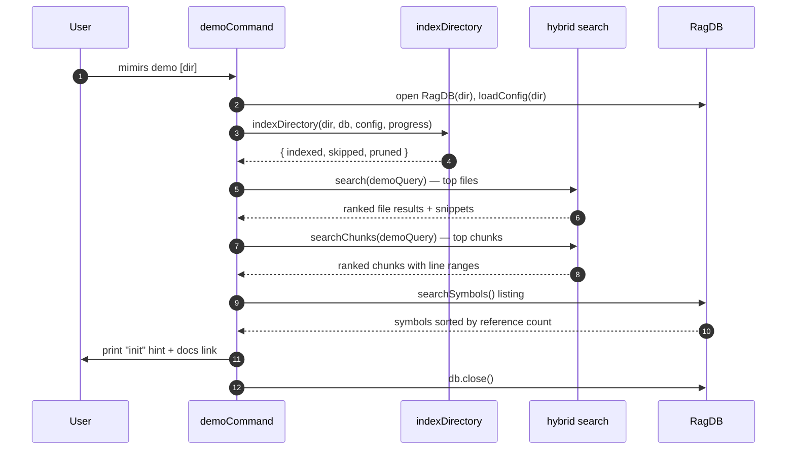

# CLI: demo

`mimirs demo` is a guided, first-run walkthrough. It indexes a directory and then runs three of mimirs' core retrieval features against it — semantic file search, ranked code-chunk reading, and a most-referenced-symbols listing — printing colorized output with short pauses between sections. The goal is to let a brand-new user see, in one command, what mimirs does and what its output looks like before wiring it into an editor.

It does not ship its own sample corpus. It indexes whatever directory you point it at — the current directory by default — so the output reflects your real project (`src/cli/commands/demo.ts:37`, `src/cli/commands/demo.ts:45-56`).

## How it works



1. The target directory is resolved from the first positional argument, or `.` when none is given or the first argument is a flag (`src/cli/commands/demo.ts:37`).
2. The command opens the database for that directory and loads its configuration (`src/cli/commands/demo.ts:45-46`).
3. Section 1 indexes the directory. A progress callback prints live progress; once it sees a `Found N files to index` message it switches to a quieter progress renderer scaled to that file count. When indexing finishes it prints a `Done: N indexed, N skipped, N pruned` summary (`src/cli/commands/demo.ts:42-59`).
4. Section 2 runs `search` for a fixed demo query and prints up to three ranked files, each with its score and the first snippet, trimmed to a few lines (`src/cli/commands/demo.ts:64-79`).
5. Section 3 runs `searchChunks` for the same query and prints up to two ranked chunks with their score, file path, line range, optional entity name, and a longer content preview (`src/cli/commands/demo.ts:82-98`).
6. Section 4 lists indexed symbols, keeps only non-reexports with at least one importer, sorts by reference count, and prints the top five most-referenced symbols (`src/cli/commands/demo.ts:101-117`).
7. It prints a closing hint showing how to add mimirs to an editor with `init`, plus a docs link, then closes the database (`src/cli/commands/demo.ts:120-125`).

Between each section there is a half-second pause so the output reads as a paced walkthrough rather than a wall of text (`src/cli/commands/demo.ts:21-23`, `src/cli/commands/demo.ts:60`).

## Inputs

| name | type | required | description |
| --- | --- | --- | --- |
| directory | positional string | no | Directory to index and demo against. Used when present and not starting with `--`; otherwise the current directory `.`. Resolved to an absolute path (`src/cli/commands/demo.ts:37`). |

## Outputs

| output | where it lands / shape / description |
| --- | --- |
| Index summary | `Done: N indexed, N skipped, N pruned` printed after indexing (`src/cli/commands/demo.ts:57-59`). |
| Search section | Up to three ranked files: score, project-relative path, and the first snippet trimmed to three lines at 96 columns (`src/cli/commands/demo.ts:68-79`). |
| Read-relevant section | Up to two ranked chunks: score, path with `:start-end` line range, optional entity name, and content preview up to 18 lines (`src/cli/commands/demo.ts:86-98`). |
| Symbols section | Up to five symbols by import count: name, type, importer count, module count, and path (`src/cli/commands/demo.ts:108-117`). |
| Closing hint | The `init` example and docs URL printed at the end (`src/cli/commands/demo.ts:120-123`). |
| Persisted index | The directory is fully indexed into `.mimirs/`; this is a real side effect, not a throwaway. See State changes. |

## The fixed demo query

All retrieval sections use one hard-coded query string, `"AST-aware chunking with tree-sitter"` (`src/cli/commands/demo.ts:62`). This is chosen to surface mimirs' own indexing internals when the demo is run inside a codebase that mentions chunking, but against an unrelated project it may return nothing — the demo handles that gracefully (see Branches). The same query feeds both the file search and the chunk search so the two sections illustrate the difference between file-level and chunk-level retrieval on identical input.

## What each section shows

| Section | Call | Shape shown |
| --- | --- | --- |
| 2. search | `search(query, db, 3, 0, config.hybridWeight, config.generated)`, then sliced to 3 | Ranked files: `score  path` plus first snippet (`src/cli/commands/demo.ts:67-70`) |
| 3. read_relevant | `searchChunks(query, db, 2, 0.3, config.hybridWeight, config.generated)` | Ranked chunks: `[score] path:start-end entityName` plus content (`src/cli/commands/demo.ts:85-90`) |
| 4. search_symbols | `db.searchSymbols(undefined, false, undefined, 200)`, filtered and sorted | Top symbols by importer count: `name (type)  N importers across M modules` (`src/cli/commands/demo.ts:102-112`) |

The chunk search passes a `0.3` relevance threshold, so section 3 only shows chunks above that score, while section 2's file search uses threshold `0` (`src/cli/commands/demo.ts:67`, `src/cli/commands/demo.ts:85`). Both searches read `config.hybridWeight` and `config.generated` so the demo honors the project's configured blend of keyword vs semantic ranking and its generated-file handling.

## State changes

### Project index in `.mimirs/`

- **Before:** the directory may be unindexed or have a stale index.
- **After:** the directory is freshly indexed — files added, unchanged ones skipped, deleted ones pruned.
- This is a genuine, persistent side effect. `indexDirectory` writes into the real `RagDB` for the directory, the same database the editor's MCP server would use. The returned counts (`indexed`, `skipped`, `pruned`) are printed as the section-1 summary (`src/cli/commands/demo.ts:56-59`). Running the demo is therefore equivalent to indexing the project, not a sandboxed dry run.

## Branches and failure cases

- **No directory argument or a leading flag:** defaults to the current directory `.` (`src/cli/commands/demo.ts:37`).
- **Progress mode switch:** the progress callback uses the quiet renderer only after it parses a `Found N files to index` message; before that it falls back to the standard CLI progress renderer (`src/cli/commands/demo.ts:49-54`).
- **No search results:** section 2 prints `No results — try a query related to your project.` (`src/cli/commands/demo.ts:77-78`).
- **No chunks above threshold:** section 3 prints `No chunks above threshold.` (`src/cli/commands/demo.ts:96-97`).
- **Missing line range on a chunk:** when `startLine` or `endLine` is null the `:start-end` suffix is omitted (`src/cli/commands/demo.ts:88`).
- **Chunk without an entity name:** the entity label is left blank (`src/cli/commands/demo.ts:89`).
- **No qualifying symbols:** section 4 prints `No exported symbols indexed yet.`; symbols that are re-exports or have zero importers are filtered out before ranking (`src/cli/commands/demo.ts:104-116`).
- **Long content:** `renderBlock` truncates each section's text to a maximum number of lines (3 for search, 18 for chunks) and wraps long lines at 96 columns, appending a `… (+N more lines)` marker when truncated (`src/cli/commands/demo.ts:25-34`).

## Example

```bash
# Demo against the current project
mimirs demo

# Demo against another checkout
mimirs demo /path/to/project
```

Illustrative output (values synthetic):

```
mimirs demo
Running against: /path/to/project

--- 1. Index your project ---
Indexing files with AST-aware chunking...

Done: 128 indexed, 4 skipped, 0 pruned

--- 2. search — ranked files for a query ---
> search "AST-aware chunking with tree-sitter"

  0.8123  src/indexing/chunker.ts
      // splits a file into AST-aware chunks
      …

--- 3. read_relevant — ranked chunks with exact line ranges ---
> read_relevant "AST-aware chunking with tree-sitter"

  [0.79] src/indexing/chunker.ts:10-48  chunkFile
      export function chunkFile(...) {
      …

--- 4. search_symbols — most-referenced symbols in the codebase ---
> search_symbols   # listing mode, ranked by import count

  RagDB (class)  37 importers across 21 modules
    src/db/index.ts

--- Done ---
Add mimirs to your editor:
  bunx mimirs init --ide claude   # or: cursor, windsurf, copilot, jetbrains, all
```

## Related commands

- [cli/search](./search.md) — the standalone search command that section 2 demonstrates.
- [cli/read](./read.md) — the read-relevant command that section 3 demonstrates.
- [cli/init](./init.md) — the editor-wiring command the closing hint points to.

## Key source files

- `src/cli/commands/demo.ts` — the entire walkthrough: indexing, the three retrieval sections, rendering helpers, and the closing hint.
- `src/indexing/indexer.ts` — `indexDirectory`, which performs the section-1 indexing and returns the counts.
- `src/search/hybrid.ts` — `search` and `searchChunks`, the retrieval functions driving sections 2 and 3.
- `src/db/index.ts` — `RagDB`, including `searchSymbols` used by section 4.
- `src/cli/progress.ts` — `cliProgress` and `createQuietProgress` for indexing progress.
- `src/config/index.ts` — `loadConfig`, supplying `hybridWeight` and `generated`.
