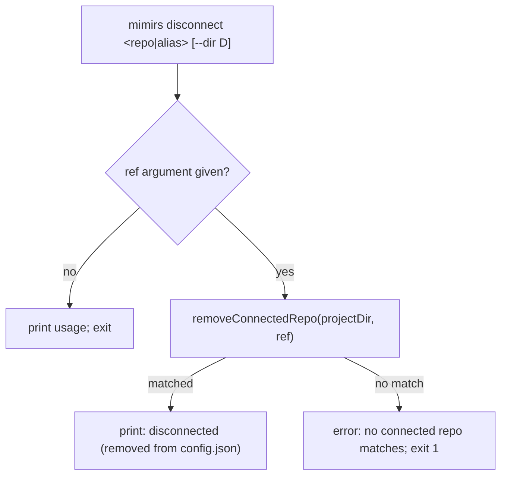

# CLI: disconnect

`mimirs disconnect <repo|alias>` removes a persistent cross-repo connection from
`.mimirs/config.json`. It is the inverse of [connect](./connect.md): where
`connect` appends an entry to `connectedRepos` so the server warm-attaches that
repo on startup, `disconnect` drops the matching entry so future sessions stop
attaching it. The change takes effect for live servers on their next restart.

The command is a thin wrapper over the config layer
(`src/cli/commands/connect.ts:72-82`). It resolves the project directory
(`--dir`, default `.`), requires a single reference argument, and asks
`removeConnectedRepo` to delete the matching entry.



1. **Resolve the project directory.** `--dir` overrides the default of `.`; this
   is the project whose `.mimirs/config.json` is edited
   (`src/cli/commands/connect.ts:73`).
2. **Require a reference.** `queryArg` enforces the single
   `<repo|alias>` argument and prints usage if it is missing
   (`src/cli/commands/connect.ts:74`).
3. **Remove the entry.** `removeConnectedRepo` matches the reference against each
   entry's alias, its stored `path`, or its resolved path, and rewrites
   `connectedRepos` without the matches. It returns `true` when something was
   removed (`src/config/index.ts:317-329`).
4. **Report.** A removal prints a confirmation; no match is a hard error with
   exit 1, so a typo'd alias fails loudly rather than silently doing nothing
   (`src/cli/commands/connect.ts:76-81`).

## How the match and write work

`removeConnectedRepo` is forgiving about *how* you name the connection: the same
entry can be removed by the alias you gave it, by the exact path string stored,
or by any path that resolves to the same directory (`src/config/index.ts:322-324`).
It returns `false` without writing when nothing matched — that is what the
command turns into the exit-1 error. The rewrite goes through the same locked,
atomic `mutateRawConfig` used by `connect`: a `wx` lock around a temp-file +
rename, editing the raw JSON so unrelated config fields are preserved
(`src/config/index.ts:320-328`, `src/config/index.ts:272-295`).

## Inputs

| name | type | required | description |
| --- | --- | --- | --- |
| `repo\|alias` | positional string | yes | The connection to remove, matched by alias, stored path, or resolved path (`src/config/index.ts:322-324`). |
| `--dir` | flag (path) | no | Project directory whose `connectedRepos` is edited; defaults to `.` (`src/cli/commands/connect.ts:73`). |

## Outputs

| output | where it lands / shape / description |
| --- | --- |
| `connectedRepos` rewrite | The matching entry is removed from `.mimirs/config.json` via the locked atomic write (`src/config/index.ts:326-327`). |
| Status line | "Disconnected …" on success, or "No connected repo matches …" on failure. |
| Exit code | `0` when an entry was removed; `1` when none matched (`src/cli/commands/connect.ts:80`). |

## State changes

| Item | Before | After | Why it matters |
| --- | --- | --- | --- |
| Connected repo entry | saved in `connectedRepos` | absent | Future server sessions stop warm-attaching that repo, and read tools can no longer target it by path or alias. Written by `removeConnectedRepo` (`src/config/index.ts:326-327`). |

## Branches and failure cases

- **Missing argument** — `queryArg` prints the usage string and stops
  (`src/cli/commands/connect.ts:74`).
- **No config file** — `removeConnectedRepo` returns `false` immediately when
  `.mimirs/config.json` does not exist, surfacing as the no-match error
  (`src/config/index.ts:318-319`).
- **No matching entry** — error, exit 1 (`src/cli/commands/connect.ts:78-80`).
- **Match removed** — confirmation printed, file rewritten
  (`src/cli/commands/connect.ts:76-77`).

## Example

```console
$ mimirs disconnect backend
Disconnected "backend" (removed from .mimirs/config.json).
```

## Key source files

- `src/cli/commands/connect.ts` — `disconnectCommand` (and its sibling
  `connectCommand`).
- `src/config/index.ts` — `removeConnectedRepo` and the locked atomic
  `mutateRawConfig` write.
- `src/cli/index.ts:151-152` — the `disconnect` case in the CLI dispatch switch.
