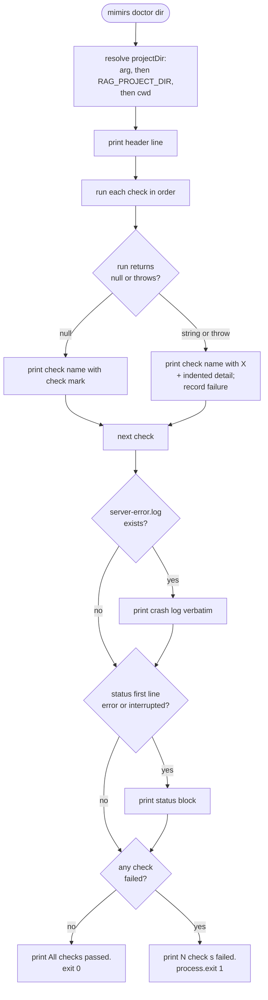

# CLI: doctor

`mimirs doctor` runs a sequence of environment checks that reproduce, in the foreground, the work the MCP server does at startup. The server is launched as a detached background process by your editor, so when it fails to come up there is usually no terminal to show the error. `doctor` re-does that startup work where you can see it — confirming the Bun runtime, loading an extension-capable SQLite plus `sqlite-vec`, opening the real database, and importing the embedding module — and prints a pass/fail line plus an actionable fix for each. Run it when the server will not start, when search returns nothing, or right after installing on a new machine.

The command is dispatched from the CLI's `doctor` case, which forwards the raw argument list to the handler (`src/cli/index.ts:171-172`). All of the work lives in `doctorCommand` (`src/cli/commands/doctor.ts:12-240`).

## Why doctor stays lightweight

The point of `doctor` is to run even when the heavy parts of mimirs are broken. Its only top-level imports are `fs`, `path`, `os`, and the CLI logger (`src/cli/commands/doctor.ts:1-5`). Everything that could itself fail to load — `bun:sqlite`, `sqlite-vec`, the database wrapper, the embedding module — is pulled in lazily with `require()` inside the individual check functions (`src/cli/commands/doctor.ts:30-31`, `src/cli/commands/doctor.ts:97`, `src/cli/commands/doctor.ts:166`, `src/cli/commands/doctor.ts:178`). The CLI entry follows the same rule for `serve`: it imports the server module dynamically inside the dispatch switch, because the server's transitive native dependencies and top-level awaits would crash the whole CLI at module-load time and block even `doctor` (`src/cli/index.ts:115-118`, `src/cli/index.ts:17-19`). On top of that, each check is wrapped in a try/catch so a thrown error becomes a recorded failure rather than an uncaught exception that aborts the run (`src/cli/commands/doctor.ts:193-209`).

## How it works

Each check is a `{ name, run }` pair, where `run` returns `null` on success or an error string on failure. The handler iterates the fixed list, prints a mark per check, then reads two best-effort files left behind by a real server launch and finally sets the exit code. Because the value is in the per-check branches, a flowchart fits better than a call sequence:



1. The target directory is resolved from the first positional argument, falling back to the `RAG_PROJECT_DIR` environment variable and then the current working directory, and is then resolved to an absolute path (`src/cli/commands/doctor.ts:14`).
2. The command defines an ordered array of checks. Each `run` returns `null` on success or an error string — often with an indented `Fix:` line — on failure (`src/cli/commands/doctor.ts:7-10`, `src/cli/commands/doctor.ts:17-189`).
3. It prints a header naming the directory under test (`src/cli/commands/doctor.ts:191`).
4. It runs each check in order. A `null` result prints a passing line; a non-null result, or a thrown exception, prints a failing line followed by the indented detail, and is recorded in `results` as a failure (`src/cli/commands/doctor.ts:193-210`).
5. After the checks, it looks for a recent crash log at `.mimirs/server-error.log` and, if present, prints its full contents between `--- Recent crash log ---` markers (`src/cli/commands/doctor.ts:212-219`).
6. It reads the indexing `status` file; only when its first line is exactly `error` or `interrupted` does it print the status block (`src/cli/commands/doctor.ts:221-231`).
7. If no checks failed it prints `All checks passed.` and returns normally; otherwise it prints how many failed and calls `process.exit(1)` (`src/cli/commands/doctor.ts:233-239`).

All output goes to stdout through the shared CLI logger, whose `log` method is a thin `console.log` wrapper (`src/utils/log.ts:51-55`).

## Inputs

| name | type | required | description |
| --- | --- | --- | --- |
| directory | positional string | no | Project directory to diagnose. Falls back to `RAG_PROJECT_DIR`, then the current working directory, then is resolved to an absolute path (`src/cli/commands/doctor.ts:14`). |
| `RAG_PROJECT_DIR` | env var | no | Used as the project directory when no positional argument is given (`src/cli/commands/doctor.ts:14`). |
| `RAG_DB_DIR` | env var | no | When set, the writability probe and the `RagDB` open both target this directory instead of `<projectDir>/.mimirs` (`src/cli/commands/doctor.ts:77-79`, `src/db/index.ts:114-118`). |

The argument array that reaches the handler is the whole CLI token list; index `0` is the command word `doctor`, so the positional directory is read from index `1` (`src/cli/index.ts:26-27`, `src/cli/commands/doctor.ts:14`). The directory is selected with `positionalArg`, so a leading flag token like `-v` is not mistaken for the directory (`src/cli/commands/doctor.ts:13-14`).

## Outputs

| output | where it lands / shape / description |
| --- | --- |
| Per-check status lines | Printed to stdout: a passing line carrying the check name, or a failing line carrying the name plus an indented detail line (`src/cli/commands/doctor.ts:196-208`). |
| Crash log dump | Full contents of `.mimirs/server-error.log` printed between `--- Recent crash log ---` and `--- end ---` markers when that file exists (`src/cli/commands/doctor.ts:213-218`). |
| Indexing status dump | The `.mimirs/status` file contents printed when its first line is `error` or `interrupted` (`src/cli/commands/doctor.ts:226-229`). |
| Summary line | `All checks passed.` or `N check(s) failed. Fix the issues above and retry.` (`src/cli/commands/doctor.ts:235-237`). |
| Exit code | `0` when all checks pass; `1` via `process.exit(1)` when any check fails (`src/cli/commands/doctor.ts:238`). |

## The checks

The checks run in this fixed order. Each reproduces one step the server performs at startup, so a failing line points directly at the part of the startup chain that is broken.

| # | Check | What it verifies | Failure / fix |
| --- | --- | --- | --- |
| 1 | Bun runtime | The global `Bun` object exists; mimirs only runs under Bun (`src/cli/commands/doctor.ts:18-23`). | "Bun runtime not detected. mimirs requires Bun." |
| 2 | SQLite (extension-capable) | Loads `bun:sqlite` and `sqlite-vec`, opens an in-memory DB, loads the extension, and queries `vec_version()`. On macOS it first locates a Homebrew SQLite dylib and registers it with `Database.setCustomSQLite`, because Apple's bundled SQLite cannot load extensions (`src/cli/commands/doctor.ts:25-66`). | macOS: `brew install sqlite`; Linux: install `libsqlite3-dev` / `sqlite-devel`. |
| 3 | Project directory | The resolved project directory exists on disk (`src/cli/commands/doctor.ts:67-73`). | "Directory does not exist: …" |
| 4 | .mimirs directory writable | Creates the data directory (`RAG_DB_DIR` or `<projectDir>/.mimirs`), writes a `.doctor-probe` file, then deletes it (`src/cli/commands/doctor.ts:74-92`). | "Cannot write to … Set RAG_DB_DIR to a writable directory." |
| 5 | Database opens | Constructs `RagDB` for the project and closes it, exercising the real database bring-up (`src/cli/commands/doctor.ts:93-105`). | "Database failed to open: …" |
| 6 | Embedding config matches index | Read-only introspection of an existing `index.db`: compares the stored vector dimension and stored model name against what the currently configured embedding model would produce (`src/cli/commands/doctor.ts:106-159`). | "Index was built with N-dim vectors but the configured model produces M-dim…" / "…built with model X but the configured model is Y…" |
| 7 | sqlite-vec extension | Independently requires the `sqlite-vec` module and confirms it exposes a `load` function (`src/cli/commands/doctor.ts:160-173`). | "sqlite-vec module not found … Fix: bun install sqlite-vec". |
| 8 | Embedding model | Requires the embedding module and confirms its `embed` export is a function. It does not download or run the model (`src/cli/commands/doctor.ts:174-188`). | "Embedding module failed to load: …" |

SQLite extension capability is intentionally verified twice from different angles. The "SQLite (extension-capable)" check loads `sqlite-vec` into a live in-memory database and queries `vec_version()`, proving the extension actually initializes; the later "sqlite-vec extension" check only confirms the module imports and exposes a `load` function (`src/cli/commands/doctor.ts:48-53`, `src/cli/commands/doctor.ts:165-168`). The embedding check is deliberately shallow: it inspects the module's export shape, not a real embedding call, so it stays fast and works offline — the comment in source notes the actual model download is async (`src/cli/commands/doctor.ts:182`). The real `embed` export is an async function defined in `src/embeddings/embed.ts:274`.

### What "Database opens" actually exercises

This is the most thorough live check, because constructing `RagDB` runs the server's full database bring-up. The constructor registers the custom SQLite build via `loadCustomSQLite()`, resolves the data directory the same way the writability probe does, creates it (mapping `EROFS`/`EACCES` to a clear "set RAG_DB_DIR" message), applies the on-disk embedding config so the vector tables are created at the configured dimension, opens `index.db` in WAL mode with a busy timeout, loads `sqlite-vec`, guards against an embedding-dimension and an embedding-model mismatch with the stored index, then creates the schema (`src/db/index.ts:106-156`). The dimension guard inside the constructor matters when debugging: if `vec_chunks` was built at a different vector size than the currently configured model produces, `assertEmbeddingDimCompatible()` throws, and `doctor` reports it under "Database failed to open" (`src/db/index.ts:271-290`). A sibling guard, `assertEmbeddingModelCompatible()`, throws on a stored-vs-configured model or variant mismatch even when the dimensions match (`src/db/index.ts:226-254`). So this single check can surface a corrupt directory, a permissions problem, a missing extension, or a config/index mismatch.

### The "Embedding config matches index" check

The next check repeats the config-vs-index comparison from a different angle, and it is gentler than the constructor guard. It opens `index.db` read-only and introspects two tables that need no vector extension: it reads the `vec_chunks` table definition from `sqlite_master` to recover the stored vector dimension, and reads the `embedding_model` row from `meta` to recover the model the index was built with (`src/cli/commands/doctor.ts:120-130`). It then compares both against what the configured model would produce — `getEmbeddingDim()` and `getModelId()` after `applyEmbeddingConfigFromDisk()` re-reads `.mimirs/config.json` (`src/cli/commands/doctor.ts:115-117`, `src/cli/commands/doctor.ts:134-151`). A dimension mismatch or a model-name mismatch each returns a "Fix: restore embeddingModel/embeddingDim … or delete the index to rebuild" message. This check is short-circuited to a pass in three cases: there is no `index.db` yet, the index has no `vec_chunks` table yet, or any introspection error occurs — the surrounding `catch` returns `null` on the reasoning that the "Database opens" check already covers genuine open failures (`src/cli/commands/doctor.ts:113`, `src/cli/commands/doctor.ts:133`, `src/cli/commands/doctor.ts:153-157`). The value of the read-only path is that it can flag a config/index mismatch even when the live constructor open would also fail, and it names the specific stored model so the fix is obvious.

## Reading .mimirs/server-error.log and the status file

Because the MCP server runs detached from your terminal, an uncaught startup failure is written to `.mimirs/server-error.log` instead of stderr you can read. Both the launcher in `src/main.ts:14-36` and the server's own `writeStartupError` in `src/server/index.ts:94-114` write that file, each ending with the hint `To diagnose: bunx mimirs doctor`. The launcher only writes it for the long-running `serve` command, so an ordinary CLI error never leaves a misleading crash log behind (`src/main.ts:14`). `doctor` reads the file back after running its checks and prints it verbatim, so a crash from a real server launch shows up alongside the live check results (`src/cli/commands/doctor.ts:212-219`).

It also inspects the indexing `status` file that the server maintains while running. The server writes a status string whose first line is a keyword: `starting` during bring-up and indexing phases, `done` when indexing completes, `error` on a failed phase, and `interrupted` when the instance is shut down or killed (`src/server/index.ts:144`, `src/server/index.ts:372`, `src/server/index.ts:381`, `src/server/index.ts:166`). `doctor` only prints the status block when that first line is `error` or `interrupted` — surfacing a stalled or failed index while staying quiet during a healthy run (`src/cli/commands/doctor.ts:221-231`). Both reads are best-effort: if the files are absent, those sections are skipped.

## Branches and failure cases

- Missing positional directory: the project directory falls back to `RAG_PROJECT_DIR`, then `process.cwd()` (`src/cli/commands/doctor.ts:14`).
- Per-check failure: any `run()` that returns a non-null string is recorded as failed and its detail printed indented under the check name (`src/cli/commands/doctor.ts:196-199`).
- Per-check exception: a thrown error inside a check is caught and turned into a recorded failure with the error message, so one broken check never aborts the run (`src/cli/commands/doctor.ts:204-208`).
- Platform-specific SQLite advice: the SQLite check returns a macOS-specific "Homebrew SQLite not found" message when no Homebrew dylib exists at either of the two probed paths, and otherwise tailors the load-failure fix per platform — `brew install sqlite` on macOS, `libsqlite3-dev`/`sqlite-devel` on Linux, and a bare message on other platforms (`src/cli/commands/doctor.ts:33-63`).
- SQLite loaded but extension dead: if the in-memory query returns no `vec_version()` value, the check reports "SQLite loaded but sqlite-vec didn't initialize properly." (`src/cli/commands/doctor.ts:51-53`).
- Writability redirect: the probe and the `RagDB` open both honor `RAG_DB_DIR`, so a non-writable default `.mimirs` can be redirected by setting it (`src/cli/commands/doctor.ts:77-79`, `src/db/index.ts:114-118`).
- No index yet: the "Embedding config matches index" check passes silently when `index.db` does not exist, the index has no `vec_chunks` table, or any read-only introspection throws (`src/cli/commands/doctor.ts:113`, `src/cli/commands/doctor.ts:133`, `src/cli/commands/doctor.ts:153-157`).
- No crash log / no bad status: when `.mimirs/server-error.log` is absent, or the status first line is anything other than `error`/`interrupted`, those output blocks are skipped (`src/cli/commands/doctor.ts:214`, `src/cli/commands/doctor.ts:223-226`).
- All passed: prints `All checks passed.` and returns normally with exit code `0` (`src/cli/commands/doctor.ts:234-235`).
- Any failed: prints the failure count and calls `process.exit(1)`, so the command ends with a non-zero status that CI or a wrapper script can detect (`src/cli/commands/doctor.ts:236-238`).

## Example

```bash
# Diagnose the current directory
mimirs doctor

# Diagnose a specific project
mimirs doctor /path/to/project
```

Illustrative output for a machine missing the Homebrew SQLite build:

```
mimirs doctor — checking /path/to/project

  ✓ Bun runtime
  ✗ SQLite (extension-capable)
    Homebrew SQLite not found. Apple's bundled SQLite doesn't support extensions.
    Fix: run "brew install sqlite" and restart your editor.

  ✓ Project directory
  ✓ .mimirs directory writable
  ✗ Database opens
    Database failed to open: ...
  ✓ Embedding config matches index
  ✓ sqlite-vec extension
  ✓ Embedding model

2 check(s) failed. Fix the issues above and retry.
```

The check names and message wording above are taken from source; the specific path and the trailing `...` are placeholders.

## Key source files

- `src/cli/index.ts` — CLI entry; parses `process.argv`, dispatches the `doctor` command, and imports `serve` lazily so a broken native dependency cannot block `doctor`.
- `src/cli/commands/doctor.ts` — the handler: defines and runs the ordered checks, prints results, dumps the crash log and bad-status block, and sets the exit code.
- `src/db/index.ts` — `RagDB`; the "Database opens" check constructs it, exercising data-dir creation, WAL setup, `sqlite-vec` loading, the embedding-dim guard, and schema creation.
- `src/server/index.ts` — writes `.mimirs/server-error.log` and the `status` file that `doctor` reads back. See [Server: start](../server/start.md) for the lifecycle that produces them.
