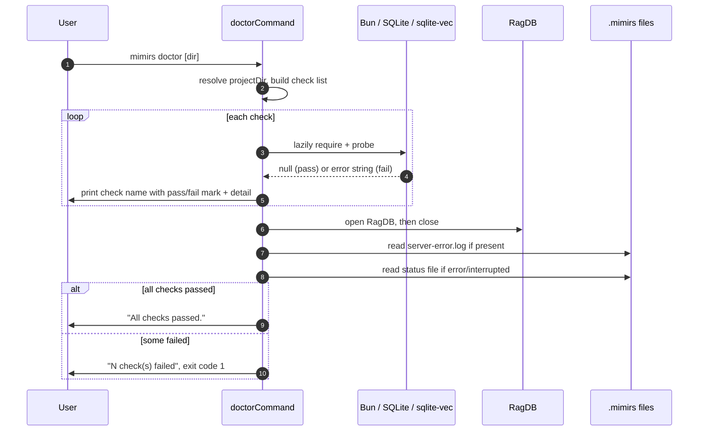

# CLI: doctor

`mimirs doctor` runs a set of environment checks that mirror what the MCP server needs to start. The server runs as a background process spawned by your editor, so when it fails to come up there is often nowhere to see the error. `doctor` reproduces the same startup work in the foreground — loading the custom SQLite build, the `sqlite-vec` extension, the database, and the embedding module — and prints a pass/fail line plus an actionable fix for each. Run it when the server will not start, when search returns nothing, or right after installing on a new machine.

The command is dispatched from the CLI's `doctor` case, which simply forwards the raw argument list to the handler (`src/cli/index.ts:160-161`). All of the real work lives in `doctorCommand` (`src/cli/commands/doctor.ts:11-184`).

## Why doctor stays lightweight

The whole point of `doctor` is to be runnable even when the heavy parts of mimirs are broken. Its only top-level import is the CLI logger (`src/cli/commands/doctor.ts:1-4`). Everything that could itself fail to load — the database wrapper, `sqlite-vec`, the embedding module — is pulled in lazily with `require()` inside the individual check functions (`src/cli/commands/doctor.ts:28-29`, `src/cli/commands/doctor.ts:95`, `src/cli/commands/doctor.ts:110`, `src/cli/commands/doctor.ts:122`). The CLI entry deliberately imports `serve` dynamically for the same reason — its native dependencies and top-level awaits would crash the whole CLI at module-load time and block even `doctor` (`src/cli/index.ts:16-18`). Each check is also wrapped so a thrown error becomes a recorded failure rather than an uncaught exception (`src/cli/commands/doctor.ts:137-153`).

## How it works



1. The target directory is resolved from the first positional argument, falling back to the `RAG_PROJECT_DIR` environment variable and then the current working directory, and is then resolved to an absolute path (`src/cli/commands/doctor.ts:12`).
2. The command defines an ordered list of checks. Each is a `{ name, run }` pair where `run` returns `null` on success or an error string — often with an indented `Fix:` line — on failure (`src/cli/commands/doctor.ts:6-9`, `src/cli/commands/doctor.ts:15-133`).
3. It prints a header naming the directory under test (`src/cli/commands/doctor.ts:135`).
4. It runs each check in order. A `null` result prints a passing line; a non-null result or a thrown exception prints a failing line followed by the indented detail, and is recorded in `results` as a failure (`src/cli/commands/doctor.ts:137-153`).
5. After the checks, it looks for a recent crash log at `.mimirs/server-error.log` and, if present, prints its full contents between `--- Recent crash log ---` markers (`src/cli/commands/doctor.ts:156-163`).
6. It reads the indexing `status` file; only when its first line is `error` or `interrupted` does it print the status block (`src/cli/commands/doctor.ts:166-175`).
7. If no checks failed it prints `All checks passed.`; otherwise it prints how many failed and exits with code `1` (`src/cli/commands/doctor.ts:177-183`).

All output goes to stdout through the shared logger, whose `log` method is a thin `console.log` wrapper (`src/utils/log.ts:49-53`).

## Inputs

| name | type | required | description |
| --- | --- | --- | --- |
| directory | positional string | no | Project directory to diagnose. Falls back to `RAG_PROJECT_DIR`, then the current working directory, and is resolved to an absolute path (`src/cli/commands/doctor.ts:12`). |
| `RAG_PROJECT_DIR` | env var | no | Used as the project directory when no positional argument is given (`src/cli/commands/doctor.ts:12`). |
| `RAG_DB_DIR` | env var | no | When set, the writability probe targets this directory instead of `<projectDir>/.mimirs` (`src/cli/commands/doctor.ts:75-77`). |

The argument that reaches the handler is the whole CLI token list; index `0` is the literal command word `doctor`, so the positional directory is read from index `1` (`src/cli/index.ts:25-26`, `src/cli/commands/doctor.ts:12`).

## Outputs

| output | where it lands / shape / description |
| --- | --- |
| Per-check status lines | Printed to stdout: a passing line carrying the check name, or a failing line carrying the name plus an indented detail line (`src/cli/commands/doctor.ts:142-152`). |
| Crash log dump | Full contents of `.mimirs/server-error.log` printed between markers when that file exists (`src/cli/commands/doctor.ts:158-163`). |
| Indexing status dump | The `.mimirs/status` file contents printed when its first line is `error` or `interrupted` (`src/cli/commands/doctor.ts:170-174`). |
| Summary line | `All checks passed.` or `N check(s) failed. Fix the issues above and retry.` (`src/cli/commands/doctor.ts:178-181`). |
| Exit code | `0` when all checks pass; `1` via `process.exit(1)` when any check fails (`src/cli/commands/doctor.ts:182`). |

## The checks

The checks run in this fixed order. Each reproduces one step the server itself performs at startup, so a failing line points directly at the part of the startup chain that is broken.

| Check | What it verifies | Failure / fix |
| --- | --- | --- |
| Bun runtime | The global `Bun` object exists; mimirs only runs under Bun (`src/cli/commands/doctor.ts:17-21`). | "Bun runtime not detected. mimirs requires Bun." |
| SQLite (extension-capable) | Loads `bun:sqlite` and `sqlite-vec`, opens an in-memory DB, loads the extension, and queries `vec_version()`. On macOS it first locates a Homebrew SQLite dylib and registers it with `Database.setCustomSQLite`, because Apple's bundled SQLite cannot load extensions (`src/cli/commands/doctor.ts:24-63`). | macOS: `brew install sqlite`; Linux: install `libsqlite3-dev` / `sqlite-devel`. |
| Project directory | The resolved project directory exists on disk (`src/cli/commands/doctor.ts:66-70`). | "Directory does not exist: …" |
| .rag directory writable | Creates the data directory (`RAG_DB_DIR` or `<projectDir>/.mimirs`), writes a `.doctor-probe` file, then deletes it (`src/cli/commands/doctor.ts:73-89`). | "Cannot write to … Set RAG_DB_DIR to a writable directory." |
| Database opens | Constructs `RagDB` for the project and closes it, exercising the real database initialization path (`src/cli/commands/doctor.ts:92-102`). | "Database failed to open: …" |
| sqlite-vec extension | Independently requires the `sqlite-vec` module and confirms it exposes a `load` function (`src/cli/commands/doctor.ts:105-116`). | "sqlite-vec module not found … Fix: bun install sqlite-vec". |
| Embedding model | Requires the embedding module and confirms its `embed` export is a function. It does not download or run the model — that happens asynchronously at real use (`src/cli/commands/doctor.ts:119-131`). | "Embedding module failed to load: …" |

SQLite extension capability is intentionally verified twice from different angles. The "SQLite (extension-capable)" check actually loads `sqlite-vec` into a live database and queries it, while the later "sqlite-vec extension" check only confirms the module imports and exposes `load`. The embedding check is deliberately shallow: it inspects the module's export shape, not a real embedding call, so it stays fast and works offline (`src/cli/commands/doctor.ts:126`).

### What "Database opens" actually exercises

This check is the most thorough one because constructing `RagDB` runs the server's full database bring-up. The constructor registers the custom SQLite build, resolves the data directory the same way the writability probe does, creates it (mapping `EROFS`/`EACCES` to a clear "set RAG_DB_DIR" message), applies the on-disk embedding config so the vector tables are created at the right dimension, opens `index.db` in WAL mode, loads `sqlite-vec`, guards against an embedding-dimension mismatch with the stored index, and creates the schema (`src/db/index.ts:94-140`). The dimension guard is worth knowing about when debugging: if `vec_chunks` was built at a different vector size than the currently configured model produces, the constructor throws, and `doctor` reports it under "Database failed to open" with the mismatch message (`src/db/index.ts:149-168`). So this single check can surface a corrupt directory, a permissions problem, a missing extension, or a config/index mismatch.

## Reading .mimirs/server-error.log and the status file

Because the MCP server runs detached from your terminal, an uncaught startup failure is written to `.mimirs/server-error.log` instead of stderr you can see — both the launcher in `src/main.ts:17` and the server itself in `src/server/index.ts:62-71` write there. `doctor` reads that file after running its checks and prints it verbatim, so a crash from a real server launch shows up alongside the live check results (`src/cli/commands/doctor.ts:157-163`).

It also inspects the indexing `status` file that the server maintains while it runs. The server writes lines beginning with `starting`, `done`, or `error` during its lifecycle and writes `interrupted` if it is killed, with the keyword always on the first line (`src/server/index.ts:100-110`, `src/server/index.ts:195`, `src/server/index.ts:348`). `doctor` only prints the status block when that first line is `error` or `interrupted` — surfacing a stalled or failed index while staying quiet during a healthy run (`src/cli/commands/doctor.ts:166-175`). Both reads are best-effort: if the files are absent, those sections are simply skipped.

## Branches and failure cases

- Missing positional directory: the project directory falls back to `RAG_PROJECT_DIR`, then `process.cwd()` (`src/cli/commands/doctor.ts:12`).
- Per-check failure: any `run()` that returns a non-null string is recorded as failed and its detail printed indented under the check name (`src/cli/commands/doctor.ts:140-143`).
- Per-check exception: a thrown error inside a check is caught and turned into a recorded failure with the error message, so one broken check never aborts the run (`src/cli/commands/doctor.ts:148-153`).
- Platform-specific SQLite advice: the SQLite check returns a macOS-specific "Homebrew SQLite not found" message when no Homebrew dylib exists, and tailors the load-failure fix per platform (`brew install sqlite` on macOS, `libsqlite3-dev`/`sqlite-devel` on Linux) (`src/cli/commands/doctor.ts:31-61`).
- Writability via `RAG_DB_DIR`: the probe and the `RagDB` open both honor `RAG_DB_DIR`, so a non-writable default `.mimirs` can be redirected by setting it (`src/cli/commands/doctor.ts:75-77`, `src/db/index.ts:101-105`).
- No crash log / no bad status: when `.mimirs/server-error.log` is absent, or the status first line is anything other than `error`/`interrupted`, those output blocks are skipped (`src/cli/commands/doctor.ts:158`, `src/cli/commands/doctor.ts:170`).
- All passed: prints `All checks passed.` and returns normally with exit code `0` (`src/cli/commands/doctor.ts:178-179`).
- Any failed: prints the failure count and calls `process.exit(1)`, so the command ends with a non-zero status that CI or a wrapper script can detect (`src/cli/commands/doctor.ts:180-182`).

## Example

```bash
# Diagnose the current directory
mimirs doctor

# Diagnose a specific project
mimirs doctor /path/to/project
```

Illustrative output for a machine missing the Homebrew SQLite build:

```
mimirs doctor — checking /path/to/project

  ✓ Bun runtime
  ✗ SQLite (extension-capable)
    Homebrew SQLite not found. Apple's bundled SQLite doesn't support extensions.
    Fix: run "brew install sqlite" and restart your editor.

  ✓ Project directory
  ✓ .rag directory writable
  ✗ Database failed to open: ...
  ✓ sqlite-vec extension
  ✓ Embedding model

2 check(s) failed. Fix the issues above and retry.
```

The check names and message wording above are taken from source; specific paths and the trailing `...` are placeholders.

## Key source files

- `src/cli/index.ts` — CLI entry; parses `process.argv`, dispatches the `doctor` command, and imports `serve` lazily so a broken native dependency cannot block `doctor`.
- `src/cli/commands/doctor.ts` — the handler: defines and runs the ordered checks, prints results, dumps the crash log and bad-status block, and sets the exit code.
- `src/db/index.ts` — `RagDB`; the "Database opens" check constructs it, exercising data-dir creation, WAL setup, `sqlite-vec` loading, the embedding-dim guard, and schema creation.
- `src/server/index.ts` — writes `.mimirs/server-error.log` and the `status` file that `doctor` reads back. See [Server: start](../server/start.md) for the lifecycle that produces them.
