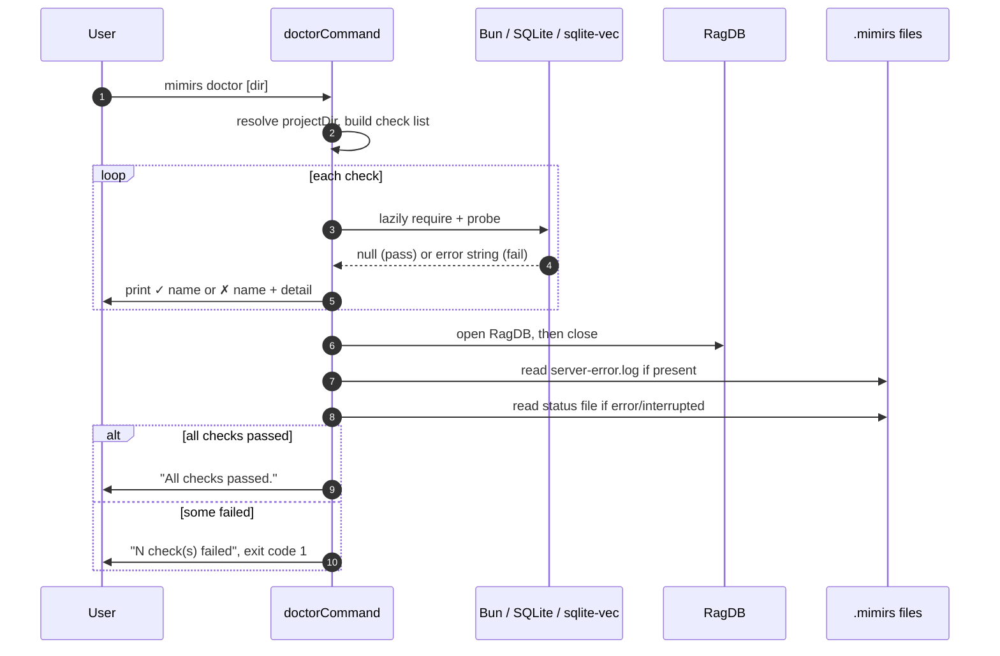

# CLI: doctor

`mimirs doctor` runs a set of environment checks that mirror what the MCP server needs to start. The server runs as a background process spawned by your editor, so when it fails to come up there is often nowhere to see the error. `doctor` reproduces the same startup work in the foreground — loading the custom SQLite build, the `sqlite-vec` extension, the database, and the embedding module — and prints a pass/fail line and an actionable fix for each. Run it when the server will not start, when search returns nothing, or right after installing on a new machine.

## Why doctor stays lightweight

The whole point of `doctor` is to be runnable even when the heavy parts of mimirs are broken. Its only top-level import is the CLI logger (`src/cli/commands/doctor.ts:1-4`). Everything that could itself fail to load — the database wrapper, `sqlite-vec`, the embedding module — is pulled in lazily with `require()` inside the individual check functions (`src/cli/commands/doctor.ts:28-29`, `src/cli/commands/doctor.ts:95`, `src/cli/commands/doctor.ts:110`, `src/cli/commands/doctor.ts:122`). Because it never imports the server or `serve` command at module load time, a broken native dependency surfaces as a single failed check with a fix message, instead of crashing the whole command before it can print anything. This is the same reason each check is wrapped so a thrown error becomes a recorded failure rather than an uncaught exception (`src/cli/commands/doctor.ts:137-153`).

## How it works



1. The target directory is resolved from the first positional argument, falling back to the `RAG_PROJECT_DIR` environment variable and then the current working directory (`src/cli/commands/doctor.ts:12`).
2. The command defines an ordered list of checks. Each is `{ name, run }`, where `run` returns `null` on success or an error string (often with an indented `Fix:` line) on failure (`src/cli/commands/doctor.ts:6-9`, `src/cli/commands/doctor.ts:15-133`).
3. It prints a header naming the directory under test (`src/cli/commands/doctor.ts:135`).
4. It runs each check in order. A `null` result prints `✓ <name>`; a non-null result or a thrown exception prints `✗ <name>` followed by the indented detail, and is recorded as a failure (`src/cli/commands/doctor.ts:137-153`).
5. After the checks, it looks for a recent crash log at `.mimirs/server-error.log` and, if present, prints its full contents between `--- Recent crash log ---` markers (`src/cli/commands/doctor.ts:156-163`).
6. It reads the indexing `status` file; if its first line is `error` or `interrupted`, it prints the status block (`src/cli/commands/doctor.ts:166-175`).
7. If no checks failed it prints `All checks passed.`; otherwise it prints how many failed and exits with code `1` (`src/cli/commands/doctor.ts:177-183`).

## Inputs

| name | type | required | description |
| --- | --- | --- | --- |
| directory | positional string | no | Project directory to diagnose. Falls back to `RAG_PROJECT_DIR`, then the current working directory, and is resolved to an absolute path (`src/cli/commands/doctor.ts:12`). |
| `RAG_PROJECT_DIR` | env var | no | Used as the project directory when no positional argument is given (`src/cli/commands/doctor.ts:12`). |
| `RAG_DB_DIR` | env var | no | When set, the writability probe targets this directory instead of `<projectDir>/.mimirs` (`src/cli/commands/doctor.ts:75-77`). |

## Outputs

| output | where it lands / shape / description |
| --- | --- |
| Per-check status lines | Printed to stdout: `✓ <name>` for a pass, `✗ <name>` plus an indented detail line for a fail (`src/cli/commands/doctor.ts:142-152`). |
| Crash log dump | Full contents of `.mimirs/server-error.log` printed between markers when that file exists (`src/cli/commands/doctor.ts:158-163`). |
| Indexing status dump | The `.mimirs/status` file contents printed when its first line is `error` or `interrupted` (`src/cli/commands/doctor.ts:170-174`). |
| Summary line | `All checks passed.` or `N check(s) failed. Fix the issues above and retry.` (`src/cli/commands/doctor.ts:178-181`). |
| Exit code | `0` when all checks pass; `1` (via `process.exit(1)`) when any check fails (`src/cli/commands/doctor.ts:182`). |

## The checks

The checks run in this order. Each reproduces a step the server itself performs at startup.

| Check | What it verifies | Failure / fix |
| --- | --- | --- |
| Bun runtime | The global `Bun` object exists; mimirs only runs under Bun (`src/cli/commands/doctor.ts:17-21`). | "Bun runtime not detected." |
| SQLite (extension-capable) | Loads `bun:sqlite` and `sqlite-vec`, opens an in-memory DB, and calls `vec_version()`. On macOS it first locates a Homebrew SQLite dylib and registers it with `Database.setCustomSQLite`, because Apple's bundled SQLite cannot load extensions (`src/cli/commands/doctor.ts:24-63`). | macOS: `brew install sqlite`; Linux: install `libsqlite3-dev` / `sqlite-devel`. |
| Project directory | The resolved project directory exists on disk (`src/cli/commands/doctor.ts:66-70`). | "Directory does not exist." |
| .rag directory writable | Creates the data directory (`RAG_DB_DIR` or `<projectDir>/.mimirs`), writes a `.doctor-probe` file, and removes it (`src/cli/commands/doctor.ts:73-89`). | "Cannot write to … Set RAG_DB_DIR to a writable directory." |
| Database opens | Constructs `RagDB` for the project and closes it, exercising the real database initialization path (`src/cli/commands/doctor.ts:92-102`). | "Database failed to open: …" |
| sqlite-vec extension | Independently requires the `sqlite-vec` module and confirms it exposes a `load` function (`src/cli/commands/doctor.ts:105-116`). | "sqlite-vec module not found … Fix: bun install sqlite-vec". |
| Embedding model | Requires the embedding module and confirms `embed` is a function. It does not download or run the model — that happens asynchronously at real use (`src/cli/commands/doctor.ts:119-131`). | "Embedding module failed to load: …" |

Note that the SQLite extension capability is verified twice from different angles: the "SQLite (extension-capable)" check actually loads `sqlite-vec` into a live database and queries it, while the later "sqlite-vec extension" check only confirms the module imports and exposes `load`. The embedding check is deliberately shallow — it checks the module shape, not a real embedding call, so it stays fast and offline-safe (`src/cli/commands/doctor.ts:126`).

## Relationship to .mimirs/server-error.log and the status file

Because the MCP server runs detached, an uncaught startup error is written to `.mimirs/server-error.log` rather than your terminal. `doctor` reads that file after running its checks and prints it verbatim, so a crash that happened during a real server launch shows up alongside the live check results (`src/cli/commands/doctor.ts:157-163`). It also inspects the indexing `status` file: only when the first line is `error` or `interrupted` does it print the block, surfacing a stalled or failed index without noise during a healthy run (`src/cli/commands/doctor.ts:166-175`). Both reads are best-effort — if the files are absent, that section is simply skipped.

## State changes

`doctor` is essentially read-only, with one transient exception. The "Database opens" check constructs `RagDB`, which can create or migrate the database on first open, and the writability probe creates the data directory if it does not exist (`src/cli/commands/doctor.ts:80`, `src/cli/commands/doctor.ts:96`). The probe file `.doctor-probe` is written and immediately deleted, so it leaves no residue (`src/cli/commands/doctor.ts:81-83`).

## Branches and failure cases

- **No directory argument:** falls back to `RAG_PROJECT_DIR`, then `process.cwd()` (`src/cli/commands/doctor.ts:12`).
- **Bun missing:** `typeof Bun === "undefined"` returns the Bun error string (`src/cli/commands/doctor.ts:19`).
- **macOS without Homebrew SQLite:** no dylib found in the known paths, so the check returns the `brew install sqlite` message before opening any database (`src/cli/commands/doctor.ts:36-42`).
- **sqlite-vec loads but `vec_version()` returns nothing:** reported as "SQLite loaded but sqlite-vec didn't initialize properly." (`src/cli/commands/doctor.ts:51`).
- **SQLite load throws:** the catch branch tailors the fix message per platform — macOS suggests `brew install sqlite`, Linux suggests the dev package, others get the raw message (`src/cli/commands/doctor.ts:53-61`).
- **Project directory absent:** reported with the resolved path (`src/cli/commands/doctor.ts:68`).
- **Data directory not writable:** the probe write fails and the error code (or message) is surfaced with the `RAG_DB_DIR` hint (`src/cli/commands/doctor.ts:85-87`).
- **`RAG_DB_DIR` set:** the writability probe targets that resolved directory instead of `<projectDir>/.mimirs` (`src/cli/commands/doctor.ts:75-77`).
- **Database open fails:** the `RagDB` constructor error is reported (`src/cli/commands/doctor.ts:99-100`).
- **sqlite-vec module missing or missing `load`:** reported with the `bun install sqlite-vec` fix (`src/cli/commands/doctor.ts:111-114`).
- **Embedding module fails to load or lacks `embed`:** reported as an embedding-module failure (`src/cli/commands/doctor.ts:123-129`).
- **A check throws unexpectedly:** the wrapper catches it, records a failure, and continues with the remaining checks (`src/cli/commands/doctor.ts:148-153`).
- **Any failure at the end:** prints the failure count and calls `process.exit(1)`; all-pass prints `All checks passed.` with the default exit code (`src/cli/commands/doctor.ts:178-182`).

## Example

```bash
# Diagnose the current project
mimirs doctor

# Diagnose a specific project
mimirs doctor /path/to/project
```

Illustrative output on a macOS machine missing the Homebrew SQLite build:

```
mimirs doctor — checking /path/to/project

  ✓ Bun runtime
  ✗ SQLite (extension-capable)
    Homebrew SQLite not found. Apple's bundled SQLite doesn't support extensions.
    Fix: run "brew install sqlite" and restart your editor.

  ✓ Project directory
  ✓ .rag directory writable
  ...

1 check(s) failed. Fix the issues above and retry.
```

## Related commands

- [cli/serve](./serve.md) — starts the MCP server whose startup these checks reproduce.
- [server/start](../server/start.md) — the server lifecycle that produces `.mimirs/server-error.log` on failure.
- [tools/server-info](../tools/server-info.md) — the tool that reports server health once it is running.

## Key source files

- `src/cli/commands/doctor.ts` — the entire command: the check definitions, the runner loop, the crash-log and status reads, and the exit code.
- `src/db/` — the `RagDB` wrapper exercised by the "Database opens" check.
- `src/embeddings/embed.ts` — the embedding module whose `embed` export the embedding check validates.
- `src/utils/log.ts` — the `cli` logger used for all output.
