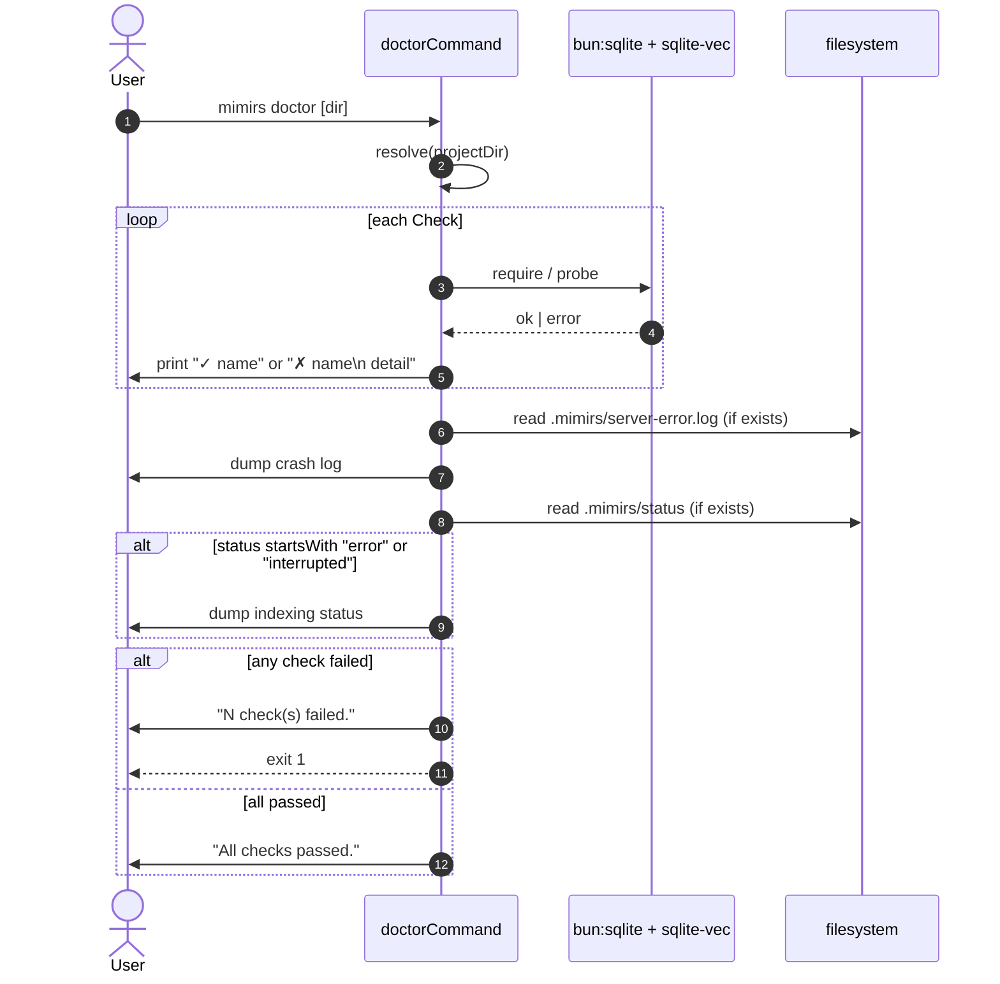

# CLI: doctor

`mimirs doctor` runs a sequence of checks against the local environment and prints a pass/fail line per check. It exists for one job: when the IDE's MCP client says "Connection closed" with no detail, `doctor` is what the user can run to find out *why* the server crashed.

The command deliberately depends on as little as possible. It must keep working when `bun:sqlite` or `sqlite-vec` can't load — because that's exactly the failure mode it needs to diagnose.

## Flow



1. `doctorCommand` resolves the target dir from `args[1]`, `RAG_PROJECT_DIR`, or `process.cwd()`, in that order (`src/cli/commands/doctor.ts:12`).
2. It then walks an array of `Check` objects, each with a `run()` that returns either `null` (pass) or an error string (`src/cli/commands/doctor.ts:15-133`).
3. Each result is printed immediately: `✓ name` for pass, `✗ name` plus an indented detail line for fail. A `try/catch` around `check.run()` makes sure a thrown check never aborts the rest (`src/cli/commands/doctor.ts:137-153`).
4. After the checks, doctor opportunistically dumps `.mimirs/server-error.log` if it exists, then `.mimirs/status` if its first line is `error` or `interrupted`. This puts the most relevant post-mortem info on screen alongside the checks (`src/cli/commands/doctor.ts:156-175`).
5. If any check failed, doctor prints a count and exits with code 1; otherwise it prints `"All checks passed."` (`src/cli/commands/doctor.ts:177-183`).

## Why doctor stays decoupled from serve

`src/cli/index.ts:16-18` carries a comment explaining: `serve` is imported dynamically because `src/server/index.ts` has top-level await and native dependencies (`bun:sqlite`, `sqlite-vec`). A static import of `serve` would be a static import of those natives transitively — and that import would crash the whole CLI at module-load time, before `doctor` could even start.

`doctor` itself only imports `fs`, `path`, `os`, and the shared `cli` logger (`src/cli/commands/doctor.ts:1-4`). Inside individual checks it `require()`s the native modules lazily, so a load failure becomes a failed check (with a useful error message) instead of crashing the binary.

This is the asymmetry that keeps doctor useful: every other command imports through `src/cli/index.ts`'s static import graph; only `serve` is gated behind a dynamic import; `doctor` is the recovery surface for when that dynamic import would fail.

## Checks performed

Each check runs in order and is independent.

1. **Bun runtime.** Verifies `typeof Bun !== "undefined"`. Mimirs requires Bun; this catches `node` invocations (`src/cli/commands/doctor.ts:16-22`).
2. **SQLite (extension-capable).** The interesting check. It `require`s `bun:sqlite` and `sqlite-vec`, and on macOS scans `/opt/homebrew/opt/sqlite/lib/libsqlite3.dylib` and `/usr/local/opt/sqlite/lib/libsqlite3.dylib`. Apple's system SQLite is built without extension support, so without Homebrew SQLite the `sqlite-vec` extension can't load. When neither path exists, doctor returns the actionable fix `'run "brew install sqlite" and restart your editor.'` Otherwise it calls `Database.setCustomSQLite(found)`, opens `:memory:`, loads `sqlite-vec`, and asserts `vec_version()` returns a string. On Linux failure the fix line points at `libsqlite3-dev` / `sqlite-devel` (`src/cli/commands/doctor.ts:23-64`).
3. **Project directory.** Confirms the resolved path exists on disk (`src/cli/commands/doctor.ts:66-71`).
4. **`.rag directory writable`.** Picks the same data dir mimirs would (`RAG_DB_DIR` env, else `<dir>/.mimirs`), makes it, writes a probe file, then deletes it. On failure the message points at `RAG_DB_DIR` as the fix (`src/cli/commands/doctor.ts:72-90`).
5. **Database opens.** Lazy-requires `RagDB` and constructs it for the resolved dir, then closes. This is the integration test that ties together SQLite, sqlite-vec, the file system, and the migration code (`src/cli/commands/doctor.ts:91-103`).
6. **`sqlite-vec` extension.** A redundant but cheap sanity check that the npm package is installed and exports a `load` function. Different failure surface than check 2 — this one fires when the package is missing entirely, not when the extension fails to load against SQLite (`src/cli/commands/doctor.ts:104-117`).
7. **Embedding model.** Imports `../../embeddings/embed` and asserts the `embed` export is a function. The actual model download is async and not exercised here — the check is "the module loads cleanly" (`src/cli/commands/doctor.ts:118-132`).

## Output sections

After the check list, doctor inspects two files inside `.mimirs/`:

- **`.mimirs/server-error.log`** — written by `serveCommand` on module-load failure and by `startServer` on startup failure. When present, doctor prints it wrapped in `--- Recent crash log (.mimirs/server-error.log) ---` markers (`src/cli/commands/doctor.ts:157-163`, `src/cli/commands/serve.ts:21-47`, `src/server/index.ts:62-86`).
- **`.mimirs/status`** — written by `serve` and during the first `init` index. Doctor only surfaces it when the first line is `error` or `interrupted`, because `done` and progress lines aren't useful here (`src/cli/commands/doctor.ts:166-175`).

This means doctor can answer three different "what went wrong?" questions in a single run: the static environment (checks), the last load attempt (`server-error.log`), and the last index attempt (`status`).

## Inputs

| Input | Source | Notes |
| --- | --- | --- |
| `directory` | first positional arg | Resolved with fallbacks: `args[1]` → `RAG_PROJECT_DIR` → `process.cwd()` (`src/cli/commands/doctor.ts:12`). |
| `RAG_DB_DIR` | env | When set, the writable-dir check probes this path instead of `<dir>/.mimirs` (`src/cli/commands/doctor.ts:75-77`). |

## Outputs

| Output | Where | Notes |
| --- | --- | --- |
| Per-check status line | stdout | `✓ <name>` or `✗ <name>` + indented detail with an actionable fix. |
| Crash log dump | stdout | Contents of `.mimirs/server-error.log` when present. |
| Indexing status dump | stdout | Contents of `.mimirs/status` when its first line is `error` or `interrupted`. |
| Final summary | stdout | `"All checks passed."` or `"N check(s) failed. Fix the issues above and retry."` |
| Exit code | shell | `0` when everything passes, `1` when any check fails (`src/cli/commands/doctor.ts:181-183`). |

## Branches and failure cases

- **Bun missing.** First check fails fast; subsequent checks that need `require` of native modules may still run but will likely fail too.
- **macOS without Homebrew SQLite.** The most common failure mode. The SQLite check returns a fix string ending with `brew install sqlite` and the user is expected to restart their editor afterwards.
- **DB lock from running server.** The `RagDB` open check may fail with `SQLITE_BUSY` when an IDE-launched server already holds the DB. The error string is shown; the fix is usually to close the IDE window briefly.
- **No `.mimirs/` directory yet.** Doctor still runs — the writable-dir check will create one as part of the probe. No crash log and no status block are printed in this case.
- **Crash log from previous failure.** Even when all checks pass, doctor will still print an old `server-error.log` if one exists. Treat it as historical context; delete the file once resolved.

## Example

```bash
mimirs doctor
# mimirs doctor — checking /Users/me/repos/foo
#
#   ✓ Bun runtime
#   ✗ SQLite (extension-capable)
#     Homebrew SQLite not found. Apple's bundled SQLite doesn't support extensions.
#         Fix: run "brew install sqlite" and restart your editor.
#
#   ✓ Project directory
#   ✓ .rag directory writable
#   ✗ Database opens
#     Database failed to open: <details>
#   ...
#
# --- Recent crash log (.mimirs/server-error.log) ---
# mimirs server module failed to load at 2026-05-27T13:21:09.000Z
# ...
# --- end ---
#
# 2 check(s) failed. Fix the issues above and retry.
```

## Key source files

- `src/cli/commands/doctor.ts` — every check; the entire flow lives here.
- `src/cli/index.ts:16-18` — the comment that documents why `serve` is dynamic and `doctor` is not.
- `src/cli/commands/serve.ts:21-47` — writer of `.mimirs/server-error.log` for module-load failures.
- `src/server/index.ts:62-86` — writer of `.mimirs/server-error.log` for startup failures.

## Related flows

- [CLI: serve](serve.md) — the command whose failures doctor exists to explain.
- [tools/server-info](../tools/server-info.md) — equivalent diagnostic when the server *is* running.
