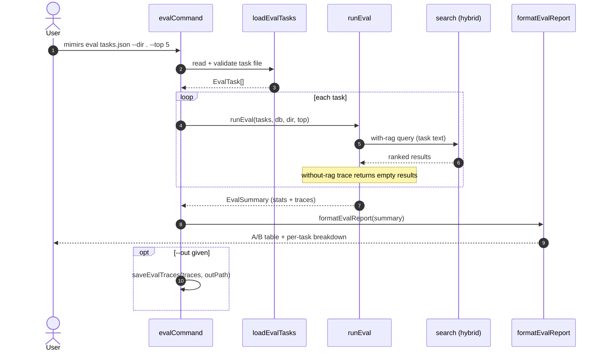

# CLI: eval

`mimirs eval` measures how much the local search index actually helps. It takes a file of tasks, runs each task two ways — once with semantic search turned on, once with it turned off — and prints a side-by-side report. Use it when you want a number to back the claim that indexing this project improves what an agent can find, or to catch a regression where search stops surfacing the files a task needs.

The command is a thin wrapper. It parses arguments, loads the task file, opens the index, runs the A/B comparison, prints the report, and optionally saves the raw traces to disk. All of the real work lives in the search evaluation helpers in `src/search/eval.ts`.

## How the comparison works

For every task the evaluator builds two traces. The "with-rag" trace runs one semantic search over the index using the task description as the query and records the files that came back. The "without-rag" trace runs no search at all and returns an empty result set, simulating an agent that has no index to lean on (`src/search/eval.ts:62-91`). Because the second condition is a fixed empty baseline, the report is really showing "what does search add on top of nothing", not a comparison of two search algorithms.



1. The user runs the command with a task file and optional flags. `evalCommand` requires the first positional argument (the file); without it the command prints a usage line and exits with code 1 (`src/cli/commands/eval.ts:8-12`).
2. `loadEvalTasks` reads and JSON-parses the file. It throws if the top level is not an array, or if any entry is missing `task` or `grading` (`src/search/eval.ts:40-55`).
3. The parsed tasks are returned to the command, which logs how many tasks it will run against which directory (`src/cli/commands/eval.ts:20-21`).
4. `runEval` loops over the tasks, building a "with-rag" and a "without-rag" trace for each (`src/search/eval.ts:101-105`).
5. The "with-rag" trace loads the project config and calls the hybrid `search` helper once, passing the task text as the query and `topK` as the limit (`src/search/eval.ts:73-77`).
6. The "without-rag" trace skips search entirely, so its result list stays empty and its `searchCount` stays 0 (`src/search/eval.ts:70-77`).
7. `runEval` aggregates the traces into an `EvalSummary` with per-condition averages and a file-hit rate (`src/search/eval.ts:135-141`).
8. `formatEvalReport` turns the summary into the printed table plus a per-task breakdown (`src/search/eval.ts:143-167`).
9. If `--out` was supplied, `saveEvalTraces` writes the full trace array as pretty-printed JSON, then the index is closed (`src/cli/commands/eval.ts:26-31`).

## Fixture file format

The task file is a JSON array. Each element is an object with two required string fields and one optional array field:

| Field | Type | Required | Description |
| --- | --- | --- | --- |
| `task` | string | yes | The task description. It is used directly as the search query for the "with-rag" condition. |
| `grading` | string | yes | Human-readable criteria describing what a good answer looks like. It is not scored automatically; it is echoed into the per-task breakdown for a human to judge against. |
| `expectedFiles` | string[] | no | Files the task should surface. When present, they drive the file-hit-rate metric. |

These shapes are defined by the `EvalTask` interface (`src/search/eval.ts:7-11`). A minimal valid file is an array of objects, each with at least `task` and `grading`; anything else throws during load.

## Inputs

| Name | Type | Required | Description |
| --- | --- | --- | --- |
| `fixture` | positional path | yes | Path to the JSON task file. Resolved relative to cwd. Missing value prints usage and exits 1 (`src/cli/commands/eval.ts:8-12`). |
| `--dir` | path | no | Project directory whose index is queried. Defaults to `.` and is resolved to an absolute path (`src/cli/commands/eval.ts:14`). |
| `--top` | integer | no | Number of results to request per "with-rag" search. Defaults to the project's `benchmarkTopK` config value, which itself defaults to 5 (`src/cli/commands/eval.ts:18`, `src/config/index.ts:32`). |
| `--out` | path | no | When set, the raw traces are written here as JSON after the report prints (`src/cli/commands/eval.ts:15`,`26-29`). |

## Outputs

| Output | Where it lands / shape / description |
| --- | --- |
| A/B eval report | Printed to stdout. A header line with the task count, a four-row comparison table (avg results, avg files found, file hit rate, avg latency) for both conditions, then a per-task breakdown listing the task text, the basenames of files found, and the grading criteria (`src/search/eval.ts:143-167`). |
| Trace file | Only when `--out` is given. A JSON array of every `EvalTrace`, including full search results, pretty-printed with two-space indentation (`src/search/eval.ts:169-171`). |

The report compares the two conditions on these metrics:

| Metric | With RAG | Without RAG |
| --- | --- | --- |
| Avg results | Mean number of search hits per task | Always 0 (no search runs) |
| Avg files found | Mean number of referenced files per task | Always 0 |
| File hit rate | % of tasks (that declare `expectedFiles`) where at least one expected file was found | 0% — nothing is found |
| Avg latency | Mean search time in ms | Near 0 — no work is done |

## State changes

This command does not mutate the index or any persistent project state. It opens the database for searching and closes it at the end (`src/cli/commands/eval.ts:16`,`31`). The only file system write is optional: when `--out` is set it creates or overwrites the trace file at the resolved path (`src/search/eval.ts:169-171`).

## Branches and failure cases

- **Missing fixture argument** — no positional file: prints the usage string and exits with code 1 (`src/cli/commands/eval.ts:8-12`).
- **File not an array** — `loadEvalTasks` throws "Eval file must be a JSON array of { task, grading } objects" (`src/search/eval.ts:44-46`).
- **Entry missing required fields** — any element without `task` or `grading` throws an error naming the offending entry (`src/search/eval.ts:48-52`).
- **Invalid JSON** — `JSON.parse` throws before validation runs (`src/search/eval.ts:42`).
- **`--top` not passed** — falls back to the config's `benchmarkTopK` (default 5) (`src/cli/commands/eval.ts:18`).
- **`--out` not passed** — the trace file write is skipped; only the report prints (`src/cli/commands/eval.ts:26`).
- **Task with no `expectedFiles`** — that task is excluded from the file-hit-rate denominator. If no task declares expected files, the rate is reported as 0 because the divisor is 0 (`src/search/eval.ts:118-130`).
- **File-match logic** — an expected file counts as found when any referenced path equals it, ends with it, or is a suffix of it, so relative and absolute path forms both match (`src/search/eval.ts:124-126`).
- **Empty trace set guard** — average computation divides by `traceSet.length || 1`, so an empty set yields 0 averages rather than a divide-by-zero (`src/search/eval.ts:111`).

## Example

```bash
# tasks.json:
# [
#   {
#     "task": "where is the database opened",
#     "grading": "should point to the RagDB constructor",
#     "expectedFiles": ["src/db/index.ts"]
#   }
# ]

bun run mimirs eval tasks.json --dir . --top 5 --out traces.json
```

Illustrative report shape:

```
Running A/B eval with 1 tasks against /path/to/project...

A/B Eval results (1 tasks):

                     With RAG    Without RAG
  Avg results:            5.0            0.0
  Avg files found:        5.0            0.0
  File hit rate:          100%             0%
  Avg latency:            12ms             0ms

Per-task breakdown:
  "where is the database opened"
    files found: index.ts, hybrid.ts
    grading: should point to the RagDB constructor

Traces saved to traces.json
```

## Related

- [benchmark](benchmark.md) — the sibling measurement command, which scores retrieval quality (recall and MRR) against labeled queries rather than running the with/without-search A/B comparison.

## Key source files

- `src/cli/commands/eval.ts` — command entry point: argument parsing, orchestration, optional trace save.
- `src/search/eval.ts` — task loading, per-task trace building, A/B aggregation, report formatting, trace persistence.
- `src/config/index.ts` — supplies the `benchmarkTopK` default used when `--top` is omitted.
- `src/search/hybrid.ts` — the `search` function that powers the "with-rag" condition.
