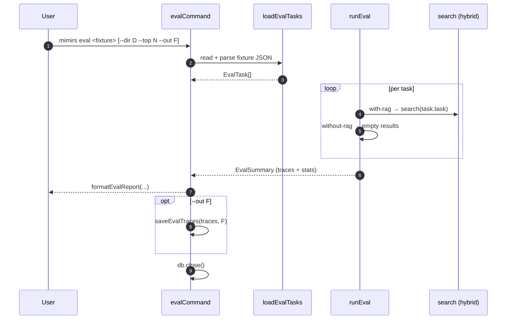

# CLI: eval

`mimirs eval` runs an A/B retrieval evaluation. For each task in a fixture file it produces two traces — one where a search was run against the RAG index (`with-rag`) and one where no search happened (`without-rag`) — and reports aggregate stats plus a per-task breakdown. The point is to show how much the local index actually helps an agent find the right files, against a fixed list of tasks you care about.

## Flow



1. The first positional argument is the fixture path. Missing → the command prints usage and exits with code `1` (`src/cli/commands/eval.ts:8-12`).
2. The project directory comes from `--dir` (default `.`) and `--top` from the flag, falling back to `config.benchmarkTopK` (`src/cli/commands/eval.ts:14-18`).
3. `loadEvalTasks(file)` reads the fixture, parses it as JSON, and validates it is an array where every entry has a string `task` and `grading` (`src/search/eval.ts:40-55`). Anything else throws.
4. `runEval` iterates the tasks. For each task it calls `runEvalTask` twice — once with `condition: "with-rag"`, once with `condition: "without-rag"`. The with-rag branch calls `search(task.task, db, topK, 0, config.hybridWeight, config.generated)`; the without-rag branch returns an empty result list (`src/search/eval.ts:62-91`).
5. After all tasks finish, `runEval` splits traces into the two conditions and computes per-condition averages plus a file-hit rate over tasks that have `expectedFiles`.
6. `formatEvalReport` prints the summary header (two columns: With RAG / Without RAG) and a per-task breakdown that lists the files each with-rag trace found and the grading rubric. Without-rag traces always have zero files found, so they are not repeated per-task.
7. If `--out F` is set, `saveEvalTraces(summary.traces, F)` writes the full traces (both conditions, with search results) as pretty-printed JSON.

## Inputs

| Input | Where it comes from | Effect |
|---|---|---|
| `fixture` (positional) | First arg | Path to a JSON file describing the eval tasks. Required. |
| `--dir D` | CLI flag (default `.`) | Project directory whose RAG index is searched. |
| `--top N` | CLI flag (default `config.benchmarkTopK`) | How many search results to retrieve per task; reused for both conditions even though only with-rag uses it. |
| `--out F` | CLI flag, optional | If set, full traces are written to this path as JSON. |

### Fixture file format

The fixture is a JSON array. Each entry is an `EvalTask`:

| Field | Type | Required | Notes |
|---|---|---|---|
| `task` | string | yes | The natural-language ask the simulated agent would search for. |
| `grading` | string | yes | Human-readable description of what a good answer looks like. Printed in the report; not used for automated grading. |
| `expectedFiles` | string[] | optional | Files the search ideally returns. When present, contributes to the file-hit rate. Path matching is loose (suffix / endsWith / exact) so relative paths work. |

The validator only checks `task` and `grading` are present and the file is a JSON array (`src/search/eval.ts:44-52`). Extra fields are tolerated. The fixture schema is flagged as not yet fully stable — the open question on this page is to document the exact schema once it is.

## Outputs

- **Stdout**: a formatted A/B summary table from `formatEvalReport` plus a per-task breakdown listing each task, the files found, and its grading rubric.
- **Trace file** (when `--out` is set): a JSON array of `EvalTrace` records, two per task (one per condition). Each trace contains `task`, `grading`, `condition`, `searchResults` (raw `DedupedResult[]` with score + snippet), `filesReferenced`, `searchCount`, and `durationMs` (`src/search/eval.ts:13-21`).
- **Exit code**: `0` on success, `1` if no fixture argument was given. There are no quality thresholds — eval will not exit non-zero on bad results (unlike `mimirs benchmark`).

## Reported metrics

`formatEvalReport` prints these fields side-by-side for each condition (`src/search/eval.ts:143-167`):

- **Avg results** — `searchResults.length` averaged across traces in that condition. Always `0` for without-rag.
- **Avg files found** — same as above (one file per result). For with-rag this is bounded by `--top`.
- **File hit rate** — share of tasks with a non-empty `expectedFiles` where at least one expected file appears in the trace's results. Without-rag is always `0%` because nothing was searched.
- **Avg latency** — milliseconds spent inside `runEvalTask`; for without-rag this is essentially noise from the `performance.now()` bracket.

The per-task breakdown only iterates the with-rag traces and shows the file basenames found per task. The without-rag column exists in the header to make the comparison obvious but is not detailed per task — there is nothing to show.

## Branches and failure cases

- Missing fixture argument → `cli.error` with usage line + `process.exit(1)`.
- Fixture is not a JSON array → `loadEvalTasks` throws and the command crashes before any search runs.
- Fixture entry missing `task` or `grading` → same; the error message includes the offending entry.
- `expectedFiles` absent on all tasks → file hit rate is `0` (the `withExpected` counter never increments).
- `--top` parses with `parseInt` and no validation. Non-numeric values become `NaN` and propagate into the search call.
- The command does not validate that `--out` is writable until `saveEvalTraces` actually runs at the end — a bad path will surface as a `fs/promises.writeFile` error after the eval has completed.

## Example

```sh
mimirs eval evals/agent-tasks.json --dir . --top 5 --out evals/last-run.json
```

Fixture entry:

```json
[
  {
    "task": "where is the embedding model configured",
    "grading": "Should mention embeddings/embed.ts and the configureEmbedder function",
    "expectedFiles": ["src/embeddings/embed.ts"]
  }
]
```

Illustrative report:

```
A/B Eval results (1 tasks):

                     With RAG    Without RAG
  Avg results:            5.0            0.0
  Avg files found:        5.0            0.0
  File hit rate:          100%             0%
  Avg latency:             42ms            0ms

Per-task breakdown:
  "where is the embedding model configured"
    files found: embed.ts, config.ts, indexer.ts, hybrid.ts, init.ts
    grading: Should mention embeddings/embed.ts and the configureEmbedder function
```

## Related flows

- [cli/benchmark](benchmark.md) — fixture-based retrieval benchmark with quantitative metrics (recall@K, MRR). `eval` is the A/B counterpart that simulates agent search; `benchmark` measures retrieval quality directly.

## Key source files

- `src/cli/commands/eval.ts` — argument parsing, top-K resolution, optional trace save.
- `src/search/eval.ts` — `loadEvalTasks`, `runEval`, `runEvalTask`, `formatEvalReport`, `saveEvalTraces`.

## Open questions

- The exact fixture schema is marked unstable in discovery. The validator currently only enforces `task` + `grading` are strings and that `expectedFiles` (if present) is treated as a string array via index access — there is no explicit type check on `expectedFiles`. Treat the format as best-effort until the schema is fixed.
