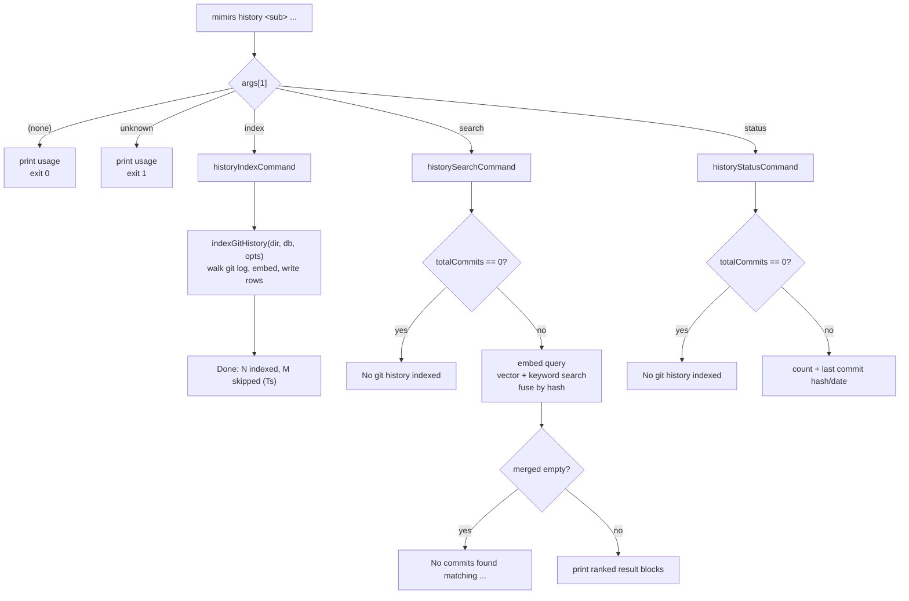

# CLI: history

`mimirs history` is the command-line entry into git commit history. Mimirs already indexes the *files* in a project; this command adds a second, parallel index over the project's *commits*, so you can ask "why was this changed" and "what did this author work on" by meaning, not just with `git log --grep`. The command is a small group of three subcommands `src/cli/commands/history.ts:13`:

| Subcommand | What it does |
| --- | --- |
| `index` | Walks `git log`, embeds each commit message (plus its changed-file context), and stores the commits in the local index. |
| `search` | Runs a hybrid (vector + keyword) search over the indexed commits, with optional `--author` and `--since` filters. |
| `status` | Reports how many commits are indexed and which commit is the newest. |

The same indexed tables back two MCP tools an agent uses at runtime: [search_commits](../tools/search-commits.md) and [file_history](../tools/file-history.md). This CLI command is the human-facing way to build that index and to spot-check it from a terminal. Only `index` writes; `search` and `status` are read-only.

## How a `history` invocation is routed

The top-level CLI reads `process.argv.slice(2)`, takes the first token as the command name, and dispatches on it. When the command is `history`, it calls `historyCommand(args, getFlag)` with the full argument array and a flag-lookup helper `src/cli/index.ts:158`.

`getFlag` is a simple positional lookup: it finds the index of a flag like `--since` in the argument list and returns the *next* token as its value `src/cli/index.ts:85`. It does not understand `--flag=value` form — a flag and its value must be two separate tokens.

`historyCommand` then reads `args[1]` as the subcommand and switches on it. An unknown subcommand prints usage and exits non-zero; no subcommand at all prints usage and exits cleanly `src/cli/commands/history.ts:23`.



1. The user runs `mimirs history <sub> ...`. The top-level dispatcher routes `history` to `historyCommand` `src/cli/index.ts:158`.
2. `historyCommand` switches on `args[1]`. With no subcommand it prints the usage block and falls through (exit 0); with an unrecognized one it prints usage, logs `Unknown subcommand`, and exits 1 `src/cli/commands/history.ts:30`.
3. `index` is the only state-changing path: it opens a `RagDB`, loads config, and calls `indexGitHistory`, then prints a one-line summary `src/cli/commands/history.ts:47`.
4. `search` first guards on the commit count, then embeds the query and runs two searches, fuses them by hash, and prints either result blocks or a "not found" line `src/cli/commands/history.ts:79`.
5. `status` reads a single stats row and prints the count and newest commit, or the same "not indexed" hint as `search` when nothing is indexed `src/cli/commands/history.ts:131`.

## `index` — walking git log into the commit index

`historyIndexCommand` is the writer. It resolves the target directory (the first positional after the subcommand that does not start with `--`, else the current directory), reads `--verbose`/`-v` and `--since`, opens a `RagDB`, loads the project config, and records a start time `src/cli/commands/history.ts:37`.

It then calls `indexGitHistory(dir, db, { since, threads, onProgress })`, passing `config.indexThreads` as the thread count for embedding and choosing a progress callback based on verbosity `src/cli/commands/history.ts:47`. In verbose mode the callback is the full `cliProgress` reporter; in quiet mode it is an inline filter that drops transient updates and only echoes summary lines starting with `Scanning`, `Found`, `Indexing`, `No `, `All `, or `Warning` `src/cli/commands/history.ts:50`.

### What the indexer actually does

`indexGitHistory` lives in `src/git/indexer.ts:222`. Every `git` call runs through `runGit`, which spawns `git` as a subprocess and returns trimmed stdout on a zero exit code, or `null` on any non-zero exit or spawn exception `src/git/indexer.ts:25`. That `null`-on-failure pattern is how the indexer treats "not a git repo" and "git errored" the same way — gracefully, never throwing.

The flow inside the indexer:

1. **Locate the repo.** `findGitRoot` runs `git rev-parse --show-toplevel`. If that returns `null`, the directory is not inside a git repository; the indexer reports it and returns empty counts `src/git/indexer.ts:234`.
2. **Decide the range.** If the caller passed `--since`, that value is used directly. Otherwise the indexer reads the newest indexed commit with `getLastIndexedCommit()` and uses it as the lower bound for incremental indexing `src/git/indexer.ts:241`.
3. **Validate the resume point.** Before trusting the stored commit, it runs `git merge-base --is-ancestor <lastHash> HEAD`. On success `runGit` returns an empty string (which is not `null`), so indexing resumes from that commit. On failure it returns `null`, meaning history was rewritten (a force push), and the indexer enters recovery — see [Branches and failure cases](#branches-and-failure-cases) `src/git/indexer.ts:246`.
4. **Read the log.** It calls `git log --all` with a custom format that packs hash, author name, author email, ISO author date, ref names, and the full body into one record, using ASCII unit separator (`\x1f`) and record separator (`\x1e`) so commit messages with newlines or commas survive parsing intact `src/git/indexer.ts:270`. When a `since` ref is set, it appends `<since>..HEAD` to restrict the range. `--all` means commits on every branch are considered, not just the current one.
5. **Parse and de-duplicate.** `parseGitLog` splits the output on the record separator and turns each well-formed entry (six or more fields) into a `RawCommit` `src/git/indexer.ts:44`. The indexer then drops any commit already present via `db.hasCommit(c.hash)`; the difference between found and new becomes the `skipped` count `src/git/indexer.ts:297`. If nothing is new it reports "All commits already indexed" and returns.
6. **Gather details.** For the new commits it fetches, in parallel, per-file `--numstat` changes (`getFileChanges`, batched 50 hashes at a time, one `diff-tree --no-commit-id -r --numstat` per commit) and parent counts (`getParentCounts`, a single `git log --format=%H %P --no-walk` over all hashes) `src/git/indexer.ts:309`. Parent count drives the `isMerge` flag: a commit with more than one parent is a merge `src/git/indexer.ts:349`.
7. **Build embeddable text.** `buildEmbeddableText` concatenates the commit message with a `Files changed:` line and a `Modules affected:` line derived from the top-level directory of each changed path, so semantically similar commits (same area of the tree) cluster even when the wording differs `src/git/indexer.ts:175`.
8. **Embed in one batch.** All commit texts go through `embedBatchMerged`, which token-counts each text, embeds short ones directly and splits oversized ones into overlapping windows that are averaged and normalized back into a single vector `src/git/indexer.ts:324`, `src/embeddings/embed.ts:153`.
9. **Build and write rows.** Each commit becomes a `GitCommitInsert` carrying the full hash, an 8-character short hash, the message, author name and email, ISO date, the changed-file list, summed insertions/deletions, the merge flag, parsed ref names, a capped diff summary, and the embedding `src/git/indexer.ts:331`. These are written in batches of 100 via `db.insertCommitBatch` `src/git/indexer.ts:357`.

### What `insertCommitBatch` writes

`insertCommitBatch` wraps the whole batch in one SQLite transaction `src/db/git-history.ts:21`. For each commit it does `INSERT OR IGNORE INTO git_commits`, storing the changed-file list as a JSON array of *paths only* and the ref list as a JSON array `src/db/git-history.ts:24`. It reads `changes()` and skips the rest of the work when the row was ignored (already present). For a genuinely new row it reads `last_insert_rowid()`, inserts the embedding into the `vec_git_commits` vector table keyed by that id, and inserts one `git_commit_files` row per changed file with its own insertion/deletion counts `src/db/git-history.ts:46`.

The keyword index is populated automatically: an `AFTER INSERT` trigger on `git_commits` copies the message and diff summary into the `fts_git_commits` FTS5 table, and an `AFTER DELETE` trigger removes them `src/db/index.ts:388`. The indexer never writes the FTS table directly.

## `search` — hybrid search over indexed commits

`historySearchCommand` is read-only. It requires a positional `<query>`; a missing query, or one that looks like a flag, prints usage and exits 1 `src/cli/commands/history.ts:68`. It reads the directory from `--dir` (default current), parses `--top` through `intFlag` (default 10, minimum 1, integer-validated), and reads optional `--author` and `--since` `src/cli/commands/history.ts:73`.

Before searching it checks `db.getGitHistoryStatus()`. If zero commits are indexed it prints "No git history indexed. Run: mimirs history index" and returns — there is nothing to search `src/cli/commands/history.ts:79`.

It then embeds the query once and runs two independent searches over the same tables `src/cli/commands/history.ts:86`:

- **Vector search** — `db.searchGitCommits(queryEmbedding, top, author, since)` finds the nearest commit vectors via `vec_git_commits ... ORDER BY distance`. The score is `1 / (1 + distance)` `src/db/git-history.ts:177`.
- **Keyword search** — `db.textSearchGitCommits(query, top, author, since)` runs an FTS5 `MATCH` against the commit message and diff summary, after sanitizing the query for FTS syntax with `sanitizeFTS`. Its score is `1 / (1 + abs(rank))` `src/db/git-history.ts:217`.

Both functions fetch extra candidates before filtering — `topK * 5` when any filter is active, otherwise `topK * 2` — so that author/date filtering does not starve the result set `src/db/git-history.ts:164`. Filtering happens in JavaScript after the SQL fetch in `applyFilters`: `--author` matches a case-insensitive substring of either the author name or email, and `--since` keeps only commits whose ISO date string is greater than or equal to the given value `src/db/git-history.ts:144`.

### Merging the two result lists

The command fuses the two lists by commit hash `src/cli/commands/history.ts:92`. Vector hits seed a map. For each keyword hit, if the same hash already has a vector hit, the scores combine as `0.7 * vector + 0.3 * keyword`; if the hash is keyword-only, it enters with `0.3 * keyword`. The merged values are sorted by score descending and truncated to `top`. This weighting favors semantic relevance while still letting strong exact-keyword matches surface.

If the merged list is empty it prints `No commits found matching "<query>"` and returns `src/cli/commands/history.ts:107`. Otherwise it prints a header showing how many of the total indexed commits matched, then one block per result: short hash, two-decimal score, the date (date portion only, split at `T`), `@author`, the first line of the message, and up to three changed files with a `+N more` overflow and the `(+insertions -deletions)` totals `src/cli/commands/history.ts:113`.

## `status` — index stats

`historyStatusCommand` resolves the directory (same positional rule as `index`), opens the index, and calls `getGitHistoryStatus()` `src/cli/commands/history.ts:127`. That helper runs a single query returning the commit count, the maximum date, and the hash of the newest commit by date `src/db/git-history.ts:342`. If the count is zero it prints the same "No git history indexed" hint as `search`; otherwise it prints the commit count and the newest commit as an 8-character hash slice and its date portion `src/cli/commands/history.ts:133`.

Every subcommand closes its `RagDB` before returning.

## Inputs

| Name | Type | Required | Description |
| --- | --- | --- | --- |
| subcommand | `index` \| `search` \| `status` | yes | Second positional token (`args[1]`). Any other value prints usage and exits 1; absent prints usage and exits 0. |
| `[dir]` | path (positional) | no | Project directory for `index` and `status`. First positional after the subcommand that does not start with `--`; defaults to the current directory. `search` reads its directory from `--dir` instead. |
| `<query>` | string (positional) | yes for `search` | The semantic + keyword search query. Required by `search`; a missing or flag-shaped value exits 1. |
| `--since REF` | string | no | For `index`, the lower bound passed to `git log` as `REF..HEAD`. For `search`, an ISO date/string lower bound applied to commit dates (`date >= since`). |
| `--top N` | integer ≥ 1 | no | (`search`) Maximum results to return. Defaults to 10. Validated by `intFlag`; non-integer input fails with a flag-named error. |
| `--author A` | string | no | (`search`) Case-insensitive substring filter on author name or email. |
| `--dir D` | path | no | (`search`) Project directory. Defaults to the current directory. |
| `--verbose`, `-v` | flag | no | (`index`) Stream per-step progress instead of summary lines only. |

## Outputs

| Output | Where it lands / shape / description |
| --- | --- |
| `git_commits` rows | (`index`) One row per new commit in the local index, plus a `vec_git_commits` embedding row and `git_commit_files` rows per changed file. FTS rows are created by trigger. |
| Index summary line | (`index`) `Done: N indexed, M skipped (Ts)` printed to the terminal `src/cli/commands/history.ts:62`. |
| Commit search results | (`search`) A header plus one block per match: short hash, score, date, author, first message line, changed files, line-change totals. Printed to the terminal. |
| History stats | (`status`) Commit count and newest-commit hash + date, or the "not indexed" hint. |

## State changes

### Empty or stale commit index → fresh `git_commits` rows

- **Before:** the project's index has no `git_commits` rows for the new commits (or none at all on first run).
- **After:** each new commit has a `git_commits` row, a matching `vec_git_commits` embedding, per-file `git_commit_files` rows, and FTS entries created by the insert trigger.
- **Why it matters:** this is the only thing that makes commit history searchable — both this command's `search` subcommand and the [search_commits](../tools/search-commits.md) / [file_history](../tools/file-history.md) MCP tools read these tables. Until `index` runs, `search` and `status` report "No git history indexed."
- **Trigger and evidence:** `indexGitHistory(dir, db, { since, threads, onProgress })` calls `db.insertCommitBatch(batch)` in batches of 100 `src/git/indexer.ts:357`; the SQL writes live in `src/db/git-history.ts:21`.

`index` is the only subcommand that changes state. `search` and `status` are read-only.

## Branches and failure cases

- **Not a git repository.** `findGitRoot` returns `null`; the indexer reports "Not a git repository — skipping git history indexing" and returns zero counts without touching the index `src/git/indexer.ts:234`.
- **Any git subprocess fails.** `runGit` returns `null` on a non-zero exit or a spawn exception, so individual git failures degrade gracefully instead of throwing `src/git/indexer.ts:25`.
- **No log output / no new commits.** When `git log` yields nothing, the indexer reports "No commits found" and returns. When commits are found but all are already present, it reports "All commits already indexed" and returns `src/git/indexer.ts:281`, `src/git/indexer.ts:300`.
- **Force push / rewritten history.** If the stored newest commit is no longer an ancestor of `HEAD`, `merge-base --is-ancestor` returns `null` and `handleForcePush` runs: it lists all commits reachable from any ref, purges indexed commits that are no longer reachable, and resumes from the newest *surviving* indexed commit `src/git/indexer.ts:252`, `src/git/indexer.ts:147`. If no shared history remains, it clears the entire git index and rebuilds from scratch `src/git/indexer.ts:262`.
- **Purge mechanics.** `purgeOrphanedCommits` deletes the orphaned rows from `git_commit_files`, `vec_git_commits`, and `git_commits`, then rebuilds the FTS index in one transaction `src/db/git-history.ts:308`. `clearGitHistory` does the same for all rows `src/db/git-history.ts:332`.
- **Duplicate insert.** `insertCommitBatch` uses `INSERT OR IGNORE` and checks `changes()`; an already-present hash is skipped without writing a duplicate vector or file rows `src/db/git-history.ts:46`.
- **Binary files in numstat.** `git --numstat` prints `-` for insertions/deletions on binary files; the parser maps `-` to `0` so totals stay numeric `src/git/indexer.ts:102`.
- **Search before indexing.** Both `search` and `status` short-circuit on `totalCommits === 0` with the "No git history indexed" hint `src/cli/commands/history.ts:79`.
- **Empty search result.** When the merged result list is empty after fusion and filtering, `search` prints `No commits found matching "<query>"` and returns `src/cli/commands/history.ts:107`.
- **Bad `--top`.** A non-integer or out-of-range `--top` raises `CliFlagError`, which the top-level dispatcher catches in `main`, prints, and exits 1 — no crash `src/cli/flags.ts:40`, `src/cli/index.ts:101`.
- **Missing query.** `search` with no query (or a flag-shaped first token) prints usage and exits 1 `src/cli/commands/history.ts:68`.
- **Unknown subcommand.** Prints usage then exits 1; no subcommand prints usage and exits 0 `src/cli/commands/history.ts:23`.

## Example

```bash
# Index commit history for the current repo (incremental after the first run)
mimirs history index

# Re-index from a specific point, with per-step progress
mimirs history index . --since v1.2.0 --verbose

# Semantic + keyword search, top 5, by one author, since a date
mimirs history search "windows path normalization" --top 5 --author winci --since 2025-01-01

# Check what is indexed
mimirs history status
```

Illustrative `search` output (synthetic hashes and values):

```text
Results for "windows path normalization" (3 of 412 indexed):

  e970e8b1  0.83  2026-05-20  @winci
    fix: normalize path separators on Windows
    src/example.ts, src/db/index.ts +2 more (+31 -8)

  ...
```

## Key source files

| File | Role |
| --- | --- |
| `src/cli/index.ts` | Top-level CLI dispatcher; routes `history` to `historyCommand` and supplies `getFlag`. |
| `src/cli/commands/history.ts` | The three subcommand handlers: `index`, `search`, `status`. |
| `src/git/indexer.ts` | `indexGitHistory` — walks `git log`, fetches numstat/parents, embeds, and writes commits. |
| `src/db/git-history.ts` | SQL layer: insert, search, status, file-history, force-push purge/clear. |
| `src/db/index.ts` | Git table schema (`git_commits`, `git_commit_files`, `vec_git_commits`, `fts_git_commits`) and the FTS triggers the handlers rely on. |
| `src/embeddings/embed.ts` | `embed` (single query) and `embedBatchMerged` (commit batch embedding). |
| `src/cli/flags.ts` | `intFlag` validation and `CliFlagError` for `--top`. |
