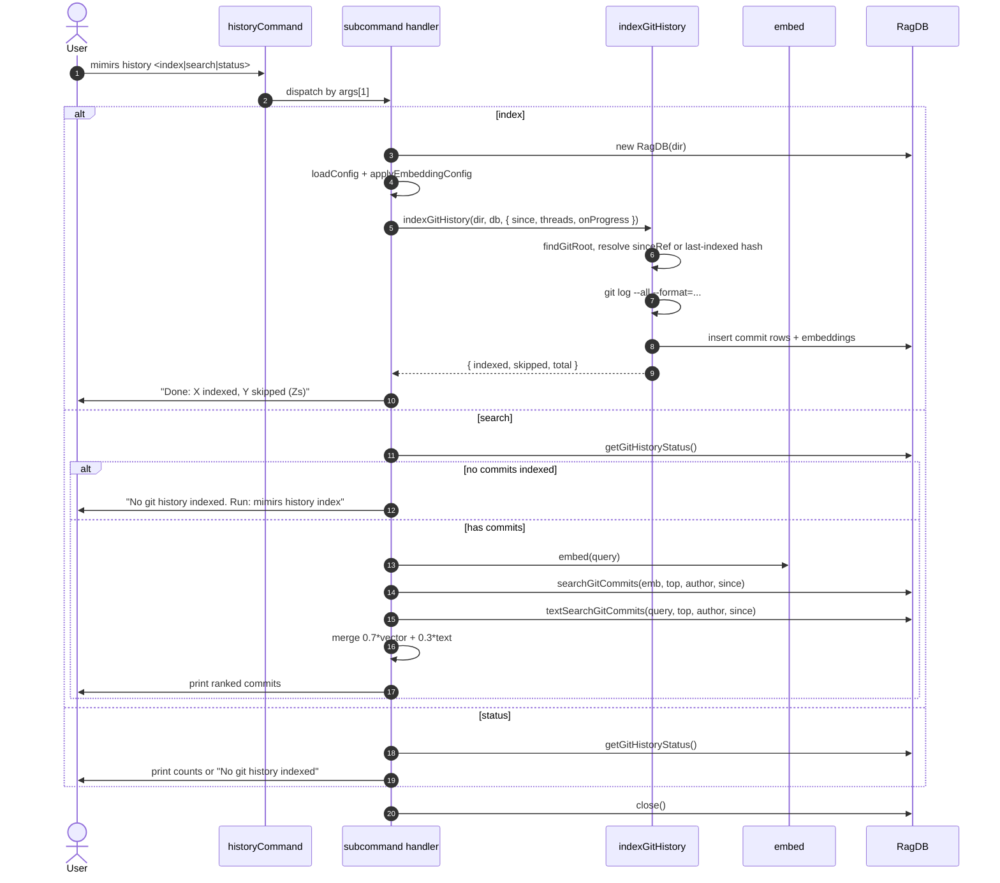

# CLI: history

`mimirs history` is the CLI front door to the git-commit index. It has
three subcommands: `index` populates the commit table from `git log`,
`search` queries it with hybrid vector+BM25 ranking, and `status`
reports counts. The MCP tools `search_commits` and `file_history`
depend on this table being populated — until you have run
`mimirs history index` at least once, those tools will report no
results (`src/cli/commands/history.ts:78-82`).

Use `mimirs history index` when you want commit-message search to
work, want to ask "why was this code added?", or want to feed the
`file_history` tool. Re-run it after pulling new commits — the
indexer is incremental by default.

## Flow



1. The user runs `mimirs history <subcommand> ...`. The CLI reads
   `args[1]` and dispatches via a `switch`. An unknown or missing
   subcommand prints the full usage block; an unknown one also exits
   with code 1 (`src/cli/commands/history.ts:10-33`).
2. For each subcommand handler the directory comes from
   `args[2]` (when the second positional looks like a path) or from
   `--dir` (search-only); otherwise the shell CWD is used.
3. `index` opens the DB, calls `loadConfig` and
   `applyEmbeddingConfig` so the indexer uses the project's embedding
   model, then invokes `indexGitHistory` with a quiet progress
   callback by default and a verbose one when `-v`/`--verbose` is
   set (`src/cli/commands/history.ts:36-58`).
4. `indexGitHistory` finds the git root with `findGitRoot`. When the
   directory is not a git repo, it returns zeros without writing
   (`src/git/indexer.ts:225-228`).
5. The indexer is incremental: when `--since` is not provided, it
   reads the last-indexed commit hash from the DB and re-uses it as
   the lower bound. It even handles force-pushes by walking the
   indexed commits back to a still-reachable ancestor and purging the
   rest (`src/git/indexer.ts:233-265`).
6. `git log --all --format=...%H...%B` is run inside the git root. The
   format string uses custom record and field separators so multi-line
   commit messages survive parsing (`src/git/indexer.ts:267-281`).
7. Parsed commits are embedded in batches and inserted into the
   `git_commits` table.
8. `search` first checks `db.getGitHistoryStatus().totalCommits` and
   short-circuits with a hint if nothing is indexed
   (`src/cli/commands/history.ts:78-83`).
9. When there are commits, the query is embedded once. Vector results
   come from `db.searchGitCommits(embedding, top, author, since)` and
   BM25-style results come from `db.textSearchGitCommits(query, ...)`
   (`src/cli/commands/history.ts:85-89`).
10. The two result sets are merged into a `Map` keyed by commit hash.
    A commit that appears in both gets a blended score
    `0.7 * vectorScore + 0.3 * textScore`; a commit found only by
    text search keeps `0.3 * textScore`
    (`src/cli/commands/history.ts:91-100`).
11. The merged commits are sorted by score, truncated to `--top`, and
    printed in a short multi-line block per commit. Each block shows
    the short hash, score, date, author, first message line, and the
    first three changed files plus `+insertions -deletions`.
12. `status` simply prints `totalCommits`, the short form of the last
    commit hash, and its date — or the same "no git history indexed"
    hint when the table is empty (`src/cli/commands/history.ts:126-140`).

## Inputs

| Input | Subcommand | Source | Notes |
| --- | --- | --- | --- |
| `index\|search\|status` | all | `args[1]` | Required. Unknown values print usage and exit 1. |
| `directory` | index, status | `args[2]` positional | Optional. Defaults to `.`. Must not start with `--`. |
| `query` | search | `args[2]` | Required for `search`. Must not start with `--` (`src/cli/commands/history.ts:66-70`). |
| `--since REF` | index | flag | Optional. A git ref or hash; passed straight through to the indexer to set the lower bound `<REF>..HEAD`. When omitted, the indexer uses the last-indexed commit. |
| `--since S` | search | flag | Optional. A date-or-ref filter forwarded to `db.searchGitCommits` / `db.textSearchGitCommits`. |
| `--top N` | search | flag | Optional. Defaults to 10. Bounds both the per-source row count and the final merged list. |
| `--author A` | search | flag | Optional. Author filter forwarded to both DB queries. |
| `--dir D` | search | flag | Optional. Selects the project directory for `search` (the positional slot is used for the query). |
| `-v`, `--verbose` | index | bare flag | Optional. Switches the progress callback from quiet (only key status lines) to `cliProgress`, which prints per-file events. |

## Outputs

| Output | What happens |
| --- | --- |
| Indexed commit rows | `index` writes rows to the `git_commits` table (with embeddings). The CLI prints a one-line `Done: X indexed, Y skipped (Zs)` summary (`src/cli/commands/history.ts:60-61`). |
| Ranked commit results | `search` prints up to `--top` blocks. Each block: `<shortHash>  <score>  <date>  @<author>`, the first line of the message, and `<filesChanged...>  +<insertions> -<deletions>`. |
| History stats | `status` prints `Git history: N commits indexed` and the short hash plus date of the last commit, or the no-history hint. |

## State changes

### `git_commits` table

- Before: previously indexed commits (potentially empty).
- After: rows for every commit reachable by `git log --all` since the
  lower bound. The lower bound is `--since` if set, otherwise the
  database's `last_indexed_commit`, otherwise the entire history.
- Trigger: `mimirs history index`.
- Why it matters: `mcp__mimirs__search_commits` and
  `mcp__mimirs__file_history` both query this table. Without it,
  semantic commit search returns nothing.
- Code: `indexGitHistory` in `src/git/indexer.ts:221-...` orchestrates
  the log parse, the embedding batches, and the inserts. The CLI
  invocation is at `src/cli/commands/history.ts:46-58`.

A subtle behavior: when the indexer detects a force-push (the last
indexed hash is no longer an ancestor of `HEAD`), it walks back to a
still-reachable commit and **purges** the now-orphaned commits before
resuming (`src/git/indexer.ts:243-265`). The table is therefore
self-healing — you do not need to wipe it after rewriting history.

## Branches and failure cases

- **Unknown subcommand**: prints usage, then `cli.error("Unknown
  subcommand: ...")`, then `process.exit(1)`
  (`src/cli/commands/history.ts:29-32`).
- **Search without an indexed history**: prints
  `"No git history indexed. Run: mimirs history index"` and returns
  without running embeddings or queries
  (`src/cli/commands/history.ts:78-82`).
- **Search query missing**: prints usage and exits 1
  (`src/cli/commands/history.ts:66-70`).
- **Search yields nothing**: prints
  `"No commits found matching \"<query>\""` and returns without an
  error (`src/cli/commands/history.ts:106-110`).
- **Not a git repo**: `indexGitHistory` short-circuits to a zero
  result. The progress callback receives the "Not a git repository"
  message in verbose mode (`src/git/indexer.ts:225-228`).

## Hybrid scoring: 0.7 / 0.3

`search` does not use the project's general `hybridWeight` config.
The weights are hard-coded in `src/cli/commands/history.ts:91-100`:

- A commit found by **both** vector and text search:
  `score = 0.7 * vectorScore + 0.3 * textScore`.
- A commit found only by text search: `score = 0.3 * textScore`.

Commits found only by vector search keep their raw vector score (set
on the first loop into `seen`). That asymmetry slightly favours
semantically-similar commits. The final list is sorted by the merged
score and trimmed to `--top`.

## `--since` for incremental indexing

`--since` is a thin pass-through to `git log <since>..HEAD`. The
common use case is re-indexing only the latest pull:

- Omit `--since` to use the DB's last-indexed commit. This is the
  default behavior and is what you want after `git pull`.
- Pass `--since v1.2.0` (or any git revision) to force a specific
  lower bound — useful for backfilling history you previously skipped.
- The indexer treats a force-push as a special case: if the recorded
  last-indexed hash is no longer an ancestor of `HEAD`, the indexer
  finds the new shared base instead of starting over.

## When to run `history index`

- Once, after installing mimirs in a project, to seed
  `search_commits` / `file_history`.
- After each significant `git pull` or `git fetch` cycle to keep the
  index current.
- After a rebase or force-push that rewrote your local history — the
  indexer will detect this and purge orphaned commits, but you still
  need to re-run the command to ingest the new ones.

## Example

```
# First-time indexing in a fresh checkout
mimirs history index
# → Scanning git history...
#   Found 1842 commits to index
#   Indexing...
#   Done: 1842 indexed, 0 skipped (12.4s)

# After a git pull
mimirs history index
# → Done: 5 indexed, 0 skipped (0.4s)

# Search
mimirs history search "fix off-by-one in chunker" --top 5
# → Results for "fix off-by-one in chunker" (3 of 1847 indexed):
#
#   a1b2c3d4  0.84  2026-03-12  @alice
#     fix: off-by-one in chunker overlap
#     src/indexing/chunker.ts, tests/indexing/chunker.test.ts (+12 -3)
#   ...

# Status
mimirs history status
# → Git history: 1847 commits indexed
#   Last commit: a1b2c3d4 (2026-04-22)
```

## Key source files

- `src/cli/commands/history.ts` — CLI entrypoint with three handler
  functions (`historyIndexCommand`, `historySearchCommand`,
  `historyStatusCommand`).
- `src/git/indexer.ts` — `indexGitHistory` and the force-push
  recovery logic.
- `src/db/index.ts` — `RagDB.getGitHistoryStatus`,
  `RagDB.searchGitCommits`, `RagDB.textSearchGitCommits`,
  `RagDB.getLastIndexedCommit`, `RagDB.clearGitHistory`.
- `src/embeddings/embed.ts` — `embed` used to embed the search query.
- `src/cli/progress.ts` — `cliProgress` and `createQuietProgress` for
  the indexing progress UI.

## Related flows

- [tools/search-commits](../tools/search-commits.md) — MCP tool that
  reads from the same table.
- [tools/file-history](../tools/file-history.md) — MCP tool that
  filters this table to a single path.
