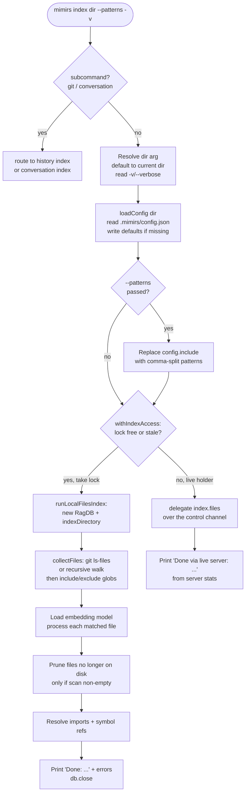

# CLI: index

`mimirs index [dir] [--patterns ...] [-v]` scans a project directory, embeds every matching file into the local index, and prints a one-line summary of how many files were indexed, skipped, and pruned. It is the command you run to build or refresh the searchable index that powers `search`, `read`, `map`, and the MCP server. Running it again after editing code re-indexes only what changed: files whose content hash matches the stored hash are skipped, and files deleted from disk are pruned out of the index.

The command is a thin CLI wrapper. The real work lives in `indexDirectory`, the same indexing engine the MCP `index_files` tool and the file watcher call (see [index_files](../tools/index-files.md)). But the CLI is sessionless, so it cannot share the running server's database handle. When a live mimirs server already holds the project's index lock, indexing in-process would race that writer; so instead the command hands the job to the live server over the [drop-box command channel](../mechanisms/control-channel.md) and prints what the server reports. Only when the lock is free (or held by a dead process) does it index in-process. This page follows the CLI path from argument parsing through the database writes.

## Subcommand aliases

The bare form indexes project files. Three subcommands route elsewhere so one verb covers every index type `src/cli/commands/index-cmd.ts:26-35`:

| form | does | same as |
| --- | --- | --- |
| `mimirs index [dir]` | index project files | (this page) |
| `mimirs index files [dir]` | index project files (explicit) | the bare form |
| `mimirs index git [dir]` | re-index git commit history | [`mimirs history index`](history.md) |
| `mimirs index conversation` | re-index conversation transcripts | [`mimirs conversation index`](conversation.md) |

A directory literally named like a subcommand can still be addressed as `./git`.

## How it runs

The top-level CLI reads `process.argv`, matches the first word `index`, and calls `indexCommand(args, getFlag)` `src/cli/index.ts:123-124`. Everything after that is in the handler `src/cli/commands/index-cmd.ts:25-83`.



1. The user runs the command. After subcommand routing, `dir` is the first positional argument; if it is missing or looks like a flag (starts with `-`), the handler defaults to `.` and resolves it to an absolute path `src/cli/commands/index-cmd.ts:37`.
2. Verbose mode is on if the args contain `--verbose` or `-v` `src/cli/commands/index-cmd.ts:38`. This only changes how progress is printed, not what gets indexed.
3. `loadConfig(dir)` reads `.mimirs/config.json`. If the file is absent it writes the defaults there first and returns them, so a first run always has a config on disk to edit `src/config/index.ts:175-178`.
4. If `--patterns` was passed, its comma-separated value replaces `config.include` entirely (each pattern trimmed) `src/cli/commands/index-cmd.ts:43-45`. This is an override, not an addition.
5. The handler calls `withIndexAccess(dir, runLocalFilesIndex, { cmd: "index.files", args }, …)` `src/cli/commands/index-cmd.ts:50-56`. This is the run-local-or-delegate decision: if the index lock is free or held by a dead process it takes the lock and runs locally; if a live server holds it, the reindex is sent to that server as an `index.files` command and the handler streams the server's progress lines. The full protocol lives on the [drop-box command channel](../mechanisms/control-channel.md) page.
6. **Local path.** `runLocalFilesIndex` opens a `RagDB` for the directory and calls `indexDirectory(dir, db, config, progress)`, closing the DB when done `src/cli/commands/index-cmd.ts:85-107`. The `RagDB` constructor creates the index directory, opens `index.db`, applies the project's embedding model and dimension from disk, loads the sqlite-vec extension, and creates the schema if it does not exist — which is why the handler does not configure embeddings separately. `indexDirectory` collects matching files (see [Which files get scanned](#which-files-get-scanned)), loads the embedding model once files are found, processes each file (details under State changes), prunes files no longer on disk, then resolves imports and symbol references `src/indexing/indexer.ts:919-1002`.
7. **Local summary.** `indexDirectory` returns an `IndexResult` with `indexed`, `skipped`, `pruned`, and `errors` `src/indexing/indexer.ts:48-55`. The handler prints `Done: <indexed> indexed, <skipped> skipped, <pruned> pruned (<elapsed>s)`, then any errors `src/cli/commands/index-cmd.ts:59-66`.
8. **Delegated summary.** When the work ran on the live server, the handler prints `Done (via live server): …` from the returned stats; a non-`ok` result, or a `DropboxError`, prints an error and exits non-zero `src/cli/commands/index-cmd.ts:67-82`.

## Which files get scanned

Before any embedding happens, `collectFiles` decides what to read. It does not just walk the directory tree: it first asks git for the project's non-ignored files, so `.gitignore` is honored end to end `src/indexing/indexer.ts:269-315`.

- **Git-aware listing.** `listGitFiles` runs `git ls-files --cached --others --exclude-standard -z` in the directory. `--cached` lists tracked files; `--others --exclude-standard` adds untracked files that are *not* ignored — so new, uncommitted source is still indexed, but anything matched by `.gitignore` (nested rules, negations, the global excludes file) is left out, and heavy ignored directories like `node_modules` are never even walked `src/indexing/indexer.ts:246-257`.
- **Fallback walk.** When the directory is not a git repo, git is missing, or the git command exits non-zero, `listGitFiles` returns `null` and `collectFiles` falls back to a plain recursive `readdir` of the whole tree `src/indexing/indexer.ts:256`, `src/indexing/indexer.ts:283-284`.
- **Empty output → walk, not wipe.** An empty `git ls-files` result is ambiguous — it can mean the user pointed mimirs at a gitignored subdirectory they clearly want indexed, not that every file was deleted. So empty output also returns `null` and triggers the recursive walk rather than being treated as "zero files," which would otherwise let the prune step delete the entire existing index `src/indexing/indexer.ts:258-263`.
- **Config globs on top.** Whichever source produced the file list, every entry is then filtered through the config `exclude` and `include` patterns: a path is dropped if it matches an exclude glob, and kept only if it matches an include glob `src/indexing/indexer.ts:275-294`. So `.gitignore` and the config patterns layer — git decides the candidate set, the config narrows it.

## Inputs

| name | type | required | description |
| --- | --- | --- | --- |
| `dir` | positional path | no | Directory to index. Defaults to the current directory. Ignored if it begins with `-` so flags are not mistaken for the path `src/cli/commands/index-cmd.ts:37`, `src/cli/flags.ts:63-66`. |
| `--patterns` | comma-separated glob string | no | Overrides the config's `include` list with exactly these patterns, e.g. `--patterns "**/*.ts,**/*.md"`. Each entry is trimmed `src/cli/commands/index-cmd.ts:43-45`. |
| `-v` / `--verbose` | boolean flag | no | Prints per-file progress (`Indexing ...`, `Indexed: ...`) instead of a single updating progress line `src/cli/commands/index-cmd.ts:38`. |
| `.mimirs/config.json` | file on disk | no | Supplies `include`, `exclude`, embedding model/dim, chunk size, and indexing options. Created with defaults on first run `src/config/index.ts:175-178`. |
| `.gitignore` | file on disk | no | Honored automatically for git repos: ignored paths are excluded from the candidate file set via `git ls-files` `src/indexing/indexer.ts:246-257`. |

The default `include` list covers source languages (TypeScript, Python, Go, Rust, Java, C/C++, and more), Markdown and text, build files like `Makefile` and `Dockerfile`, shell scripts, and structured config such as YAML, TOML, and SQL `src/config/index.ts:61-106`. Stylesheets (`.css`, `.scss`, `.less`) are deliberately left out by default because class names add noise to code search `src/config/index.ts:104-105`. Passing `--patterns` discards the default list for the run and uses only what you supply.

## Outputs

| output | where it lands / shape / description |
| --- | --- |
| File and chunk rows | Written to `index.db`: a `files` row per indexed file plus `chunks` rows for its semantic pieces, each with an embedding mirrored into `vec_chunks` in the same transaction `src/db/files.ts:90-116`, and full-text content mirrored into `fts_chunks` via triggers. |
| Graph + symbol data | Per-file `file_imports`/`file_exports` (via `upsertFileGraph`) and per-chunk `symbol_refs` (via `upsertSymbolRefs`) `src/indexing/indexer.ts:619-629`, then cross-resolved after the file loop `src/indexing/indexer.ts:978-1002`. |
| Summary line | `Done: <indexed> indexed, <skipped> skipped, <pruned> pruned (<elapsed>s)` for a local run, or `Done (via live server): …` when the live server did the work `src/cli/commands/index-cmd.ts:61-71`. |
| Error report | If any local file failed, an `Errors: ...` block listing each message `src/cli/commands/index-cmd.ts:64-66`. |
| Progress output | Live progress to the terminal — a single updating line by default, or per-file lines under `-v`. When delegated, the server's progress lines are echoed prefixed with `server:` `src/cli/commands/index-cmd.ts:55`. |

A sample run looks like:

```
$ mimirs index . -v
Indexing /Users/example/project...
Indexing src/example.ts
Indexed: src/example.ts (12 chunks)
Skipped (unchanged): src/util.ts
...
Done: 84 indexed, 31 skipped, 2 pruned (6.3s)
```

## Verbose vs quiet progress

For a local run, the handler builds the progress callback differently depending on the verbose flag `src/cli/commands/index-cmd.ts:88-101`.

| mode | callback | what the user sees |
| --- | --- | --- |
| `-v` / `--verbose` | `cliProgress` directly | Every message from the engine. `file:start`/`file:done` bookkeeping is suppressed, but `Indexing <path>`, `Indexed: <path> (N chunks)`, and `Skipped (...)` lines all print `src/cli/progress.ts:28-39`. |
| default (quiet) | a wrapper that lazily creates `createQuietProgress` | A single overwriting line, plus the persistent `Found`, `Pruned`, and `Resolved` summary lines `src/cli/progress.ts:46-106`. Per-file Indexed/Skipped noise is hidden. |

In quiet mode the wrapper waits for the engine's `Found <N> files to index` message, parses the count out of it, and only then constructs the quiet renderer sized to that total `src/cli/commands/index-cmd.ts:90-93`. Until that message arrives — during the initial directory scan and model load — messages fall through to `cliProgress` so early status is still visible. The quiet renderer tracks the current file from `file:start`, advances a counter on `file:done`, and shows per-file embedding progress parsed from `Embedded X/Y chunks` messages `src/cli/progress.ts:60-91`. The line it writes has the form `Indexing: <n>/<total> files (<pct>%) | <chunks-done>/<chunks-total> — <current file>`, with the chunk segment and file segment omitted when not yet known `src/cli/progress.ts:52-58`.

Both modes use a shared transient-line mechanism: transient messages overwrite the current terminal line, and a persistent message first clears any transient line before printing on its own line `src/cli/progress.ts:10-26`. Transient lines are dropped entirely when stdout is not a TTY, so piping `mimirs index` into a file or `tee` does not produce carriage-return junk `src/cli/progress.ts:14`.

## State changes

### Index rows for each matched file: absent or stale → current

When `indexDirectory` processes a file, `processFile` reads it once, hashes the content, and looks up the stored row `src/indexing/indexer.ts:494-496`. If a row exists with the same hash, the file is skipped and nothing is written `src/indexing/indexer.ts:498-501`. Otherwise the file is (re)indexed:

- For a full re-index, `upsertFileStart` deletes the file's existing chunks and updates (or inserts) the `files` row, keeping the same `files.id` so foreign keys from other files' resolved imports stay intact `src/db/files.ts:51-77`. The row's hash is set to an empty string here and committed only at the very end, so an abort mid-write leaves the file to be retried rather than stranded with a matching hash but missing chunks `src/indexing/indexer.ts:631-632`. Deleting chunks fires the `chunks_vec_ad` trigger, so the matching `vec_chunks` (and FTS) entries are dropped automatically `src/db/files.ts:57-59`.
- New chunks are embedded in batches and inserted via `insertChunkBatch`, which also writes each embedding into `vec_chunks` in the same transaction `src/db/files.ts:90-116`.
- Graph metadata (`file_imports`, `file_exports`) and per-chunk symbol references (`symbol_refs`) are written for the file `src/indexing/indexer.ts:619-629`.

When incremental chunking is enabled and the file already has hashed chunks, `processFileIncremental` re-embeds only the chunks whose content hash changed and updates positions for the rest, falling back to a full re-index when incremental is not viable `src/indexing/indexer.ts:553-564`. Either way the observable result is the same: the index reflects the current file content. The state change is triggered by `indexDirectory(dir, db, config, progress)` inside `runLocalFilesIndex` `src/cli/commands/index-cmd.ts:103` and counted as `indexed` or `skipped` in the result `src/indexing/indexer.ts:946-951`.

### Deleted files: present in index → pruned

After the file loop, unless pruning is explicitly disabled, `indexDirectory` collects the set of files it just matched and calls `db.pruneDeleted(existingPaths)` `src/indexing/indexer.ts:962-976`. `pruneDeleted` deletes every `files` row whose path is not in that set, removing its chunks (and, via the trigger, its vectors) and clearing its graph rows `src/db/files.ts:317-340`. The returned count becomes `result.pruned`. This is why a full CLI index keeps the index honest: rename or delete a file and the next run drops it.

Two guards keep pruning from over-deleting. First, it only runs when the scan found at least one file: an empty `matchedFiles` almost always means a degenerate scan (git returned nothing, a transient filesystem error, a too-narrow filter) rather than a genuinely empty project, and pruning against the empty set would wipe the whole index `src/indexing/indexer.ts:962-971`. Second, pruning compares against just the matched set, so a narrowed `--patterns` run only ever reconciles the files those patterns match — see the failure note below.

### Cross-file resolution: per-file refs → resolved edges

Once at least one file was indexed, the engine resolves import paths across all files and then resolves symbol references against that import scope `src/indexing/indexer.ts:978-1002`. Symbol resolution must follow import resolution because cross-file reference edges depend on `file_imports.resolved_file_id`. To keep post-index latency proportional to the change size rather than repo size, symbol-ref resolution is scoped to just the indexed files plus their importers, gathered after import resolution `src/indexing/indexer.ts:986-1001`. This is what makes `usages`, `depends_on`, and `dependents` return cross-file results after indexing.

## Branches and failure cases

- **Subcommand routing.** `git` and `conversation` are dispatched to the history and conversation indexers before any file indexing runs; `files` is an explicit alias of the bare form `src/cli/commands/index-cmd.ts:26-37`.
- **Default directory.** No `dir` argument, or a first argument starting with `-`, falls back to the current directory `src/cli/commands/index-cmd.ts:37`, `src/cli/flags.ts:63-66`.
- **`--patterns` override.** When present, `config.include` is replaced wholesale; the default include list is not used for that run `src/cli/commands/index-cmd.ts:43-45`. Combined with pruning, a too-narrow `--patterns` run only matches a subset of files. Because `pruneDeleted` compares against just that matched subset, files outside the patterns are not deleted here, but a follow-up full run is the way to reconcile the whole tree `src/indexing/indexer.ts:962-976`.
- **A live server holds the lock.** This is the case that used to print `Done: 0 indexed` and silently do nothing. Now `withIndexAccess` detects the live holder and sends the reindex to it as an `index.files` command, streaming the server's progress and printing `Done (via live server): …` `src/cli/commands/index-cmd.ts:50-71`. If the holder predates the command channel or dies mid-job, a `DropboxError` is printed and the command exits non-zero `src/cli/commands/index-cmd.ts:76-82`. See the [drop-box command channel](../mechanisms/control-channel.md).
- **Lock free or stale.** `withIndexAccess` takes the lock and runs `runLocalFilesIndex` in-process; a stale lock whose PID is gone is reclaimed first `src/control/producer.ts:142-159`, `src/utils/index-lock.ts:28-65`. Inside, `indexDirectory` also holds its own reentrant lock, and a per-directory promise chain serializes overlapping in-process indexers `src/indexing/indexer.ts:857-877`.
- **Unsafe directory.** `indexDirectory` calls `checkIndexDir` and throws if the target is a system-level directory like `$HOME` or `/`, before any indexing happens `src/indexing/indexer.ts:893-896`.
- **Empty directory.** When no files match, the embedding model is not even loaded (that step is gated on `matchedFiles.length > 0`) and the result is all zeros `src/indexing/indexer.ts:925-928`.
- **Per-file skips.** A file is skipped — counted in `skipped`, not `indexed` — when it is larger than 50 MB `src/indexing/indexer.ts:483-491`, when its content hash is unchanged `src/indexing/indexer.ts:498-501`, when its average line length exceeds 1000 characters (minified/obfuscated detection) `src/indexing/indexer.ts:511-516`, when its extension is unsupported `src/indexing/indexer.ts:522-526`, or when it is empty `src/indexing/indexer.ts:528-533`. The directory scan also silently skips paths that git listed but no longer exist on disk (or broken symlinks), and bare directory or submodule entries `src/indexing/indexer.ts:470-482`.
- **Per-file errors.** An exception while processing one file is caught, pushed onto `result.errors`, and reported through progress; the loop continues with the next file `src/indexing/indexer.ts:952-956`. At the end the handler prints the collected errors `src/cli/commands/index-cmd.ts:64-66`.
- **Large project warning.** If more than 200,000 files match, the engine warns that the directory may be too broad but does not abort `src/indexing/indexer.ts:305-311`.
- **Abort signal.** `indexDirectory` accepts an optional `AbortSignal` and bails out at the start, between files, and after the file loop `src/indexing/indexer.ts:890`, `src/indexing/indexer.ts:932`, `src/indexing/indexer.ts:960`. The CLI does not pass one, so this path is exercised by callers like the file watcher rather than by `mimirs index`.

## Example

```
# Index the current directory with default patterns, quiet progress
mimirs index

# Index a specific project, showing per-file output
mimirs index /path/to/project --verbose

# Index only TypeScript and Markdown, overriding the include list
mimirs index . --patterns "**/*.ts,**/*.md"
```

## Key source files

- `src/cli/index.ts` — top-level CLI dispatcher; routes the `index` command to the handler `src/cli/index.ts:123-124`.
- `src/cli/commands/index-cmd.ts` — the `index` command handler: subcommand routing, arg parsing, `--patterns`, the `withIndexAccess` local-or-delegate call, and `runLocalFilesIndex`.
- `src/control/producer.ts` — `withIndexAccess`, the run-local-or-delegate fallback this command uses (see the [drop-box command channel](../mechanisms/control-channel.md)).
- `src/cli/flags.ts` — `positionalArg`, which keeps short flags like `-v` from being mistaken for the directory argument `src/cli/flags.ts:63-66`.
- `src/indexing/indexer.ts` — `indexDirectory`, `collectFiles`/`listGitFiles`, and `processFile`: git-aware scanning, locking, embedding, writing, pruning, and cross-file resolution.
- `src/cli/progress.ts` — `cliProgress` and `createQuietProgress`: verbose vs quiet terminal output.
- `src/config/index.ts` — `loadConfig` and the default include/exclude patterns.
- `src/db/files.ts` — `upsertFileStart`, `insertChunkBatch`, and `pruneDeleted`: the file/chunk row writes and prune.

## Related

- [index_files](../tools/index-files.md) — the MCP tool that calls the same `indexDirectory` engine from inside the server.
- [drop-box command channel](../mechanisms/control-channel.md) — how the command delegates to a live server when one holds the index lock.
- [init](init.md) — creates `.mimirs/config.json` and performs the first index.
- [status](status.md) — reports how many files and chunks the index currently holds.
- [server start](../server/start.md) — the long-running server that indexes on startup and via the watcher.
