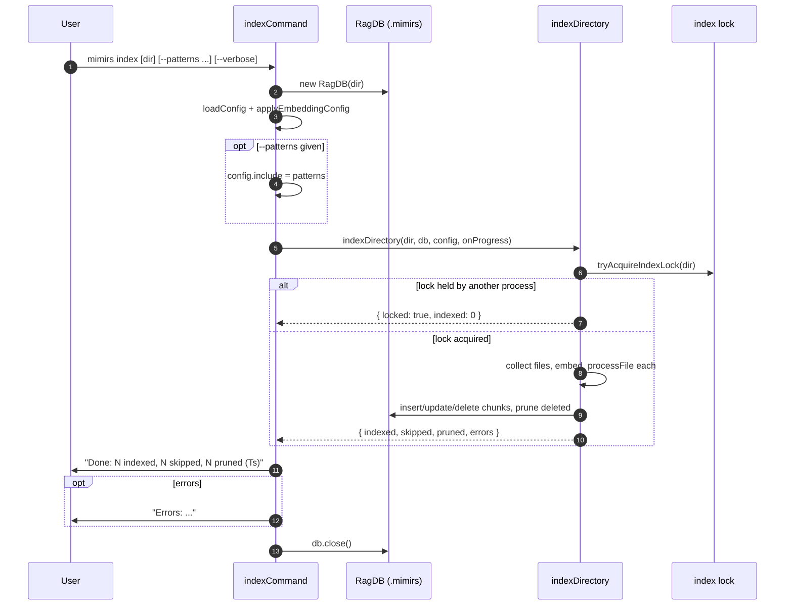

# CLI: index

`mimirs index` builds or refreshes the local search index for a project. It
walks the directory, parses and chunks every matching file, embeds the chunks,
and stores the results in the project's `.mimirs` database so that the `search`
and `read` commands and the MCP tools have something to query.

Run it whenever the code on disk has drifted from the index — for example after
pulling new commits, or after editing files while the live file watcher in the
server was not running. The index is incremental: unchanged files are skipped,
only changed files are re-embedded, and files that no longer exist are pruned.

The command entry point is `indexCommand` in
`src/cli/commands/index-cmd.ts:8`. The actual indexing work happens in
`indexDirectory` (`src/indexing/indexer.ts:695`).

## What the command does

`indexCommand` is a thin driver. It resolves the target directory, opens the
database, loads and applies config, optionally narrows the file set with
`--patterns`, then calls `indexDirectory` and prints a one-line summary
(`src/cli/commands/index-cmd.ts:8-47`).



1. The user runs the command, optionally naming a directory and passing
   `--patterns` and/or `--verbose`/`-v` (`src/cli/commands/index-cmd.ts:9-10`).
2. The command opens the project database with `new RagDB(dir)`
   (`src/cli/commands/index-cmd.ts:11`).
3. It loads config and applies the embedding settings so the indexer uses the
   right model and dimensions (`src/cli/commands/index-cmd.ts:12-13`).
4. If `--patterns` was given, it replaces `config.include` with the
   comma-separated list so only matching files are indexed this run
   (`src/cli/commands/index-cmd.ts:15-18`).
5. `indexDirectory` first tries to acquire a process-level index lock for the
   directory (`src/indexing/indexer.ts:722`). If another mimirs process owns it,
   the run is skipped and returns zero counts (`src/indexing/indexer.ts:723-730`).
6. With the lock held, it collects matching files, eagerly loads the embedding
   model, then processes each file: re-indexed files count as `indexed`,
   unchanged ones as `skipped` (`src/indexing/indexer.ts:734-770`).
7. Unless pruning is disabled, files that are in the index but not in the
   current matched set are deleted (`src/indexing/indexer.ts:774-782`).
8. If anything was re-indexed, import paths and symbol references are re-resolved
   so cross-file edges stay correct (`src/indexing/indexer.ts:785-793`).
9. The command prints the indexed / skipped / pruned counts with elapsed
   seconds, prints any per-file errors, and closes the database
   (`src/cli/commands/index-cmd.ts:40-47`).

## Inputs

| name | type | required | description |
|------|------|----------|-------------|
| directory | positional arg | no | Project directory to index. Taken from `args[1]` only when present and not a flag; otherwise defaults to `.` and is resolved to an absolute path (`src/cli/commands/index-cmd.ts:9`). |
| `--patterns` | flag with value | no | Comma-separated glob list. When present it overwrites `config.include`, restricting this run to matching files (`src/cli/commands/index-cmd.ts:15-18`). |
| `--verbose` / `-v` | boolean flag | no | Emit per-file output instead of a single updating progress line (`src/cli/commands/index-cmd.ts:10`,`:25`). |
| config | `.mimirs/config.json` | yes (auto-created) | Loaded by `loadConfig`; supplies the default include/exclude patterns, embedding model, batch size, and thread count (`src/cli/commands/index-cmd.ts:12`). |

## Outputs

| output | where it lands / shape / description |
|--------|--------------------------------------|
| Summary line | `Done: N indexed, N skipped, N pruned (Ts)` printed to stdout, built from the `IndexResult` counts (`src/cli/commands/index-cmd.ts:41-43`). |
| Error report | When `result.errors` is non-empty, a newline-joined list of per-file errors printed to stderr via `cli.error` (`src/cli/commands/index-cmd.ts:44-46`). |
| Updated database | Refreshed `files`, `chunks`, `symbols`, and dependency rows in the project's `.mimirs` database, plus re-resolved import and symbol-reference edges (`src/indexing/indexer.ts:752-793`). |
| Progress output | Terminal progress, either per-file (verbose) or a single updating line (quiet) (`src/cli/commands/index-cmd.ts:23-36`). |

## State changes

### Index tables refreshed and pruned

- Before: the database holds the previous index snapshot — rows from the last
  indexing run, possibly stale relative to the files on disk.
- After: changed files have fresh chunks and symbols, unchanged files are left
  alone, and files that disappeared (or fell outside the matched set) are
  removed.
- Why it matters: search quality depends on the index matching the working
  tree. Stale chunks return wrong line ranges; missing files mean missing
  results.
- How: each file is run through `processFile`, which re-indexes or skips it
  based on its content hash; the returned status drives the `indexed`/`skipped`
  counters (`src/indexing/indexer.ts:752-763`). Removed files are deleted by
  `db.pruneDeleted` against the set of matched paths
  (`src/indexing/indexer.ts:777-778`). After any re-index, `resolveImports` and
  `db.resolveAllSymbolRefs` rebuild cross-file edges
  (`src/indexing/indexer.ts:786-792`).

## Branches and failure cases

- **Default directory.** With no positional argument (or a leading-`--`
  argument), the target is the current directory (`src/cli/commands/index-cmd.ts:9`).
- **`--patterns` narrows the run.** The patterns replace `config.include`, so
  only matching files are collected (`src/cli/commands/index-cmd.ts:15-18`).
  Note that pruning runs against the matched set: when a full project is already
  indexed and you re-index with a narrow `--patterns`, files outside the pattern
  are pruned from the index because they are not in the current matched set
  (`src/indexing/indexer.ts:777-778`). Use `--patterns` to add or refresh a
  subset only when the index is already scoped the same way.
- **Verbose vs quiet progress.** With `--verbose`, progress is the per-file
  `cliProgress` callback (`src/cli/commands/index-cmd.ts:25`,
  `src/cli/progress.ts:24`). Without it, the command waits for the indexer's
  "Found N files to index" message, then switches to a single updating progress
  line via `createQuietProgress` (`src/cli/commands/index-cmd.ts:26-36`,
  `src/cli/progress.ts:42`).
- **Index lock held.** If another mimirs process (a second IDE window, or the
  server) owns the directory's index lock, `indexDirectory` returns immediately
  with `locked: true` and zero indexed/skipped/pruned counts; the command then
  prints `Done: 0 indexed, 0 skipped, 0 pruned` (`src/indexing/indexer.ts:722-730`).
- **Unsafe directory.** Indexing a system-level directory (home, root, etc.) is
  rejected: `checkIndexDir` throws before any work begins
  (`src/indexing/indexer.ts:708-711`).
- **Per-file errors.** A file that throws during processing is caught, recorded
  in `result.errors`, and indexing continues with the next file
  (`src/indexing/indexer.ts:764-768`). The command surfaces these afterward
  (`src/cli/commands/index-cmd.ts:44-46`).
- **No changes.** If every matched file is unchanged, all of them count as
  `skipped`, nothing is pruned, and the summary reads `0 indexed`.
- **Incremental vs full re-index per file.** For a changed file, if more than
  half its chunks are new, `processFile` falls back to a full re-index;
  otherwise it does an incremental update that keeps unchanged chunks and only
  embeds new ones (`src/indexing/indexer.ts:571-575`).

## Example

```bash
# Re-index the current project.
mimirs index

# Index a specific directory.
mimirs index ./packages/api

# Refresh only TypeScript sources under src/, with per-file output.
mimirs index --patterns "src/**/*.ts" --verbose
```

Typical output:

```
Indexing /Users/example/my-app...
Found 128 files to index
Indexing: 128/128 files (100%)

Done: 6 indexed, 122 skipped, 1 pruned (3.4s)
```

## Key source files

- `src/cli/commands/index-cmd.ts` — command entry point; flag parsing, config
  loading, progress wiring, and the summary line.
- `src/indexing/indexer.ts` — `indexDirectory`, the lock, file collection,
  per-file processing, pruning, and import/symbol resolution.
- `src/db/index.ts` — `RagDB`, the store that holds files, chunks, symbols, and
  dependency rows, and performs the prune and resolution operations.
- `src/cli/progress.ts` — verbose and quiet terminal progress rendering.

## Related pages

- [init](init.md) — first-time setup, which can run the initial index.
- [index_files](../tools/index-files.md) — the MCP tool that triggers the same
  `indexDirectory` work from an agent.
